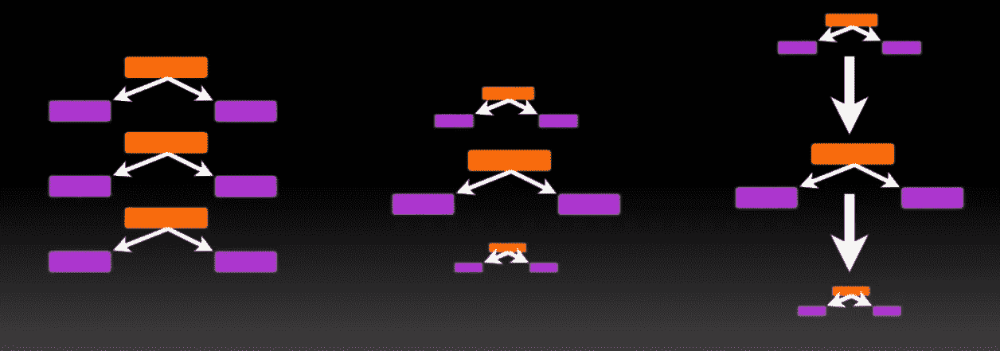
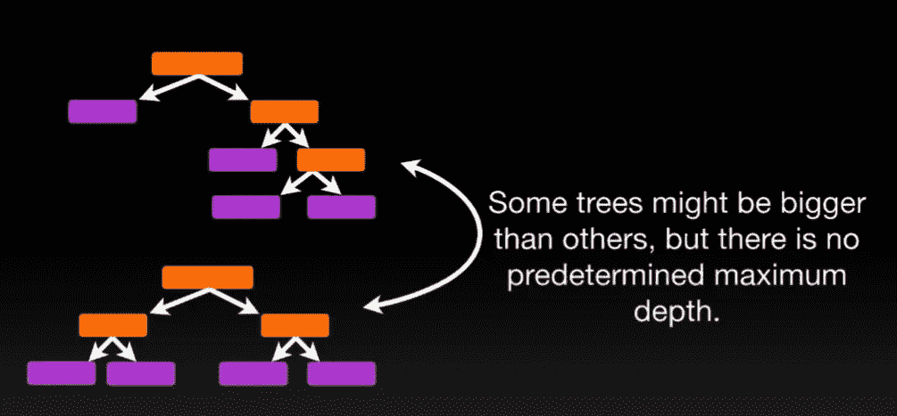
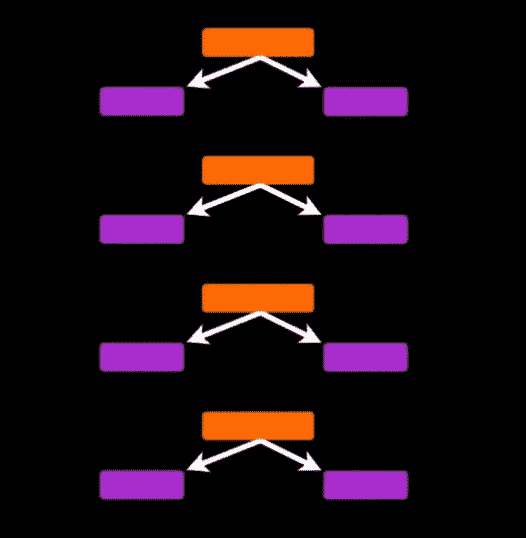
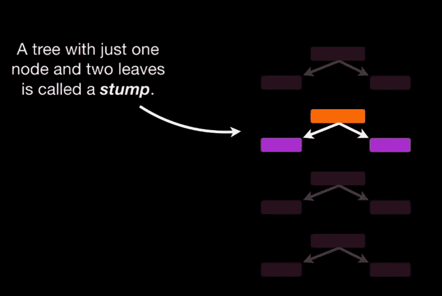
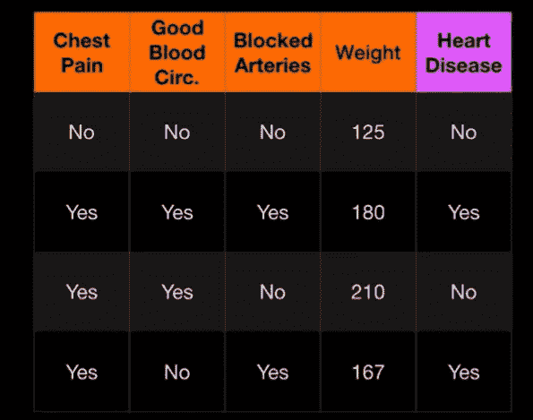
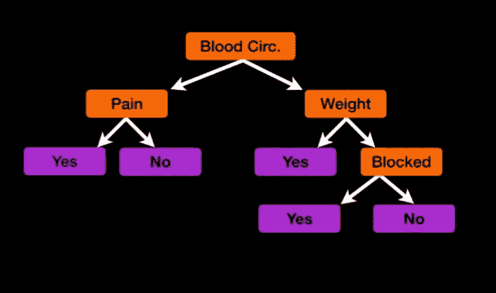
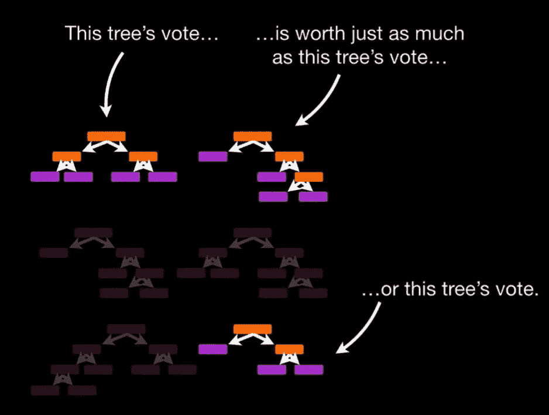
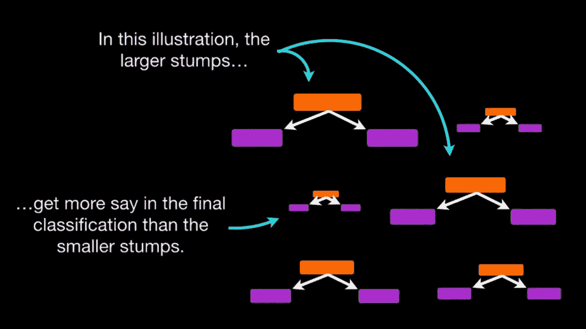
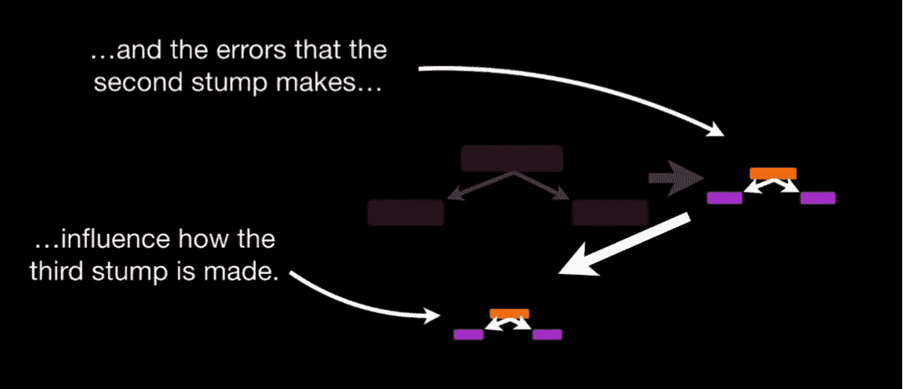

# 自适应 Boosting 算法:解释清楚！— (Adaboost 部分:1)

> 原文：<https://medium.datadriveninvestor.com/adaptive-boosting-algorithm-clearly-explained-adaboost-part-1-82d1c53d2b3f?source=collection_archive---------12----------------------->

机器学习…听起来好复杂…

💡但是没那么复杂。

今天我们将讨论 AdaBoost，它将被清楚地解释。这篇博文展示了如何将 **Adaboost 与决策树**结合起来，因为这是使用 Adaboost 最常见的方式。

***所以，如果你不熟悉决策树，可以看看*** [***帖子***](https://medium.com/datadriveninvestor/introduction-to-machine-learning-3cfc70aaf6b9)***:***[***机器学习简介:使用决策树***](https://medium.com/datadriveninvestor/introduction-to-machine-learning-3cfc70aaf6b9)

我还会提到关于**随机森林**，所以如果你不知道它们，不要担心。看完这个，你就会有所了解了。

# **首先，我将使用决策树和随机森林来解释 AdaBoost 背后的三个概念……**

…然后我将深入了解 AdaBoost 如何从零开始创建森林，以及如何使用它进行分类。

所以，让我先用决策树和随机森林来解释一下 **AdaBoost** 背后的三个主要概念！

✅In a **随机森林**，每次你做一棵树，你就做了一棵全尺寸的树。有些树可能比其他树大，但是没有预先确定的最大深度。

相比之下，在用 AdaBoost 制作的树木森林中，树木通常只是**一个节点和两片叶子。**

# ***术语:~只有一个节点和两片叶子的树叫做树桩。***

…所以这实际上是一片树桩森林，而不是树木。树桩不擅长进行精确的分类。

🌸例如，如果我们使用这些数据来确定某人是否患有心脏病…

…然后，一个完整的决策树将利用我们测量的所有 4 个变量(胸痛、血液循环、动脉阻塞和体重)来做出决策。

…但是一个树桩只能用一个变量来做决定。由此可见残肢在技术上是“ ***【弱习者】*** ”。然而，这是 AdaBoost 喜欢的方式，也是它们通常组合在一起的原因之一。

🔙现在回到随机森林。

在随机森林中，每棵树在最终分类上都有同等的投票权。

💡相比之下，**在由 AdaBoost 生成的树桩森林中，一些树桩在最终分类中比其他树桩拥有更多发言权。**

最后，在随机森林中，每个决策树都是独立于其他决策树而形成的。换句话说，如果一棵树比另一棵树先造出来并不重要。

💡相比之下， ***在用 AdaBoost 制作的树桩森林中，顺序很重要。***

 [## 认知计算——一套被广泛认为是……

### 作为它的用户，我们已经习惯了科技。这些天几乎没有什么是司空见惯的…

www.datadriveninvestor.com](https://www.datadriveninvestor.com/2020/02/19/cognitive-computing-a-skill-set-widely-considered-to-be-the-most-vital-manifestation-of-artificial-intelligence/) 

第一个树桩产生的误差会影响第二个树桩的制作。以及第二个树桩产生的误差，影响第三个树桩是如何形成的，等等。等等。等等。

# **回顾一下，AdaBoost 背后的三个理念是…**

1.  **AdaBoost** 结合很多***弱学习者***做**分类**。学习能力差的人几乎总是被难倒。
2.  一些树桩在分类中比其他树桩更有发言权。
3.  每个树桩都是通过考虑前一个树桩的错误而形成的。

**谢谢！**

要了解更多关于 Adaboost 的信息，请关注我的下一篇文章。零件:2

> [**不要错过。如果你想看更多，请在这个平台上关注我。**](https://medium.com/@praveen.pareek)

好吧！请在另一个时间收听另一篇激动人心的博文。