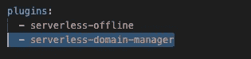
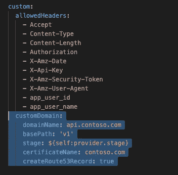

# 将自定义域添加到 AWS 云的 API 中

> 原文：<https://medium.datadriveninvestor.com/adding-a-custom-domain-to-the-api-to-the-aws-cloud-ed1945b51845?source=collection_archive---------13----------------------->

当您使用 AWS 服务创建一个项目时，您可以通过配置 Route 53 来使用 AWS 云 API 的自定义域。我将一步一步地引导你完成这个过程。

 [## 信息图:云之旅|数据驱动的投资者

### 聪明的企业领导者了解利用云的价值。随着数据存储需求的增长，他们已经…

www.datadriveninvestor.com](https://www.datadriveninvestor.com/2018/09/22/infographic-journey-to-the-clouds/) 

## 首先，

在您的项目中使用 *serverless.yml* 文件中的无服务器框架。它需要一个名为“无服务器域管理器”的新插件您可以在您的控制台中安装它:

**npm 安装—保存—开发无服务器—域管理器**

这个插件将帮助我们将自定义域映射到部署在 AWS 上的 API。

## 第二，

我们必须在无服务器模板的插件部分引用它。

## 在自定义部分，

我们将添加一个名为“custom domain”的新属性，在该属性下，我们必须提供一个我们想要使用的域名

xyz.com 除外)

*   在下一行中，我们必须添加 basePath:在你的域名后面有来自 API 服务的东西，比如 API-Gateway
*   我们还必须指定阶段。

例如)${self.provider.stage}

*   然后，指定一个证书名。(我们必须对我们的自定义域使用 SSL 证书。我们可以从 AWS 获得免费的 SSL 证书。我将在以后的文章中向您展示这一点。)
*   我们必须创建 Route 53 记录并将其设置为“真”。(实现这个可以自动为我们创建必要的 Route53 记录。)

这是您的代码库，准备实现您的自定义域！在下一节课中，我将介绍如何配置 Route 53 并使用 ACM 向自定义域添加 SSL 证书。