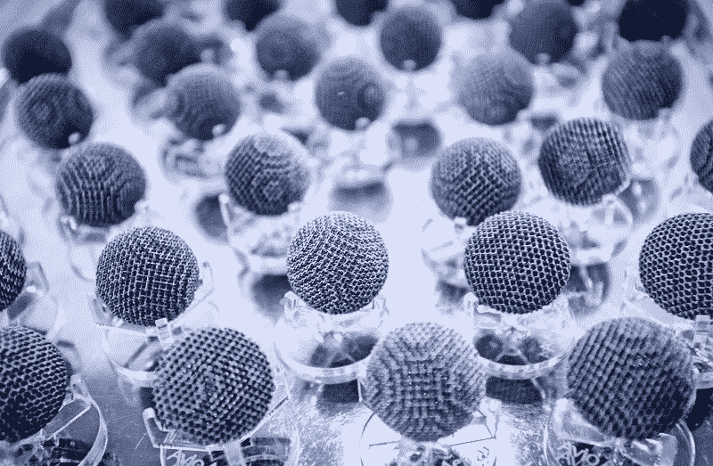

# 制造过程中的添加技术

> 原文：<https://medium.datadriveninvestor.com/additive-technologies-in-manufacturing-processes-50dde4e64e28?source=collection_archive---------25----------------------->

***实施加法技术的经济问题***

添加剂技术的高级发展过程决定了对其在每个具体生产中的实施的盈利性进行彻底的技术和经济分析的相关性。经济问题很少反映在统计数据中，这给参与实施增材制造的专家带来了困难。与此同时，世界经济已经朝着尺寸成型的附加技术的高级开发和实施方向发展，这预先决定了对附加制造的盈利能力进行彻底的技术和经济分析的相关性。从正规技术的角度来看，如果在其他条件相同的情况下，每单位产出的生产成本(特定资源成本)降低，那么在某一特定企业采用附加技术是合理和有利的。因此，计算使用两种技术选项制造零件或组件的车间成本之间的差异非常重要:

使用已掌握的获得毛坯和加工方法制造产品的现有技术；

制造产品的技术——使用添加成型操作。

在讨论这种计算的特征之前，我们将制定一些条件、限制和假设:

1.比较技术方案的技术和经济效率的一个必要条件是生产结果的同一性。因此，在对各种选择进行比较分析之前，有必要从产品的组成、质量、数量、生产任务的时间安排、时间表和工作条件等方面检查结果的一致性。

2.如果第二个选项允许您立即从 n 个零件中获得产品的一个组成零件，那么为了确保第一个选项中产品组成结果的一致性，应该考虑 n 个零件中每个零件的总单位制造成本，加上它们的组装、运输和储存成本。

3.如果第二种选择缩短了生产的技术准备周期和生产周期，那么为了进行比较，有必要确保这些选择在时间上的一致性。在激烈竞争的条件下，缩短适销产品向市场的交付时间对于制造消费者特性方面新颖的适销产品尤其重要。根据附加选项，这种情况可以被认为是产品销售的利润损失。由于市场情况、产品价格水平的可能变化，这种计算经常会引起问题，但它使得有可能很好地评估添加技术的重要竞争优势。

4.由于制造的技术条件(产品质量相同)，假设两种选择提供相同的产品质量。否则，在计算过程中，必须根据可用的建议评估产品功能特性的变化。因此，建议在相应成本发生变化的情况下，将一定数量的高质量产品转换为更多数量的普通质量产品。

考虑到以上情况，制造和装配成本的结构:

1)根据该技术的第一个版本以表格的形式呈现

*C*1 =∑(*C*1з*I*+*C*1м*I*)+*C*сб， *i* = 1

2)第二版—*с*2 =*с*пр+*с*ад+*с*пс，

其中，C1、C2 是根据比较的技术方案制造最终产品的总成本，C1зi 是获得装配单元第 I 个零件毛坯的成本，C1mi 是加工第 I 个零件的成本，m 是装配单元制造零件的数量，Cсб是装配一个部件产品的成本，根据装配单元的规格考虑所有其他部件的成本。 спр——前期操作的成本，сад——添加成型操作的成本，спс——产品最终加工的后续操作的成本。

请注意，由粉末逐层生长产品的添加技术不允许去除残余孔隙，这使得在某些情况下有必要使用后续技术，例如热等静压、渗透和热处理。如上图所示，只有约 19%的增材制造产品被用作最终产品。假设第二种选择的起始材料，例如金属粉末，是购买的，而不是企业生产的。对于两种技术方案的有效性的技术和经济评估，使用直接成本计算方法，根据该方法，最佳方案的选择根据两个标准进行:

比较经济效率的计算系数ер

或者根据估计的回收期 Tr。

偏好规则由 Eр> En，Tr

在我们的情况下，比较计算的特点如下:

首先，作为一项规则，添加成型操作的使用可以显著减少制造零件的工艺流程中的操作数量。

其次，加法成型操作的计件时间通常是几十个小时。

由于现代设备长期以来一直以自动模式运行，因此在其运行过程中宜采用多站服务和专业组合。因此，操作的机器和劳动强度有很大的不同。因此，对于每种添加成型方法，机器或操作 tфыеьime 的计算表达式是基于标准化技术操作的现有方法获得的，并考虑了在每种情况下获得散装固体形式的物理化学过程的细节。空间复杂形状的产品的逐层合成的主要缺点是相对大量的机器处理时间。这导致成本计算中设备折旧成本的比例很高。因此，根据现有数据，机器折旧的成本份额在某些情况下可达到产品成本的 70%。

为了减少这一成本项目的支出，建议最大化负荷，一周七天运行设备，最好是 2-3 班。由于这些设备很快就会过时，投资回收期不应超过 5 年。据专家称，在未来几年中，可持续劳动力市场和可持续土地管理设备的价格有望明显下降，这将对销售形势和相关技术的实施速度产生有利影响。在生产中引入增材技术时，为了提高经济效益，建议为增材成型工段配备几台不同性能的机器，例如 SLM 50 + SLM 300 (400 W):

配备大功率激光器的 SLM 机器效率更高，技术成本更低。激光功率较小、光斑直径较小的机器可提供质量更好的产品表层；

不同标准尺寸的产品在不同工作区尺寸的机器之间的分配有助于节省粉末和减少辅助时间。

可行性研究中可以考虑的好处还包括减少工人数量和确保生命安全的成本，降低物流成本，从而降低车间和工厂的管理费用。

***组织技术方面***

当掌握技术时，描述其特性和实施条件就成了一项紧迫的任务。规定了概念装置，建立了确保合成给定结构的固体的物理和化学过程的参数与添加成型操作的技术特征之间的关系。这项工作将导致在不久的将来建立一个添加剂技术的监管和参考基地。阻碍生产中添加技术发展的因素包括:

材料属性

零件的制造精度和表面质量

相对较低的性能

高资本投资

设备仍不完善

不同安装中制造的相同零件之间的几何形状和特性差异

大多数添加剂机器的封闭结构，不允许研究人员和技术人员改变加工条件。

除了列出的限制增材制造发展和实施的组织和技术因素外，还包括以下因素:

1.由美国材料试验协会(ASTM)发起并积极发展的增材制造工艺标准化。一些重要的标准已经制定出来，但是制定一套相当完整的国际标准、制定国家标准还需要时间。

2.设备认证是增材制造实施的根本重要因素，是产品认证的前提条件。设备鉴定的主要问题可以表述如下:

-缺乏材料、技术和设备标准；

-大量不同设计和操作原理的设备；

-工业运作经验不足，缺乏统计数据；

-在某些情况下，缺乏在真实条件下测试产品的结果、表征产品物理和机械性能的可靠数据；

计量支持薄弱；

-设备的封闭结构；

-设备销售和售后服务的现有商业模式实际上将安装变成了黑箱，限制了技术人员和工厂操作员提高添加技术效率的能力；

-认证程序的时间和金钱。

3.以上列出的因素使得认证添加剂产品变得困难。到目前为止，应用通常伴随着极其严格的测试，以确保产品性能符合规格，这大大降低了添加制造的好处和效率。

4.应该强调的是，第三类和第四类技术和设备的创造不仅需要与新的成型工艺和方法相关的机械工程技术的科学基础的快速发展，而且需要能够解决新的设计和技术问题的工程技术人员的高级培训

***主要发展方向***

增加用于添加成形的设备的生产率的有效方法是开发不同于逐层合成的新方法。因此，我们注意到基于从液体界面大量合成所需形状的添加成形方法的出现。这种方法-连续液体界面生产(CLIP)-提供了高速成型(在 25-100 年内，据专家称，未来将比逐层合成方法高 1000 倍)。其特征还在于生产对象的结构和性质的各向同性、低表面粗糙度和印刷产品时的高分辨率。预计它将实时接收一个空间复杂的物体，其功能特性符合最终产品的要求。

让我们注意到第四类组合技术和设备的发展趋势。这种技术将进一步缩短技术周期，并允许利用减法和加法技术的优点。例如，Solidica 开发了 UAM(超声波添加制造)技术，Fabrisonic 基于该技术生产 SonicLayer R200 型混合机器，该机器提供由塑料金属和具有金属或聚合物基体的复合材料制成的产品的加减加工。三菱 LUMEX 已经开始供应 Avance 25 集成系统，该系统结合了 SLS 技术和铣削。Hermle 宣布了 MPA-40 复合体的生产准备工作，该复合体集成了 5 轴铣削和 3D 气动喷涂的能力。考虑到上述特点，使用这些技术和相关的机床系统也需要进行可行性研究。

**结论**

增材制造的发展伴随着兴奋和高估的期望。尽管许多人认为添加技术是向第六技术秩序过渡的突破和关键，但迄今为止，它们对全球生产规模的影响仍然有限。对最近席卷全球的工业“纳米革命”经验的现实方法和分析，让我们希望在可预见的未来，增材制造将在世界生产中占据相当广泛的一席之地。

**访问专家视图—** [**订阅 DDI 英特尔**](https://datadriveninvestor.com/ddi-intel)

[加入聊天](https://t.me/joinchat/AAAAAE84vCXg5PK-VpHADg)

**谢尔盖·戈卢别夫**

[Crynet 营销解决方案](https://crynet.io)、 [vtorov.tech](http://vtorov.tech) 、欧盟结构基金、ICO/STO/IEO 项目、NGO &投资项目、项目管理