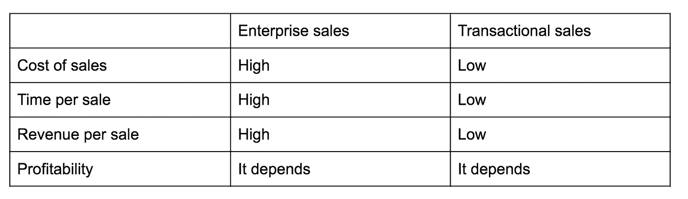
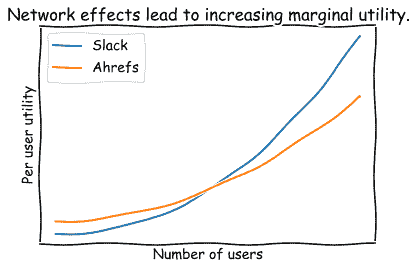
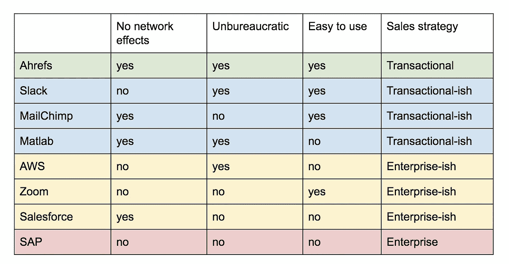

# 采用交易型销售模式——来自 Ahrefs 的经验

> 原文：<https://medium.datadriveninvestor.com/adopting-a-transactional-sales-model-lessons-from-ahrefs-5e93e46b5dc0?source=collection_archive---------15----------------------->

[蒂姆·索罗](https://twitter.com/timsoulo)(Ahrefs 的 CMO)在[贴出了这个关于企业销售方法失败的故事](https://medium.com/swlh/an-enterprise-sales-story-how-our-saas-closed-the-deal-by-walking-away-6b269df4a176)——简而言之，他的论点可以总结为:在企业销售模式中，成本大于收益。当然，每个人都同意企业销售是一项昂贵的工作(就投入的时间、销售团队的报酬等而言)。)，但是 Soulo 也声称*的收益被高估了*。

为什么？

好吧，这些你辛辛苦苦争取到的企业客户在签约后可能会成为你持续的眼中钉——他们可能会拖累支持资源，更令人不安的是，他们可能会提出威胁误导你的产品开发战略的要求。

Enterprise clients can be an unwanted voice in your ear, drawing your product away from your nobler, strategic aims.

相反，索罗说，只需关注“产品开发和客户教育”。不过，他在这个建议中忽略了一些核心警告，我认为这些警告值得在这里提出来。

Clearly, there’s no tautologically correct approach to sales. Both enterprise and transactional sales strategies can have their time and place. The devil is in the details.

Ahrefs，对于那些不熟悉的人来说，为用户提供了一个工具集和一个光滑的界面来跟踪网站性能和改进 SEO。他们自下而上的销售策略是[显然不会让他们失望](https://entrepreneurshandbook.co/how-we-grew-our-8-figure-arr-by-65-two-years-straight-with-a-team-of-30-and-no-vc-8b28146b7960)，但是我认为任何软件组织盲目模仿他们的销售策略都是错误的。

**当你有一个强大的产品和坚实的用户支持*再加上*一个适合自下而上增长的产品时，交易型销售会很有效。**什么样的产品适合自下而上的增长？符合以下准则的产品:

## 非官僚的

*   如果我是营销人员马克，想要了解我们竞争中表现最好的页面，我可以注册，插入 Ahrefs，然后开始我的价值之路——不需要额外的组织签名。我的老板、IT 部门、我的同事不需要参与—即使没有这些利益相关者的额外支持，我仍然可以启动并运行 Ahrefs。
*   这与其他“高度官僚化”的产品形成了鲜明对比。想象一下，我们在我的财富 1000 强公司中使用持续联系，我想将我的团队扩展到 MailChimp。在这种情况下，如果没有组织的监督，这可能不是我能做出的决定，(考虑到该工具影响我们面向外部的运营，因此受到更多限制的官僚签准)。官僚主义阻碍了我自下而上的采用。

 [## 商务沟通不畅是网络安全问题的 5 个原因|数据驱动型投资者

### 沟通是商业的命脉。没有协作就不会有想法，没有合作就不会有交易

www.datadriveninvestor.com](https://www.datadriveninvestor.com/2020/09/01/5-reasons-why-poor-business-communication-is-a-cybersecurity-issue/) 

## 缺乏内部网络效应

*   假设我的公司使用 Slack，我想加入微软团队😕。当然，我可以下载 Slack 并启动它。但是 Slack 作为我和我一个人的工具并不是特别得心应手。我已经在这里写了关于 B2B 和 B2C 网络效应的文章，但是这个例子足以说明这一点。您的公司是相关的网络，您采用新工具的比率取决于它在多大程度上受益于或不受益于公司网络效应。随着用户数量的增加，一些工具(如 Slack 或 Microsoft Teams)对于任何边缘用户来说都变得更有效率，而 Ahrefs 这样的工具对于每增加一个用户，其每用户效用的增长速度较慢。当然，在您的组织中有更多的 Ahrefs 用户会增加您的个人效用(例如，您现在有一个很好的内部用户社区和同事可以与之合作或向其提问)，但即使您是独行侠，您仍会从该工具中获得价值。缺乏强大的内部网络效应允许自下而上的采用，从而促进交易型而非企业型销售策略。

*Take the absolute y-axis positions with a grain of salt.* ***The key idea here is that you can get more per-user utility out of the box with Ahrefs when no one else at your organization is using it.*** *But then, as internal usage scales, suddenly Slack, with its demand side economies of scale, sees its per user utility increasing at an increasing rate.*

## 易用性

*   如果一个产品 a)很复杂，b)缺乏足够的文档，那么我就有点困惑了。假设我发现了一种工具，它有望让我变得更有效率，并且 1)我不需要官僚机构的批准，2)它不需要更广泛的组织采用来满足我的需求。太好了！但是，如果这个小部件如此复杂，又如此缺乏自助资源，我就走不远，自下而上的增长就会失败。在这种情况下，交易型销售可能会成功……但一旦人们意识到他们实际上不能使用这个华而不实的、最近购买的小玩意，这种幻灭感将是真实的，消息将会传开，你和你的首席执行官将需要找到一种不同的销售方法。

给定这些核心标准，让我们考虑各种软件供应商，以及它们在这三个维度(易于使用、不官僚、缺乏网络效应)中的位置。根据我的启发，如果一个公司/产品在每个方面都得了“是”,这应该使它们成为交易销售的良好候选。所有的“不”应该对应的是企业销售界的一些庞然大物。让我们看看:

Color gradient maps the companies proclivity towards *transactional sales.*

因此，我们看到 Tim 的 Ahrefs 位于表的顶部，在每个维度上都获得了“是”,这使得该产品成为交易销售的强有力候选产品，而不太适合企业销售。另一方面，我们看到像 [SAP](http://www.SAP.com) 这样的公司——如果有任何公司符合企业销售范畴，它肯定是传统的德国 ERP 提供商，对吗？

因此，虽然我称赞 Soulo 的创新方法，但我鼓励你在离开企业销售之前，对自己和你的产品提出一些问题。

我留给你的最后一个有趣的金块与前述交易销售所需的准则有关。假设你发现蒂姆和我的主张都很有说服力。您希望转向事务性方法，但您同意我的观点，即这不可能一蹴而就。相反，您需要确保您在每个核心维度上都获得高分——1)不需要组织签署即可采用的产品，2)具有弱网络效应的产品，以及 3)易于使用且记录良好的产品。这三个中哪一个最容易被你影响？

当然，它是第三个。您可以制作更直观的产品，并且可以为用户提供有价值的资源。但是，如果有的话，你能用什么方法改变 1 或 2 呢？请在评论中留下这样做的建议。

**进入专家视角—** [**订阅 DDI 英特尔**](https://datadriveninvestor.com/ddi-intel)