# 先进的价格行为技术来检测市场反应。

> 原文：<https://medium.datadriveninvestor.com/advanced-price-action-techniques-to-detect-market-reactions-4a8745860354?source=collection_archive---------3----------------------->

## 介绍先进的技术分析技术来交易市场。

[pngtree.com](http://pngtree.com)

价格行为分析是一种强大的技术，当正确使用并结合适当的指标时，可以提供巨大的机会。在这篇文章中，我将介绍一种高级的价格行为分析，这种分析不太为人所知，但对检测市场的修正和反转非常重要。

在 Python 的 ***新技术指标成功后，我刚刚出版了一本新书。它对复杂的交易策略进行了更完整的描述和补充，Github 页面致力于不断更新代码。如果你对此感兴趣，请随时访问下面的链接，或者如果你喜欢购买 PDF 版本，你可以在 Linkedin 上联系我。***

 [## 交易策略之书

### 亚马逊网站:交易策略之书:9798532885707: Kaabar，Sofien:书籍

www.amazon.com](https://www.amazon.com/gp/product/B09919GQ22/ref=as_li_tl?ie=UTF8&camp=1789&creative=9325&creativeASIN=B09919GQ22&linkCode=as2&tag=sofien-20&linkId=bc5df3f6ab0f3af2df79641c56b949ba) 

# **和声模式介绍**

谐波模式是特定比率的简单和复杂形式的组合，它们通过蜡烛线或棒线的倒数可能指示反转或至少在特定水平的修正区。

与任何其他类型的分析一样，最好将它们与其他方法和指标结合使用。但是，在我们开始学习如何交易它们之前，让我们先了解一下斐波那契数列。该序列遵循以下独特的模式:

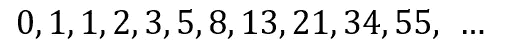

这些数字是通过将后面的前两个数字相加得到的。在 13 的情况下，它被计算为 8 + 5，因此公式为:

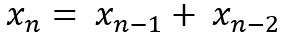

简单对吗？现在，这些数字的美妙之处在于某种比例，叫做黄金比例。如果我们在序列中取任意两个连续的数字，它们的比值(X n / X n-1)会更接近 1.618，这就是我们所说的黄金比例:

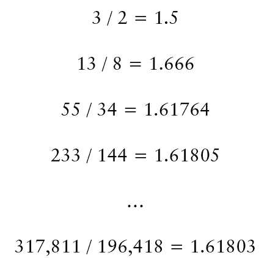

我们如何从这些模式开始交易并不重要，因此，我们将从金融交易的角度来讨论比率。在掌握了斐波纳契技巧之后，我们将继续把它们用于谐波模式。我们在这里的工作是要知道在趋势恢复之前价格要跌到什么水平。

我们在交易中感兴趣的主要回撤和倒易是:

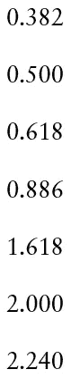

我知道这些很难理解，但是你实际上不应该记住它们，因为在任何交易软件中，当你使用斐波纳契回撤时，你可以将它们编程为可见的，到时候你就会熟悉它们了。

虽然，在金融和交易中不存在极端的准确性，但是我们应该尝试用我们所拥有的任何手段来接近它，这反过来要求我们使用蜡烛线，以便从其真正的底部(即上涨中第一根蜡烛线的低点)追溯上涨，直到波的可疑终点的最高点(上涨)。

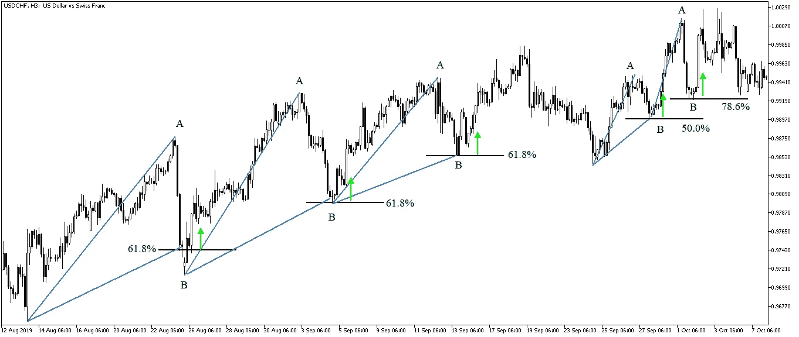

Fibonacci-based support levels showing retracements as reactionary zones. (Image by Author)

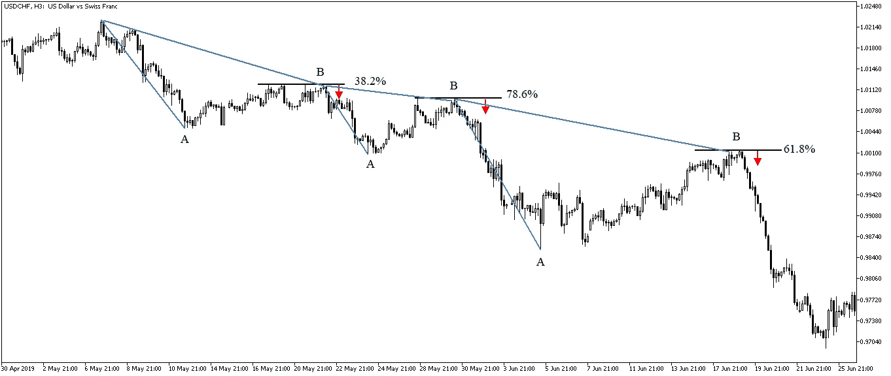

Fibonacci-based resistance levels showing retracements as reactionary zones. (Image by Author)

# 高级谐波模式

**加特利模式**

这种模式可能是第一个也是最著名的复杂谐波配置。它的比率很容易记忆，而且比后面的比率更常见。以下是如何检测 Gartley 模式:

*   第一段应该回撤 61.8%。
*   第二回合应该也会回撤 61.8%。
*   第三条腿应该回撤 161.8%，这是一个简单的 ABCD 模式。
*   从开始到顶部的整个回撤应该是 78.6%。

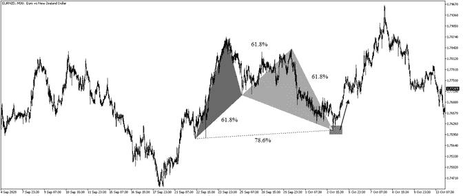

An example of the Gartley pattern. (Image by Author)

上面的例子展示了 Gartley 上的一个例子，其中所有的比率都是完美的。下一张图表显示，Gartley 看跌欧元兑美元。尽管疫情在很大程度上控制了剧烈波动，但我们还是设法让市场对 Gartley 水平有所反应。

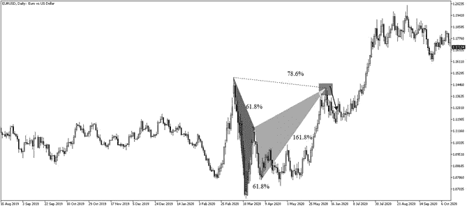

An example of the Gartley pattern. (Image by Author)

**蝙蝠图案**

这是斯科特·卡尼发现的好模式之一。它类似于 Gartley，但具有不同的比率。要检测蝙蝠图案，我们应该具备以下条件:

*   第一段应该回撤 50.0%。
*   第二回合也应该回撤 50.0%。
*   第三条腿应该折回 200.0%，这是一个简单的 ABCD 模式。
*   从开始到顶部的整个回撤应该是 88.6%。

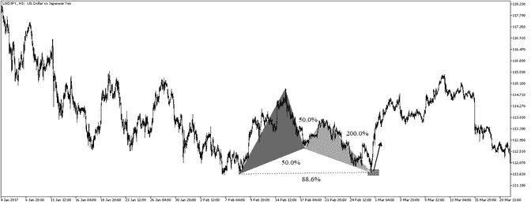

An example of the Bat pattern. (Image by Author)

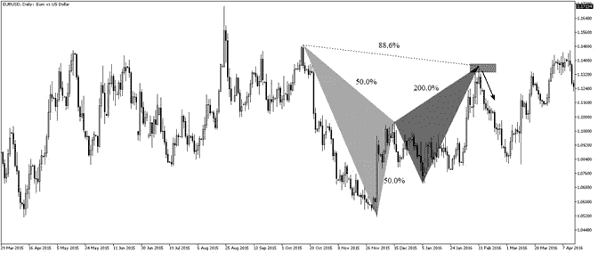

An example of the Bat pattern. (Image by Author)

上图显示了价格达到 88.6%后的良好反应。Bat 模式在我自己的亲身经历中有非常好的成功率。它不容易被发现，也不常见，但当它发生时，它肯定会增加我们交易的价值。

如果你也对更多的技术指标和使用 Python 创建策略感兴趣，那么我关于技术指标的畅销书可能会让你感兴趣:

 [## Python 中的新技术指标

### 亚马逊网站:Python 中的新技术指标:9798711128861: Kaabar，Sofien 先生:书籍

www.amazon.com](https://www.amazon.com/gp/product/B08WZL1PNL/ref=as_li_tl?ie=UTF8&camp=1789&creative=9325&creativeASIN=B08WZL1PNL&linkCode=as2&tag=sofien-20&linkId=e3cb9716bb6a07cf6c8b9fb585412b07) 

**螃蟹图案**

螃蟹形态是一个有趣的配置，它利用延伸的移动来检测即将来临的反转水平。它被定义为:

*   第一段应该回撤 61.8%。
*   第二回合应该也会回撤 61.8%。
*   第三支应该回撤 261.8%。
*   从开始到顶部的整个回撤应该回撤 161.8%。

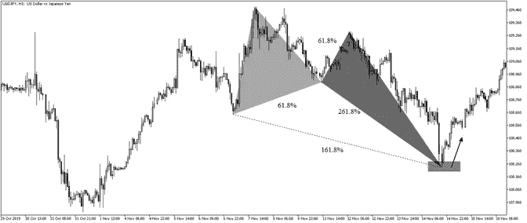

An example of the Crab pattern. (Image by Author)

这是另一个看跌螃蟹做出反应的例子。有时，和声模式确实提供了反转，但我们不应该期望他们会这样。它们仅用于反应，如下图所示。

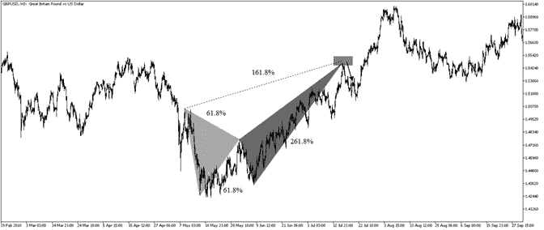

An example of the Crab pattern. (Image by Author)

**蝴蝶图案**

蝴蝶模式是另一种复杂的谐波配置，与上述类似，但有一个明显的区别。第三条腿打断第二条腿的边。也就是说，一个看涨的蝴蝶形态会有一个 M 形，第二条腿比第一条腿低。以下是完美蝴蝶图案的条件:

*   第一段应该回撤 78.6%。
*   第二回合也应该回撤 50.0%。
*   第三条腿应该回撤 161.8%，这是一个简单的 ABCD 模式。
*   从开始到顶部的整个回撤应该回撤 127.2%。

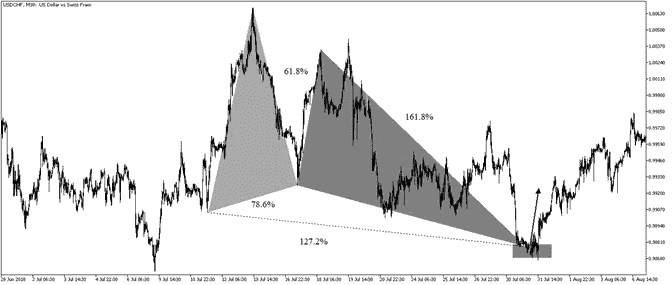

An example of the Butterfly pattern. (Image by Author)

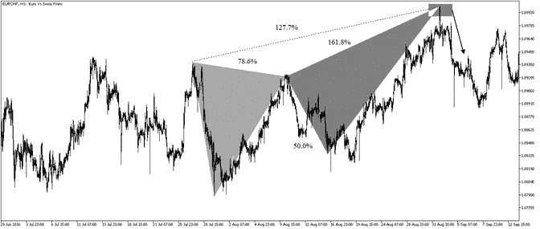

An example of the Butterfly pattern. (Image by Author)

**修改后的鲨鱼图案**

这个模式对我来说并不是一个真正的发现，它仅仅是试图找到完美比例的汇合点。我发现许多模式都有比率的间隔，这使得它们模糊不清，具有重叠的性质。我试图找到一个有精确比例的模式。

 [## 新冠肺炎期间股票交易的 9 个教训|数据驱动的投资者

### 在你浏览之前，让我告诉你一些关于我自己的情况。我是…

www.datadriveninvestor.com](https://www.datadriveninvestor.com/2020/12/09/9-lessons-learned-about-stock-trading-during-covid-19/) 

当然，这种模式很少见，但以我个人的经验来看，它很有效。这也是唯一一个仅使用完美比率的复杂模式，第一段回撤 61.8%，第二段回撤 161.8%，第三段回撤也是 161.8%，最后回撤是黄金比率(161.8%)及其倒数(61.8%)之和 224.0%。我喜欢把这个比率和技术指标或长期均线结合起来使用，这样才能对交易有很强的信心。

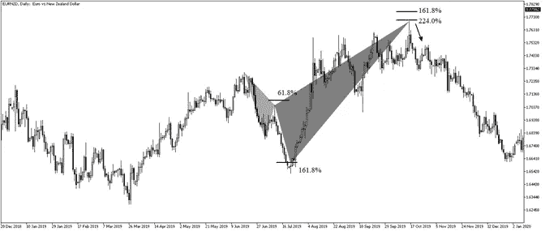

An example of the Modified Shark pattern. (Image by Author)

这种模式的美妙之处在于，它通常比其他模式预示着更强的反转。然而，这不应该是与谐波模式一样的预期，我们只想玩反应，而不是完全的趋势反转。然而，有趣的是知道反应会很强烈。我称之为修改的鲨鱼模式，因为它类似于原始的鲨鱼模式。

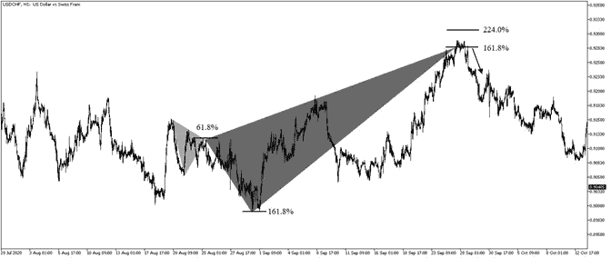

An example of the Modified Shark pattern. (Image by Author)

**箭头调和图案**

我在搜索极端反转后的长期波动后发现了这个模式。该模式相当简单，来自 ABCD 家族。ABCD 是一个简单的对称结构，AB 边等于 CD 边。箭头调和模式是当 CD 段等于 AB 段的 2.24 倍时，因此它捕捉到了遥远的反转。下面是箭头图案的一个例子。

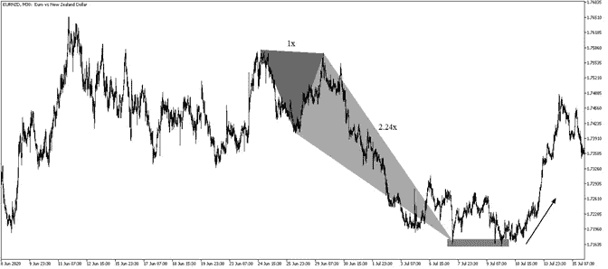

An example of the Arrow pattern. (Image by Author)

为什么我选择了箭头这个名字？嗯，这不是由于某种复杂的原因，而是因为这个图案的长度像一个箭头。下一张图显示了一个 ABCD 模式，后面跟着一个箭头模式。ABCD 的另一个变化是 CD 段等于 AB 段的 1.618 倍。

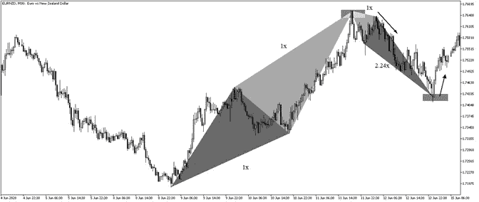

An example of the Arrow pattern. (Image by Author)

下面的模式只是一个 ABCD，CD 是 AB 的 1.618，因此扩展了它。

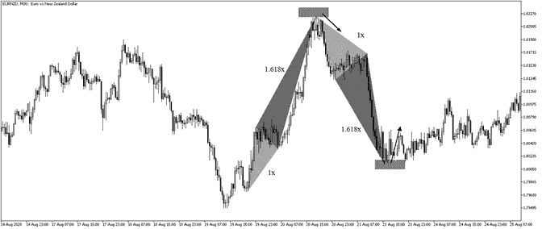

An example of the extended ABCD pattern. (Image by Author)

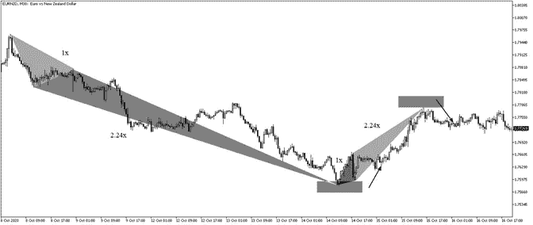

An example of the Arrow pattern. (Image by Author)

有时，我们可以将模式与技术指标(如 RSI)结合起来，以确认反应。在下面的例子中，我们可以看到箭头形态完成时的看涨背离。

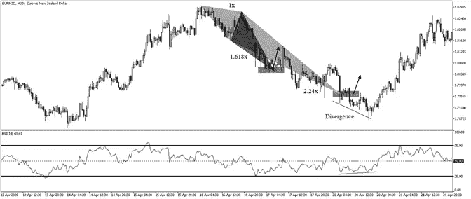

An example of the Arrow pattern. (Image by Author)

下一节将讨论如何交易模式，以及在哪里设置止损和止盈单。这是一种相对简单的方法，交易者可以灵活多变。

# **谐波风险管理**

根据模式交易需要触及隐含反转区，也称为潜在反转区——PRZ。我交易时遵循的一个基本乐途是设置两个目标，第一个在顶部到底部回撤的 38.2%，第二个在 61.8%。止损点将设在进场点和第二个目标点之间距离的一半处，从而确保 2.0 的风险回报率。我通常在第一个目标时拿走一半的利润，把止损移动到盈亏平衡，这样我可以确保交易不会亏钱，以防价格反弹。

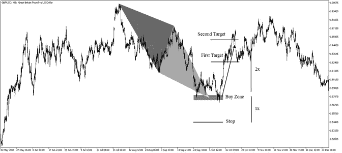

Harmonic Risk Management. (Image by Author)

# 结论

和声模式教程和书籍在互联网上随处可见。如果有一个来源我会推荐，这将是斯科特卡尼的书籍。有很多例子很好的解释了它们。

为什么写这篇文章？这当然不是填鸭式的方法，也不是盈利战略之路。如果你关注我的文章，你会注意到我更强调如何去做，而不是 T2，这里是 T3，我也提供了不完全可复制的代码。在金融行业，你应该自己从其他外生信息和数据中组合碎片，只有这样，你才会掌握研究和交易的艺术。

## 获得专家观点— [订阅 DDI 英特尔](https://datadriveninvestor.com/ddi-intel)