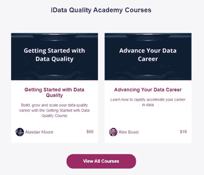

# 推进您的数据职业发展

> 原文：<https://medium.datadriveninvestor.com/advancing-your-career-in-data-ec083eb6d0ba?source=collection_archive---------12----------------------->

## 学习如何进化

Photo by [Razvan Chisu](https://unsplash.com/@nullplus?utm_source=medium&utm_medium=referral) on [Unsplash](https://unsplash.com?utm_source=medium&utm_medium=referral)

大家好，

我回来了！

今年夏天，在经历了一段恐惧和不确定的时期(自由职业、写作和哭泣)后，我回到了数据行业，并再次用我的能力做好事。

我非常幸运，因为我被要求开设一门课程，在这个不确定的时期里，如何在数据领域导航或追求职业生涯，我已经投入了全部精力。

我想给你们概述一下今天的课程内容。

在我谈论细节之前，我想解释一下我们已经作出的一些决定；我们计划的目标是帮助尽可能多的人更多地了解数据行业，获得新的技能和知识，并最终在我们所处的充满挑战的经济环境中为自己做好准备。

正是因为这种充满挑战的环境，我们认识到，我们需要让我们正在做的事情**更容易被人理解**，并不断为你们，我们的观众，增加价值。

因此，我们很高兴地宣布，我们已经采取了三个步骤来应对数据社区中所有人目前面临的挑战:

我们将把[开始使用数据质量](https://idataqualityacademy.com/courses/idata-quality-course?affcode=536778_8wz5l-gi)的价格降低 66%，将**永久降低**

我已经成为一名讲师，并开设了一门课程，教你我是如何在数据行业取得成功的，失去了一切，然后重新努力，并尽可能积极地定价。

购买《数据质量入门》的每个人还将免费获得我的课程[数据职业发展](https://www.idataqualityacademy.com/p/advancing-or-pursuing-a-career-in-data?affcode=536778_ildryali)。

不仅如此，如果你目前无法投资这些课程，如果你从现在到圣诞节期间给 Alexander.Boast@intelligent-ds.co.uk 发电子邮件，解释你的情况，我可能会为你们中的一些人安排高达 100%的折扣，前提是你向你的朋友推荐这门课程，如果它对你有帮助的话。

 [## 一瞬间学会数据科学！？数据驱动的投资者

### 在我之前的职业生涯中，我是一名训练有素的古典钢琴家。还记得那些声称你可以…

www.datadriveninvestor.com](https://www.datadriveninvestor.com/2020/07/23/learn-data-science-in-a-flash/) 

**关于推进您的数据职业:**

我的课程与今天的情况特别相关，因为它涵盖了你在这些不确定的时期变得适应性强、灵活和富有弹性所需要的技能。

我可以代表面试桌上的双方，也可以代表最近就业和失业的人。

以下是我列出的章节标题:

**(追求或)推进你的数据职业:**

介绍

与你的相关性

没有学位？没问题！

理解运气

钱的问题

巨大的性感风险

经理与领导者

勇气

情商和倾听

寻求帮助

指导

您的新 KPI

数据呢？

挑战还是机遇？

B 计划

奖金

一旦你完成了课程，你将获得证书，并有机会加入 Slack 小组，在那里我和我们的其他教师与你的学习伙伴一起闲逛；您可以随时向我们的专家提问。

Source: Idataqualityacademy.com

## 获得专家视图— [订阅 DDI 英特尔](https://datadriveninvestor.com/ddi-intel)