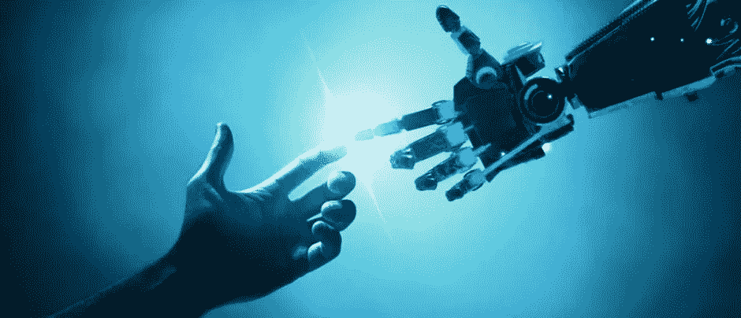

# 幕间休息后:第二幕

> 原文：<https://medium.datadriveninvestor.com/after-the-intermission-the-second-act-f2469cf228a1?source=collection_archive---------5----------------------->

所以，去年二月我半退休了。

经过十年的建设、发展和最终出售 SweetIQ 后，我需要去度一个没有预定结束日期的长假。一部分是因为我精神枯竭了，但老实说，更大的原因是因为我想享受——这是我人生中第一次——不用担心钱的奢侈生活。在我三十多岁的时候过着“退休”的生活。

所以我做了…什么都做了…买了所有的东西，到处旅游，吃了昂贵的食物(不管那意味着什么)，参加了独家活动，见到了名人…酷…不管…

三个月后，当迷雾散去，我感到不满足。我不应该有这种感觉。但我做到了。

我读了书，听到了所有的评论，收到了以前经历过这些的人的所有建议，但你只是不知道，直到你自己经历过…现在… *我知道*。

 [## 风险投资家在给创业公司播种时会考虑什么标准？数据驱动的投资者

### 2017 年，风险投资资金攀升至十年来的最高水平。你的创业公司目前吸引风险投资的机会是…

www.datadriveninvestor.com](https://www.datadriveninvestor.com/2018/04/20/what-criteria-do-venture-capitalists-consider-when-seeding-a-startup/) 

所以我在接下来的几个月里试图找出差距。不是更多的物质财富。不是更多的关系。不是家庭或孩子…我很幸运拥有这一切。

它更深。这感觉像是一种义务，一种我必须做的事情。

所以我召集了我认识的最聪明的人，花了无数的时间讨论最随意的话题。我花了整整 8 分钟的时间试图成为一名风险投资人(讨厌它——向所有做得好的风险投资人致敬)。我为一群非常聪明的企业家提供咨询(讨厌这样——我不喜欢不负责)。我甚至试图与埃及政府合作，帮助其新兴的技术领域(这很有趣，但距离是一个挑战，我还没有准备好搬回来)。

尽管在整个过程中，我一直坚持两个主张。

1-我是个彻头彻尾的经营者。我不想做其他任何事情，这是让我开心的事情，下一个动作需要大，需要有意义，需要**大胆**。

无论我去哪里，看到什么，我都发现自己被吸引去分析人和机器之间的相互作用。我们如何工作，我们如何相互交流，人类劳动力如何发展，以及我们如何描述一个机器取代人类的未来…有点像愤世嫉俗的自我实现的预言。自始至终，我都在思考同一个问题:**我们是在创造一个人类技能被低估或被淘汰的未来状态吗？**

那是相当暗淡的未来…

# 我们严重低估了人类的能力

绝大多数人过着朝九晚五的生活，完成一系列重复性的与工作相关的任务，根据他们居住地区的社会经济条件和他们的职位获得一些“标准化”的货币价值。这种按时补偿员工的观念是一个错误的价值等式，在过去几年里，随着零工经济工作的出现，我们已经看到这个问题开始得到解决。尽管零工的条件还不理想，但至少现在有了一个基础。

当我看到这个可怜的保安站在零下 25 度的天气里告诉那些试图进入封闭街道的人他们不能…真是浪费生命时，我的想法达到了顶点。那个警卫不是白痴，他们的环境让他们接受做这份工作来获得每小时 15 美元的报酬。

这不应该发生。这个职位不应该存在，这个聪明能干的人应该利用他们的能力做更有价值的工作，更好地利用他们的人类能力，而拒绝人们进入封闭街道的功能应该交给机器人。

# **我在今天的“AI”上叫扯淡**

我会见了几十家公司，它们都声称拥有“真正的人工智能”。我有一个计算机科学的学位，在过去的 20 年里一直从事编码工作…我知道如何进行非常深入的技术对话。这些公司不仅没有人工智能，而且他们都是在假设他们的*“高级算法”*将能够取代全部人类技能的基础上筹集资金的。好吧…好吧…给我看看。我与他们的客户、潜在客户、行业人士进行了交谈，从他们那里我得到了压倒性的信息:

> 我们不相信机器，它最多只能带我们走 80%的路。

这并不是说没有令人难以置信的深度学习技术和非常先进的神经网络正在建立之中……我是说我们离完全一对一的机器替代人类还很远。

这是个好消息！仍然有时间对这种不可避免的说法做些什么。

# 我生活在一个…

我经常用这句话来描述我对某些情况的看法，或者指责某人告诉我某事不能做。它让我将一个我看到的状态具体化，一个我相信的状态，一个我知道我能创造的状态。所以现在开始…

*在我生活的世界里，*机器使人类能够扩展他们的能力和技能，混合的人类+机器比单独的任何一个都提供更多、更好、更快的东西，他们提供的产出的价值是以可交付成果而不是时间来补偿的。

这是一个令我兴奋的世界，一个人类潜力无限的未来。

# 我要重新发明工作

我已经深入这个空间，分析如何创造我所描述的这个世界，大约 4 个月后，一些奇迹开始发生了。非常聪明的人正在加入我的团队，我们构想的概念验证已经成为 alpha 版本，我们已经在我们的平台上完成了数十万美元的工作，并创造了合适的条件向我们的员工社区支付数十万美元，在不久的将来，有望达到数百万美元。

所以现在，我正式宣布“不退休”，作为[wrk.com](http://www.wrk.com)的联合创始人，我感到非常自豪和激动。

我会在 [Medium](https://medium.com/@Mohannad) 、 [twitter](https://twitter.com/mohannadB) 和 [LinkedIn](https://www.linkedin.com/in/mohannade1/) 上分享我们旅程的更多细节，我一直很感谢大家的投入、评论和对困难问题的挑战。

最重要的是，如果你想成为这个旅程的一部分，请联系我们。有令人难以置信的大量工作要做，这只能通过引入具有传教驱动力的人来完成这一使命。

未来是我们去创造的…而不是看着它展开。