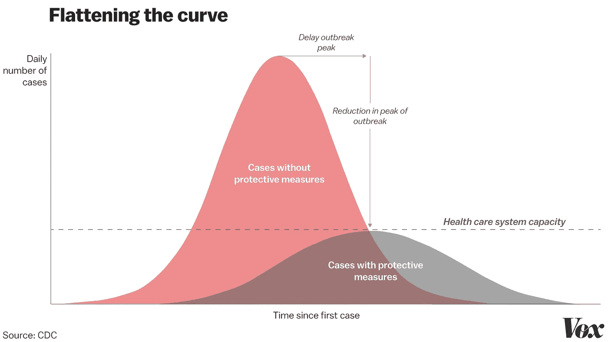

# 病毒之后。接下来会发生什么，为什么西方经济体不能同意

> 原文：<https://medium.datadriveninvestor.com/after-the-virus-what-happens-next-and-why-western-economies-cant-agree-186e1df72aa6?source=collection_archive---------3----------------------->

## 铺天盖地的报道专注于新冠肺炎每分钟的最新消息，但很少关注疫情管理层的长期影响。所以我试了一下。

Alice Yamamura on Unsplash

目前，大多数西方经济体都处于高度“隔离”状态，希望延缓、减少甚至遏制病毒。但是接下来会发生什么呢？就隔离的持续时间和影响而言，2020 年会是什么样子？我发现这种报道是令人沮丧的短视行为，所以我想把我所能找到的关于病毒随时间发展的情况以及它对我们经济的意义放在一起——以英国/欧洲为重点。(这些都来自可靠的来源，如世卫组织、柳叶刀——都有超链接)。

健康警告:我不是流行病学家，但我有统计学、经济学方面的经验，甚至完成了关于 17 世纪黑死病传播的本科论文(这比听起来更有趣)。

这是一个独特的情况，对新冠肺炎的流行病学知之甚少。我们所知道的大部分来自中国，这与西方经济体和公民社会的运作方式不同。但是让我们尽力去学。

我们知道新冠肺炎不是“新流感”。它的传染性是普通人的两倍，死亡率也高得多。我们知道它的平均潜伏期(无症状，但有传染性)为[5-6 天](https://www.who.int/docs/default-source/coronaviruse/who-china-joint-mission-on-covid-19-final-report.pdf)，并且已经击败了中国、意大利、西班牙和法国的遏制企图。我们知道它在中国[之外呈指数增长](https://www.who.int/docs/default-source/coronaviruse/20200312-sitrep-52-covid-19.pdf?sfvrsn=e2bfc9c0_2)(这仅仅意味着病例每几天翻一番)。我们还知道，在一月份遏制措施失败后，中国限制感染增长的超人的防疫措施已经导致那里的病毒传播迅速下降。

 [## 为什么包容性财富指数比 GDP 更能衡量社会进步？|数据驱动…

### 你不需要成为一个经济奇才或金融大师就能知道 GDP 的定义。即使你从未拿过 ECON 奖…

www.datadriveninvestor.com](https://www.datadriveninvestor.com/2019/03/08/why-inclusive-wealth-index-is-a-better-measure-of-societal-progress-than-gdp/) 

一旦被感染，这种病毒只能持续大约 3 周。我们相信新冠肺炎患者在大约 20 天后不再具有传染性[，我们希望(但不能确定)他们对病毒有免疫力。(我快速但相当彻底的搜索没有发现病毒后免疫的真实证据，大概是因为现在下结论还为时过早)](https://www.thelancet.com/journals/lancet/article/PIIS0140-6736(20)30566-3/fulltext)

正是这最后一点值得细说。英国和其他政府希望病毒达到顶峰，然后“群体免疫”——当大多数人具有病毒后免疫——允许社会回归更正常的生活模式。

但问题是。在你有疫苗之前，如果你想让社会发展出对新冠肺炎的免疫力，那么你*希望他们得到它*。让我们明确一点，80%的人口(英国的模拟假设)。

这是一种不同于中国隔离数百万人口并追踪感染者接触者的方法。为什么西方经济体不效仿武汉模式？除了在不太易受影响的人群中实现这一目标的可行性之外，危险在于这一切会在今年晚些时候引发第二波疾病。发生这种情况是因为从未感染过新冠肺炎病毒的大量人群仍然容易受到仍在传播的病毒的影响，当他们从隔离生活中走出来时，会立即被新一波病毒感染。在 14 亿人口中“只有”8 万例病例，中国绝对没有“群体免疫”。

如果第二波疫情发生在今年晚些时候(那时病毒会产生更大的影响，医疗服务会更加紧张)，总体影响可能会比让病毒在今年春天“泛滥”更糟糕。

所以，如果我们(或者至少是社会中最健康的人)感染病毒是最好的，为什么我们都还在洗手呢？这也许是国家的最大利益和个人的最大利益相冲突的地方。没有人想要这种病毒，尽管它有可能“提供”未来的免疫力，

因此，在英国和许多其他经济体，我们有一种精神分裂的官方反应。卫生专业人士肯定会就如何避免这种情况提出建议，但政府没有强制推行全面的“社会距离”政策，很可能是因为他们寄希望于“群体免疫”。建议能感觉到*矛盾:*“怎么**不**拿到病毒(却请**拿到**)”。

Vox quoting CDC

这是基于行为科学的各种社会工程——行为科学总是提供不同的变化理论。各国政府大多遵循疾病预防控制中心的“延迟和拉平”策略，即你承认疫情将会很严重，但你会延迟疫情高峰并减少疫情。

但是，对于每个政府愿意在多大程度上阻止或减缓传播，出现了广泛的分歧。在一些政府寻求“低中断启动”模式的地方(英国、德国)，许多[欧洲国家](https://www.bbc.co.uk/news/world-europe-51876784)关闭了边境和/或学校。此外，个人和组织正在“自我选择”，这是一种集体隔离的形式。在撰写本文时，无数的体育赛事被取消，大量的雇主和大学将人们送回家。

现在很难批评任何一个政府的做法。也就是说，美国对所有欧洲航班的禁令——最初除了英国和爱尔兰——至少从根本上看是不合逻辑的。为什么不是英国和爱尔兰？我们拿到了。

如果某些政府认为更加孤立主义/留在国内/关闭边境的方法将“拉平曲线”,那么谁说他们错了？鉴于“群体免疫”理论无法得到保证，一个简单的不被感染的政策对个人和组织来说似乎是基本合理的。

然而，我真正担心的是经济。无论英国政府通过避免更严厉的措施对经济多么“仁慈”,孤立的浪潮将在经济活动中产生一个阶跃变化。

Photo by [Hello I’m Nik 🍌](https://unsplash.com/@helloimnik?utm_source=unsplash&utm_medium=referral&utm_content=creditCopyText) on [Unsplash](https://unsplash.com/s/photos/virus?utm_source=unsplash&utm_medium=referral&utm_content=creditCopyText)

接下来会发生什么？理论上，新冠肺炎病毒会扩散到大多数现代西方经济体——除非社会距离造成了一种伪武汉式的病例减少。坦白地说，从西班牙和法国最近的数据来看，这似乎有点牵强。所以回到“我们中的许多人/大多数人会明白”的场景:不管你在哪里，这种传染程度从“保持冷静，继续前进”到“锁上门，买卫生纸”，我们都将看到旅行、工作、度假和休闲的空前减少。试着想出一个不受这种活动水平下降影响的工业部门。坦率地说，麦肯锡预测经济影响的审慎尝试看起来“欠考虑”。这是在我们开始寻找新的病毒株，即“COVID-20”和其他病毒株之前。

我认为，是时候开始审视这场全球经济大震荡所带来的新经济范式了。我们需要帮助人们度过经济危机，而不仅仅是健康危机。