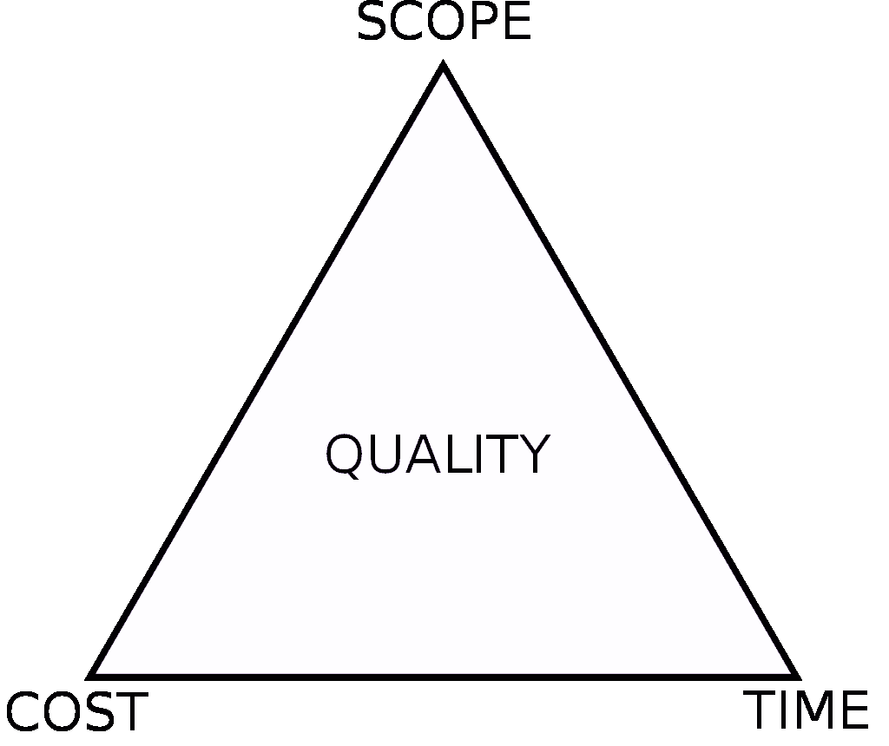

# 敏捷项目管理及其在医疗实践中的应用

> 原文：<https://medium.datadriveninvestor.com/agile-project-management-and-its-application-in-medical-practice-3e68c6853c60?source=collection_archive---------1----------------------->

Photo by [Marcelo Leal](https://unsplash.com/@marceloleal80?utm_source=medium&utm_medium=referral) on [Unsplash](https://unsplash.com?utm_source=medium&utm_medium=referral)

## 管理当今医疗实践的当代见解

现实地说，“医疗实践”是一个复杂的大工程。它正变得日益复杂和错综复杂。与通常属于技术领域的东西不同，医疗保健充满了无数的决定因素和可变性。因此，在过去的十年中，拥有一个强大的管理方法变得更加重要。

随着过去几个时代的快速技术发展，我们从科技行业中了解到，医疗保健业务落后于所有其他业务。特别是医疗实践，在采用实用而有效的工具来保持领先于 21 世纪千禧年的期望，同时保持竞争优势方面，无论如何都是落后的。

因此，在我看来，医生的实践，而不仅仅是大型组织，必须采用某种形式的项目管理方法和工具，这将为他们做得最好铺平道路；也就是说，病人护理。

在项目管理设备的光谱中，我们可以说出九种最常见的方法:敏捷、Scrum、看板、Scrumban、精益、极限编程(XP)、瀑布、PRINCE2 和 PMI 的 PMBOK。人们还可以注意到各种组织应用的一种或多种最新方法的混合。

就我而言，我不认为自己精通项目管理；尽管如此，我还是打算从另一个角度来解决我们这个时代常见的医疗实践挑战。

这篇文章只关注敏捷实践及其在医疗保健中的潜在价值，并不倾向于某一种方法。

## 医学项目的定义和关键特征

理解项目的正确定义和重要特征需要个人的立场，因为项目或任务的执行不仅仅是完成一项工作。但是通过项目管理，开发成为实现一些预期结果或产品的机会。因此，陷入任何给定项目的个人或组织需要理解如何通过项目管理解决错综复杂的问题。

该项目为组织和个人提供了一个通过实施转型更有效地实现其商业和非商业抱负的机会。项目以一种有组织的方式支持我们期望的变化，并且减少了失败的可能性。

典型的项目通常是短暂的。它总是有一个起点和终点，利用一组独特的可交付成果或一个单一的产品。

每个项目都需要逐步细化，包括不断的调查和改进，因为它变得可用，所有这些都允许构建更准确和全面的计划。

任何可交付成果都应该在项目开始之前解决问题或进行需求分析。同样，一个标准的项目必须是有目的的，因为它有一个**理性的和可测量的**购买，**逻辑的**因为它有一个特定的生命周期，**结构化的**因为它的任务和行动之间有相互依赖性。一个项目在试图解决一个问题时可能会有**冲突**，受到可用资源的**限制**，并可能与**风险**一起成为一个要素。

一个项目与其他项目的区别在于它们的目标工作，如任务、过程、程序。同时，从广泛的意义上来说，项目被定义为一个精确的、预先确定的活动，在精确的预先确定的规格下产生可见的和可测量的结果。

基于这一假设，并考虑到当前医疗保健系统的复杂性，让我们将患者门诊视为一个不寻常的项目。我们相信某种形式的项目管理方法支持任何医疗实践。

Photo by [Richard Cohen](https://unsplash.com/@rickyc678?utm_source=medium&utm_medium=referral) on [Unsplash](https://unsplash.com?utm_source=medium&utm_medium=referral)

## 项目管理三角

不管我们为给定的医疗实践选择什么样的项目管理方法，有一点是一致适用于所有项目的，不管是什么行业——都遵循“项目管理三角形”的规则

项目管理三角，也称为**三重约束**、**铁三角**，或简称为**项目三角**，是项目管理局限性的模型。

根据三角形，工作质量受到项目资金、期限和范围的限制。(图 1。)

Fig 1.

在一个典型的场景中，任何给定的项目经理都必须在三个约束之间做出决策，同时尽可能保持三角形的等边形状。一个约束的改变迫使其他约束的改变来补偿。否则，质量会受到影响。例如，我们可以通过增加预算或缩减工作范围来更快地完成患者就诊。

正如我们所知，保险公司不会根据项目的财务要求来调整赔偿；因此，在这种情况下范围；因此，护理质量将受到影响。类似地，工作或交付物数量的增加可能需要相应地增加预算和进度，如果不利用基本的技术、策略和人力资源，这是很难实现的。

简而言之，削减预算而不调整进度或范围将会降低质量。

## 项目管理基础及其医学应用

每一个[项目管理都由](https://en.wikipedia.org/wiki/Project_management)一组单独的任务或活动组成，包括**启动**、**计划**、**执行**、**控制**、**结束一个团队的工作**，以在特定的时间框架内实现精确的目标和满足具体的成功措施。

开发管理的主要挑战是在给定的约束条件下达到所有概述的目标，正如项目三角形所描述的。这些信息通常在项目文档中指定，在任何开发过程开始时创建。从病人联系医生的办公室开始，直到出院时有一个计划和后续计划，医疗实践必须有一个明确定义的目标，提供主要的约束。因此，公平地说，项目或实践管理的目标是按照医生和患者的目标和期望产生完整的患者护理。在许多情况下，这种患者就诊管理旨在形成或改革医生的主张，以可行地解决目标；并保持最佳患者满意度。

一旦医疗实践的目标被精确地介绍，他们应该能够影响其他参与他们计划的人的所有决策，如经理、顾问、承包商。定义不明确的项目管理目标对决策的构建是有害的。

项目管理通常是根据规模、计划范围、性质和行业类型为特定类型的项目量身定制的。

 [## 机器人医疗会把医生甩在后面吗？

### 医疗实践是一门艺术。它一直是，并将永远是艺术。作为医生，我们收集临床和…

medium.com。](https://medium.com/datadriveninvestor/will-robotic-medicine-leave-physicians-behind-db808ba8ee54) 

## 项目管理的四个 P

任何项目的最终成功都取决于管理的四个关键方面与其动态环境力量的匹配程度。这些关键因素也被称为“四个 P”。后者包括计划和预测活动、将整体战略应用于所有运营和项目治理的项目开发、人员以及他们如何合作和沟通的动力，以及最终的权力线、决策者、实施政策。

## 如何着手一个项目

设计和完成项目的方法有很多，包括**分阶段**、**精益**、**迭代**、**增量**。项目预测也有不同的分支，基于**结果(基于产品)**或**活动(基于过程)**。

无论采用何种方法，都需要仔细考虑总体项目目标、时间表、成本以及所有成员和利益相关者的角色和职责。

Photo by [Martha Dominguez de Gouveia](https://unsplash.com/@mdominguezfoto?utm_source=medium&utm_medium=referral) on [Unsplash](https://unsplash.com?utm_source=medium&utm_medium=referral)

## 什么是项目，它如何应用于病人护理？

在一个组织中，项目是在给定的商业生态系统中为实现而计划的一项细致的工作。在项目管理领域中，必须区分创建的不同部分。例如，一个计划通常属于一个广泛的、长期的目标，我们通常可以将它分解成一系列的项目和子项目。或者是一项任务，其中表示一项可识别和可测量的活动，包括执行相关项目的一小部分工作。

关于项目要提到的其他部分是与项目任务的划分相关的工作包。因此，工作单元是工作包的一个部分。

想象一下；患者护理作为一个项目，在其频谱和所述患者护理过程的顺序内产生任务、工作包，例如**安排**、**评估**和**出院后跟进**。

在医疗实践环境中使用项目管理练习的主要好处是，通过实现实际监督的概念，可以加速医师实践管理的完善和加强。后一种方法也有助于通过实现与诊所策略相关的独特变化来灵活处理风险。

## 项目管理工具及其意义

在本文的前面，我指出了典型项目管理的主要“ [4 P”方法。我还描述了结果(基于产品)或活动(基于过程)的应用。无论采用何种方法，都需要特别关注项目的总体目标。这包括特别关注成本、时间表以及所有利益相关者的角色和职责，如护士、经理、医生和职员。](https://en.wikipedia.org/wiki/Project_management)

在假设的领域内，我们还可以找到项目的各种关注点和方法，包括**效益实现管理**、**关键链项目管理**、**挣值管理**、**迭代和增量项目管理**、**精益项目管理**、**分阶段方法**、**项目生产管理**。

## 为医疗实践选择正确的方法

在现代项目管理中，管理者通常不会坚持单一的方法。相反，当代医疗实践必须精通各种项目管理手段，知道如何同时融合几种技术。它必须能够适应基于个人实践的需求。在 2019 年接受调查的项目专家中，百分之八十九( [89%)宣称他们的机构执行了混合项目管理方案。](https://thedigitalprojectmanager.com/project-management-methodologies-made-simple/)

今天，人们可以找到大量的项目管理方法，并以这样或那样的方式使用，我在本文前面概述了其中的九种。然而，为了更好地理解，所有流行的方法都是由领域中的人使用的练习、技术、过程和规则的方案。尽管如此，我们必须选择基于以某种方式执行事情的方法，比如应用各种原则、主题、框架、过程和标准。因此，为了便于讨论，让我们选择“敏捷方法”

## 敏捷管理是医疗价值观的应用

敏捷管理是主要为敏捷软件开发这一技术领域建立的价值观的应用。今天，这种方法在其他行业的各种管理技术中变得越来越普遍。随着 2001 年敏捷软件开发领域的出现，敏捷系统开始分散到其他活动领域。

因为敏捷方法的价值是基于整个交付过程的经验，所以它对于小型医疗实践来说是一个有价值的模型。

## 敏捷方法的演变

敏捷方法包括许多患者管理策略，在这些策略下，需求和解决方案通过自组织和跨职能团队及其患者的协作努力展开。它坚持**“适应性规划**、**进化成长**、**提前交付**、**持续变革**。敏捷性激发了对变化的快速和灵活的反应，这对于今天的医疗实践领域来说是非常熟悉的。

## 敏捷开发宣言

敏捷方法的价值基于他们交付项目(如病人护理)和帮助他人完成同样项目的综合经验。敏捷哲学强调透明度和优先级的重要性:

●个人和互动；超过流程和工具

●工作服务操作；过度全面的文档

●客户协作；过度合同谈判

●应对变化；过度遵循计划

工具**和过程在敏捷方法论**中至关重要，但是让合格的员工有效地一起工作甚至更加重要。充分的文档对于帮助人们理解如何构建操作和患者护理分布以及如何利用系统(包括技术和服务交付)是有价值的。尽管如此，该项目的中心主题是照顾病人，而不是记录或遵循一套严格的协议。

契约是相关的，但不能代替与医生和病人密切合作，发现他们的愿望。

项目策略是必不可少的，但它不能过于严格，以适应技术或环境的变化，利益相关者的优先事项，以及人们对问题及其解决方案的理解。

## 敏捷运动不是反方法论的。

一些人认为快速方案本身就违反了方法论原则。相反，许多人期望通过恢复平衡来恢复方法论这个词的可信度。这就是为什么敏捷项目管理方案包含建模，但不是为了在一个布满灰尘的公司知识库中填充一些模型和策略。但是，有必要扣紧文档，而不是数百页从不维护和很少使用的大部头。敏捷有助于规划，但也认识到在混乱的环境中规划的门槛。

## 敏捷方法的哲学

敏捷方法主要针对具有动态、不确定和非线性特性的复杂系统。在医疗实践和医疗保健交付等情况下，在早期阶段通常很难获得精确的估计、坚定的计划和预测，并且对它们的信心可能非常低。因此，敏捷用户会请求减少信任，这是在我们能够实现任何价值证明之前所需要的。需求和设计被认为是积极向上的，同时接受任何重要的预先规定可能会在这种情况下造成大量浪费，比如经济上不合理。这些基本的论点和以前从多年的成功和失败中学到的行业实践帮助形成了敏捷开发对适应性的、迭代的和进化的进步的支持。

通过及时和连续提供有价值的服务使医生和病人满意是任何医疗实践的核心目标。因此，承认变更需求，即使是在过程的后期，对于项目管理也是至关重要的。该方法必须能够在员工的日常团队工作中频繁、紧密地交付服务。敏捷提供了那种管理系统。

围绕敏捷结构构建的项目鼓励应该可靠的个人；它提供了面对面讨论的最佳交流方式。

患者和医生的满意度是敏捷系统增长的主要衡量标准。它提供不稳定的发展，可以承受稳定的步伐，呈现不间断的卓越意识和道德实践模式。简单至关重要。

最好的架构、配额和设计来自自组织团队。在后者中，船员们通常会考虑如何变得更有效率，并做出相应的调整。

大多数敏捷开发方法将项目工作分成小的增量，从而最大限度地减少前期规划和设计。迭代或冲刺是持续时间很短的帧，通常持续一到四周。

每个冗余包括一个跨职能团队，从事所有职责，包括规划、分析、运行设计、测量和批准测试。

在项目结束时，向参与者演示一个工作系统。这将整体风险降至最低，并允许结果迅速适应变化。

Photo by [National Cancer Institute](https://unsplash.com/@nci?utm_source=medium&utm_medium=referral) on [Unsplash](https://unsplash.com?utm_source=medium&utm_medium=referral)

## 在医疗保健中采用敏捷原则

医疗保健市场中起搏技术的不断升级、成本的不断上升以及新参与者的不断涌现给医疗保健利益相关者，尤其是独立医生带来了挑战。因此，医疗保健组织和医生必须找到切实可行的方法来接受改革，我们将其概括为新的患者和临床医生价值观的转变。医疗保健领域的大多数现代发展，以及治理、业务规划和信息技术实施，都旨在最大限度地降低医疗实践的风险。然而，他们通常不灵活，无法快速适应新的变化，做出的增量变化无法交付急需的转型。

医疗保健领域敏捷方法的核心原则是，对于每一项创新，从一开始，它就建立了一个由临床医生、工程师、经理、数据科学家和用户代表组成的敏捷团队。每个小组组织一个项目周期，以改善结果并提高对患者、卫生专业人员和整个系统的价值。

虽然核心团队涵盖的员工不多，但是来自成员医疗保健系统的数百人已经参与了敏捷项目。通过在整合过程中实施敏捷原则，医疗实践可以整合变化并快速迭代，从而实现行为健康、糖尿病管理、患者参与、校园寻路、实践合规性和远程监控等临床可交付成果的在线机制。

医疗保健组织和医疗实践是天生复杂的适应性系统，许多临床和非临床学科协同工作，在不断变化的管理和报销政策下，利用技术满足患者的需求，此外还有快速的医疗信息。

敏捷和类似理论的文化挪用对于加快改革的交付和获得医疗保健中非传统方法的接受是至关重要的。为此，医疗实践必须注重在整个组织中传播创新文化。

## 高效的面对面交流

协同定位是敏捷方法的特征之一。作为负责人，团队的同事通常会联合起来，更好地认同团队，然后改善沟通。同处一地允许面对面的交流，最好是在白板前，这减少了通过电话、Slack、微软团队或电子邮件等各种通信门户传递查询和回答时通常所花费的周期时间。无论选择哪种类型的进度方法，每个团队都应该包括一个客户代表，由利益相关者认可，根据他们的利益行事，并使开发人员有个人义务在整个强调过程中回答问题。在每次重复结束时，利益相关者和客户代表审查进度并重新评估优先级，以增加投资回报(ROI)并确保与客户需求和实践目标保持一致。

## 敏捷系统需要一个非常简洁的反馈循环和适应周期。

敏捷方案中的一个共同特征是 scrum 框架中的每日站立或 [scrum](https://en.wikipedia.org/wiki/Scrum_%28software_development%29) 。后者与简短会面有关，团队成员相互报告他们前一天为团队的迭代目标做了什么，他们现在计划为目标做什么，以及他们可以看到的任何障碍或阻碍。

## 敏捷方法中的质量焦点

在敏捷中，经常使用各种工具来提高质量和增强产品或服务。这包括特定的工具和技术，例如持续集成、自动化单元测试、结对编程、测试驱动开发、设计模式、行为驱动增长、领域驱动设计以及其他方法。这是有所指的；从一开始就设计和构建质量，并在任何时候，或者至少在每次迭代结束时，为医生、工作人员和患者演示解决方案。

## 自适应方法与预测方法

从适应性到预测性，每一个项目管理工具都在永恒的光谱中占有一席之地。敏捷方法使用这个连续体的适应性方面。适应过程的一个关键特征是时间表规划的“滚动波方法”,它确定了里程碑，但在实现这些里程碑的道路上留下了灵活性，为支柱本身在未来的变化提供了余地。

适应性系统专注于快速调整以适应不断变化的现实。因此，当项目的需求改变时，适应性团队也会改变。但是，与此同时，一个适应性强的组织在预测未来会发生什么时会受到限制。

一个适应性强的团队不能概括他们在接下来的一周将承担什么责任，尽管如此，他们只能规划下个月的功能。离一个日期越远，关于那个日期将会发生什么的适应性方法就越模糊。

另一方面，预测方法往往侧重于详细分析和规划未来，并迎合既定的风险。在高潮中，预测团队可以准确地传达在整个管理过程中安排了哪些功能和任务。预测方法依赖于积极的早期分析，但不利的是，如果前面提到的失败，项目可能会变得复杂。

预测团队反复建立变更控制委员会，以确保他们只考虑最有价值的变化。因此，为了帮助管理者在适应性和预测性模型之间做出选择，他们实施了风险分析。

 [## 深度学习游戏化和人工智能作为一种现代学习工具，还是一种代理…

### 在阅读一些最新的深度学习和人工智能趋势时，我偶然发现了一个…

www.datadriveninvestor.com。](https://www.datadriveninvestor.com/2019/12/11/deep-learning-ai-learning-tool/) 

## 敏捷方法中的项目生命周期

敏捷方法支持广泛的开发或实现生命周期。一些专注于**实践**，而一些专注于管理**工作流**。很少支持**需求和扩展**的活动，而其他的寻求覆盖**整个开发生命周期**。

情境相关性应该被认为是敏捷方法之间的一个区别属性。尽管如此，在实践中，可以利用各种手段来制定条款。

敏捷开发被广泛认为非常适合特定的环境，包括从事未开发项目的小型专家团队。

作为回应，各种各样的战略和纲要应运而生，以克服大规模发展努力带来的挑战和其他问题；现在有几个公认的框架试图减轻或避免这些困难。

## 敏捷方法论；在高度管制的领域

敏捷方法最初被认为最适合于非关键服务和产品领域，因此被禁止用于受监管的领域，如医疗设备、制药、金融、核系统、汽车和航空电子部门等。然而，最近，一些非技术领域开始采用敏捷方法。

## 体验和采用敏捷工具

尽管在实践中我们可以将敏捷设计与任何范式或语言结合使用，但它们最初是与面向对象的环境紧密相关的。如前所述，敏捷方法的最初采用者通常是在独特系统上工作的中小型团队，这些系统的需求很难确定，并且很可能随着系统的开发而改变。

## 衡量敏捷性

有许多不可估量的实践和工具来衡量敏捷产品和团队的表现，我将在这一部分描述其中的一些。

## 内部评估

其中，敏捷性度量指数根据项目开发的五个维度对项目进度进行评级——后者包括:**风险**、**持续时间**、**新奇度**、**努力度**、**互动度**。一项研究表明，迅捷可以作为敏捷性的一种衡量标准，补充技术就是针对这些可衡量的目标而制定的。还有敏捷自我评估来确定一个团队是否在使用敏捷实践。

## 关于敏捷方法的公众调查

早期的一项研究报告了使用敏捷方案在**质量**、**生产率**和**业务**、**满意度**方面的收益。

调查也越来越多地指出，敏捷系统帮助他们更快地交付，提高他们管理不断变化的客户优先级的能力，并增加他们的收益。与传统的项目管理相比，研究也不断地赋予敏捷开发方法更好的结果。与此相反，也有报道称敏捷管理方法仍然太年轻，没有资格对其成功进行广泛的学术研究。

## 常见的敏捷开发陷阱

实施敏捷方法的组织和团队经常面临从更传统的方法过渡的障碍，例如[瀑布方法](https://en.wikipedia.org/wiki/Waterfall_model)，也称为敏捷反模式，或者更常见的，敏捷气味。

## 缺乏赞助者支持敏捷系统。

敏捷方法通常由团队作为“草根”努力来实现，试图优化他们的开发过程并确保一致的项目生命周期。如果没有赞助商的支持，团队可能会面临来自商业伙伴的困难和抵制。

## 敏捷培训不足

培训不足似乎是敏捷项目管理失败的最重要原因。与其他方法相比，团队陷入了假设敏捷开发的简化过程的陷阱。

## 项目负责人对敏捷的参与度很低

产品负责人负责开发活动中的业务，通常是最具挑战性的角色。一个常见的误解是让项目团队中的某个人担任产品所有者的角色。这要求团队在没有来自业务的真实反馈的情况下，就优先级做出自己的决定。团队试图在团队内部解决业务问题或延迟工作，因为他们在团队外部寻求指导。这通常会导致协作的中断和崩溃。

## 团队成员注意力不集中

敏捷方法要求团队履行项目义务，这意味着他们应该只强调那个目标的工作。然而，看起来有空闲能力的团队成员通常被期望承担其他活动，这使得成员很难帮助完成他们团队所承诺的工作。

## 敏捷方法的过度准备/规划

团队陷入花费太多时间准备或计划的陷阱并不罕见。后者对于那些不太习惯敏捷系统的人来说尤其普遍，在敏捷系统中，团队觉得有义务完全理解所有图例的规格说明。我们应该让单元准备好只推进他们有信心的那些故事，然后，在强调期间，继续发现和开发后续迭代的工作。

## 日常单口相声中的问题解决

每日站立会议应该是一个集中的、及时的会议，所有团队成员在会上传播信息。如果出现了问题解决方案，它通常只能涉及特定的团队成员，并且可能不是对整个团队时间的最佳利用。如果在每天的站立会议中，团队开始着手解决问题，那么应该把它放在一边，直到一个小组可以说话，通常是在站立会议结束后立即开始。

## 在敏捷系统中分配任务

敏捷方法的预期好处之一是允许团队做出选择，因为他们最熟悉问题。此外，他们应该在尽可能接近实施的时候做出选择，以便在判断中使用更及时的报告。如果团队成员被其他人分配任务或者在过程中过早分配任务，我们可能会失去本地化和快速决策的好处。此外，第三方工作分配也迫使团队成员进入特定角色，这限制了交叉培训的前景。通过敏捷方法，团队成员可以承担扩展他们技能的责任，并提供交叉培训的机会。

## 作为贡献者的 Scrum Master

scrum 大师是敏捷行动团队的推动者。Scrum 是一种方法论，根据敏捷理论，它使一个团队能够自我组织并快速做出修改。

scrum master 带来了信息交换的过程。

另一个标准的敏捷方法的致命弱点是 scrum 领导者扮演贡献者的角色。但是，scrum master 需要确保他们能够首先进入 scrum master 的角色，而不是从事开发任务。scrum 大师的职责是促进过程，而不是创造产品。

## 测试自动化缺失

由于敏捷开发的重复性，经常需要不同的测试周期。自动化测试有助于减少重复的集成和回归测试的影响，并解放开发者和验证者来关注更高价值的工作。

测试自动化提供了不断的重组。它允许管理者快速运行试验来确认重构没有改变系统的功能。它可以减少工作量，并增加清理工作没有引入新缺陷的信心。

## 允许技术债务累积

过分强调交付新功能可能会导致技术债务。团队必须为缺陷修复和重构留出时间。技术债务阻碍了规划能力。由于开发中断转移了团队的进一步发展，增加了计划外的工作量。随着系统的扩展，当系统的入口逻辑上增加时，重构是必不可少的。随着时间的推移，缺乏持续的关注会导致缺陷和开发成本的增加。

## 试图在迭代中接受过多的责任

一个常见的误解是敏捷系统允许不断的转换；然而，重复待办事项清单同意在重述过程中可以完成哪些工作。

过多的在制品(WIP)会导致浪费，比如上下文切换和排队。团队需要避免被迫承担额外工作的感觉。

Photo by [Austin Distel](https://unsplash.com/@austindistel?utm_source=medium&utm_medium=referral) on [Unsplash](https://unsplash.com?utm_source=medium&utm_medium=referral)

## 固定的时间、资源、范围和质量

敏捷预先确定时间(迭代持续时间)、质量，以及理想的资源，而范围保持可变。客户通常要求迭代有一个固定的范围。然而，敏捷团队应该不愿意承诺固定的时间、资源和范围(项目管理三角)。努力增加敏捷开发的固定时间和资源的广度可能会导致质量下降。

## 发起人的倦怠

由于敏捷模式专注的步伐和持续的本质，在交付团队的成员中有一个尖锐的精疲力竭的风险。

## 敏捷管理是迭代和增量的

术语敏捷管理适用于管理学科领域的设计和构建活动的迭代、增量方法，目的是基于敏捷开发宣言中表达的原则，以高度灵活和交互的方式提供新产品或服务开发。

敏捷 X 技术也可以被称为极限项目管理。它是迭代生命周期的一种变体，在迭代生命周期中，交付件是分阶段提交的。

敏捷开发和迭代开发的主要区别在于，敏捷方法在每个交付周期(迭代)中完成小的可交付成果。相比之下，迭代方法随着时间的推移发展整个可交付成果集，在项目接近尾声时完成它们。

我们开发了迭代和敏捷的方法来应对在项目结构的更一致的形式中设置的多个障碍。例如，随着项目变得越来越复杂，如果没有进步的理念，最终用户在确定长期需求时会有困难。但是在迭代中发生的项目可以不断地收集反馈来帮助过滤那些需求。

## 敏捷商业管理模式

敏捷业务管理的原则和价值体现在五个领域:

1.  **整合客户参与**包括在任何交付流程中嵌入患者和医生，以分担产品或服务交付的责任。
2.  **基于促进的管理**或者采用敏捷管理模式，比如 Scrum Master 的角色，来帮助团队的日常运作。
3.  **敏捷工作实践**:认可特定的迭代和增量工作习惯，例如 Scrum、看板、测试驱动开发，或者跨所有业务功能的特性驱动开发。
4.  **有利的组织结构**，关注员工参与度、个人自主权和基于结果的治理。
5.  **DataOps** 或者说，敏捷流程在数据分析、商业智能、大数据和数据科学中的应用。

敏捷范例是灵活的；因此，它们可以应用于生活的其他领域，例如抚养孩子。它在儿童发展方面的成功可能是基于一些基本的管理原则；交流、适应和意识。

## 敏捷项目管理批判

在大型组织和某些种类的项目中，敏捷实践可能是低效的。这就是为什么许多组织认为敏捷方法太过冰冷，并基于这种假设，采用一种混合方法，将敏捷开发的元素和计划驱动的策略结合起来。越来越多的采用敏捷实践也被批评为一种管理风格，这种管理风格简单地描述了新习语下现有的良好实践，促进了对发展战略的一刀切的思维模式，并且错误地强调了方法而不是结果。

敏捷之旅是特别自觉的。它不断地在镜子中检查自己的外表，但容忍很少的批评，独自专注于与同伴相处，拒绝所有来自过去的智慧，仅仅因为它来自过去。它字面上采用时尚和新的方言，然而，有时，自大和傲慢。

## 敏捷方法是医疗实践的正确选择吗？

毫无疑问，大多数现代项目管理工具都是新的，可能需要一些时间来完善。尽管如此，如果明智地选择，它将进一步成熟，适应任何医疗实践的需要。他们将变得更容易接近外部世界，更善于思考，因此也更有效率。

对于小型医疗实践来说，敏捷是一种更可靠的方法，因为它是一种草根运动，而且灵活。它可以进一步杂交以获得最佳适应性。

今天，除了大型和大多数中型医疗保健组织，大多数医生的实践与任何类型的项目管理都不相干。但是随着法规和命令数量的增加，以及基于价值的补偿的出现，利用某种形式的项目管理，方法变得不可避免并且非常必要。

数据驱动投资者最初发表了这篇文章。

 [## 为了主流的利益和反叛的少数人的利益而进行的个性支配

### 医生与患者代理的一瞥

medium.com](https://medium.com/datadriveninvestor/the-sway-of-individuality-for-the-benefit-of-mainstream-and-sake-of-rebellious-minority-20e70b5c8d0f)