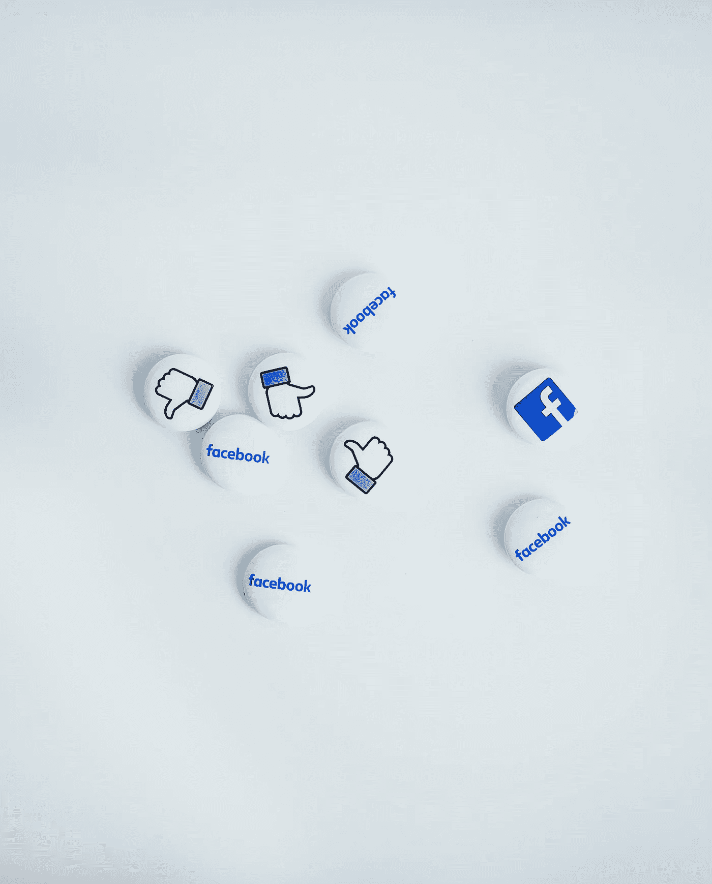

# AI &美国最受信赖的品牌助长了叛乱

> 原文：<https://medium.datadriveninvestor.com/ai-americas-most-trusted-brands-funded-the-insurgency-35bf11680442?source=collection_archive---------33----------------------->

[NeONBRAND](https://unsplash.com/@neonbrand?utm_source=unsplash&utm_medium=referral&utm_content=creditCopyText)

**错误信息的流行是由我们最信任的品牌资助的**

错误的信息正在破坏我们民主的稳定，上周，被错误信息变得激进的人试图用暴力推翻政府，并继续策划针对美国同胞的恐怖行动。这不是在真空中发生的，也不仅仅是因为不负责任的政客。美国公司已经将错误信息变成了一个价值数十亿美元的产业，有时是由于他们故意的无知，有时是睁大眼睛的共谋。不管是哪种情况，都是他们的广告收入让危险阴谋论的传播者保持了现金的充裕。

对社交网络上错误信息的几项研究表明，谎言更容易被分享，传播速度比真相更快——在数字营销世界中，这意味着“参与”，参与意味着更多的广告收入。[在麻省理工学院](https://mitsloan.mit.edu/ideas-made-to-matter/mit-sloan-research-about-social-media-misinformation-and-elections)的一项研究中，错误信息比真相更有可能被分享 70%。从经济学角度来看，在所有条件相同的情况下，当谎言的回报高得惊人时，理性的演员不会在真相上投入营销资金。当然，大多数公司并没有有意识地决定支持谎言——他们依赖第三方的营销自动化算法来“最佳地”和“客观地”放置广告，以确保他们的营销支出获得最高的投资回报(营销投资回报率)。有些人会说这是人工智能胡作非为，但这些算法正在做它们打算做的事情，并且总是比人类更有利地执行这种指令，因为它们无法猜测在它们被编程来实现的利润目标上延续谎言的道德困境。但这不能成为继续不受约束地传播错误信息的借口，因为社会付出的代价太高，而使这种流行病永久化的技术可以被修改以遏制它。现在需要做的只是改变经济激励，而广告商今天就可以改变这一点。这个国家的真理已经被谎言的海洋冲刷殆尽。没有真相，我们就不可能有有效的民主，只要谎言仍然比真相更有利可图，我们的政府体系就岌岌可危。

美国企业需要站出来，要求他们的广告费以反映他们企业价值观的方式支出，因为通过广告，他们为出现在旁边的信息和观点提供了资金。作为消费者，我们**必须**开始让他们承担责任，并假设无论我们在哪里看到这些品牌的广告，他们**都在**认可这些广告中出现的观点——因为事实上他们付钱让你看。他们会指责互联网和营销自动化平台(这些平台也从错误信息和民主的解体中赚了大钱)，但这一切都是他们的营销资金在支撑。他们控制着钱袋子，他们有能力揭穿谎言。

在今天从 www.newsguardtech.com[发布的一份](http://www.newsguardtech.com)[研究报告](https://www.axios.com/brands-ran-ads-against-election-misinformation-b4bc06d3-4464-43e8-88ba-3fc9903f76ae.html)中，超过 1600 个顶级品牌在 2020 年 10 月至 2021 年 1 月期间在网站上发布了载有选举错误信息的广告，其中包括一些你可能没有想到的——包括美国运通、宝洁、迪士尼、哈佛大学、美国退休人员协会和斯隆·凯特林——所有受尊敬的品牌都让你对它们有更多的期待。