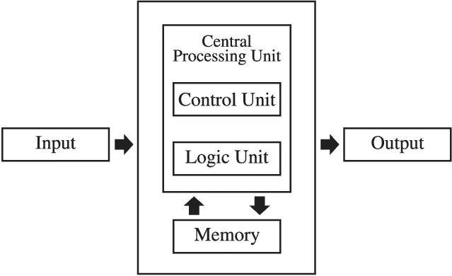
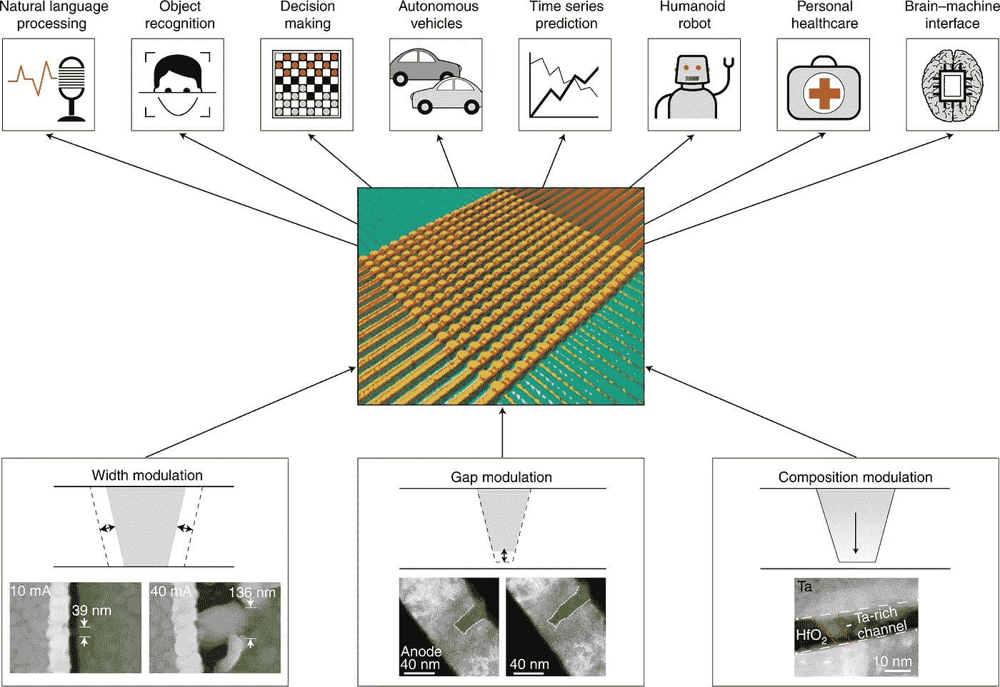
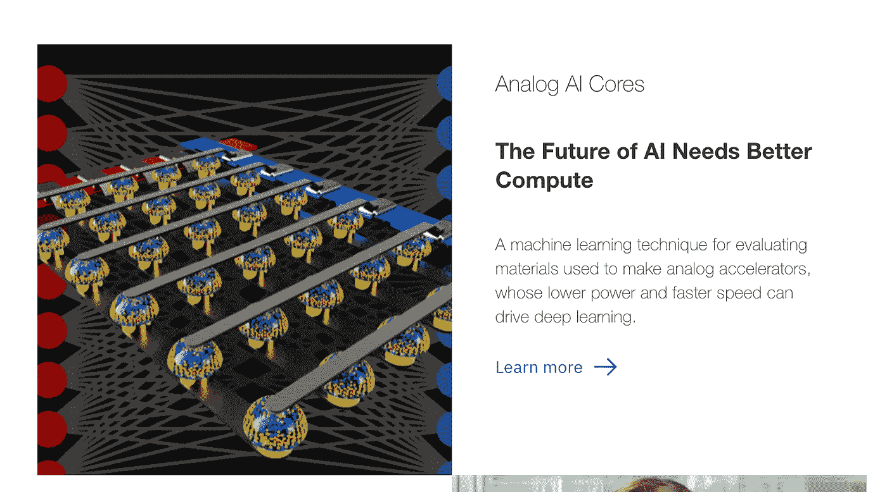
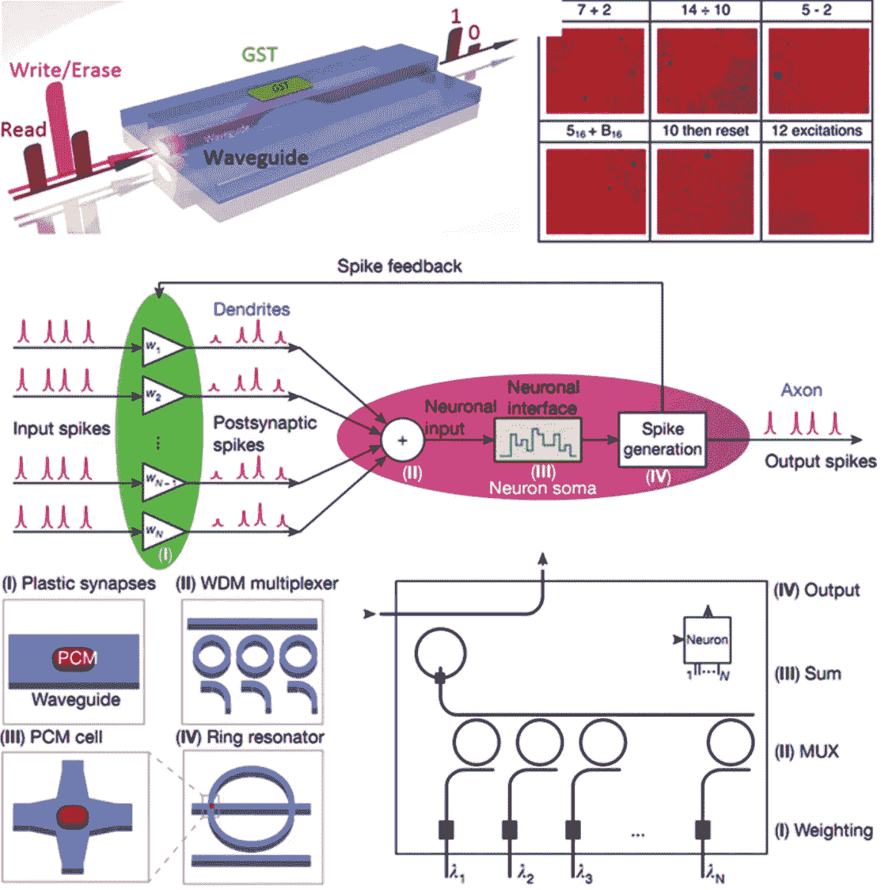
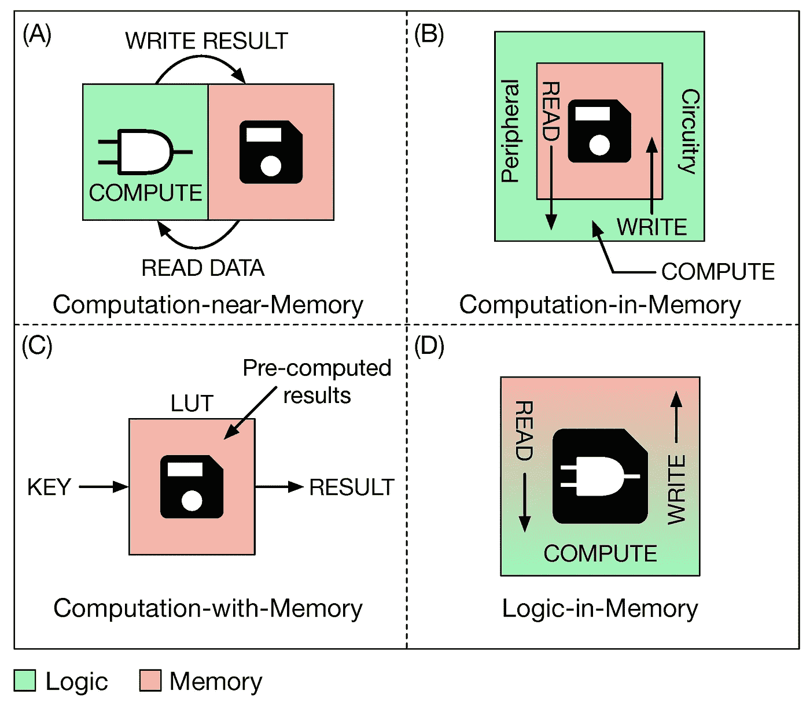
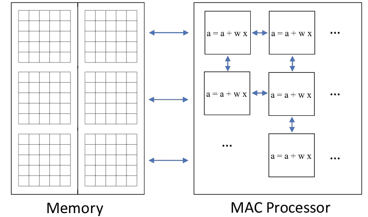
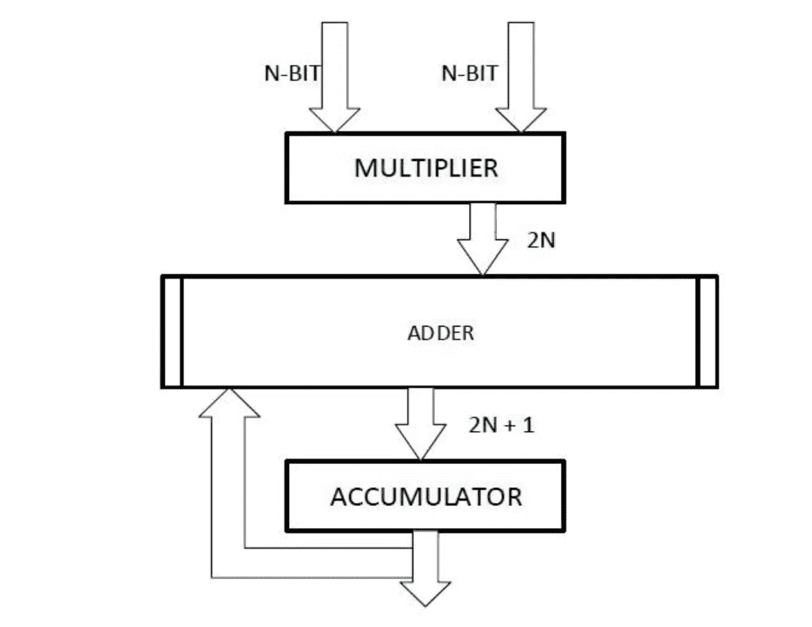

# 人工智能和改变记忆

> 原文：<https://medium.datadriveninvestor.com/ai-and-changing-memory-de46ed102bce?source=collection_archive---------6----------------------->

Ribeirão Preto — SP, Brasil ,Photo by — [@guicolosio](https://unsplash.com/@guicolosio)

## 非易失性存储器和人工智能加速器——探索硬件和软件之间的接口

最近，硬件发生了变化，以更大程度地促进专注于人工智能领域的应用的激增。正是这一点让我对这篇文章感兴趣，这篇文章关注的是 IBM hardware 的研究人员写的一篇文章，这篇文章提供了一些基本的解释。

## IBM 硬件

IBM 成立了 AI 硬件中心。这是一个旨在提高人工智能性能的研发机构。该研究中心总部位于纽约奥尔巴尼。它专注于人工智能领域的下一代芯片。

## 具有 NVM 可变性的 DNN 体重规划

IBM Hardware 的一个团队于 2019 年 4 月 23 日发表了一篇论文*Charles Mack in *、Hsinyu Tsai、Stefano Ambrogio、Pritish Narayanan、陈安和 Geoffrey W. Burr。*它有标题 [*权重编程在 DNN 模拟硬件加速器中存在 NVM 可变性*](https://onlinelibrary.wiley.com/doi/abs/10.1002/aelm.201900026) 。它的主要焦点是开发可以最小化编程工作量的策略，同时提供足够的调优精度，以实现训练和推理的软件等效精度。

> “在其核心，dnn 广泛依赖乘累加(MAC)运算，使其非常适合高性能应用中的 GPU。然而，GPU 使用“存储程序”或冯诺依曼架构，这意味着内存块在物理上与计算块分离。这对内存和计算模块之间的数据传输造成了巨大且不可避免的时间和能量损失，即所谓的“冯·诺依曼”瓶颈。”

物理上分离的内存块意味着时间和能量花费在这些“计算块”之间的数据传输上。

Model by [Srivats Shankar](https://www.researchgate.net/profile/Srivats_Shankar)

他们认为不同的架构可以显著提高速度:

> 在这些交叉阵列中，非易失性存储器(NVM)元件用于编码突触权重。最近的研究表明，与最先进的 GPU 相比，这种技术能够将单位面积吞吐量加速 280 倍，同时将单位面积能效提高 100 倍。”

 [## AI 将军是否已经超过了人类的智力容量？数据驱动的投资者

### 不仅在游戏中，而且在劳动力市场上，机器都比人类聪明。在今天的许多领域，使用…

www.datadriveninvestor.com](https://www.datadriveninvestor.com/2020/02/12/has-general-ai-exceeded-the-intellectual-capacity-of-humans/) 

根据该文章，这些纵横阵列已经使用各种模拟 NVM 元件实现，包括

*   电阻式随机存储器
*   导电桥接 RAM (CBRAM)
*   灰
*   相变存储器(PCM)

他们认为，深度学习的模拟硬件加速器可以通过使用交叉阵列结构在内存中执行 MAC 操作来避免这一瓶颈。

## 什么是纵横阵列？

这篇文章理所当然地认为读者知道什么是 crossbar 数组，所以我想我应该花点时间来详细说明一下。我可能做得不够好，但我会尽力而为。

《自然》杂志上的另一篇文章将此描述为一种大脑启发的计算。

> “内置于大规模**交叉阵列**形成神经网络，它们通过直接使用物理定律，以大规模并行性执行高效的内存计算。人工突触和神经元之间的动态交互为网络提供了监督和非监督学习能力。”

IBM 硬件对这些进步很感兴趣。

“Physical properties of materials, such as conductance, can be used to represent synaptic weights in neural networks. The conductance of a memristor can be modulated through different mechanisms. Shown in the bottom panel, with schematics and exemplary micrographs, are three typical conductance tuning mechanisms, by changing: the width of a conduction channel the gap between the channel and an electrode and the composition of the conductive channel. Consequently, a memristor crossbar array (an example is shown in the central panel) will carry different and tunable synaptic weights in each cell, forming a computational framework with a broad spectrum of artificial intelligence applications (top panel). “ from the [article in Nature](https://www.nature.com/articles/s41563-019-0291-x).

所以可以用物理性质来表示突触的重量可以加速这个过程。

从 IBM Hardware 网站的截图中可以看出，这是 IBM 关注的一部分。

然而也有一些挑战

> “…大多数 NVM 候选器件表现出不同程度的非理想行为，包括有限的电阻对比度、电导变化的显著非线性以及双向编程的强烈不对称性。”

他们提到对 PCM 的设备要求是一个重要方面。

相变存储器(PCM)。

由[李先彬](https://www.researchgate.net/profile/Xian_Bin_Li)整理的一幅插图可能在某种程度上说明了这一点。

The applications of phase-change memory in optical memory and in-memory/neuromorphic computing. (a) The integrated all-optical nonvolatile memory based on PCM material Ge 2 Sb 2 Te 5 (GST). Here, the PCM material is placed on the top of a waveguide. The data recording is realized by the optical near-field effects. The writing and erasing operations are achieved by the laser pulse passes through the waveguide while the read operation relies on the transmission signal modulated by the optical absorption of PCM materials. (b) The illustration of in-memory arithmetic computing by optically-controlled phase change. © The all-optical neuromorphic computing system based on PCM material GST. The input pulses can induce the phase change (recrystallization) of PCM material, which in turn changes the output signals. Both the in-memory computing and the neuromorphic computing utilize the accumulation effect of the crystallization.

一篇由****[**Giovanna Turvani**](https://sciprofiles.com/profile/466886)**和**Mariagrazia Graziano****描述的论文是这样的。********

************

******Depending on how the memory is used for computing data, four main in-memory computing approaches can be defined. (**A**) Computation-near-Memory (CnM): 3D-integration technologies allow one to bring computation and storage closer together by reducing the length of the interconnections. Logic and storage are still two separate entities. (**B**) Computation-in-Memory (CiM): The standard memory structure is not modified, while data computation is performed in the peripheral circuitry. © Computation-with-Memory (CwM): Memory is used as a Look Up Table to retrieve pre-computed results. (**D**) Logic-in-Memory (LiM): Data computation is performed directly inside the memory by adding simple logic in each memory cell.******

******他们在论文[中详细描述了这一点:新的内存逻辑范例:架构和技术视角](https://www.mdpi.com/2072-666X/10/6/368/htm)。******

******我进一步简化了他们的总结，尽管我建议阅读他们的论文，而不是相信我:******

*   ********计算-近内存:**计算和存储靠得更近了，CnM 这个名字就是由此而来的，通过将两个单元一个叠在另一个上面。******
*   ******内存计算**:不修改内存阵列的结构，而是利用其固有的模拟功能来执行计算。具体而言，内存中的计算是通过从内存中读取数据来实现的，然后由读出放大器(SAs)进行感测。****
*   ******带内存的计算**:作为内容可寻址存储器(CAM)的内存，通过查找表检索预先计算的结果(LUT)。这种计算的工作原理是，任何涉及两个或更多输入的布尔函数都可以通过存储其真值表而被编码在存储器中。****
*   ******内存逻辑**:逻辑直接集成在存储单元内部。与其他三种方法不同，这里数据是在本地计算的，而不需要将它们移动到阵列之外(如 CnM 方法中的靠近计算单元，或如 CiM 方法中的靠近外围电路)。****

****总之回到 IBM hardware 团队的文章。****

******存在 NVM 可变性时 DNN 模拟硬件加速器中的权重编程******

> ******“非易失性存储器(NVM)的交叉阵列通过在数据位置实施关键的乘-累加(MAC)操作，有可能加速深度神经网络(DNNs)的开发。”******

****如果我们看看别处，考虑一下人工智能芯片，我们可能会理解得稍微多一点。****

****请看这张来自 [**神经网络**](https://www.researchgate.net/publication/335895548_Photonic_Multiply-Accumulate_Operations_for_Neural_Networks) **光子乘累加运算的插图。******

********

****Standard configuration of a modern AI chip. Information is passed from the memory to the processor, which consists primarily of MAC operations. Moving data (blue arrows) takes up the majority of the energy budget, followed by MAC operations.****

****在计算中，特别是在数字信号处理中:*“……乘-累加运算是一个常见的步骤，它计算两个数的乘积，并将乘积加到累加器上。”—*[*open cores*](https://opencores.org/projects/multiply-accumulate)。****

********

*****from “*[*A High Speed and Low Power 8 bit x 8 bit Multiplier Design Using Novel Two Transistor XOR Gates*](https://www.researchgate.net/publication/270898651_A_High_Speed_and_Low_Power_8_Bit_x_8_Bit_Multiplier_Design_using_Novel_Two_Transistor_2T_XOR_Gates)*,” 2015, by Himani Upadhyay and Shubhajit Roy Chowdhury.*****

****通过了解硬件和软件交互的方式，IBM hardware 的研究人员能够考虑一种不同的有效方法。****

> ****IBM hardware 的研究人员发现，使用并行行权重编程策略在 NVM 中编程的权重能够实现软件等效的精度。****

****他们认为，DNN 模拟硬件加速器——已经能够显著提高单位面积的吞吐量和能源效率——可以实现软件中预先训练的 DNN 模型所提供的全面推广精度。尽管他们强调需要做更多的工作。****

****这里是#500daysofAI，您正在阅读的是第 313 条。500 天来，我每天都在写一篇关于或与人工智能相关的新文章。我 300-400 天的重点是关于人工智能、硬件和气候危机。****