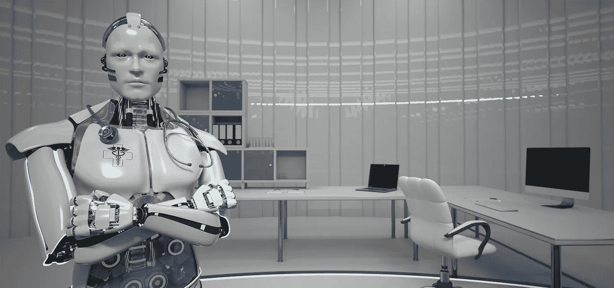
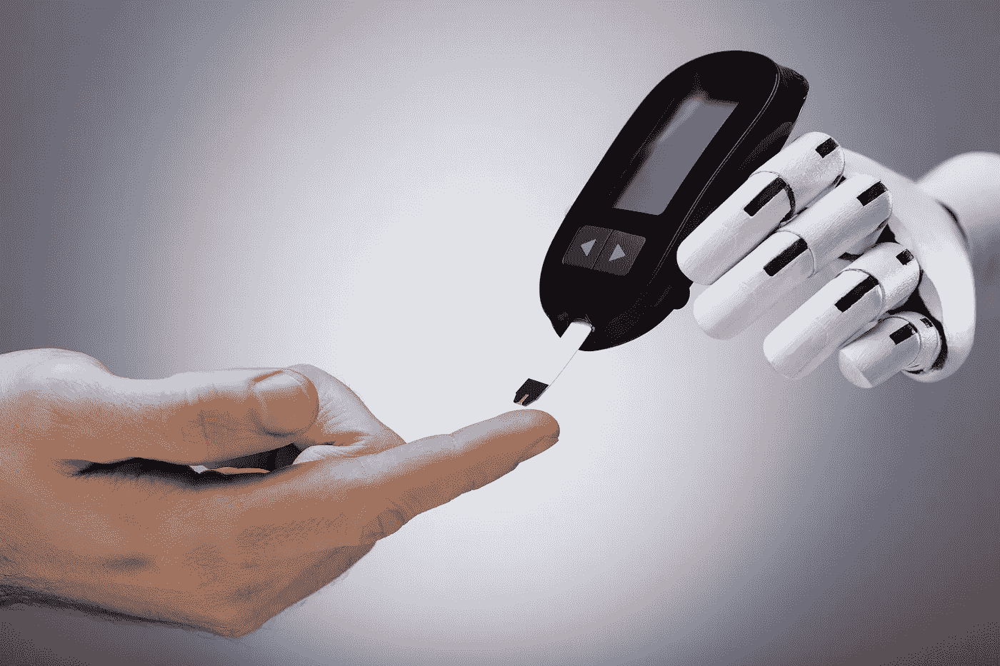
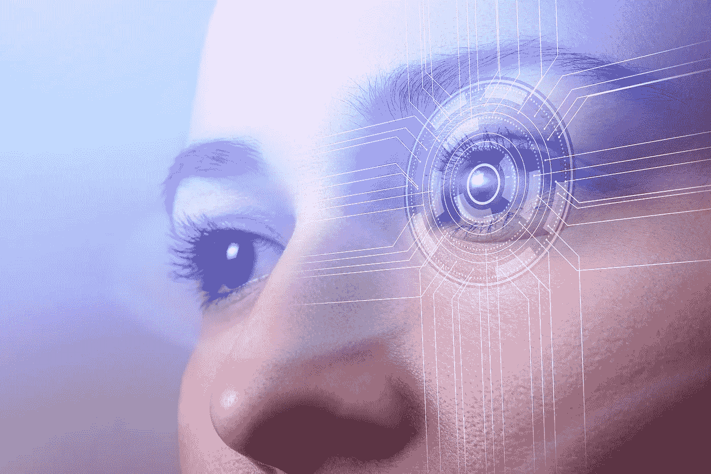
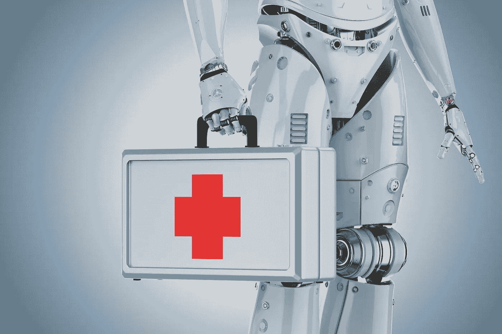

# 人工智能和糖尿病:有希望的研究需要庆祝

> 原文：<https://medium.datadriveninvestor.com/ai-and-diabetes-promising-research-calls-for-jubilation-90a9ceedb431?source=collection_archive---------27----------------------->

## **技术如何开始帮助我们解决一种主要疾病**

Source: [Limbi007](https://depositphotos.com/portfolio-1002927.html)/[Depositphotos.com](https://depositphotos.com/)

随着世界范围内糖尿病发病率的增加，很明显，医学可以在其诊断和维护中使用辅助。虽然全球有超过 4 . 25 亿人患有这种疾病，但仍有数百万人未被确诊。来自世卫组织的信息表明，诊断和管理疾病负担是极其资本密集型的。

人工智能的主要优势之一在于它能够在磨练和进行活动时利用大块数据，从而为用户提供基于事实的结果，为更好的分析铺平道路。在本文中，我们将讨论人工智能将如何帮助我们识别、管理和治疗糖尿病。

Source: [AndreyPopov](https://depositphotos.com/portfolio-1010613.html) / [Depositphotos.com](https://depositphotos.com/)

## 人工智能在行动

虽然人工智能在糖尿病方面有几种现有和潜在的用途，但我们将专注于四种重要的应用，如 [Dankwa-Mullan 等人(2019)](https://www.liebertpub.com/doi/full/10.1089/pop.2018.0129) 所确定的:

## 通过自动化视网膜筛查治疗糖尿病视网膜病变

自动化视网膜筛查是使用基于人工智能的机器学习工具，如多重感知、卷积连接神经网络(CNN)、随机森林、支持向量机(SVM)和其他方法，从正常发现中检测糖尿病视网膜病变、黄斑病变、渗出物和其他异常。

Source: [azarov99366](https://depositphotos.com/portfolio-15667042.html) / [Depositphotos.com](https://depositphotos.com/)

[糖尿病视网膜病变](https://www.mayoclinic.org/diseases-conditions/diabetic-retinopathy/symptoms-causes/syc-20371611) (DR)是一种导致中度至重度视力丧失的眼病。它已被确定为患有长期糖尿病的工作年龄人群失明的主要原因。

或许与 DR 相关的最大危险是，其症状直到疾病达到晚期才显现出来，这增加了我们的全球负担。然而，一段时间以来，科学家和工程师已经在筛查中利用基于计算机的眼底图像分析。现在，随着他们在这样做的同时结合使用基于人工智能的技术，避免 DR 失明的机会增加了  惊人的 [90%](https://www.ncbi.nlm.nih.gov/pmc/articles/PMC6611318/) 。

> 人工智能可以将糖尿病视网膜病变导致永久性失明的几率降低 90%。
> 
> -Padhy 等人(2019 年)

基于人工智能的系统利用由卷积神经网络(CNN)和大规模训练人工神经网络(MTANN)支持的机器学习算法来决定患者是否会从转诊中受益。这台机器比找眼科医生进行面对面筛查要便宜。根据这一数据，2018 年， [FDA](https://www.google.com/url?q=https://www.google.com/url?q%3Dhttps://www.ncbi.nlm.nih.gov/pmc/articles/PMC6611318/%2523ref21%26sa%3DD%26ust%3D1607568015663000%26usg%3DAOvVaw0EZWD-eykbry4lrVxLzaWa&sa=D&ust=1607568019637000&usg=AOvVaw0fWivn0OKwlFoHTufOnHfo) 批准使用 IDx 开发的人工智能算法，该算法采用 Topcon 眼底相机进行 DR 识别。

## 临床决策支持和对抗糖尿病神经病变

最早的人工智能算法是为了支持医生管理临床和患者数据。在整个医学的许多其他足智多谋的用途中，最近的人工智能已经集中在糖尿病和共病(如神经病变和创伤)的检测和监测上。

发生在高血糖(葡萄糖)伤害身体神经时，[糖尿病神经病变](https://www.mayoclinic.org/diseases-conditions/diabetic-neuropathy/symptoms-causes/syc-20371580)是神经损伤的一种形式。这种情况往往会产生一系列症状，从腿和脚的麻木和疼痛到消化系统、血管、心脏和尿道的问题。

Source: [Phonlamai](https://depositphotos.com/portfolio-10325516.html) / [Depositphotos.com](https://depositphotos.com/)

2019 年 11 月，一群科学家发表了一篇  [论文](https://link.springer.com/article/10.1007/s00125-019-05023-4)，讲述了一种基于人工智能的深度学习算法，可用于糖尿病神经病变的诊断；它使用角膜共焦显微镜。这种强大的算法利用了具有数据增强的卷积神经网络来自动量化角膜基底下神经丛，从而支持诊断。研究人员使用高端图形处理器单元对 1698 幅角膜共焦显微镜图像进行了算法训练，并在 2137 幅图像上进行了测试。

最终，令人兴奋的人工智能技术为角膜神经生物标志物的量化提供了快速而精确的定位性能。这是一个潜在的糖尿病神经病变的临床筛查项目。

## 但是人工智能能帮助预测人口风险吗？

是的，好像是这样！

人工智能已被用于识别并发症、住院和再住院风险较高的糖尿病亚群。机器学习算法指向  [十大变量](https://care.diabetesjournals.org/content/early/2019/09/11/dc19-0587)可以准确预测糖尿病患者心力衰竭的风险。这些预测因素包括体重、年龄、高血压和糖尿病控制。

在一项研究中，科学家和工程师开发并验证了一种基于机器学习的模型，该模型易于集成临床、实验室和心电图变量，用于预测门诊 2 型糖尿病患者的心力衰竭。这种算法可以在确定哪个病人更有可能经历心力衰竭以及为什么会这样方面发挥很大作用，这将有助于医生计划下一步行动。

## 人工智能与自我管理

患者自我管理工具得到了广泛应用，如人工智能改进的葡萄糖传感器、活动和饮食跟踪器以及人工胰腺。让我们仔细看看:

## a.人工智能改进的葡萄糖传感器:

这些血糖仪利用人工智能和生物医学工程原理，实现对血糖水平的准确和实时监测。

## b.活动和饮食跟踪设备:

IBM Watson 与 Medtronic 合作，创造了一种称为 Sugar IQ 糖尿病助手的人工智能技术。该装置是为  [Guardian Connect 连续血糖监测仪](https://www.endocrineweb.com/professional/endocrinology/fda-approved-diabetes-innovations-risk-patients-rejecting-statins)的研究使用而制造的，并在 ADA 上亮相。Sugar IQ 是一个交互式应用程序，它采用认知计算和分析技术向每个用户提供个性化的简化日常糖尿病反馈。它结合了人工智能、高级分析和糖尿病技术，可以不断评估和更新患者的血糖水平，以便他们可以对食物摄入量、日常生活和胰岛素剂量进行必要的调整。

## c.人造胰腺:

人造胰腺会释放胰岛素来响应血糖水平的波动。它的工作原理与人类胰腺相似，只是它由基于人工智能的算法控制。继 2019 年 12 月发表的一项  [研究发现后，](https://www.nejm.org/doi/full/10.1056/NEJMoa1907863)  [FDA](https://newsroom.uvahealth.com/2020/01/02/fda-approves-uva-developed-artificial-pancreas/) 近日批准了 Control-IQ 人工胰腺系统，用于自动监测和调节 1 型糖尿病患者的血糖水平。该胰腺由 Tandem Diabetes Care 制造，能够通过连续血糖监测仪(Dexcom G6 CGM)跟踪血糖水平。对于某些人来说，这种机器可以省去频繁的指尖血糖测试和多次胰岛素注射。

# 结论

随着人工智能的最新进展，我们诊断和管理糖尿病患者的方式显然正在快速发展。当然，不久的将来会有更多令人激动的创新。

想法？有问题吗？想法？我们很乐意收到你的来信，别忘了和你的朋友或同事分享这篇文章。

*本帖最初发布于* [*AIM 博客*](https://www.aimblog.io/2020/12/10/ai-and-diabetes-promising-research-calls-for-jubilation/) *。*