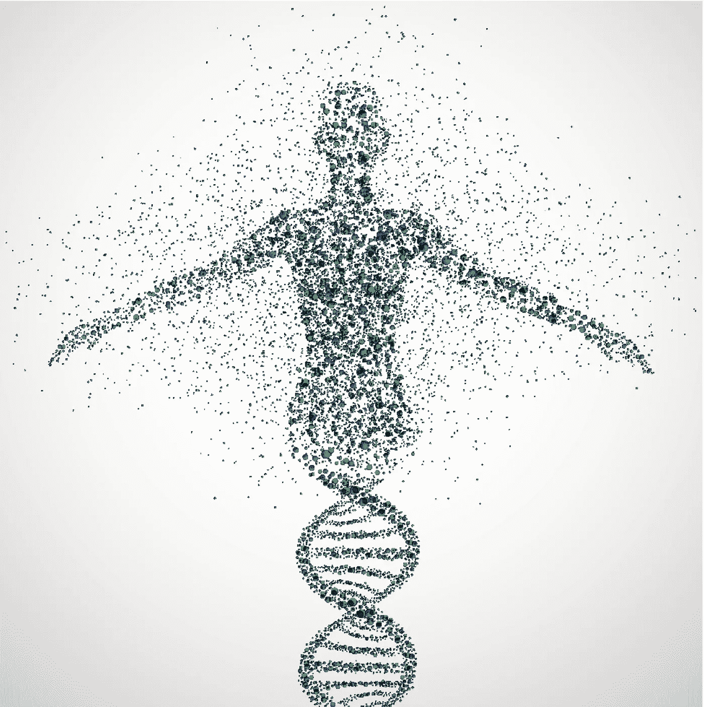
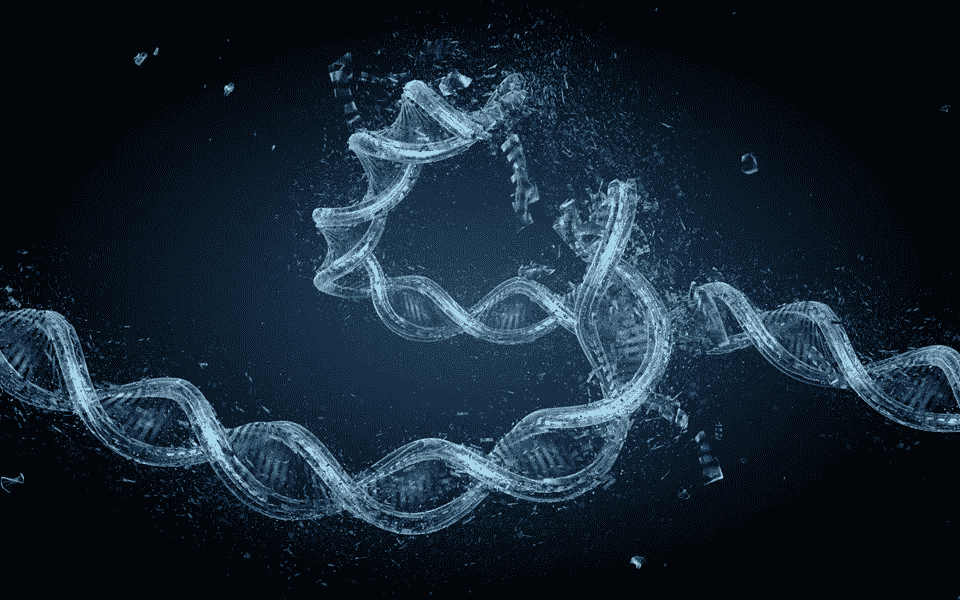
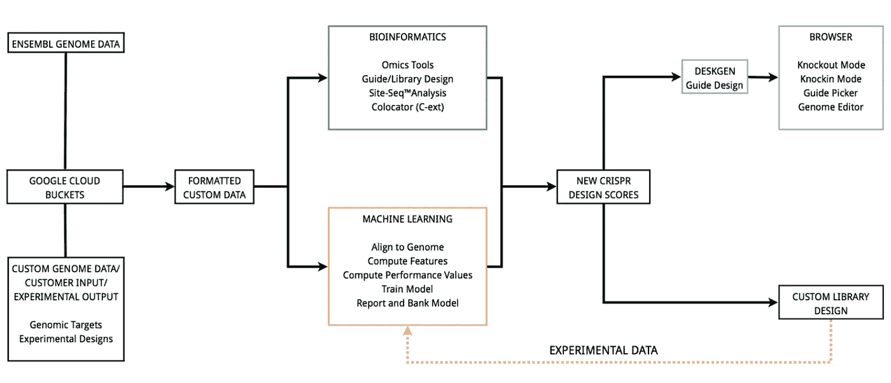
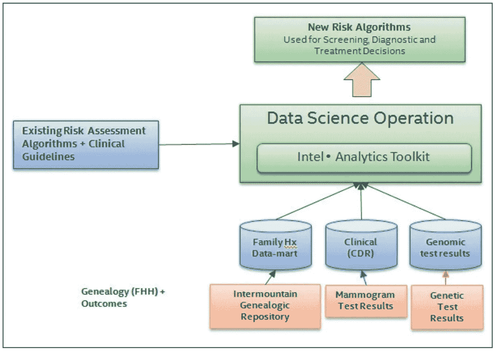

# 利用人类基因组(系统)研究的人工智能和机器学习

> 原文：<https://medium.datadriveninvestor.com/ai-and-machine-learning-made-advantage-in-the-research-of-human-genome-system-518afbade950?source=collection_archive---------12----------------------->

# 介绍

人类基因组计划(HGP)是一个国际性的合作研究项目，其目标是完整绘制和理解人类的所有基因。我们所有的基因统称为“基因组”这是历史上伟大的探险壮举之一。

Human Genome system(DNA)

*HGP 揭示了人类大约有 20500 个基因。这个 HGP 的最终产品给世界提供了一个关于人类基因组的结构、组织和功能的详细信息资源。这些信息可以被认为是人类发展和功能的基本遗传“指令”。*

 [## 一名大学生使用语言生成人工智能工具创建了一个病毒式博客帖子|数据驱动…

### 作为作家，我们喜欢告诉自己，我们处在一个无法自动化的职业中，至少短期内不会。但是…

www.datadriveninvestor.com](https://www.datadriveninvestor.com/2020/09/15/a-college-student-used-a-language-generating-ai-tool-to-create-a-viral-blog-post/) 

# 人工智能和机器学习在基因组学中的应用

## **1)基因组测序**

> 全基因组测序(WGS)已经发展成为医学诊断中的一个感兴趣的领域。下一代测序已经成为一个包含现代 DNA 测序技术的时髦词。
> 
> 像 Deep Genomics 这样的公司使用机器学习来帮助研究人员解释基因变异。
> 
> 具体来说，算法是基于大型遗传数据集中识别的模式设计的，然后这些模式被转化为计算机模型，以帮助客户解释遗传变异如何影响关键的细胞过程。细胞过程的例子包括新陈代谢、DNA 修复和细胞生长。这些途径的正常功能受到破坏可能会导致癌症等疾病。

Genome Sequencing

## 2)基因编辑

> 基因编辑被定义为在细胞或有机体水平上对 DNA 进行特定改变的方法。
> 
> “CRISPR 是一种基因编辑技术，提供了一种更快、更便宜的基因编辑方式”。为了使用 CRISPR，研究人员必须首先选择一个合适的  靶序列。这可能是一个令人生畏的过程，涉及许多选择和不可预测的结果。机器学习提供了显著减少识别合适的靶序列所需的时间、成本和努力的能力。

## 示例:

一家公司在“基因组测序和基因编辑”方面取得了进展总部位于伦敦的“桌面遗传学”是一家人工智能和 CRISPR 融合的软件公司。该公司已经从 7 个投资者那里获得了总计 580 万美元的股权融资，其中包括加速器、风险投资公司和生物技术公司以及 DNA 测序资深人士 Illumina。

First, experimental or reference data of the work done

## 该公司报告了最近一项研究的两个关键发现:

> 1)训练数据量的增加提高了算法预测 CRISPR 活性能力的准确性。
> 
> 2)当应用于不同物种时，例如人类对小鼠，模型的准确性降低。这些发现都不是特别令人惊讶，桌面遗传学承认，广泛的研究将是必要的，以继续改善过程，并推动机器学习如何影响 CRISPR 的边界。

## 3)临床工作流程

*为患者提供服务的医疗保健团队的不同成员可获得的患者数据往往存在差距。这一挑战激发了人们对使用机器学习来提高临床工作流程效率的兴趣。*

*这种合作关系导致了一种算法的开发，该算法用于测量患者患多种癌症的风险水平等因素。使用具有四个主要组件的机器学习来开发工作流模型:*

*1)链接到“临床和患者数据”的基因组数据中央数据库*

*2)所有临床医生和遗传咨询师都可以访问电子健康记录(EHR)*

*3)所有来自基因测试的数据都被整合到 EHRs 中*

*4)临床决策支持工具(CDS)可操作且可访问。临床决策支持的例子包括家族健康史、筛查和过去的临床数据。*

A visual representation of the phases listed above

使用机器学习开发的工作流模型有助于提高数据的可访问性。

*虽然根据以前数据没有集中这一事实，可以假设现在流程更快，但从报告中并不清楚在实施新模式之前流程需要多长时间。*

# 机器学习在 Homan 基因组学中的未来应用

*机器学习在基因组学领域的未来应用多种多样，可能有助于开发针对患者或人群的药物*，并有助于开发针对新生儿的高级基因筛查工具。

## 1)药物基因组学

> 作为精准医学的自然发展，药物基因组学是一个新兴领域，它着眼于个体对药物反应的背景下遗传学的作用。虽然这个领域仍然很新，但有证据表明研究涉及机器学习。

Pharmacogenomics

## 例如:

*被视为第一项应用机器学习模型确定肾移植患者他克莫司稳定剂量的研究于 2017 年 2 月发表。他克莫司通常用于实体器官移植后的患者，以防止新器官的“急性排斥”。*

## 2)新生儿基因筛查工具

> *分析人士预计，未来十年，新生儿基因筛查将成为标准做法。出生时收集的数据将无缝集成到个人 EHR 中，怀孕期间的妇女将能够获得针对特定疾病(如唐氏综合症)的非侵入性筛查能力。*

## 新生儿遗传学的例子:

*国立台湾大学医院新生儿筛查中心实施了机器学习，以提高其基于网络的新生儿代谢缺陷筛查系统的准确性。*

## *结果:*

*研究表明，假阳性的情况减少了，“苯丙酮尿症(PKU)从 21 例减少到 2 例，高蛋氨酸血症从 30 例减少到 10 例，3-甲基巴豆酰辅酶 a 羧化酶(3-MCC)缺乏症从 209 例减少到 46 例。”*

## 结论:

*最后，我想总结一下，基因组学中的机器学习和人工智能目前正在影响多个接触点，包括如何进行遗传研究，临床医生如何提供患者护理，以及对了解遗传如何影响健康感兴趣的个人对基因组学的可及性。*

*努力实施人工智能以帮助加速从工作台到床边的路径，并使精准医疗更加普遍，这是一项明智的业务。对于那些能够为精准医疗所面临的挑战提供切实、可持续的解决方案的企业来说，这些努力可能也是有利可图的。*

*药物基因组学是机器学习在基因组学中新兴应用的主要领域，但这只是一个例子，潜在的未来应用是多种多样的。然而，由于结果数据有限，时间会告诉我们哪些领域将从人工智能投资中获得最大收益。*

**访问专家视图—** [**订阅 DDI 英特尔**](https://datadriveninvestor.com/ddi-intel)