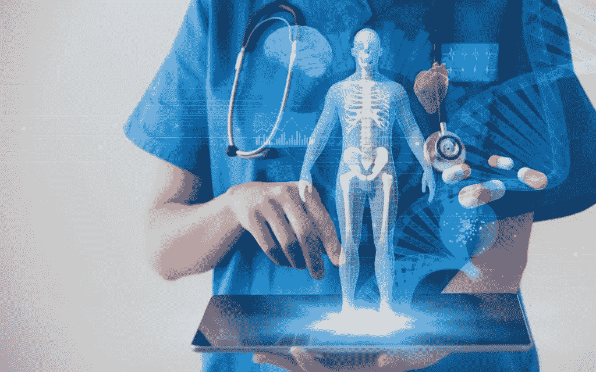
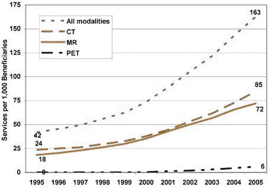
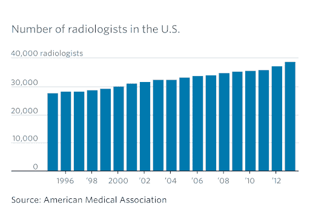
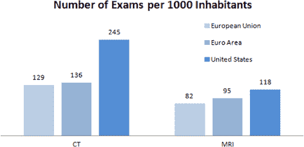
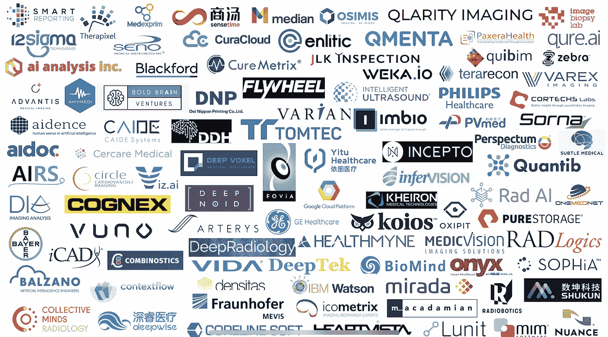

# AI 和医学影像创业公司？6 个主要趋势

> 原文：<https://medium.datadriveninvestor.com/ai-and-medical-imaging-startups-6-key-trends-da8a70e45493?source=collection_archive---------2----------------------->

[IBM Watson 健康成像是医疗保健的未来吗？](https://www.nanalyze.com/2018/06/ibm-watson-health-imaging-healthcare/)

[谷歌详细介绍了人工智能，它可以以人类水平的准确度对胸部 x 光进行分类](https://venturebeat.com/2019/12/03/google-details-ai-that-classifies-chest-x-rays-with-human-level-accuracy/)。

[新研究发现人工智能生成的 FastMRI 扫描与传统 MRI 一样准确](https://nyulangone.org/news/new-research-finds-fastmri-scans-generated-artificial-intelligence-are-accurate-traditional-mri)。

像这样的头条新闻已经变得司空见惯，尤其是在过去的三年里。在流行的对话中，很多东西被忽略了，最终甚至影响到了专家。这对获得资助的想法、推出的产品以及我们所期望的结果都有严重的影响。本文将探讨医学成像中人工智能的需求和解决方案，试图消除现实中的炒作。

**1)成像:新的体检**

负责绝大多数研究的四种核心成像模式是 X 射线、CT、MRI 和超声波。成像量一直在稳步增长，现在全世界每年超过 10 亿次研究，其中一半在美国。其中一些显然是好消息，因为它导致患者在需要时得到正确的治疗。

但并不是所有增加成像量的驱动因素都是积极的。事实上，这种增长还有其他一些原因:

*   供应商受到激励和压力，通过订购更多图像来创收。
*   患者要求做成像，因为他们认为这样可以得到更好的治疗。
*   普遍认为大多数成像几乎不会造成伤害。
*   提供者和支付者尤其害怕诉讼，如果他们不做成像的话。

资料来源:OIG(监察长办公室)对 B 部分(医疗保险)数据的分析，2007 年

**2)放射学家超负荷工作**

成像需求的快速增长远远超过了放射科医生的供应，放射科医生的供应在 2012 年之前增长缓慢，实际上一直在大幅下降，现在几乎已经回到了 1995 年的水平。

 [## 人工智能帮助你聪明理财|数据驱动的投资者

### 自动化和人工智能为创新平台提供动力，简化双方的财务流程…

www.datadriveninvestor.com](https://www.datadriveninvestor.com/2020/09/02/artificial-intelligence-helps-you-be-smart-with-money/) 

市场失衡没有得到纠正的原因有很多，例如:

*   成为一名成功的放射科医师的要求更高，导致申请者花更多的时间专攻
*   增加工作量，在工资和生活质量方面创造机会成本
*   每次成像研究的报销额下降
*   对该职业长期前景的担忧，人工智能和非放射学家最终将负责更多的成像

美国队

日本有非常高的成像利用率，部分原因是他们也处于地球老龄化的前沿。但当你将美国与其他发达市场进行比较时，确实存在明显的差异:一项[自然研究](https://www.nature.com/articles/s41746-019-0142-9)显示了与欧盟相比的人均 CT 和 MRI 数量(“欧元区”是使用单一货币的欧盟的子集)。很难说这种差异有多大是因为欧洲的单一支付系统，或者是更注重预防的文化，或者是测试不足还是测试过度。但事实是，与大多数拥有高生活质量和高预期寿命的富裕国家相比，美国远远落后于其他国家。

**4)回顾与前瞻**

因此，人工智能在医学成像领域肯定有一个爆炸式的市场——争论甚至不是为了让医疗保健变得更好，而是为了跟上成像量增加和放射科医生数量减少的步伐。这就是事情开始变得模糊的地方，因为媒体至少倾向于过分强调专注于更好的诊断的公司，将回顾性研究与前瞻性研究混为一谈。

如果你将一个算法的输出与已经发生的已知结果进行比较，那就是一个回顾性研究。这只是说基于过去的一系列输入，结果与现实相符。当你读到一个关于某某公司制造的人工智能比人类医生更好的故事时，几乎总是如此。更严格的是一种算法，它可以根据连续收集的数据预测将会发生什么，也就是一项前瞻性研究。

**5)更好的工具**

Rad AI 自动创建定制语言，简化报告的一部分，这可能需要放射科医生三分之一的时间。推理分析使用自然语言处理来理解和翻译书面笔记。铁健康帮助医疗系统纠正医疗错误，鉴于其对整个医疗保健的横向影响，这在放射学中尤其重要(即，放射学帮助许多不同领域的医生做出决策)。如果你深入了解这些公司和许多其他有前途的公司，你会发现它们是关于建立工具来帮助放射科医生变得更加高效和有效，而不是取代他们。

以下是 2019 年版北美放射学会(RSNA)人工智能公司的快照。拥有 54，000 名会员的 RSNA 举办了最大的放射学家年度会议，这是世界上最大的年度医学会议之一。

**6)受约束的领域和循环中的人**

另一个标题:[IBM Watson 如何在人工智能医疗保健上承诺过多和交付不足](https://spectrum.ieee.org/biomedical/diagnostics/how-ibm-watson-overpromised-and-underdelivered-on-ai-health-care)。

大多数专家会告诉你，一个真正的人工智能，可以以类似于人类的方式学习，通常被称为人工智能，永远是 35 年后的事情。人工智能已经非常擅长的是获取大量数据，并基于这些数据做出决策，但不是基于未经训练的新型数据。人工智能非常擅长的是比人类快几个数量级的计算，但不擅长展示类似于人类的创造力、综合能力和想象力。

在可预见的未来，放射学人工智能最有效的发展方式是确保受约束的领域——即，专注于非常具体的问题。同时强调循环中的人:医生是最终的决策者，计算机是顾问。

*感谢* [*哈普瑞特·达哈特*](https://www.linkedin.com/in/harpreet-dhatt-md-0a980b90/)*[*张信哲*](https://www.linkedin.com/in/jechang/) *和* [*普雷蒂·苏凯尔卡*](https://www.linkedin.com/in/preeti-sukerkar-m-d-ph-d-763794b/) *的反馈，三位都是放射科医生。原载于“* [*”数据驱动投资人*](https://www.datadriveninvestor.com/2020/08/30/ai-and-medical-imaging-startups-6-key-trends) *，“我很乐意在其他平台上辛迪加。我是 Tau Ventures*[*Tau Ventures*](https://www.linkedin.com/pulse/announcing-tau-ventures-amit-garg/)*的管理合伙人和联合创始人，在硅谷有 20 年的跨公司、初创公司和风险投资基金的经历。这些都是专注于实践见解的有目的的短文(我称之为 GL；dr —良好的长度；确实读过)。我的许多文章都在*[*https://www . LinkedIn . com/in/am garg/detail/recent-activity/posts*](https://www.linkedin.com/in/amgarg/detail/recent-activity/posts/)*上，如果它们能让人们对某个话题产生足够的兴趣，从而进行更深入的探讨，我会感到非常兴奋。如果这篇文章对你有帮助，请对这篇文章和 Tau Ventures 的 LinkedIn 页面* *的* [*发表评论和/或给个赞，感谢你对我们工作的支持。这里表达的所有观点都是我自己的。*](https://www.linkedin.com/company/tauventures)*

***访问专家视图—** [**订阅 DDI 英特尔**](https://datadriveninvestor.com/ddi-intel)*