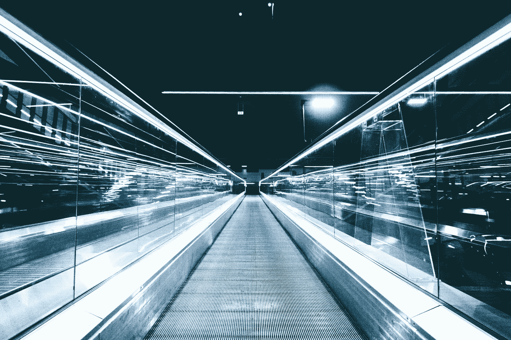

# 广告中的人工智能和人工智能:2021 年的 6 大趋势

> 原文：<https://medium.datadriveninvestor.com/ai-and-ml-in-advertising-6-trends-to-expect-in-2021-1937c16ff4d4?source=collection_archive---------41----------------------->

2020 年，数字广告技术取得了一些重大进展。尽管新的数据治理和消费者数据隐私法即将生效，但预计该行业在未来几年将继续呈指数级增长。

Photo by [Tomasz Frankowski](https://unsplash.com/@sunlifter?utm_source=unsplash&utm_medium=referral&utm_content=creditCopyText) on [Unsplash](https://unsplash.com/s/photos/future?utm_source=unsplash&utm_medium=referral&utm_content=creditCopyText)

当我们结束这奇怪而重要的一年，迈向 2021 年时，记住几个关键点至关重要。

# 1.永远不要低估 AI 和 ML 的力量去做人们做不到的事情

人工智能和人工智能技术可以做人们做不到的事情——这对想要发展和竞争的 DSP 来说至关重要。例如，这些技术可以以闪电般的速度处理大量数据，以人类不可能的方式识别模式并预测结果。这些技术还可以建议最理想的方式来推动客户的购买之旅。这不仅仅是规模和速度的问题；人工智能和人工智能也为营销带来了智能，这是人类不可能以同样的方式匹配的。

# 2.欺诈检测工具变得越来越锋利

他们将在 2021 年继续这样做。无论我们谈论的是流量欺诈、印象欺诈、点击欺诈、归因欺诈还是任何其他类型的欺诈，人工智能和人工智能都在帮助根除这些威胁。例如，今年，在我的团队中，我们使用人工智能和人工智能将数据流中的欺诈事件数量减少到几乎为零。

**了解更多:** [**为 2021 年做好准备:广告主必须做好一切准备**](https://www.toolbox.com/marketing/programmatic-advertising/guest-article/gearing-up-for-2021-advertisers-must-be-ready-for-anything/)

# 3.个性化将发展到新的高度

通过程序化定制，广告商可以向目标群体提供高度相关的个性化信息。由于现在在人工智能和人工智能的帮助下可以获得大量数据，现在有了动态广告，可以根据用户群、设备使用模式、特定领域的亲和力等指标进行变化。借助程序化广告技术，这些广告可以被实时测量和优化。这意味着在正确的时间以正确的形式向用户展示他们感兴趣的广告，从而最大限度地吸引用户。

# 4.准备迎接高影响力广告创意的复兴吧

由于动态创意优化或 DCO 的兴起，高影响力的广告创意在 2020 年卷土重来。借助创新的管理平台，企业现在可以轻松实现 DCO，从而获得高质量、相关和高影响力的广告。然而，根据最近来自 [Kargo 和 tobii](https://cdn2.hubspot.net/hubfs/5762657/Viewability%20vs%20Memorability_Whitepaper_R4-2.pdf?utm_source=hs_automation&utm_medium=email&utm_content=77973127&_hsenc=p2ANqtz-8xrL7BdMImPWfP3aJ7rt-d6WKJz6S-WcYWKUHlbHqYNWfFUveAvBheONA2w_7fAgzIYOQMC30wPZOQHrMm9tTS87jhKiEyrQmSy_93Y3S7eTWChnw&_hsmi=77973127) 的研究，要想在 2021 年真正取得成功，他们需要确保使用顶尖的创意人才。

# 5.更多的公司将会发现重新定位或重新参与活动的巨大好处

这个概念可能看起来很无聊，但却是真的。重新定位战役将在 2021 年卷土重来，尤其是现在人工智能和人工智能可以实现的壮举。重新定位或重新使用应用活动的目标是曾经活跃了一段时间，然后转向或停止使用该应用的应用用户。因为受众是准确的和相关的，如果[做得正确](https://www.bigabid.com/blog/data-measuring-the-performance-of-app-retargeting-campaigns)，这些活动会非常有效和有利可图。目前，只有大约 [30%](https://www.appsflyer.com/state-of-app-retargeting-2020/) 的营销活动专注于重新定位，但随着 AI 和 ML 在塑造这些活动中发挥更重要的作用，这一数字将在未来几个月内增长。

**了解更多:** [**搜索广告垄断让品牌面临风险**](https://www.toolbox.com/marketing/programmatic-advertising/guest-article/search-advertising-monopolies-are-putting-brands-at-risk/)

# 6.嘿，谢谢，GDPR！

早在 2018 年，[通用数据保护条例](https://gdpr-info.eu/) (GDPR)在欧洲生效。这对许多营销人员来说是个坏消息，他们认为此举是广告业的一次重大挫折。现在时间已经过去，我们知道 GDPR 已经产生了一些杰出的东西:更干净和更可靠的数据集。将高质量的数据与人工智能和人工智能的力量结合起来，数字广告在 2021 年将会突飞猛进。

2020 年是重要的一年，不仅因为广告技术行业如何在全球疫情中航行。在这一年里，我们围绕如何以最佳的广告能力为客户提供最佳服务，带来了新的挑战和成就。这是我们自豪地回顾的一年。随着人工进步和机器学习的持续发展，想想 2021 年的事情会如何发展是令人兴奋的。