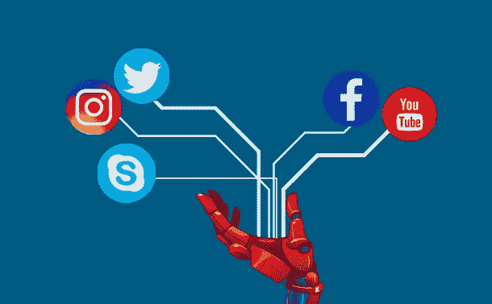
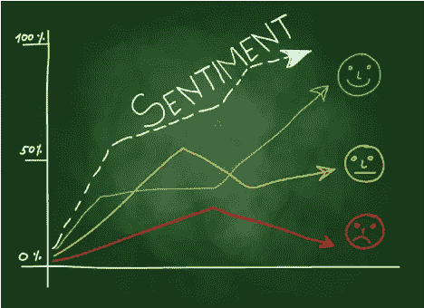

# 人工智能和社交媒体运动:它如何改变游戏

> 原文：<https://medium.datadriveninvestor.com/ai-and-the-social-media-campaign-how-it-changes-the-game-9c23530e01e?source=collection_archive---------16----------------------->

Photo by [Alexander Sinn](https://unsplash.com/@swimstaralex?utm_source=unsplash&utm_medium=referral&utm_content=creditCopyText) on [Unsplash](https://unsplash.com/s/photos/artificial-intelligence?utm_source=unsplash&utm_medium=referral&utm_content=creditCopyText)

社交媒体是数字品牌营销的长期战场——盈利和非盈利组织都在争夺不断扩大的观众、点击和(希望是)消费者数量。

无论是脸书、Instagram、LinkedIn、Twitter 和/或 Tik Tok，这些平台已经积累了如此庞大的粉丝，以至于组织必须制定具体的战略来增加每个渠道的客户。

[正如我之前提到的](https://www.linkedin.com/pulse/why-were-hopeful-philosophy-social-impact-startup-alexander-jivov/)，我们生活在一个每天 9500 万条 Instagram 帖子，每分钟 3125 条脸书帖子，每秒 6000 条推文的时代。这积累了每天每秒都在产生的大量原始数据和原始噪音，对各地寻求获得主流意识的品牌构成了越来越大的挑战。

虽然人工智能(AI)在过去十年中被广泛用于电子邮件和网站的发展，但社交网站仍然基本上不受人工智能可以为组织带来的好处的影响。直到最近，人们还认为社交媒体是一个过于宽泛的类别，无法有效利用人工智能，因为每个竞争平台产生的大量无组织数据被证明太令人生畏，难以组织。

然而，在过去的几年里，这一假设受到了越来越多的挑战。根据市场和市场报告，[人工智能驱动的社交媒体营销预计将从 2018 年的 6.33 亿美元增长到 2023 年的 21 亿美元](https://www.marketingaiinstitute.com/blog/what-is-artificial-intelligence-for-social-media)。

Credit: [Cognilityca](https://www.cognilytica.com/2019/01/17/infographic-ai-in-social-media-marketing/)

此外，新冠肺炎危机提升了社交媒体在我们社会中的地位，使其成为人们日常互动和分享信息的核心。

随着[hope、](https://www.hopefulinc.me/) [Trufan](https://www.trufan.io/) 、 [Cortex](https://www.meetcortex.com/) 等公司的崛起，人工智能技术正在迅速出现在网上，这将改变数字营销的进行方式、社交媒体数据的分析方式，并最终改变品牌接触受众的方式。

什么是 AI 社交媒体营销？

[人工智能在过去几年中已经开始被社交媒体公司](https://www.marketingaiinstitute.com/blog/what-is-artificial-intelligence-for-social-media)无处不在地使用，利用其数据处理和学习能力来确定什么应该成为趋势，哪些内容应该为消费者提供服务，在一个人的头上正确放置狗耳朵过滤器等等。

从通才的角度来看，人工智能已经在许多方面得到了应用，但在社交媒体方面，最受欢迎的是客户服务和聊天工具。通过识别评论、问题和一般参与的语气，人工智能工具可以对客户请求进行分类，并独立回答它们，或者将它们解析给人类客户成功代理，以按照他们认为合适的方式进行处理。

为了增加收入，社交媒体工具已经采取了许多不同的方法来提高组织的底线。首先也是最重要的，有一个[社交倾听](https://blog.hubspot.com/service/social-listening)的过程，本质上是利用技术来监控潜在客户通过你的社交媒体渠道的反馈。

具体来说，这些工具可以识别任何直接提及您品牌的信息，确保提供关于如何最好地锁定收购机会的见解。社交监听是社交监控的一个升级，社交监控只是监控(顾名思义)社交媒体上对你的品牌的任何提及，没有洞察力。

这些类型的工具通常是人工智能开始进入社交媒体营销领域的地方，也是人工智能潜力的冰山一角。我们越来越多地看到创新公司意识到，人工智能的数据解析能力可以从内容构思的最开始一直用到帖子发布分析。

## 社交媒体人工智能——何去何从

过去几年，人工智能社交媒体领域最有趣的演变之一是端到端社交分析科技公司的崛起。我们的公司 hopped Inc 是几家新成立的公司之一，他们正在构建允许组织使用历史数据在一个地方自动创建、安排、发布和分析他们的社交媒体的解决方案。

在基础层面上，这些新工具使无法参与营销分析团队的较小组织能够有效和高效地进入社交媒体领域，从一开始就让自己进入品牌识别的大联盟。

自社交媒体兴起以来，这种民主化效应在盈利或非盈利领域都是前所未有的，并对以现任者为代价降低小型创业公司的准入门槛产生了深远的影响。

然而，利用过去的数据来创造内容仅仅是一个开始。随着人工智能的正确实施，组织将能够分析图像和视频之间的关键共性，而不仅仅是文本。这些分析技术在过去很大程度上是不可能执行的，因为内容的多样性使得人们很难区分共同的元素。

鉴于我们生活在一个越来越注重模因的世界，顾客情绪可以围绕诙谐的图像而不是来回的在线文本进行定位。鉴于网上发布的图像的多样性，人工智能能够确定客户刚刚发布的关于你品牌的模因是完全有趣还是应该得到有效管理的负面趋势的开始。

最后，这给我们带来了 AI 将给社交媒体领域带来的最后一项重大改进:快速准确的[情感分析](https://monkeylearn.com/sentiment-analysis/)。

最终，情感分析(SA)是决定社交媒体营销方向的基石。传统上，SA 被用来将客户的情绪反应分为三类——积极、中性和消极。

Credit: [TheNextWeb](https://thenextweb.com/contributors/2017/08/06/5-ways-sentiment-analysis-can-boost-business/)

然而，将人类情感的[全谱](https://towardsdatascience.com/sentiment-analysis-is-difficult-but-ai-may-have-an-answer-a8c447110357)分为三类显然存在缺陷，包括不正确的分类和无法预测最初识别的几条信息之后的情感趋势。

随着人工智能在社交媒体中的出现，SA 现在可以被开发来密切反映品牌客户的真实感受，而不是笨拙地将他们包装成近似的近似。随着 IBM 的沃森[等大公司已经为企业提供高级情绪分析](https://www.ibm.com/cloud/watson-tone-analyzer?p1=Search&p4=p51010330300&p5=e&cm_mmc=Search_Google-_-1S_1S-_-WW_NA-_-ai%20sentiment%20analysis_e&cm_mmca7=71700000061805327&cm_mmca8=kwd-464642753258&cm_mmca9=EAIaIQobChMI3obWoMXU6QIVyrzACh3Xvw2VEAAYASAAEgIY__D_BwE&cm_mmca10=412803429802&cm_mmca11=e&gclid=EAIaIQobChMI3obWoMXU6QIVyrzACh3Xvw2VEAAYASAAEgIY__D_BwE&gclsrc=aw.ds)，价格下降和专业知识增长到中小企业获得这种技术所需的程度只是时间问题。

特别是，为非营利组织、餐馆、零售和任何其他每天依赖积极客户情绪的组织解锁人工智能支持的情绪分析，将是这些中小企业品牌的巨大力量倍增器。

通过能够轻松和经济地利用客户的感受，企业主可以使用人工智能来影响他们的在线营销，如上所述，或者简单地使用人工智能的数据处理能力来超准确地了解客户对品牌的看法，并据此制定计划。

## 结论

需要注意的是，这篇文章是对人工智能及其在社交媒体营销中的应用的一个非常高层次的观点——在过去十年中，人工智能技术在社交媒体领域进行了革命，这种独特的使用案例数不胜数。这就是说，这篇文章中的高层次描述显示了社交媒体中人工智能能力的不足。未来十年，人工智能将继续改善社交媒体分析，带来更多创新，帮助中小型企业管理其品牌和在线社交存在。

人工智能及其子集仍然是人类生活各个方面极其令人兴奋的技术，特别是为品牌的基本收入要素提供动力的能力。

本文原载于 [LinkedIn](https://www.linkedin.com/pulse/how-win-robot-friends-influence-people-ai-its-effects-alexander-jivov)

***免责声明:*** *我是* [*希望公司*](https://www.hopefulinc.me/) *的首席执行官和联合创始人，这是一家高增长的初创公司，它利用人工智能使非营利组织能够超越喜欢并通过社交媒体和在线捐赠来源获得更多资金。我们自己目前正在筹集种子资金。如需了解更多信息，请发送电子邮件至*[*ajivov @ hopeflinc . me*](http://ajivo@hopefulinc.me/)