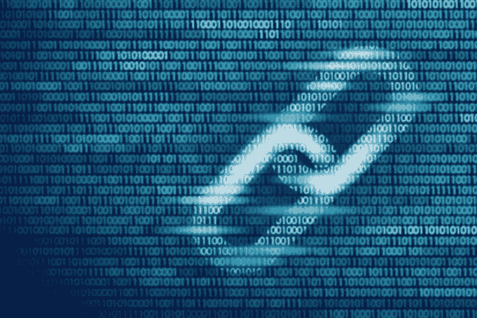

# 人工智能、区块链和智能合约:为什么我们都需要拥抱创新

> 原文：<https://medium.datadriveninvestor.com/ai-blockchain-and-smart-contracts-why-we-all-need-to-embrace-innovation-7190b9b4148d?source=collection_archive---------22----------------------->

当我们走向未知的未来时，似乎会有一个快速的变化。企业和公民日常活动方式的技术变革。

人工智能(AI)、区块链、机器人和自动化是媒体定期报道的一系列技术，它们将取代我们目前所知的工作。

> 未来没有劳动力的经济如何繁荣？
> 
> 2020 年你会看到区块链开始发挥潜力吗？

Gartner 预测，到 2023 年，区块链项目将完全可扩展。由麻省理工学院(MIT)教授 Silvio Macali 创立的 algrand 是下一代区块链项目，旨在为这一新的金融未来铺平道路。

自 1983 年以来，希尔维奥·米卡利一直在麻省理工学院电气工程和计算机科学系任教。2012 年，西尔维奥获得了著名的图灵奖，这是一项由计算机械协会颁发的年度奖项，授予因“对计算机领域具有持久和重大技术重要性”的贡献而入选的个人。

在本文的后面，我将与您分享为什么一个名为智能合同的区块链应用程序似乎是金融系统的终极进步。

# 起点——平均值的终点

在我们开始用创新技术迎接新的未来之前，我们需要看看我们将如何改变自己。

在这个 4 分钟的视频《平均的终结》中，你将看到高中辍学者托德·罗斯的励志故事。托德，现在是哈佛大学的教授，谈论他对教育系统改革的愿景。他对修复教育系统以帮助孩子们充分发挥潜力的观点。他创建了哈佛个性科学实验室，该实验室的愿景是定制学习以满足儿童的个性化需求。

重新设计教育对成人和儿童都至关重要。未来的工作似乎需要从学习过程转向拥抱创新和终身学习。然而，任何希望拥抱个人思维的新教学方式也必须记住教授团队合作。

## 教育技术

多年来，教育技术一直是一个不断发展的领域。现在，疫情似乎已经把这种曾经可选的学习方式变成了每个人的必修课。你可以上网学习任何东西。这种教育方式对于帮助每个人为充满活力的未来工作做好准备至关重要。谁知道你什么时候可能需要学习一些尚未发明的利基技术呢？

Coursera 等技术教育平台通过与 140 所世界一流大学合作，为超过 2000 万注册学习者提供服务。2019 年 4 月，Coursera 额外筹集了 1.03 亿美元的融资，以帮助发展其教育平台。

> “全球高等教育市场价值 2 万亿美元，”Coursera 的首席执行官 Jeff Maggioncalda ~ [福布斯](https://www.forbes.com/sites/susanadams/2020/07/17/online-learning-platform-coursera-raises-130-million-at-reported-25-billion-valuation/#73175adb688f)。

## 区块链课程

如果你想从商业角度了解更多关于区块链的信息，请查看 Coursera 上的[区块链基础知识](https://www.coursera.org/learn/blockchain-basics)。在本课程中，您将了解以太坊，这是一个受欢迎的构建智能合约的开源区块链项目，您还将了解密码学和最初的加密货币比特币。

如果你是一个开发者，那就去看看 Algorand 吧。他们有一个优秀的[开发者学习中心](https://developer.algorand.org/)，并且有很棒的专家为你提供任何关于开发区块链技术的建议或帮助。

> 新兴技术是现在，开始学习它们的最佳时间是昨天。

 [## 参与区块链的 8 个技巧——初学者指南

### “如果你想走得快，就一个人走。想走远，就一起走。”~非洲谚语。

medium.com](https://medium.com/datadriveninvestor/8-tips-for-getting-involved-in-blockchain-a-beginners-guide-7732e94f1f94) 

# 寄希望于区块链

区块链是一个抓住了我的想象力的行业，有助于为更大的利益改造社会。大约五年前，我开始研究、分析和展示这项新兴技术。我遇到的许多这项技术创新的建设者希望建立新的金融体系来帮助所有公民。因此，区块链企业家从扰乱银行系统和全球交易费等运营活动开始。

> 全球银行交易费每年产生约 1 万亿美元的收入。麦肯锡(2019)

## 为什么智能合约是智能的？

智能合约是区块链的一项发展，有助于降低交易费用。智能合同是建立在区块链解决方案之上的应用程序。在行业中，它们被称为分散式应用程序或 Dapps。这些数字程序是在区块链基础上构建的一种创新方式。

智能合约使金融交易无需人工干预即可结算。他们使用计算机编码规则和业务逻辑来实现这一点。

智能合约使用的真实示例；

*   托管账户
*   贷款支付
*   捐款

以上例子目前需要中介来完成金融交易。但是，根据您的需求定制的智能合同允许自动付款。此外，建立在可信的区块链之上有助于增强安全性。

# 为什么要建立新的金融体系？

假设你是一个小企业主，你想为你的客户提供一个卡支付选项。首先，你被指控持有商业银行账户。其次，为了获得一个卡支付终端，即使你不使用它，你也要为拥有它而付费。由于付款机只能出租，在你开始赚钱之前，你需要每月付费。

除了使用终端还有费用。如果用信用卡支付，这些费用是客户账单的百分比。根据客户用于支付的卡的类型，一些发卡机构收取高达 3%的费用。企业主不能将这些费用转嫁给顾客。

此外，正如我们最近看到的，由于疫情，一些企业不得不暂时关闭，但他们仍然需要支付费用。

使用区块链从零开始建立一个新的金融系统是降低交易费用的一种方法。例如，降低全球交易费用可以帮助小企业主更好地控制他们的现金流。

阿尔格兰德是一家区块链科技公司，致力于降低全球交易费用。他们通过创新一种新的计算机语言创造了他们自己的高级智能合同。这种支付技术的进步有望帮助构建未来的经济。

如果你能在一个可以自动结算的安全系统上执行金融支付，这可以降低成本，开启安全数字货币支付的创新，这可能比传统货币更经济。

 [## 2050 年我们将如何挣钱生活？

### 区块链是信任，信任是支撑商业和就业的基础货币。

medium.com](https://medium.com/datadriveninvestor/how-will-we-earn-money-to-live-in-2050-b81e9a5353d3) 

我们是否已经利用区块链技术改写了我们现有的金融服务体系？不，但我们正在实现，在未来的五到十年，这项技术可以帮助改变我们的世界。

# 未来

区块链只是科技众多组成部分中的一部分，可以帮助实现我们世界的转变。

新兴技术、日益扩大的鸿沟和疫情似乎正以相当快的速度将变革推向我们。这种转变也是一种看似永久的进化。诚然，2020 年加速了这一技术变革。

世界经济论坛(WEF)认为区块链是一种可以帮助改变社会的技术。 [WEF 在他们的区块链工具包执行摘要中指出](https://widgets.weforum.org/blockchain-toolkit/):

> “区块链有可能彻底改变公司竞争和利益相关者在世界上合作的方式……”

人类的状况似乎是一个建立它，设置它，然后忘记它，直到我们无法再忍受结果或未知的灾难袭击。这些变化迫使我们冒险去改变。

似乎这一次，当我们重新设想 2020 年以后的工作世界时，这种变化被强加给了我们。

*如果你喜欢这个区块链的见解，请在这里查看我的其他见解或关注我的***！**

*艾米莉 [@BlockhchainScout](https://twitter.com/BlockchainScout)*

**原载于 2020 年 8 月 3 日 https://www.datadriveninvestor.com***。***