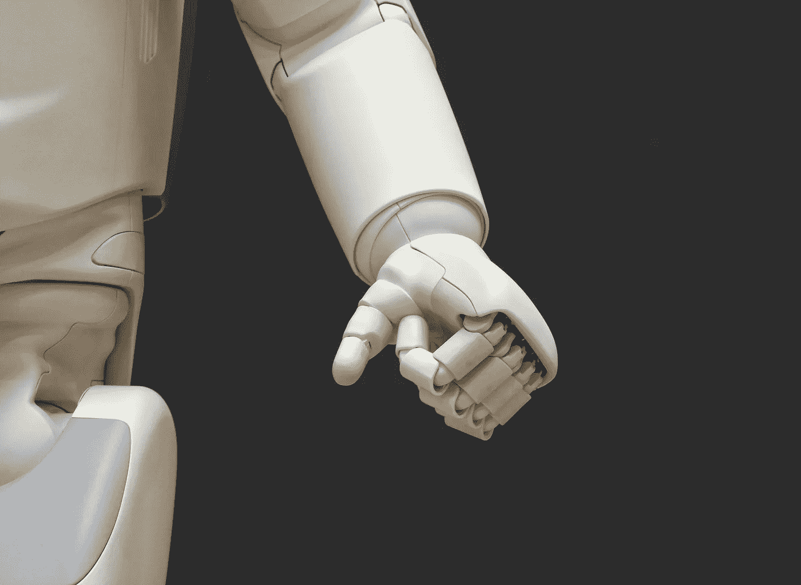

# AI 可以比你更好地管理你的团队

> 原文：<https://medium.datadriveninvestor.com/ai-can-manage-your-team-better-than-you-can-35e5b9236345?source=collection_archive---------29----------------------->

## 但它不能领导他们。

Photo by [Possessed Photography](https://unsplash.com/@possessedphotography?utm_source=unsplash&utm_medium=referral&utm_content=creditCopyText) on [Unsplash](https://unsplash.com/s/photos/robot?utm_source=unsplash&utm_medium=referral&utm_content=creditCopyText)

多年来，人们一直在争论管理和领导之间的 T2 差异。它们是一样的吗？一个比另一个好吗？如果是的话，我想努力成为什么样的人？

作为一名人才管理顾问，我对一名团队领导对其团队的影响有切身体会。我坚信我们都应该努力成为领导而不是管理，我对未来工作的预测了解得越多，我对这一信念的信念就越坚定。

那么，管理者和领导者有什么区别呢？

也许我见过的最直接的答案来自[塞斯·戈丁](https://medium.com/u/f9ac9806e153?source=post_page-----35e5b9236345--------------------------------)在他的书[部落](https://www.amazon.com/Tribes-We-Need-You-Lead-ebook/dp/B001FA0LAI/ref=sr_1_2?dchild=1&keywords=tribes&qid=1612988189&s=books&sr=1-2)中。谈到管理，戈丁解释说:“*管理者管理他们以前见过的流程，他们对外部世界做出反应，努力使流程尽可能快、尽可能便宜。”*

Godin 解释说，管理就是保持现状，而领导力则是创造你相信的变化。经理不能做出改变，因为那不是他的工作。他的工作是完成别人交给他的任务

简而言之，经理是在一个崇尚效率、准确性和稳定性的系统中工作的订单接受者。在过去，这可能已经足够了。

但是，展望未来，这还是我们所需要的吗？

工作世界中最具颠覆性的趋势之一是 T2、人工智能或人工智能。*人工智能是指在机器中模拟人类智能，这些机器被编程为像人类一样思考并模仿人类的行为。人工智能的理想特征是它能够合理化并采取最有可能实现特定目标的行动*。

这些编程指令被称为[算法](https://en.wikipedia.org/wiki/Algorithm)。事实证明，对外部数据做出快速反应，将这些数据转化为洞察力，并准确预测未来趋势，正是构建算法的目的。

他们也很擅长这个。

在他的书[算法领导力](https://www.amazon.com/Leadership-Algorithm-Who-Leads-Follows/dp/0857198289)中，David De Cremer 分享了“*算法在处理复杂数据时拥有卓越的技能，因此能够识别趋势和可能性，从而优化我们未来的决策和战略*。”德克雷默说，他们非常擅长执行这些管理任务，甚至超过了最有能力的人类管理者。

**历史上要求管理者履行的确切职能现在可以通过算法更好、更快、更准确地完成。**

这里的标题是许多领导自始至终都直觉地知道，但也许还没有能够用语言表达出来的东西:

> 如果你所做的只是“管理”人，那么你的工作是如此基本，以至于机器人都可以做。

很快，一个“机器人”可能会做这件事。

接下来的问题是，如果算法能够更好地管理我们的团队，我们作为人类管理者的角色会很快被它们取代吗？

De Cremer 说，这个问题的答案取决于你如何定义*管理*和*领导*，以及你是*经理*还是*领导*。

如果我们接受戈丁对管理的定义，那么经理的角色就完全符合算法的好处。因此， [De Cremer](https://www.amazon.com/Leadership-Algorithm-Who-Leads-Follows/dp/0857198289) 在他的书中认为，虽然算法被配备成*比你或任何其他人更好地管理*你的团队，但它们不能有效地*领导*你的团队。他说:

> “虽然通过算法进行管理的现实表明，管理功能很可能会被算法复制，但这也阐明了人类管理的未来在哪里。未来掌握在领导的手中。”

我们这些从事团队管理工作的人，以及希望继续从事团队管理工作的人，可能想知道未来的领导者和变革者需要什么。

什么样的领导技能和能力会使领导者区别于管理者？在这种情况下，卓越的领导能力如何在未来的工作中转化为工作保障？

De Cremer 解释说，未来领导者的角色是双重的:

> “首先，即使算法可以识别看待挑战的新的和原创的方式，这种知识仍然需要根据领导者希望实现的价值观和目标来解释。”
> 
> “其次，领导者需要决定如何激励员工，让他们有机会在为集体工作的同时为自己的利益服务。”
> 
> "似乎很明显，算法可能在这两个领域有所欠缺."

因此，未来的领导者仍然需要在我们团队的工作中激励、授权和灌输目标。它们可能与算法一起工作*，但不太可能被它们取代。*

根据德克雷默的说法，这八种能力将区分领导者和管理者(以及算法):

1.  [批判性思维](https://medium.com/swlh/this-is-why-you-need-to-teach-your-team-how-to-solve-problems-7e126826d610)
2.  好奇心
3.  [敏捷度](https://medium.com/swlh/what-to-do-when-you-dont-know-what-to-do-b873d5f29cba)
4.  想象
5.  创造力
6.  [情商](https://medium.com/swlh/this-is-how-the-best-bosses-remain-calm-under-pressure-aeed82747e9d)
7.  [感同身受](https://medium.com/swlh/how-to-help-your-team-overcome-self-doubt-when-learning-something-new-4bf6335be75a)
8.  道德判断

这些感知功能是非人类机器无法复制的。

总之，[德克雷默](https://www.amazon.com/Leadership-Algorithm-Who-Leads-Follows/dp/0857198289)发现，“*未来运营一个组织的现实将是，* ***越多的算法接管管理，我们就越需要领导层引入人类判断来帮助设定优先事项。***

Seth Godin 经常在“*工厂工作*”或任何可预测并可以优化生产率的工作的背景下谈论管理。曾经有一段时间，像管理一样，工厂工作是一件很有吸引力的事情。这是安全和可预见的。

直到它不是。

> 戈丁在《部落》*中写道:“在这一过程中的某个地方，也许当两万名福特工人在一天内失去工作，或者当软饮料公司的所有增长都被新贵夺走时，工厂的工作机会开始减少。*
> 
> *毕竟在工厂工作不太安全。"*

*事实证明，管理可能没有什么不同。当机器可以比我们更好地完成管理工作时，做经理毕竟不是那么安全。*

*那么，经理们，你们还在等什么？*

*是时候脱离经理的角色，开始培养领导技能了。*

# *还不是灵媒的成员？*

*[***在这里加入***](https://adjunctleadership.medium.com/membership) *直接支持我的工作，获取媒体上的每一个故事。也可以免费订阅我的* [***简讯***](https://relentless-producer-8605.ck.page/bd6ba143c0)**或者在*[***Linkedin***](https://www.linkedin.com/in/jessica-e-donahue/)*上与我联系。***