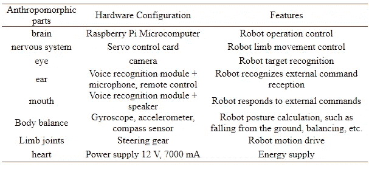
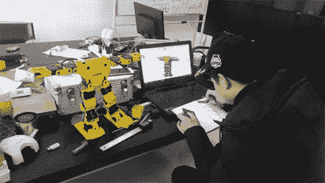

# 人工智能教育机器人控制系统的设计与开发

> 原文：<https://medium.datadriveninvestor.com/ai-educational-robotic-control-system-design-and-development-baa1e9a6f91d?source=collection_archive---------15----------------------->

## 教育机器人的推广应以教材、课件、配套教具、教学文档为载体，形成整体解决方案

Image by [Peter Pieras](https://pixabay.com/users/d5000-16677078/?utm_source=link-attribution&utm_medium=referral&utm_campaign=image&utm_content=5202869) from [Pixabay](https://pixabay.com/?utm_source=link-attribution&utm_medium=referral&utm_campaign=image&utm_content=5202869)

# 这篇文章主要讲的是什么？

本文为**人形机器人教具**开发了一套控制系统，使那些人形机器人可以通过观察、比较、测量、记录、组装、搜索、体验、思考、讨论、编程、调试、创造来完成机器人和机器人的一般知识。

构建、机器人感知、机器人学习、机器人控制等课程模块，传播机器人无线遥感、语音交互、目标识别、路径规划、轨迹跟踪、运动控制等科学原理和实现方法。

进而设计机器人进行足球、舞蹈、救援、搬运、速度竞速、追踪、答题等项目赛事，有效培养和发挥小学生的科技创新潜能，全面实现《标准》和《计划》提出的人工智能教育和科普创作目标。

# **简介**

党的十九大报告指出，中国经济已经从快速增长阶段转向高质量发展阶段。建设现代化经济体系，需要以人工智能与实体经济融合培育的增长点，加快发展先进制造业。

人工智能的创新和普及，是中国后来居上，成为制造强国的重大历史机遇。

根据国务院《新一代人工智能发展规划》和教育部《义务教育小学科学课程标准》，人工智能教育的普及要从娃娃抓起。

> **如今，世界各国青少年的科学教育正经历着剧烈而深刻的变化**

美国的 K-12 科学教育框架和 2014 年提出的新一代美国科学教育标准，经过三年修订于 2014 年实施的英国小学国家课程学习计划，日本六次修订的小学科学课程标准，新加坡旨在“为明天做准备”的 2014 年小学科学教学大纲，都是面向各自国家和地区固有的教育需求，努力使小学生适应未来的科技社会。

教育部 2017 年颁布的《义务教育小学科学课程标准》强调，科学探究与交流的过程是在真实的问题情境中，基于问题解决的学习过程。

《标准》指出，“小学科学课程在培养学生的科学素养方面发挥了重要作用。”

> 但是，在实践中还存在一些需要改进的问题

课程内容的选择缺乏现代科学的宏观视野，活动设计不能充分体现科学实践。基本特征和目标定位与儿童的认知特点和发展需求不相适应。

将人工智能以科学研究的形式引入小学课堂，将深奥的科学原理通俗易懂地应用于科学普及和科研实践，是保证小学科学课程的现代性和提高人们对教育满意度的有力措施。

> **基于人体结构和智能的人形机器人是人工智能领域最典型的代表**

*也用于小学科学课程，容易引起学生兴趣，是高科技教具。*

Image by [Enrique Meseguer](https://pixabay.com/users/darksouls1-2189876/?utm_source=link-attribution&utm_medium=referral&utm_campaign=image&utm_content=3668533) from [Pixabay](https://pixabay.com/?utm_source=link-attribution&utm_medium=referral&utm_campaign=image&utm_content=3668533)

# **仿人机器人教具控制系统设计**

1。 **总体方案配置**

本文设计的仿人机器人教具采用 Raspberry Pi 微电脑、舵机控制卡、摄像头、带麦克风的语音识别模块、遥控器、带扬声器的语音识别模块、陀螺仪、加速度计、罗盘传感器、舵机、DC 电源模拟人的大脑、神经系统、眼睛、耳朵、嘴巴、身体平衡、四肢关节、心脏等感觉器官，实现对整个机器人的操作控制、机器人四肢的运动控制、机器人目标识别、 机器人识别外部命令接收、机器人响应外部命令、机器人姿态计算、机器人运动驱动、能量供应等功能，如下表所示。

Overall scheme configuration of humanoid robot teaching aid control system

2。 **机器人控制器的配置**

Raspberry Pi 是业界主流的基于先进精简指令集设计的微机主板，功能强大，可以高速处理数据和发送指令。

Linux 操作系统与机器人算法控制完美兼容。它小巧轻便，适用于有限的空间。教具本体内部，开放 40 针 GPIO 直接连接读取传感器输入控制舵机输出，无线可直接与外部电脑通讯，64GB SD 存储卡可存储大量数据。USB 和 CSI 接口可以连接到语音识别模块和视觉识别模块。

为后续的深入发展打造平台。所以这个系统的主控制器是树莓 3B，4 核 1.2 GHz 64 位采用 ARM Cortex-A53 CPU，内置 2.4 g 无线和蓝牙 4.1，4 个 USB，40 pin GPIO，1G RAM，HDMI 视频输出，CSI 摄像头端口，Linux 操作系统。

3。 **伺服控制器配置**

转向机控制信号通过 PWM 实现。主控板上可用的 PWM 控制只是 GPIO_01 的一个通道。要控制 17 个舵机，需要 17 个 PWM 控制通道，所以需要一个外置舵机控制卡，使用 I2C 总线接口控制 17 PWN 伺服控制。

因此，本系统的舵机控制卡选用两个 16 通道舵机控制器，可以级联 32 个舵机，舵机控制电压为 6 V，控制板电压为 5 V，用一个 I2C 总线接口控制 16 个 PWM 舵机。PCA9685 芯片控制。

4。 **伺服配置**

参考其他小型仿人机器人的舵机规格，选择 6V 扭矩 2.0 Nm 的舵机，尺寸为 20.0 mm × 40.5 mm × 40.0 mm，适合作为小型仿人机器人的关节使用，尺寸建模方便节省空间。传输方式为通用 I2C，控制角度为 0° ~ 180°，传输速率快，布线简单，操作方便。

 [## 机器学习和人工智能如何改变电子商务的面貌？|数据驱动…

### 电子商务开发公司，现在，整合先进的客户体验到一个新的水平…

www.datadriveninvestor.com](https://www.datadriveninvestor.com/2020/11/19/how-machine-learning-and-artificial-intelligence-changing-the-face-of-ecommerce/) 

5。 **机器人摄像机配置**

采用主控制器专用树莓 Pi 摄像头，支持 1080p30 视频，有专用 CSI 连接卡槽，小巧轻便 800 万像素，索尼 IMX219 传感器芯片，摄像头支持 1080p30，720p60，640 × 480P60/P90。

6。 **机器人内部传感器配置**

内部传感器是由 MPU6050 三轴陀螺仪芯片+ HMC5993L 三轴加速度芯片+ BMP180 三轴磁场芯片组成的 GY-87 模块。3.3 或 5V 电源，I2C 通信。

I2C 数据通讯方式可直接连接主控板，三轴陀螺仪和加速度芯片可用于机器人自启动和平衡控制。GY-87 体积小，连接方便，可编程性强。适用于机器人内部状态识别功能的开发。

7 .。 **机器人语音控制模块配置**

语音控制模块选用 WEGASUN-M6 核心板驱动麦克风和扬声器，实现语音识别和语音输出。驱动板采用 TTL 串行数据传输，内置语音识别和离线语音识别，5 m 识别距离，智能降噪滤波，语音库检索和使用的软件。

无需使用云识别，无需联网即可离线对机器人进行语音控制，TTL 串行接口可直接连接主控制卡进行数据交换。语音库可以用软件固定，适合机器人语音开发。

8。 **机器人遥控模块配置**

本系统使用树莓 Pi 控制器，对于树莓 Pi 专用的红外控制扩展板，最好使用树莓 Pi 3B 扩展板来完成各种红外遥控和遥控功能，用于机器人控制。

其中红外收发功能，工作频率 38 kHz，接收距离 18–20m，接收角度+/-45 度，波长:940 nm，发射距离:7–8m，完全满足小型人形机器人教具的要求。

9。 **机器人电源配置**

电源需要为 17 路舵机和控制板供电，舵机的工作电压范围在 4.8~7.2 V 之间，控制板为 5 V。

电源必须大于 7.2 V，舵机最大扭矩工作电流 1~1.8 A，稳定电流 100 mA，整体额定电流可控制在 3000 mA，控制板额定电流 2.5 A，外部传感器额定电流 1 A，所以电流需要选择 6.5 A 以上的电源，12 V 7000 mA 锂电池电流和电压范围足够。

降压模块可以为控制器和舵机提供稳定的电压和足够的电流。供电时间超过 1 小时。它具有电池存储容量显示，以满足电源选择要求。因此，机器人电源配置参数为:

*工作电压:DC-DC 标称电压 11.1 V，充满电电压:12.4 V~12.6 V*

*容量:4/5/7AH*

*标准充电/放电电流 5/8A*

机器人电池连接到两个降压模块，即 12 V~5 V 3A 降压模块(由树莓 Pi 和语音识别模块供电)和 12 V~6 V 3A 降压模块(由舵机供电)。

10。 **机器人控制系统的总体方案**

上述控制系统配置和总体方案。该系统能保证机器人教具连续运行至少 2 小时，能及时准确感知内部状态，识别外部语音语义命令或遥控命令，并完成相应动作。

[https://gph.is/g/4b1K9wo](https://gph.is/g/4b1K9wo)

# **机器人控制系统的有效性验证**

将本文的控制系统加载到 RoboSoul H3P 人形机器人套件中，如下图所示，并验证了语音控制机器人前进、静止和后退的功能，给出了相应的源代码。

Robot control system verification platform

本文的控制系统实现了机器人行走过程中的方位控制效果。以机器人初始状态的方位角为参考，可以通过语音和遥控改变方位角的给定值。机器人内部传感器的 GY-87 模块计算出的测量值可以更好地跟踪给定值。保证机器人有良好的控制效果。

# **结论**

教育机器人的推广要以教材、课件、配套教具、教学文档为载体，形成整体解决方案。其他项目在一定程度上取决于教具的具体呈现和功能配置。

本文在阐明哪些人工智能元素需要通过机器人载体传播的基础上，设计并开发了一种仿人机器人教具控制系统。

基于该系统开发机器人课程模块，嵌入小学信息技术或科学课程，供学校机器人小组、机器人制造商、人工智能和机器人竞赛等使用。为人工智能解决方案提供良好的教育。

## 访问专家视图— [订阅 DDI 英特尔](https://datadriveninvestor.com/ddi-intel)