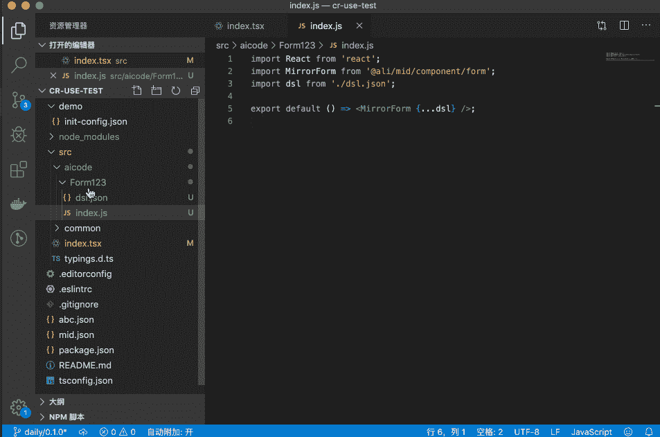

# 人工智能支持中端和后端场景中的按代码设计

> 原文：<https://medium.datadriveninvestor.com/ai-empowers-design-to-code-in-the-mid-end-and-backend-scenarios-9d42301157e8?source=collection_archive---------32----------------------->

*作者田可*

# 背景

设计到代码(Design-to-Code，D2C)是指利用各种自动化技术将草图、Photoshop、图像等设计转换成前端代码，减少前端工程师的工作量，提高他们的开发效率，创造商业价值。

在实施 D2C 的过程中，以下输入格式用于设计:

*   矢量格式，如草图和 Photoshop
*   图像格式

由设计表达的前端页面包括以下类型:

*   客户端
*   中端和后端

这篇文章探讨了人工智能如何在中端和后端场景中支持 D2C。

# 中端和后端系统的特征

与客户端相比，中端和后端系统的前端开发有以下特点:

*   Ant Design、fusion 等 UI 组件库的应用已经成为必备。很少使用 DIV + CSS。
*   除了编写接口，前端工程师还需要编写大量复杂的业务逻辑。
*   大部分(大约 60%到 70%)的任务集中在开发常见的复杂组件上，比如表单、表格、描述列表和图表。

鉴于这些特点，使用 Sketch2React 这样的工具从草图设计中生成大量 DIV + CSS 代码是不合适的。如何在中端和后端页面实现 D2C？解决方案是使用人工智能来识别组件。具体来说，你可以使用深度学习从图像设计中提取组件的信息。这些信息用于生成可读的、可维护的和组件化的代码。

# AI 能写什么代码？

## 从零开始在模型和视图层为常见的复杂组件生成代码

到目前为止，在我们的人工智能能力的支持下，我们可以从图像中提取信息，以基于模型-视图-控制器(MVC)架构在模型和视图层为常见的复杂组件(如表单、表格和描述列表)生成代码。常见复杂组件的代码无法在控制器层生成，因为即使是真人也无法从图像中提取逻辑信息，如链接和提交。然而，在不久的将来，我们将通过 NL2Code 在控制器层生成代码，因此人工智能可以“看”、“听”，并帮助在多种模式下生成代码。

## 现有代码的快速检索和重用

除了从零开始生成常见复杂组件的代码，我们还可以从成千上万段代码中快速检索和重用用户需要的代码。例如:

*   从数以万计的图标库中快速截图，生成图标的样本代码。
*   从几十个图表中快速截取屏幕截图，生成图表的示例代码。
*   从数以万计的业务组件库中快速截屏，生成业务组件的样本代码。

# 艾只是一个助手

我们期望 AI 作为独立的前端工程师，但现在这是不可能的。人工智能在现阶段有以下缺点:

*   AI 只能识别它已经学习的组件。
*   AI 只能帮助生成视图层的代码和简单的逻辑代码。对于一些无法用图像表达的联动逻辑和提交逻辑，AI 无能为力。

因此，我们决定将 AI 集成到当前的工作流中，以协助前端工程师的开发。即使出现这些问题，前端工程师也可以进行修正和补充。

我们为中端和后端系统创建了以下两个工作流:

*   Pro 代码
*   低位代码

Pro 码和 Low 码是什么意思？

*   Pro Code 指的是源代码链接，我们可以用它来编写专业的程序。
*   ●Code 指的是应用程序开发的可视化方法，它将开发人员从逐行编写代码的需要中解放出来。

以下示例显示了如何对 Pro 代码和 Low 代码使用 AI 支持的组件识别。

# 人工智能支持的 D2C 的例子

## Pro 代码示例

先来看看 Pro 代码。以阿里巴巴首席客户办公室(CCO)前端团队使用的 MID GUI 工具为例。要生成代码和相应的实时演示，您可以对表单部分进行截图，然后按 CMD+V 将截图粘贴到支持 AI 的组件识别中。或者，如果您有表单图像，您可以单击或拖放图像来上传它，如下图所示:

如果你对人工智能生成的代码感到满意，你可以点击“下载”输入组件名称后，可以将组件的代码下载到当前项目中，如下图所示:

您可以通过打开当前项目来查看和使用下载的代码。代码在`aicode/(user-entered component name)`目录中生成，该目录由以下文件组成:

*   包含常见复杂组件协议的 dsl.json 文件。生成表单代码，甚至翻译字段。也使用茶包。
*   index.js 文件，调用 dsl.json 文件中包含的协议，并作为 React 组件导出

可以直接使用或者修改 AI 生成的代码，如下图所示:

如果你认为识别效果不满意，点击反馈。我们将尽快重新培训该模型。两个小时后，深度学习模型将从每个糟糕的案例中学习。深度学习模型获取的知识越多，它就会变得越智能。

 [## 机器学习和人工智能如何改变电子商务的面貌？|数据驱动…

### 电子商务开发公司，现在，整合先进的客户体验到一个新的水平…

www.datadriveninvestor.com](https://www.datadriveninvestor.com/2020/11/19/how-machine-learning-and-artificial-intelligence-changing-the-face-of-ecommerce/) 

## 更多 Pro 代码示例

**表**

**描述列表**

**图表**

**图标**

我们已经将我们的 AI 能力嵌入到蚂蚁设计的官方网站中。欢迎使用 AI 截图搜索本网站图标。

## 低代码示例

除了使用 AI 支持的 Pro 代码组件识别来提高开发人员的效率，您还可以使用图像生成组件协议来加速可视化构建。例如，XForm 是由阿里巴巴 CCO 的前端团队开发的，最初用于通过拖放表单项来创建表单。现在，人工智能支持的组件识别服务可用于上传图像以生成协议，并帮助自动生成用户界面。当结果不准确或不完整时，您可以进行干预。

# 未来展望

在 Apsara Conference 2019 上，Daniel Zhang 表示，*“大数据是石油，计算能力是数字经济时代的引擎。”*组件化在前端行业已经初具规模，因此大量的组件可以作为大数据使用。与此同时，业界的计算能力也在不断提高。人工智能有潜力改变前端开发的模式。让我们拭目以待。

# 原始来源:

 [## 人工智能支持中端和后端场景中的按代码设计

### 阿里巴巴 F(x)团队 2020 年 12 月 9 日 126 按代码设计(D2C)是指利用各种自动化技术来…

www.alibabacloud.com](https://www.alibabacloud.com/blog/ai-empowers-design-to-code-in-the-mid-end-and-backend-scenarios_596985) 

## 获得专家观点— [订阅 DDI 英特尔](https://datadriveninvestor.com/ddi-intel)