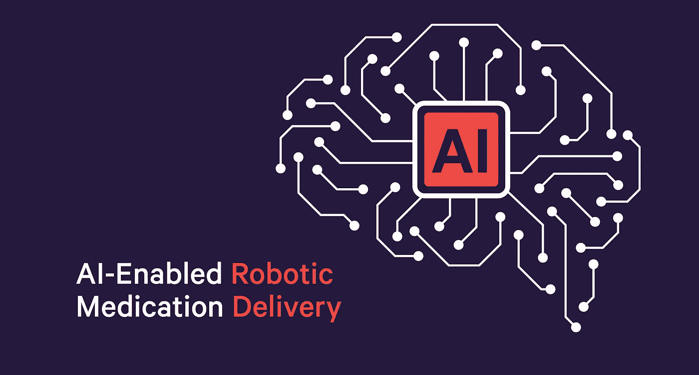
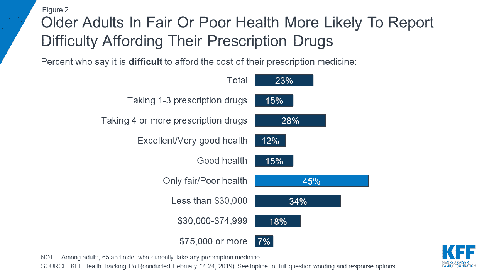
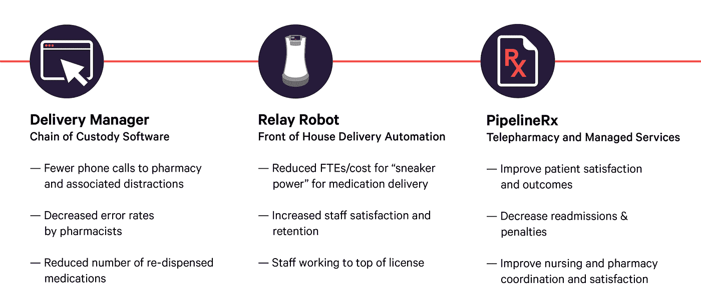
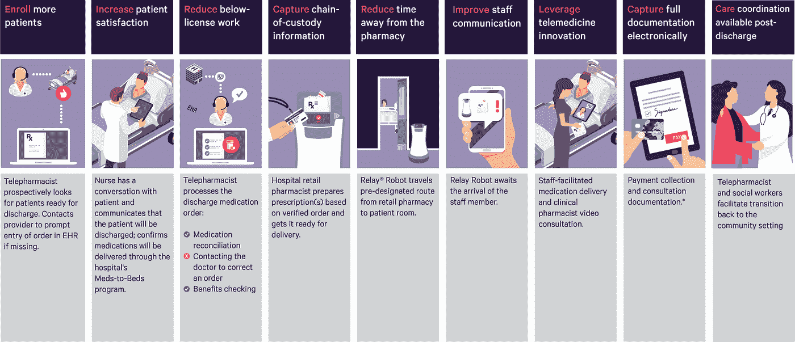

# 人工智能支持的机器人交付和医疗到床计划的远程医疗推动了依从性，降低了病原体传播的可能性

> 原文：<https://medium.datadriveninvestor.com/ai-enabled-robotic-delivery-and-telemedicine-for-meds-to-beds-programs-drives-adherence-reduces-bcef4b178e16?source=collection_archive---------7----------------------->

Hospital Meds-To-Beds programs fight pathogen transmission potential using robotic delivery and telepharmacy support services.

新冠肺炎的变化越多，它们就越保持不变

几个月前，我写了关于[恶化美国医疗保健状况的五种趋势](https://medium.com/datadriveninvestor/five-trends-aggravating-our-healthcare-system-16a9cba9b61e)。那篇全面的文章研究了导致改革的影响因素，从我们老龄化人口的指数增长到 65 岁及以上患者再入院率的上升。

自 2 月份发表那篇文章以来，发生了很多事情。第一例本地新冠肺炎病毒传播的疑似病例发生在美国。“社会距离”和“适当的庇护”成了我们日常用语的一部分。我们国家的经济结构被撕裂了。不确定性减缓了生活和商业的节奏。

然而，一些医疗保健挑战的重要性已经提高，尤其是在急症护理环境中，患者药物治疗依从性是这些挑战之一。需要更多的药物咨询，同时限制病原体的传播和药物的可及性，这对于减轻患者的不良事件(包括再住院)至关重要。

当然，医院收入的[挑战](https://www.cnbc.com/2020/05/05/hospitals-losing-millions-of-dollars-per-day-in-covid-19-pandemic.html)需要关注。

暂停了数周的选择性手术，在那些相信当地感染曲线已经变平的禁令已经解除的地区，显示出重新预订的迹象。在疫情之前，发现医院出院工作流程缺乏经过深思熟虑的药物干预流程，这仍然是一个充满机会的领域。这是影响[患者对药物使用的态度和信念体系](https://www.cdc.gov/pcd/issues/2018/18_0190.htm)的关键时刻，或许可以利用健康和安全主题的主流化，让公民适应“新常态”。

知识就是力量

提高出院时护理过渡的有效性对于安全、知情和有效地使用药物至关重要，特别是在老年人中有五分之一的老年人报告由于费用问题而没有服用他们的处方。

一般来说，[消息灵通的患者有权对其个人健康结果负责](https://www.pharmacytoday.org/article/S1042-0991(18)30463-8/fulltext)。在[的一项研究](https://www.pharmacytoday.org/article/S1042-0991(18)30463-8/fulltext)中，参与药物调和、积极参与关于正确使用药物的讨论并安排 7 天随访会议的患者在住院手术后经历了明显更好的结果。

当我们考虑教育今天的健康消费者为明天的流动和自我指导的护理环境做准备时，旨在[减少主要诊断的再入院](https://www.beckershospitalreview.com/rankings-and-ratings/average-hospital-readmission-costs-for-18-diagnoses.html)的药物治疗坚持策略不能低估。

**再入院伤害**

每年计划外再入院的成本为 150-200 亿美元。寻找有效的方法来减少可避免的再入院的情况为患者健康和安全的改善提供了巨大的潜力。对于面临基于价值的报销(或基于价值的支付，VBP)模式的医院和卫生系统，提高药物治疗的依从性是一项战略要务。

**以创新应对改革**

随着支付者服务报销越来越多地与患者结果相关，思想进步的医院已经找到了解决药物依从性的有前途的模式，同时促进了顶线收入的增长。总之，这些模式可以减轻 VBP 的财务处罚，并有助于提高运营利润。

医院药房积极采取成本控制措施，如优化库存和采用药物监管链解决方案来最大限度地减少再配送，现在可以将重点放在追求新的收入流上。专业药房、邮购药房和药品到床计划是全国范围内处于不同采用阶段的三种模式。

**您的药物依从性伙伴:支持药物到床计划的自动化**

医疗到床位计划的配置因组织而异。我目前正在领导一个新项目，处于测试阶段，我正与医院合作，测试结合以下内容的整体效益:

Savioke 接力自主服务机器人

Swisslog 医疗保健交付管理软件

PipelineRx 临床远程药房服务

该计划将药物交付到患者床边、药物调节和咨询以及药物监管链跟踪软件结合在一起。

作为一个集成系统，该计划通过自动化、软件和托管服务提高了现有医院运营的门诊药房药品到床计划的能力，从而在不增加 FTE 药房费用的情况下，通过增加对患者的服务来扩大规模。

综合优势包括:

**端到端药物到床(M2B)工作流程**

M2B 试点项目的第一阶段集中在医院流动药房，在那里已经实施了人工药物到床计划。

该工作流程允许药房团队每天处理更多数量的出院药物处方，因为自主服务机器人的任务是在患者床边而不是工作人员处分派和递送药物。临床远程药学服务旨在进行福利检查，与提供者就共付额和脚本执行援助计划等问题进行沟通。药物跟踪软件在整个过程中提供了单点控制、责任和可追溯性。

下图显示了一个高层次的概述:

如果你或你的同行正在寻求通过技术创新来扩大医疗到床项目的能力，我很乐意与你联系——请给我发邮件。如果你喜欢这篇文章，考虑分享它，以鼓励进一步的对话。

*请关注本系列的第三篇文章，了解更多信息。*

*漏了* [*一条*](https://medium.com/datadriveninvestor/five-trends-aggravating-our-healthcare-system-16a9cba9b61e) *？现在就看！*

###

图形 Swisslog 医疗保健 2020。
Relay 是 Savioke，LLC 的注册商标。
与图示相对应的 KFF 报告见[本页](https://www.kff.org/health-reform/issue-brief/data-note-prescription-drugs-and-older-adults/)。