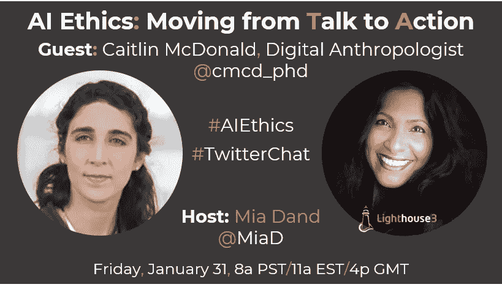

# 人工智能伦理:从谈论走向行动

> 原文：<https://medium.datadriveninvestor.com/ai-ethics-moving-from-talk-to-action-47c0b811e581?source=collection_archive---------12----------------------->

在我们一月份的每月 [**人工智能伦理推特聊天**](https://twitter.com/MiaD/status/1223275296800964609?s=20) 中，我们邀请了[凯特琳·麦克唐纳](https://www.linkedin.com/in/caitlinmcdonald/)博士，前沿论坛的获奖学者和[数字人类学家，来讨论组织如何将](https://www.linkedin.com/in/caitlinmcdonald/) [**人工智能伦理从空谈变为行动**](https://twitter.com/MiaD/status/1223275296800964609?s=20) 。以下是我们极具洞察力的谈话的要点。

**Mia Dand:** 让我们从基础开始，为什么 AI 中的伦理很重要？与不道德的人工智能相关的一些风险/危害是什么？

**Caitlin McDonald:** 人工智能中的伦理是一个如此重要的问题——无论你是否是一名数据科学家，你的工作、你的私人生活&消费者生活、&你对公民社会的参与都将受到不断增加的自动化数据处理量的影响。

你可能不会直接看到它，但它已经融入到你与所有这些机构的互动中。这意味着数据科学家、商业领袖和每个致力于构建人工智能系统的人都有巨大的责任来确保他们构建的人工智能为每个人服务。

处于权力地位的人需要为那些没有技术知识和权力来评估自动化系统中的公平性的人辩护。

这是建立问责制的一种方式，设计更加透明和可解释的系统也是如此，这样才能评估公平性。最重要的是，建立问责机制和治理，让人们有权力和机构来纠正错误。

 [## 人工智能和监督资本主义|数据驱动的投资者

### 大科技，总是现在:人工智能推动的大科技，已经使购物，搜索，在你的…

www.datadriveninvestor.com](https://www.datadriveninvestor.com/2020/03/04/on-artificial-intelligence-and-surveillance-capitalism/) 

从商业角度来看，我认为随着领导者越来越依赖人工智能，他们需要考虑四个主要危害:

💸客户会因为更有道德的服务提供商而抛弃你。

👩‍💻人才会离开你，去找更有道德的雇主。

⚖️，你会无意中加剧系统性的不平等，从而对公众造成巨大伤害。

🦹‍♀️:你将失去技术实力的竞争优势，输给那些道德危及你的员工、客户或公众的公司或国家。

当把伦理付诸行动时，首先出现的问题是谁应该在一个组织中管理人工智能的伦理？

**CM:** 现在这是一个非常重要的问题，因为在商业领域还没有达成共识:它属于道德合规吗&?通常，在法律事务方面表现出色，但在技术问题上还跟不上。如果你的组织有一个科学研究单位(例如在医学&制药行业),它属于人体试验的道德过程吗？在技术发展的最早期阶段呢？设计团队对这一切有发言权吗？

我经常发现关于治理的对话在那些相信采取基于设计思维的工具和技术的开放式方法的人之间分裂(例如，谁是利益相关者？

这个提议的改变可能会有什么结果？)&那些相信结构化的、基于规则的方法的人。但事实是，这两种方法在特定时期都有其优点&您可以通过查看其他行业的历史例子来观察它们的实际应用。

受到严格监管的行业，如保险、医疗、银行、公用事业等。所有这些都有非常完善的框架，通常体现在法律中，有时体现在行业最佳实践中，用于评估风险&设定正确或预期的做事方式。

这并不是说这些行业从来没有经历过问题，他们绝对有！但是他们通常有机制来概述预期的标准，评估那些没有达到的标准，并解决哪里出了问题。

但在早期，这些监管机制都不存在，因为不可能确切知道风险和收益是什么:这就像今天发展如此迅速的新的自动化解决方案。

它们充满了希望&充满了风险，我们只是还不知道中期和长期的影响会是什么。

因此，在这个未知的世界中，我们可以利用的最佳工具就是对可能的利弊做出合理的推测——特别是在那些将对不同群体产生不成比例影响的情况下——并围绕这些进行设计。

随着自动化决策系统变得越来越普遍，它们的风险和回报将变得更加清晰，我们可以围绕它们建立更成熟的法律和行业标准以及责任结构。

**MD:组织应该从哪里开始道德人工智能&他们应该如何区分优先级？**

**CM:** 对于每个组织来说，这将是一个真正独特的旅程，这真的取决于起点是什么。如果你是一个巨大的全球性公司，你最大的担忧可能是跨越国家和地区边界管理不同的立法。

如果你是一家小型创业公司，你可能会更专注于开发识别机器学习模型中偏差的技术。

归根结底，大多数道德问题不是源于恶意，而是源于粗心大意:缺乏监督，缺乏设计中的思想多样性，缺乏问责机制，缺乏发现和解决风险的思考时间。

如果我愤怒的老板就在我的身后，我可能会更加关注他，而不是那些可能影响我从未谋面的人的风险。

更多的道德错误来自仓促行事&考虑不周的激励措施，而不是有意造成伤害。

这并不是说我们不应该警惕蓄意伤害，在过去的五年里，我们确实看到了许多消费者和工人围绕有害的做法组织起来。Twitter 是一个见证这种演变的好地方。

**MD:你如何从道德技术使用中实现财务&文化收益？**

**CM:** 大多数企业实际上是从将道德视为风险管理工具的角度出发的:他们通常将道德视为防止坏事发生的一种方式。但实际上伦理的潜力远不止于此。

道德不仅仅是关于什么不要做，什么伤害要避免:它也是关于识别哪些伤害已经发生，可以通过创新改变。

我们已经看到了很多关于招聘、健康和其他领域的偏见的新闻，如果这些工具正在复制甚至加剧现有的社会危害，我们绝对不应该使用它们。

但最棒的是，这些工具也开启了关于这些危害发生在哪里以及如何修复它们的对话——不仅仅是在技术方面，而是在社会本身。

对建筑技术采取坚定的道德立场的一个真正关键的好处是人才的获得和保留:智库 Doteveryone 在 2019 年进行的一项研究表明，技术专家，特别是数据科学家，确实坚持为负责任的雇主工作。

企业低估了想要购买更多道德产品的忠诚消费者群体的力量:是的，有很多反例，但我们也看到消费者寻求更好/更公平的产品，尽管这可能意味着很多不同的事情。

这种差异就是为什么我们可能会看到迫使企业采取不同行为的非常不同的策略:你关注的是道德的哪些方面？你是如何区分轻重缓急的？这就是为什么不同的产品或公司会从寻求更道德未来的不同团体那里得到如此不同的反应。

**MD:** 伦理在理论上听起来很棒，但在实践中很有挑战性，因为价值观的冲突&激励系统。你如何平衡相互冲突的伦理问题？

**CM:** 关于这一点，我的最佳建议是，当事情出错时，它们几乎肯定会出错—&—你希望能够证明，你利用现有信息做出了最佳选择。

这通常意味着从一套明确的指导原则开始，通常是与一系列利益相关者和专家协商制定的:客户、律师、工程师、可能以任何方式受到技术影响或参与制造技术的人。

你也不需要从零开始:你可以查看现有框架和指南的行业指南，如 IEEE 伦理一致设计手册，或欧盟可信人工智能的伦理指南等。事实上，那里有大量的代码。

重要的是如何将这些美好的愿景变成实际行动。一旦你设计或选择了你要使用的原则，你需要一个治理机制来制定和捕捉决策，这样当真正棘手的情况出现时——没有明确的赢家，需要做出权衡以找到最不糟糕的选择——你可以清楚地利用你的原则来做出决定。

理想情况下，有一个问责机制，这样，如果受决策影响的利益相关方不同意所采取的行动，就可以对这样的决策进行审计，并采取适当的措施。

这里的关键词是问责制:明确谁需要负责，以及他们需要对谁负责。

MD:人工智能领域一直在不断发展，有什么有效的方法来跟上新出现的实践？

**CM:** 我个人觉得这很恐怖！变化的速度是惊人的&没有可行的方法来跟上该领域的所有进步。我认为第一步是缩小你的关注点，这样你就可以优先考虑你的信息来源。

你需要深入了解什么&你能满足于三句话的概述吗？这有助于确定订阅时事通讯和参加活动的优先顺序。

人工智能中的伦理社区特别热情和积极，所以幸运的是，他们非常愿意与志同道合的人合作。我经常发现我的收件箱和 Twitter 上充斥着“你看到这个了吗？？?"关于最新的人工智能恐慌的消息——偶尔也有更有希望的文章！

但是作为这样一个活跃的社区的一部分，一件很棒的事情是感觉到有人在非常积极地努力为每个人做得更好。

非常感谢[凯特琳·麦克唐纳](https://www.linkedin.com/in/caitlinmcdonald/)博士的宝贵时间和真知灼见。

再次加入我们 2 月 28 日的每月[人工智能伦理推特聊天](https://twitter.com/miad)，因为我们邀请了[布兰迪·诺内克博士](https://twitter.com/BNonnecke)来讨论深度假货的[伦理](https://www.wired.com/story/opinion-californias-anti-deepfake-law-is-far-too-feeble/)。在我们一月份的每月 [**人工智能伦理 Twitter 聊天**](https://twitter.com/MiaD/status/1223275296800964609?s=20) 中，我们邀请了前沿论坛的获奖学者和[数字人类学家](https://www.linkedin.com/in/caitlinmcdonald/)[Caitlin McDonald](https://www.linkedin.com/in/caitlinmcdonald/)博士，来讨论组织如何将 [**人工智能伦理从空谈变为行动**](https://twitter.com/MiaD/status/1223275296800964609?s=20) 。以下是我们极具洞察力的谈话的要点。

**Mia Dand:** 让我们从基础开始，为什么 AI 中的伦理很重要？与不道德的人工智能相关的一些风险/危害是什么？

**凯特琳·麦克唐纳:**人工智能中的伦理是一个如此重要的问题——无论你是否是一名数据科学家，你的工作、你的私人生活&消费者生活、&你对公民社会的参与都将受到不断增加的自动化数据处理量的影响。

你可能不会直接看到它，但它已经融入到你与所有这些机构的互动中。这意味着数据科学家、商业领袖和每个致力于构建人工智能系统的人都有巨大的责任来确保他们构建的人工智能为每个人服务。

处于权力地位的人需要为那些没有技术知识和权力来评估自动化系统中的公平性的人辩护。

这是建立问责制的一种方式，设计更加透明和可解释的系统也是如此，这样才能评估公平性。最重要的是，建立问责机制和治理，让人们有权力和机构来纠正错误。

从商业角度来看，我认为随着领导者越来越依赖人工智能，他们需要考虑四个主要危害:

💸客户会因为更有道德的服务提供商而抛弃你。

👩‍💻人才会离开你，去找更有道德的雇主。

⚖️，你会无意中加剧系统性的不平等，从而对公众造成巨大伤害。

🦹‍♀️:你将失去技术实力的竞争优势，输给那些道德危及你的员工、客户或公众的公司或国家。

当把伦理付诸行动时，首先出现的问题是谁应该在一个组织中管理人工智能的伦理？

**CM:** 现在这是一个非常重要的问题，因为在商业领域还没有达成共识:它属于道德合规吗&？通常，在法律事务方面表现出色，但在技术问题上还跟不上。如果你的组织有一个科学研究单位(例如在医药行业),它是否属于人体试验的道德过程？在技术发展的最早期阶段呢？设计团队对这一切有发言权吗？

我经常发现关于治理的对话在那些相信采取基于设计思维的工具和技术的开放式方法的人之间分裂(例如，谁是利益相关者？

这个提议的改变可能会有什么结果？)&那些相信结构化的、基于规则的方法的人。但事实是，这两种方法在特定时期都有其优点&您可以通过查看其他行业的历史例子来观察它们的实际应用。

受到严格监管的行业，如保险、医疗、银行、公用事业等。所有这些都有非常完善的框架，通常体现在法律中，有时体现在行业最佳实践中，用于评估风险&设定正确或预期的做事方式。

这并不是说这些行业从来没有经历过问题，他们绝对有！但是他们通常有机制来概述预期的标准，评估那些没有达到的标准，并解决哪里出了问题。

但在早期，这些监管机制都不存在，因为不可能确切知道风险和收益是什么:这就像今天发展如此迅速的新的自动化解决方案。

它们充满了希望&充满了风险，我们只是还不知道中期和长期的影响会是什么。

因此，在这个未知的世界中，我们可以利用的最佳工具就是对可能的利弊做出合理的推测——特别是在那些将对不同群体产生不成比例影响的情况下——并围绕这些进行设计。

随着自动化决策系统变得越来越普遍，它们的风险和回报将变得更加清晰，我们可以围绕它们建立更成熟的法律和行业标准以及责任结构。

**MD:组织应该从哪里开始伦理人工智能&他们应该如何区分优先级？**

对于每个组织来说，这都将是一个独特的旅程，这取决于起点。如果你是一家大型跨国公司，你最大的担忧可能是管理不同国家和地区的不同法律。

如果你是一家小型创业公司，你可能会更专注于开发识别机器学习模型中偏差的技术。

归根结底，大多数道德问题不是源于恶意，而是源于粗心大意:缺乏监督，缺乏设计中的思想多样性，缺乏问责机制，缺乏发现和解决风险的思考时间。

如果我愤怒的老板就在我的身后，我可能会更加关注他，而不是那些可能影响我从未谋面的人的风险。

更多的道德错误来自仓促行事&考虑不周的激励措施，而不是有意造成伤害。

这并不是说我们不应该警惕蓄意伤害，在过去的五年里，我们确实看到了许多消费者和工人围绕有害的做法组织起来。Twitter 是一个见证这种演变的好地方。

**MD:你如何从道德技术使用中实现财务&文化收益？**

**CM:** 大多数企业实际上是从将道德视为风险管理工具的角度出发的:他们通常将道德视为防止坏事发生的一种方式。但实际上伦理的潜力远不止于此。

道德不仅仅是关于什么不要做，什么伤害要避免:它也是关于识别哪些伤害已经发生，可以通过创新改变。

我们已经看到了很多关于招聘、健康和其他领域的偏见的新闻，如果这些工具正在复制甚至加剧现有的社会危害，我们绝对不应该使用它们。

但最棒的是，这些工具也开启了关于这些危害发生在哪里以及如何修复它们的对话——不仅仅是在技术方面，而是在社会本身。

对建筑技术采取坚定的道德立场的一个真正关键的好处是人才的获得和保留:智库 Doteveryone 在 2019 年进行的一项研究表明，技术专家，特别是数据科学家，确实坚持为负责任的雇主工作。

企业低估了想要购买更多道德产品的忠诚消费者群体的力量:是的，有很多反例，但我们也看到消费者寻求更好/更公平的产品，尽管这可能意味着很多不同的事情。

这种差异就是为什么我们可能会看到迫使企业采取不同行为的非常不同的策略:你关注的是道德的哪些方面？你是如何区分轻重缓急的？这就是为什么不同的产品或公司会从寻求更道德未来的不同团体那里得到如此不同的反应。

**MD:** 伦理在理论上听起来很棒，但在实践中很有挑战性，因为价值观的冲突&激励系统。你如何平衡相互冲突的伦理问题？

**CM:** 关于这一点，我的最佳建议是，当事情出错时，它们几乎肯定会出错—&—你希望能够证明，你利用现有信息做出了最佳选择。

这通常意味着从一套明确的指导原则开始，通常是与一系列利益相关者和专家协商制定的:客户、律师、工程师、可能以任何方式受到技术影响或参与制造技术的人。

你也不需要从零开始:你可以查看现有框架和指南的行业指南，如 IEEE 伦理一致设计手册，或欧盟可信人工智能的伦理指南等。事实上，那里有大量的代码。

重要的是如何将这些美好的愿景变成实际行动。一旦你设计或选择了你要使用的原则，你需要一个治理机制来制定和捕捉决策，这样当真正棘手的情况出现时——没有明确的赢家，需要做出权衡以找到最不糟糕的选择——你可以清楚地利用你的原则来做出决定。

理想情况下，有一个问责机制，这样，如果受决策影响的利益相关方不同意所采取的行动，就可以对这样的决策进行审计，并采取适当的措施。

这里的关键词是问责制:明确谁需要负责，以及他们需要对谁负责。

MD:人工智能领域一直在不断发展，有什么有效的方法来跟上新出现的实践？

**CM:** 我个人觉得这很恐怖！变化的速度是惊人的&没有可行的方法来跟上该领域的所有进步。我认为第一步是缩小你的关注点，这样你就可以优先考虑你的信息来源。

你需要深入了解什么&你能满足于三句话的概述吗？这有助于确定订阅时事通讯和参加活动的优先顺序。

人工智能中的伦理社区特别热情和积极，所以幸运的是，他们非常愿意与志同道合的人合作。我经常发现我的收件箱和 Twitter 上充斥着“你看到这个了吗？？?"关于最新的人工智能恐慌的消息——偶尔也有更有希望的文章！

但是作为这样一个活跃的社区的一部分，一件很棒的事情是感觉到有人在非常积极地努力为每个人做得更好。

非常感谢[凯特琳·麦克唐纳](https://www.linkedin.com/in/caitlinmcdonald/)博士的宝贵时间和真知灼见。

再次加入我们 2 月 28 日的每月[人工智能伦理推特聊天](https://twitter.com/miad)，因为我们邀请了[布兰迪·诺内克博士](https://twitter.com/BNonnecke)来讨论深度假货的[伦理](https://www.wired.com/story/opinion-californias-anti-deepfake-law-is-far-too-feeble/)。