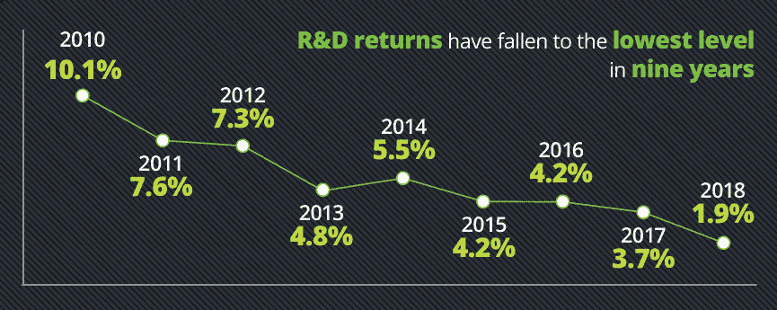
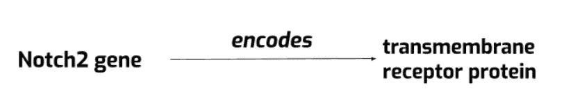
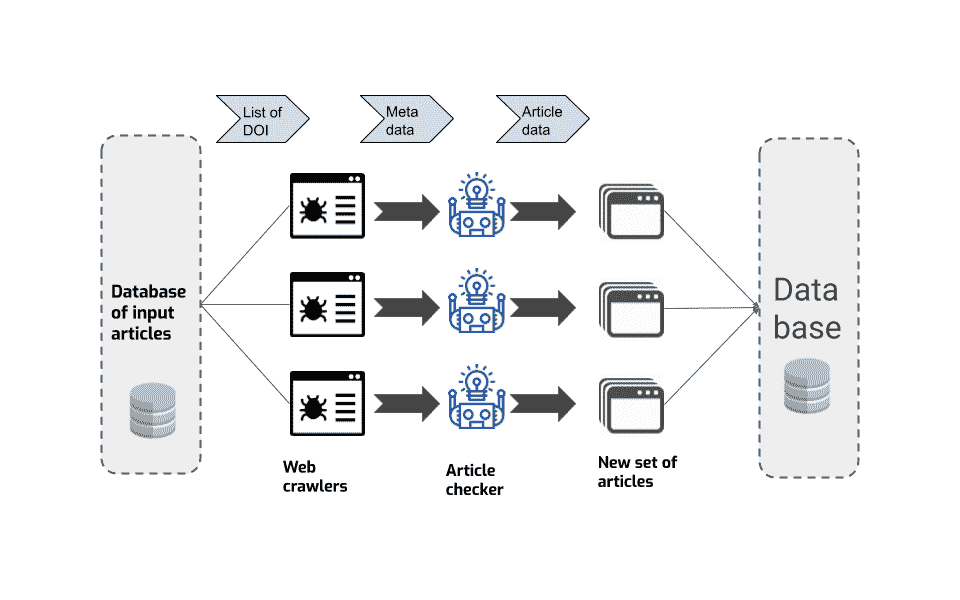
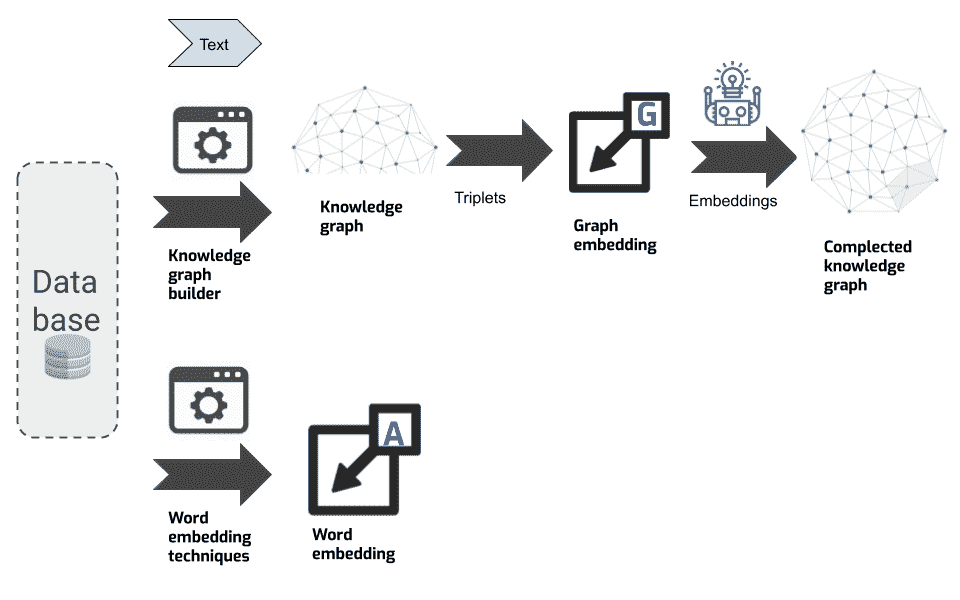
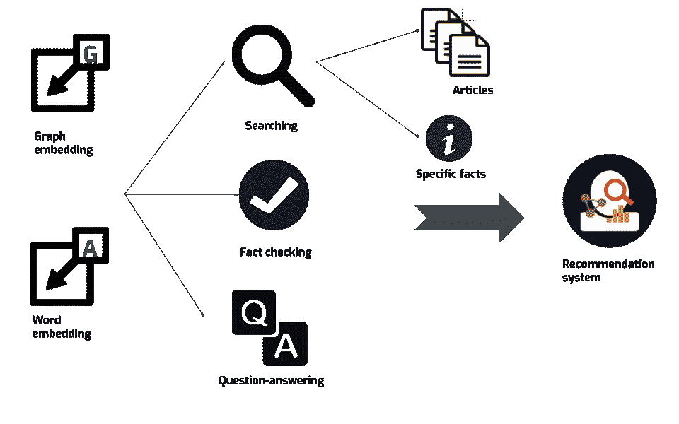

# 用于生物技术知识管理的人工智能

> 原文：<https://medium.datadriveninvestor.com/ai-for-biotech-knowledge-management-4209d64c4280?source=collection_archive---------15----------------------->

应用机器学习从生命科学数据的海洋中提取价值。

现代科学和高科技商业产生了巨大的信息流，这在单个组织的水平上几乎是不可能覆盖的。

科学文章、开发、专利和模型的数量呈指数级增长，而具有巨大潜力的科学数据自动分析方法没有得到有效利用，也没有覆盖所有生命科学行业。

以生命科学行业为例，我们将尝试展示基于机器学习的专家系统如何解决自动分析科学和技术数据的问题，以协助研究人员的信息工作流程。

# 数据雪崩

传统企业正逐渐学会应对不断增长的数字数据流。在线服务、零售店、社交媒体和金融机构早就明白，只有人工智能才能处理如此大量的信息。

但是同样的命运等待着科学密集型企业。

生命科学是过去 30 年来增长最快的知识领域之一。PubMed 上的统计数据显示，在生物学的大多数领域，科学论文的数量每隔几年就会翻一番。

信息和通信技术的发展加速了科学信息的产生，加上科学的普遍进步，为科学创造了巨大的前景，我们如何有效地利用这些机会取决于科学的未来发展。

当然，科学信息的自动化处理要困难得多——它的结构化程度更低，更复杂，而且是异构的。但好消息是，总体而言，这类信息较少，我们在处理这些信息时面临的挑战与处理在线用户行为信息时不同。

# 为什么生物技术需要数据管理

*为科学家*

现代科学家花大量时间搜索和分析科学文献。在一大堆科学文献中找到需要的文章很难，匹配必要的信息更难。另一个需要解决的问题是文章信息的验证，先进的系统将有助于只收集相关和明确的数据。此外，即使我们已经收集了结构化的信息，明智地利用数据产生新的见解也是很重要的。如果我们谈论生物学研究，巨大的资源花费在单个酶的研究上，当我们基于特殊情况创建一般假设时，归纳方法的潜力在生物学中很少被揭示。

*针对商家*

生物技术业务非常复杂，与研发高度相关。根据德勤(Deloitte)的《释放 R&D 生产力》(unlocked America productivity)，开发和推广新药变得更加困难。这种趋势与各种因素有关，包括纯粹的研究因素，因为潜在目标的范围正在缩小，这需要研究越来越复杂的途径和分子，反过来，组织这样的研究、收集专家和患者进行研究变得更加困难。德勤的解决方案之一是开发机器学习算法，用于自动化重复任务，以承担更高附加值的工作。这种制度可以成为打破这种倾向的线索。

来源:[解锁 R & D 生产力](https://www2.deloitte.com/content/dam/Deloitte/uk/Documents/life-sciences-health-care/deloitte-uk-measuring-return-on-pharma-innovation-report-2018.pdf)。

# 我们的解决方案

摆脱这种局面的一个办法是创建一个智能系统，从全球网络和科学文章中以知识图表的形式收集和组织相关信息。知识图是由实体组成的图，这些实体通过某种关系连接在一起。这种类型的数据结构可以用一组三元组(实体-关系-实体)来表示。需要说明的是，知识图对于人类和计算机来说都是可读的，并且有可能开发推理系统。

上述系统将允许:

快速找到您需要的结构化信息(事实)和所有相关元素(文章、其他事实和概念)；

研究科学知识结构随时间的变化；

根据现有信息生成新的事实，因为在实践中很难构建一个完全完整的知识图表，当然，更重要的是在图表层面培养思维能力。

同时，在这种专家系统的运行中，商业数据和科学信息的结合将允许在研究和公司的商业成功之间建立关系。

接下来，我们将讨论如何尝试让我们的团队构建这样一个系统。

 [## 机器学习和人工智能如何改变电子商务的面貌？|数据驱动…

### 电子商务开发公司，现在，整合先进的客户体验到一个新的水平…

www.datadriveninvestor.com](https://www.datadriveninvestor.com/2020/11/19/how-machine-learning-and-artificial-intelligence-changing-the-face-of-ecommerce/) 

第一步，我们建立一个基于网络信息聚合的数据库。我们创建学术爬虫来监控科学期刊的更新，并收集关于新文章及其参考文献的信息。

然后，使用数据库根据文章中描述和探讨的概念和术语构建知识图。对于图中的所有实体和关系，我们创建唯一的表示，这有助于计算机理解名为图嵌入的结构/关系信息。此外，我们应该为所有单词和短语创建表示，以便机器可以理解人类自然语言查询。对于这个任务，使用不同的神经网络模型。需要说的是，我们使用两种类型的单词嵌入，这允许我们创建更好和更复杂的单词表示。其中一种更具主题性，系统将理解类似的词，如“测序”和“DNA”，另一种类型的嵌入更具功能性:词“测序”和“方法”将是相似的。图形嵌入可用于预测缺失的三元组，因此用于图形编译。使用这三种类型的嵌入，我们通过计算机准确地学习理解单词，并在前面描述的任务中获得最先进的结果。

总来说，我们发现了使用该系统的三种基本方式，并知道我们积极致力于在这些领域创造非常有效的解决方案:

*   正在搜索；
*   事实核查；
*   问答。

最终，所有这些发展都可以用来建立一个完整的推荐系统。

这样的系统，通过其架构，将有效地结合科学研究中人类智能和机器学习的优势。

# 这对 R&D 有什么帮助

现在，所有这些听起来都很棒，但是对生物技术创业公司和 R&D 中心有什么具体的意义呢？他们如何在实践中使用这样的推荐系统？

可能的应用可分为两组:

1)理科相关；

2)商业情报(BI)和竞争情报(CI)。

科学相关应用的例子有:

1)制药应用，这非常重要，因为我们的方法有助于发现新的药物靶点；寻找药物的新用途；发现新的潜在候选药物；为临床试验寻找相关人员；预测大分子(生物药物)的性质；通过知识推理确定疾病的原因。

2)医疗应用，可以高度自动化和改善医疗护理。基本用途是根据患者的病史/信息将患者分组为风险组——预防医学；创建先进的算法，协助患者管理(开出适当的诊断和治疗处方)；帮助构建新的医疗协议。

3)生物技术应用，通过发现新的调控途径、蛋白质相互作用、基因功能，以及预测不同代谢、调控和基因模式的共存，可以促进行业的增长。

4)科学文章分析，这是我们开始工作的领域，也是提供大量机会的领域。最主要的应用是文章分类、排序和评估的机制。更先进的是通过实现推荐系统和问答系统来创建智能搜索引擎，使平台更加用户友好。此外，另一个非常相关的主题是从这些文章中找到新见解的机会。

如果我们谈论商业领域——商业智能，我们的模型也可以在这里找到有效的实现。这些图形模型在商业智能中最常见的应用可以分为两类:
1)复杂的营销和投资分析
-寻找有前景的投资公司；
——寻找无人问津的利基或低竞争的利基；
-公司竞争力分析。

2)针对特定公司的目标分析和案例研究:
-通过评估交易、产品和伙伴关系的前景来加强决策；
-发现当前战略中的缺陷，以优化其业务发展流程；
-寻找公司最本质、最有前途的发展方向。

# 参考

Ananiadou，s .，& Mcnaught，J. (2006 年)。*生物学和生物医学的文本挖掘*(第 1-12 页)。伦敦:阿特奇大厦。

首席信息官，K. J .，库尔干，洛杉矶，&重新格式化，M. (2007)。生命科学中的机器学习。 *IEEE 医学和生物学工程杂志*， *26* (2)，14–16。

科恩，K. B .，&亨特，L. (2004 年)。自然语言处理和系统生物学。在*系统生物学的人工智能方法和工具*(第 147-173 页)。斯普林格，多德雷赫特。

戴尔，r .，莫伊斯尔，h .，萨默斯，h .(编辑。).(2000).*自然语言处理手册*。CRC 出版社。

Koohy，H. (2017 年)。生物医学研究中机器学习方法的兴衰。*f 1000 研究*、 *6* 。

特里波迪、国际法院、卡拉汉、T. J .、韦斯特福尔、J. T .、梅策尔、N. S .、道威尔、R. D .、&亨特、L. E. (2020)。将知识驱动的机械推理应用于毒理基因组学。*体外毒理学*，104877。

**访问专家视图—** [**订阅 DDI 英特尔**](https://datadriveninvestor.com/ddi-intel)