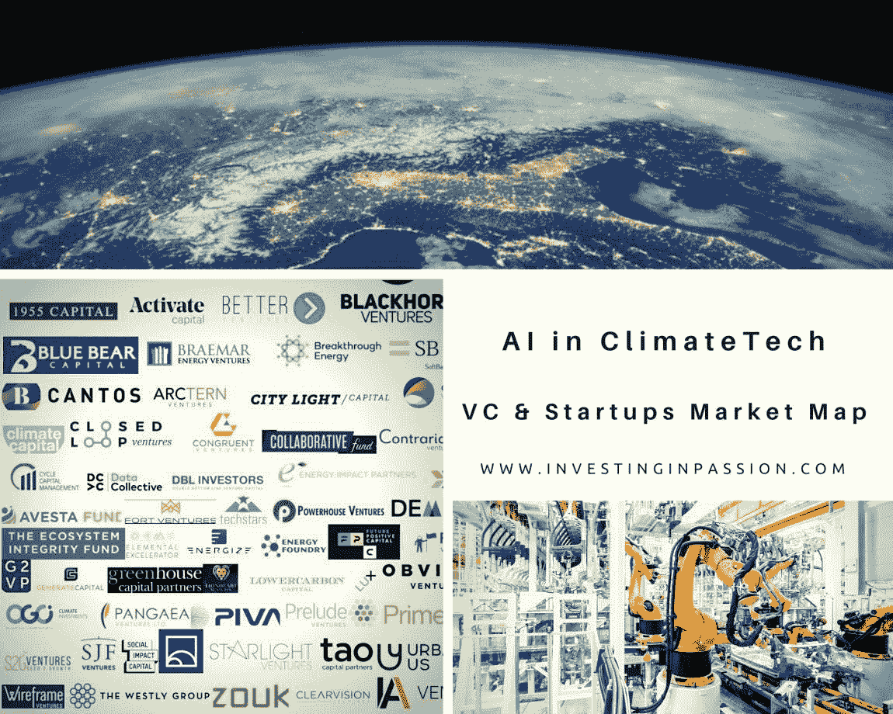
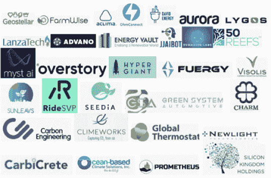
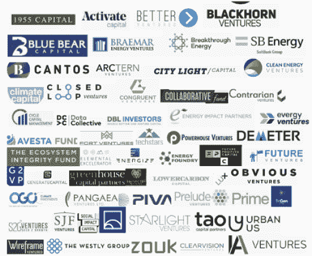

# 气候技术中的人工智能

> 原文：<https://medium.datadriveninvestor.com/ai-in-climate-tech-bdc66f0d1939?source=collection_archive---------14----------------------->

[灵感](https://investinginpassion.com/category/inspirations/)[资源](https://investinginpassion.com/category/resources/)[风险投资](https://investinginpassion.com/category/venture-capital/)

研究报告发现，从 2013 年到 2019 年，气候技术的风险投资增长速度比风险投资整体增长速度快 5 倍！我们越来越意识到气候问题，同时我们也在关注技术发展，我们已经可以使用人工智能来更有效地应对气候问题。人工智能有无数的商业应用，但也有初创公司试图在这项技术的支持下解决气候问题。人工智能可能成为气候变化的关键促成因素，并有助于预测、预防和应对一些严重的气候相关事件。

需求最大、问题最多、污染最严重的行业是农业、建筑、能源、林业、食品、制造业和运输业。

我们需要解决问题并定义期望的结果，以便我们可以看到进展和仍需进一步发展的领域。

**气候技术类别正在经历根本性变化**

**可再生能源**(太阳能、风能、水电、地热、生物质能)将取代发电方式和电池储存能量并为电动汽车提供动力。
**还需要什么？**
—提高风能和太阳能的成本和效率
—更好地利用海洋、地热和生物燃料能源
—更高的电池容量

**粮食生产**是为了减少全球排放。
**还需要什么？**

密歇根大学的报告显示，一个植物汉堡产生的温室气体减少了 90%，能源减少了 46%，对水资源短缺的影响减少了 99%，对土地使用的影响减少了 93%。

**运输**是为了减少二氧化碳的排放。电动汽车、公共汽车和飞机的全球扩张将对这一领域产生重大影响。
**还需要什么？**
–电动汽车降价
–增加电池容量和/或减少充电时间——使用替代燃料(生物燃料)

*'* [*有史以来飞得最大的电动飞机*](https://www.bbc.com/future/article/20200617-the-largest-electric-plane-ever-to-fly) *'*

**制造**中断减少工厂数量，提高生产效率，减少能源消耗和有毒物质排放。
**还需要什么？**
——碳捕获技术的进一步发展

[*可持续制造是未来的浪潮*](https://www.gray.com/insights/sustainable-manufacturing-is-the-wave-of-the-future/)*’*

**建筑和城市**减少照明、电力、供暖和制冷以及碳排放。自动驾驶汽车和智能城市项目将在这一领域发挥作用。还需要什么？
–无排放加热和冷却系统

[*绿色突破:可持续温度控制背后的新发明*](https://www.bdcnetwork.com/blog/green-breakthrough-new-invention-behind-sustainable-temperature-control)*’*

人工智能如何推动解决方案？

1.人工智能可以提高对人们需要多少电力的预测。智能人工智能电表和其他设备可以支持能耗优化。这要考虑到地理位置、天气、气候模式、季节和家庭行为。风力公司可以通过结合实时天气和运营数据，将人工智能用于每个涡轮机的螺旋桨，以在每次旋转时产生更多的电力。

2.AI 可以促进运输以及货运优化(运送货物)。它可以极大地帮助理解许多复杂的本地和国际供应链中的各种需求。

3.人工智能可以优化食品生产，更好地预测餐馆的需求(减少食物浪费)，为农民诊断和处理农作物。

4.人工智能可以帮助工业制造和新型材料的发现(创造[太阳能燃料](https://www.power-technology.com/features/featuresolar-fuels-materials-breakthrough-could-open-new-chapter-5832221/)、阳光能量储存、识别碳吸收剂；生产过程中较少依赖碳的标识材料)

5.AI 可以根据天气预报、建筑占用和使用情况，让家庭、办公室和城市变得更加高效(能耗控制系统(供暖、通风、制冷调节、照明控制)。

6.人工智能可以优化交通&通过垃圾车优化(只有当垃圾箱装满 xx%时才捡起来)，预测洪水、火灾、飓风等极端天气事件，跟踪非法活动(减少砍伐森林)，让城市变得“更聪明”。

 [## 机器学习和人工智能如何改变电子商务的面貌？|数据驱动…

### 电子商务开发公司，现在，整合先进的客户体验到一个新的水平…

www.datadriveninvestor.com](https://www.datadriveninvestor.com/2020/11/19/how-machine-learning-and-artificial-intelligence-changing-the-face-of-ecommerce/) 

还有什么可以帮忙的吗？

*   我国个人消费模式的反思与变革
*   将启动全球联盟和联合监管政策
*   提高当地社区一级的认识和一致性
*   各国代表制定的潜在财政激励措施
*   早期教育和适应

**气候技术领域的初创公司**

[www.InvestingInPassion.com](http://www.InvestingInPassion.com)

**气候技术领域的风险投资基金**

www.InvestingInPassion.com

全球舞台上正在发生什么？

*   报告[预测](https://www.iea.org/reports/global-ev-outlook-2020)全球电动汽车的份额将从 2020 年的 3%增加到 2030 年的 30%
*   世界银行估计，到 2030 年，对气候和清洁技术的投资将达到 23 万亿美元
*   Repsol 正加倍努力摆脱这种不可靠的灵丹妙药。到 2025 年，该公司将花费约 65 亿美元将可再生能源业务增长五倍
*   自 2010 年以来，将阳光转化为能量的光伏电池价格下降了 82%,而太阳能装置的数量在过去十年中增长了 6 倍
*   尽管目前碳封存技术的广泛使用过于昂贵，但它的价格正在下降，就像以前的电动汽车电池和太阳能电池板一样
*   2018 年，中国在清洁能源领域投资了 1000 亿美元，美国投资了 640 亿美元
*   微软的地球人工智能项目已经承诺在五年内投资 5000 万美元来开发和测试人工智能的新应用
*   由斯坦福大学运营的能源部 SLAC 国家加速器实验室将使用机器学习和人工智能来识别电网中的漏洞，在故障发生前加强它们，并在故障发生时更快地恢复电力
*   从 2010 年到 2020 年第一季度，人工智能公司的风险投资已经达到令人震惊的 610 亿美元

**为什么它如此重要？**

*   2019 年 11 月 28 日，欧盟议会宣布全球气候和环境[紧急状态](https://www.europarl.europa.eu/news/en/press-room/20191121IPR67110/the-european-parliament-declares-climate-emergency#:~:text=The%20resolution%20on%20declaring%20a,votes%20against%20and%2019%20abstentions.&text=A%20number%20of%20countries%2C%20local,is%20facing%20a%20climate%20emergency.)
*   在欧洲，洪水不断增加
*   在澳大利亚，反复发生的灌木丛火灾危及整个国家
*   在印度，官员宣布进入公共卫生紧急状态，并分发了 500 万个口罩来应对空气污染
*   在旧金山，宝洁公司先发制人地关闭了几天的电源
*   2016 年，[报告了 772 起天气和灾害事件](https://blogs.ei.columbia.edu/2018/06/05/artificial-intelligence-climate-environment/#:~:text=In%202016%2C%20there%20were%20772,to%2050%20percent%20by%202100.&text=By%20improving%20weather%20forecasts%2C%20these,can%20help%20keep%20people%20safe.)。比 1980 年增加了 3 倍
*   今天的温室气体水平可能是 300 万年来最高的
*   如果目前巴黎协定的承诺得以兑现，预计 2100 年全球平均气温仍将比工业化前水平高出 3 摄氏度
*   地球正在以大规模灭绝的速度丧失其生物多样性。五分之一的物种面临灭绝，估计显示，除非我们采取紧急行动，否则到本世纪末这一比例将上升至 50%
*   到 2050 年，亚马逊盆地目前的森林砍伐率可能导致该地区降雨量下降 8%，引发向“热带草原州”的转变
*   海洋的化学变化比 3 亿年来的任何时候都要快，海水吸收了人为的温室气体
*   由于海洋酸化和变暖，鱼类资源和珊瑚正在遭到破坏
*   到 2030 年，由于污染和气候变化影响全球水循环，我们可能会缺少 [40%的淡水来支持全球经济，](https://www.unenvironment.org/news-and-stories/press-release/half-world-face-severe-water-stress-2030-unless-water-use-decoupled)
*   世界上大约 92%的人生活在不符合世界卫生组织(世卫组织)空气质量指导方针的地方
*   世卫组织报道称，每年大约有 700 万人死于空气污染——全球每八个人中就有一个人死亡

*“目前约 70 亿的人口到 2050 年将增长到 98 亿，这将增加对食品、材料、运输和能源的需求，进一步增加环境退化的风险，并影响人类健康、生计和安全。”*

**开发阶段和成功用例**

*   在印度，人工智能通过提供整地、施肥和选择播期的信息，帮助农民将每公顷花生产量提高了 30 %
*   在挪威，人工智能帮助建立了一个灵活和自主的电网，整合了更多的可再生能源
*   人工智能已经帮助研究人员在识别热带气旋、锋面和大气河流方面达到了 89%至 99 %的准确率，后者可能会导致暴雨，而且人类自己往往很难识别
*   能源部和国家海洋和大气管理局的研究人员积极使用人工智能来更好地了解大气条件，以便更准确地预测风力发电场的能量输出
*   谷歌使用机器学习来帮助预测其数据中心何时最需要能源。例如，该系统分析并预测用户最有可能观看 Youtube 视频的时间，然后优化所需的冷却。结果，谷歌减少了 40%的能源使用！
*   总部位于伦敦的人工智能单位 DeepMind 正在使用传感器收集的信息来减少冷却能耗，最多可减少 40%
*   在中国，IBM 的绿色地平线项目正在使用一个人工智能系统，该系统可以预测空气污染，跟踪污染源，并制定潜在的应对策略
*   另一个正在开发的 IBM 系统可以帮助城市规划未来的热浪。AI 将模拟城市规模的气候，并探索不同的策略来测试它们缓解热浪的效果。

## 获得专家视图— [订阅 DDI 英特尔](https://datadriveninvestor.com/ddi-intel)