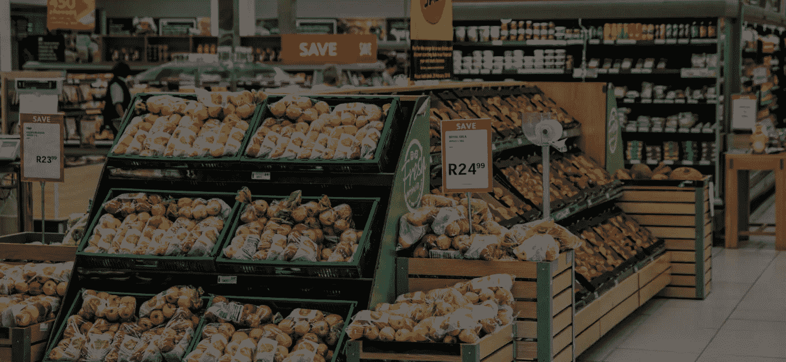
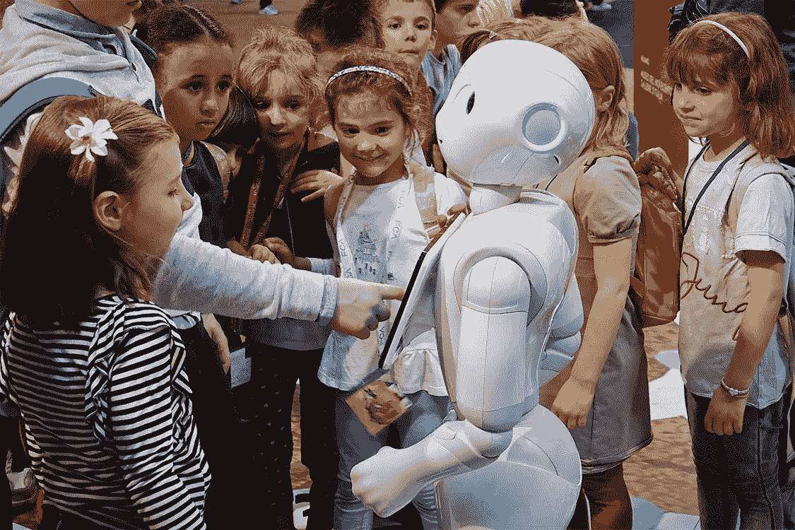
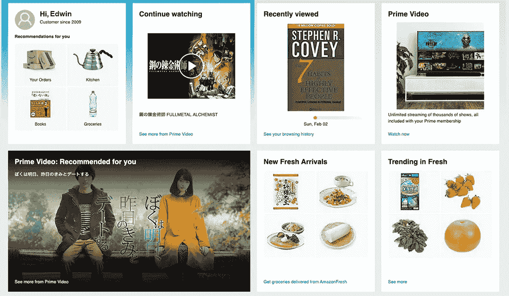

# 零售中的人工智能:6 项技术与应用

> 原文：<https://medium.datadriveninvestor.com/ai-in-retail-6-technologies-applications-f3baf6e7631?source=collection_archive---------10----------------------->

## 零售业中的人工智能提供了许多好处，但它是如何工作的呢？我们来看看零售自动化的例子以及推动零售自动化的技术。

随着零售商不断采用新策略来保持领先地位，许多公司正在将人工智能技术应用到他们的工作流程中。例如，我们现在可以通过零售机器人和 AI 购物系统在零售店看到 AI。它还在零售分析和仓库自动化领域扮演幕后角色。通过数据分析、机器学习和[质量培训数据](https://lionbridge.ai/articles/5-best-data-collection-companies-for-machine-learning-projects/)的混合，人工智能系统正在帮助零售商处理客户查询，提供更好的建议，并改善库存管理。

在这篇文章中，我们将看看人工智能在零售业中的一些流行示例，以及该技术在工作中的真实使用案例和实现技巧。我们还着眼于开发人工智能购物和零售自动化技术，这些技术可能会改变我们所知的行业。

 [## 认知计算——一套被广泛认为是……

### 作为它的用户，我们已经习惯了科技。这些天几乎没有什么是司空见惯的…

www.datadriveninvestor.com](https://www.datadriveninvestor.com/2020/02/19/cognitive-computing-a-skill-set-widely-considered-to-be-the-most-vital-manifestation-of-artificial-intelligence/) 

# 人工智能购物:自动结账

自动结账消除了传统结账体验的限制，提升了购物体验。让我们以 Amazon Go 便利店为例。顾客使用一个移动应用程序进入商店，剩下的事情很容易:拿起你需要的东西，然后离开。没有排队，也没有结账，因为商品扫描和支付过程是完全自动化的。

另一个零售自动化的显著例子是服装巨头优衣库，其自动结账不需要人员。顾客只需将购物篮放入扫描仪，付款，然后离开。这简化了顾客的购物流程，同时解放了员工，让他们可以在商场为顾客服务。

工作原理:自动收银台利用[计算机视觉技术](https://lionbridge.ai/services/image-annotation/)扫描和识别商店或收银台的商品。这些商品根据库存数据库进行确认，通过应用程序自动付款，或内置于结账流程中。为自动结账系统做准备需要一个为扫描目的而注释的商店库存数据库。这些项目的确切注释取决于您商店中摄像机的位置。

# 零售机器人

零售机器人越来越受欢迎，迄今为止最有趣的实现是商店助理。例如，机器人助手 Pepper 现在可以在日本各地的软银商店中找到。Pepper 回答基本的客户问题，同时与访客进行新奇有趣的对话。

类似地，家装零售商 Lowes 利用 Lowebot，它用多种语言回答问题，并引导客户找到他们想要的东西。通过使用计算机视觉，Lowebot 还可以监控库存，向员工反馈产品在整个商店的销售情况。

工作原理:与虚拟助理类似，零售机器人利用 ASR 技术来理解客户的查询。他们的语音识别系统将实时语音数字化为机器可读的形式，分析语音的含义，并根据之前的输入和预编程的算法做出响应。为了回答各种各样的问题，这些机器人需要大量的音频训练数据。更多关于驱动 Lowebot 的计算机视觉及其工作原理的信息，请参见我们的[综合指南](https://lionbridge.ai/articles/what-is-computer-vision/)。

# 搜索推荐系统

当谈到在线零售中的人工智能时，可用产品和服务的范围呈指数级增长。结果，许多客户现在面临着信息过载。出于这个原因，搜索推荐系统充当向导；它们是顾客寻找所需物品的必经之路。Youtube、网飞和 Spotify 都使用推荐系统，但这项技术在零售业也发挥着重要作用。

亚马逊的搜索推荐系统通常被视为黄金标准，因为据报道，他们的推荐引擎产生了 35%的收入。然而，零售商和电子商务网站如百思买、易趣和 Etsy 也利用推荐系统来帮助推动销售。这些建议采取多种形式，包括:

*   现场推荐
*   推荐相关商品
*   显示相似的购物者购买了什么
*   让用户知道是否有新版本的产品
*   根据过去的购买情况提供建议

工作原理:在基本层面上，搜索推荐系统基于客户类型的数据库工作。该系统通过定义的特征来比较用户，并在用户组中对产品进行排名。产品是根据受欢迎程度、价格等因素进行排名的。

当构建一个自动推荐系统时，在你的系统的数据方面有三点需要考虑:第一是确保高质量的数据收集，第二是确保高质量的数据标注，第三是[验证你的搜索引擎](https://lionbridge.ai/services/search-evaluation/)的准确性。

# 人工智能在零售业的未来

零售人工智能领域充满了实验，因为公司希望通过实施新技术来改善服务和利润。以下是一些自动化人工智能的例子，我们可能会在未来十年看到更多:

聊天机器人:与聊天机器人的互动是通过客户已经熟悉的通讯应用进行的。聊天机器人可以充当需要特定商品的顾客的购物助手，回答查询，并向常客推荐新产品或潮流商品。

视觉搜索:看到一件喜欢的 t 恤？如果你能给它拍张照片，然后这张照片把你带到一家可以买到它的商店，那会怎么样？简而言之，这就是视觉搜索。视觉搜索使用在图像数据集上训练的机器学习算法。每当用户拍摄照片并将其上传到视觉搜索引擎时，系统会在库中搜索与该照片匹配的任何项目以及相关细节，如品牌名称、价格等。

语音搜索:随着虚拟助手的激增，语音搜索正在稳步增长。一些消息来源称，多达 20%的移动搜索是通过这种方式完成的。语音搜索对于忙碌的人来说很方便，对于拥有活跃客户群的零售商来说也是一项不错的投资。

如果你想了解这些技术的早期应用以及它们是如何开发的，一定要看看我们对电子商务人工智能的深入研究。

# 从哪里开始

随着零售业的发展，自动化正迅速成为一种必需品。考虑到这一点，知道在哪里以及如何投资技术开发是非常重要的。然而，成功实施人工智能的关键始于以下三个步骤:

*   定义你的目标:你的 AI 自动化将解决什么问题？
*   定义你的数据:什么数据是必要的？你已经有了，还是需要收藏？
*   定义你的前进道路:你将如何标记数据，以确保你的机器学习模型的准确训练？谁将建立模型？它需要在多种语言中工作吗？

[原创文章](https://lionbridge.ai/articles/ai-in-retail-6-technologies-applications/)经许可转贴。

**访问专家视图—** [**订阅 DDI 英特尔**](https://datadriveninvestor.com/ddi-intel)