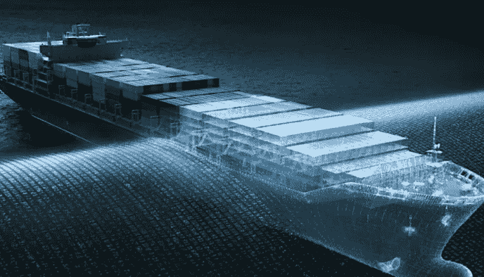

# 航运业中的人工智能

> 原文：<https://medium.datadriveninvestor.com/ai-in-the-shipping-industry-6b35a0cadb3f?source=collection_archive---------20----------------------->

正如我们所知，人工智能一直在重塑世界。不像我们在著名电影《终结者》中看到的那样(天网不会接管你的手机)，但它通过改善我们经常执行的流程，改变了我们的日常生活。航运业也是如此。人工智能已经实现了收集信息的物联网设备，人工智能可以从中学习、改进并做出自动决策。自动化可能是人工智能在航运中应用的最大和最有益的方式，因为它可以实现异常检测、减少浪费、改善质量控制和减少运输时间。物联网设备和人工智能的结合给质量控制、油耗和安全带来了前所未有的改善。

 [## 一名大学生使用语言生成人工智能工具创建了一个病毒式博客帖子|数据驱动…

### 作为作家，我们喜欢告诉自己，我们处在一个无法自动化的职业中，至少短期内不会。但是…

www.datadriveninvestor.com](https://www.datadriveninvestor.com/2020/09/15/a-college-student-used-a-language-generating-ai-tool-to-create-a-viral-blog-post/) 

人工智能如何帮助航运业的一个例子是它如何改善质量控制。通过在货物集装箱中安装摄像头和物联网设备，航运公司可以监控货物的环境，以防止损坏和变质。这在食品运输行业非常普遍。AI 监控从相机和物联网设备接收的关于温度、湿度、冲击(跌落)、光照甚至振动等数据点的数据。这不仅在运输开始和结束时，而且在运输过程中提供了更丰富的货物质量信息库。通过自动警报和解决方案建议，航运公司可以调整集装箱，以实时解决问题，防止货物浪费或变质。

人工智能还允许航运公司管理他们的燃料消耗，并利用最有效的航运路线。对燃料使用情况的准确监控有助于降低燃料消耗，并通过减少排放带来环保效益。人工智能还被用于改善航运公司的物理航线。基于天气模式的历史数据，如水流和风流、通过特定区域和港口的交通；航运公司可以利用所有这些信息来规划路线，以减少燃料消耗和旅行时间。

最后，人工智能可以通过监控船舶系统和船舶周围的环境来提高安全性。一个例子是由科技公司 SenseTime 和日本航运公司三井 OSK 航运公司(Mitsui Japan Lines)开发的船舶图像识别系统。他们正在开发一种图像识别系统，以识别周围地区的船只并监控航道。这使得海湾内的运输，从进港到出港，更加安全，不仅对你的船，对周围的船也是如此。

更便宜和更快的计算能力的出现，加上人工智能模型的准确性和效率的提高，给航运业带来了很多改善。减少浪费、高效的燃油消耗和改进的安全功能只是航运业在现在和未来变得更快、更安全和更高效的几个途径。

关于作者:乔希·米拉曼特，蓝橙数码公司首席执行官，[新闻工具包和简历](https://blueorange.digital/josh-miramant-presskit/)

图片来源:英特尔

## 获得专家视图— [订阅 DDI 英特尔](https://datadriveninvestor.com/ddi-intel)