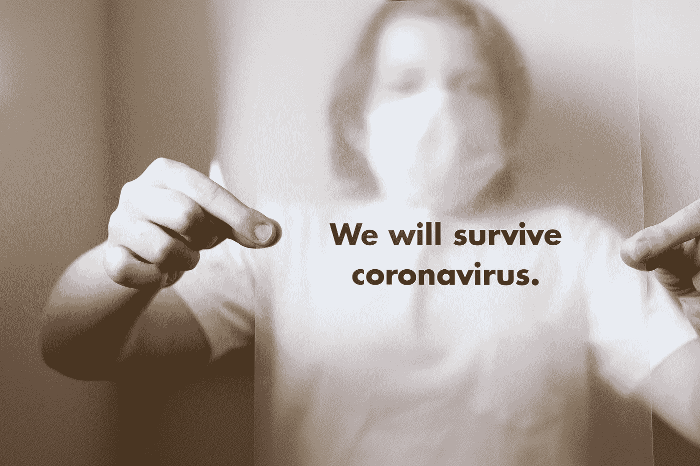

# 在冠状病毒期间人工智能是如何被使用的

> 原文：<https://medium.datadriveninvestor.com/ai-in-the-times-of-covid19-33c688306bfd?source=collection_archive---------5----------------------->

## 以伦理和以人为中心的方式使用人工智能的双重性

在 2020 年的危机和灾难管理时代，人工智能等创新技术是如何支撑的？

现实世界中有许多机器学习帮助诊断新冠肺炎感染、预测病毒的起源和传播或加快药物研究的例子。然而，在许多胜利中，在这个关键的决策时期，使用人工智能和进行实验存在犹豫和心理障碍。

第二，在这次疫情中人工智能的使用是道德的和有意识的吗？我们是否匿名化了数据，限制了个人信息的收集，维护了个人的隐私权，并消除了等式中的偏见？

本文将简要概述人工智能的使用案例，以帮助应对疫情带来的挑战，以及在负责任地使用这项技术造福公众的同时减少不同地区公民的隐私担忧时需要记住的关键因素。

# 在新冠肺炎期间利用人工智能和数据

人工智能主要可用于 3 种类型的用例——自动化、检测、预测/预报。

在这场全球健康危机中，人工智能可以用来应对挑战的几种方式:

*   简明、深刻、有背景的见解(来自对各种大型动态数据集的文本分析)；垃圾邮件检测/假新闻检测
*   新型病毒传播的预测和模式检测
*   公共场所人体体温的自动测量
*   通过胸部 x 光扫描诊断新冠肺炎感染
*   前线的机器人
*   加快药物研究
*   确定哪些患者需要住院治疗

让我们详细了解这些用例中的每一个！

 [## 艾预测:“颠覆，然后是生产力”|数据驱动的投资者

### 人们越来越担心，随着机器学习和互联网的普及，所有白领工作都将消失

www.datadriveninvestor.com](https://www.datadriveninvestor.com/2018/08/06/ai-forecast-disruption-then-productivity/) 

# 检测、分析和洞察

首先，人工智能可以用于对新闻、博客、论坛、互联网上与疫情及其他地区相关的所有内容(客户行为、受影响的行业等)进行上下文化的文本分析。)，为不同的用例提供上下文化的见解，或者在许多情况下还可以发现假新闻、垃圾邮件或非法内容。

AI 还可以发现许多不同数据点之间的重要相关性，例如已确定的病例和居住在受病毒影响最严重地区的人们的移动模式。

全球许多公司和研究人员都在使用这种文本分析和模式检测，以便在一个地方获得唯一(非冗余)信息的最准确图像。

Palantir 是硅谷最受欢迎的数据情报公司，它正在向 CDC 和 NHS 提供[新冠肺炎跟踪软件](https://techcrunch.com/2020/04/01/palantir-coronavirus-cdc-nhs-gotham-foundry/)，以整合、清理和协调分散的数据，从而开发支持决策的单一真实来源。

# **预测&模式检测**

蓝点是一家加拿大公司，它拥有一个人工智能平台，可以跟踪世界各地的传染病。他们是 2019 年 12 月第一家在中国武汉一个市场发现一系列“异常肺炎”病例的公司。

人工智能会查看卫生组织的声明、商业航班、牲畜健康报告、卫星气候数据和新闻报道，以检测模式并预测传染病在全球的潜在传播，并通知相关卫生部门。

# 自动化

中国科技巨头百度开发的一个人工智能系统使用配备计算机视觉和红外传感器的摄像头来预测人们在公共场所的温度。

这种技术对于以自动化方式指数级扩展您的运营至关重要，而不是仅仅依赖手动干预和分析。

# 分析和诊断

中国科技巨头阿里巴巴开发了一种人工智能系统，可以在胸部 ct 扫描中[检测冠状病毒](https://asia.nikkei.com/Spotlight/Coronavirus/Alibaba-says-AI-can-identify-coronavirus-infections-with-96-accuracy)。

人工智能根据 5000 例冠状病毒病例的数据进行了训练，可以在 20 秒内完成测试，而人类专家诊断患者需要 15 分钟。

还能区分冠状病毒和普通病毒性肺炎。据报道，中国有 100 家医院采用了该系统。

# **计算机视觉&自动化**

中国公司正在使用无人机和机器人进行无接触交付，并在公共场所喷洒消毒剂，以最大限度地降低交叉感染的风险。其他机器人正在检查人们的发烧和其他新冠肺炎症状，并分发免费的洗手液泡沫和凝胶。

在医院里，机器人给病人送食物和药品，给他们的房间消毒，这样就不需要护士在场了。其他机器人在无人监督的情况下忙着煮饭，减少了运营工厂所需的员工数量。

在西雅图，医生使用机器人与患者进行远程交流和治疗，以最大限度地减少医务人员与感染者的接触。

# **识别&分析**

## **药物研究**

2014 年被谷歌收购的人工智能研究实验室 DeepMind 最近宣布，它已经利用深度学习找到了与新冠肺炎相关的蛋白质结构的新信息。

这有助于更多地了解这种新型病毒，并加快药物研究。

## 确定哪些患者需要住院治疗

人工智能还可以帮助识别哪些病人需要住院治疗，哪些病人可以采取更温和的行动。

目前最困难的临床挑战之一是了解哪个病人在家可以做得很好，以及哪个病人不管提供什么治疗都可能活不下来。

人工智能可以帮助识别社区中处于严重疾病风险中的未感染个体。卫生保健组织可以建议这些人采取完全的自我隔离预防措施。

其中一种算法研究了 200 万名患者的数据，以确定数千个因素中的哪一个会增加获得感染的风险，导致最终器官损伤，如呼吸衰竭。与其他关于冠状病毒的研究一样，这些发现表明老年和慢性疾病是预后不良的主要风险因素。

但机器学习算法也能够找出社会风险因素，包括长时间通勤，住在大学宿舍等密集的住宅区，参加公共活动和亲自购物。

人工智能还有数百个其他的用例——它们都需要数据来分析、预测、预测和自动化，这就引出了我的下一个观点——

# 负责任地使用人工智能

我们知道人工智能有巨大的积极力量和潜力。它可以帮助那些卷入这场战斗的人减缓这种令人衰弱的疾病的传播。它可以帮助拯救生命。

但我们必须保持警惕，并致力于安全、道德和负责任地使用人工智能——关注合规性和商业规范的系统性转变。至关重要的是，即使在这场危机中，我们仍然对人工智能的双重性保持良知，并努力促进人工智能的发展。

现在，世界各地的政府都在要求特别的新监控权力来对抗病毒。因此，我们需要密切关注疫情时期政府和私营企业之间正在形成的新关系。

*   **数据匿名化&聚合** —为政府提供跟踪大型群体活动的能力，同时最大限度地降低侵犯数据隐私权的风险。
    这是公司正在采取的最基本的预防措施，也是应该采取的措施，以便在为了公共利益使用人工智能和数据与保护个人隐私之间取得平衡。
*   **有限的个人信息收集—** 通过窃听人们的电话和医疗记录，研究人员和公共卫生当局希望更迅速地识别和隔离潜在的感染患者。
    但是，在最近进行的许多调查之一中，人们愿意在这种环境中为了安全而放弃隐私。
    人们愿意使用症状检查器，而且大多数人无疑会支持与公共卫生机构分享他们的匿名 PII(个人身份信息)来抗击新冠肺炎。
    然而，作为公司和组织，我们需要谨慎对待我们收集的信息种类和用途。
    我们需要能够保护我们收集的信息，并同意不将这些数据用于商业目的。
*   **知识共享&透明度** —机构和实体必须相互合作，并与社区中的其他关键利益相关方合作，包括公众和民间社会组织。
    应共享人工智能用例、数据和见解，并提高透明度。
*   **出于特定目的的独家使用** —为追踪冠状病毒传播而收集和处理的个人数据不应再用于其他目的，尤其是商业目的。
    国家当局应寻求确保大量个人和医疗数据仅用于公共卫生目的。
*   **维护个人隐私和不受歧视的权利** —如果一家公司或组织有能力准确(或可能不准确)预测你更有可能被感染或已经被感染，因此需要自我隔离；我们可能会遇到隐私泄露甚至歧视感染者的情况。
    因此，政府需要确保在通过这些应用程序和软件识别某人时采取适当的预防措施，并确保人们仍然可以获得他们的自由和权利。

我有两个公司/组织的例子，它们试图创建以人为中心的框架来保护用户隐私，同时试图将数据用于公共利益。

苹果公司表示，它只收集人们如何使用其筛选工具的信息，而不是他们提供的答案，这些信息不会识别他们的身份。显然，苹果将保留从其筛选工具收集的信息，直到完成其项目，而不会将其用于广告。

同样，**麻省理工学院**与脸书大学、梅奥诊所和其他组织合作，开发了一款应用程序，使用一种被称为差分隐私的技术来收集信息，这是一种公开共享从数据集收集的信息的方式，无需识别该数据集中所代表的个人活动。

# 前进

我们看到了人工智能如何通过医疗保健、研究、政府和公共卫生领域的目标用例来帮助抗击冠状病毒。然而，这条路仍在建设中——

## 药物研发领域排名第一的人工智能+数据挖掘技术

AI 无法独自将我们从疫情手中拯救出来。药物研发人员认为—

> "使用实验系统的产品，从零开始花费宝贵的时间和经费是有风险的."

相反，人工智能可以补充其他数据挖掘技术，帮助筛选这些过载的信息，并发现那些令人鼓舞的趋势。
因此，是的，人工智能可以在一定程度上用于分析和自动化，但它仍需在具体的用例中发挥潜力，如药物发现。

## #2 重新思考数据的存储和共享方式；公平和透明

这个疫情还可以帮助我们重新思考数据是如何存储和共享的，我们需要采取哪些措施来实现隐私和价值之间的平衡。

将采取强有力的措施来帮助解决在我们的日常工作流程中使用人工智能所带来的公平性、透明度和可解释性挑战，并解决切实的客户挑战。

## #3 人工智能是新的标准

毫无疑问，人工智能将成为新规范的一部分——无论是帮助我们自动订购食品杂货、进行自我检查还是通过算法进行诊断、为我们的财务或商业场景规划提供建议。

> AI 会在那里。这只是开始。