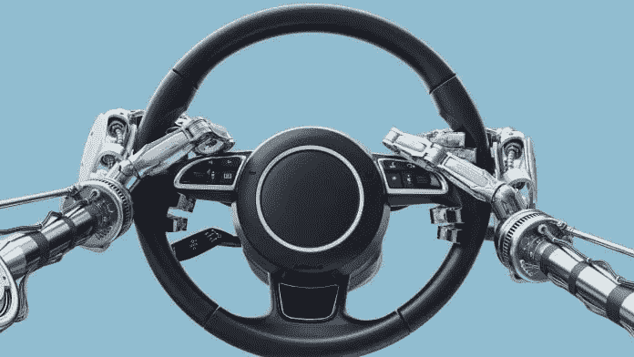

# 交通运输中的人工智能:商业机会概述

> 原文：<https://medium.datadriveninvestor.com/ai-in-transportation-business-opportunities-overview-b235aa0e8de2?source=collection_archive---------12----------------------->

source: [https://www.governmenteuropa.eu/wp-content/uploads/2019/01/iStock-Menno-van-Dijk-696x392.jpg](https://www.governmenteuropa.eu/wp-content/uploads/2019/01/iStock-Menno-van-Dijk-696x392.jpg)

人工智能和交通从一开始就看起来是一个有益的结合。

*   一个是创建一个从 A 地到 B 地高效移动的框架；
*   另一个是所有关于带来秩序和自动化工作流程的关键方面。

在这一点上，交通运输中的人工智能已经从一个遥远的开发商品的可能性发展到证明自己是可行的。

*   自动驾驶汽车、交通管理、各种交通服务——每一项都展示了人工智能在交通领域的未来。

在这篇文章中，我将描述交通领域的几个重大人工智能技术机会。

# 交通领域的 AI 如何解决商业挑战？

## 1 车辆监控—道路安全

道路安全是运输业最敏感的话题之一。这也是人工智能在交通领域的优势显而易见的一个领域。

事情是这样的——交通控制是人工智能在交通领域应用的最大赢家之一。AI 提供交通工具，让人们在路上保持安全，防止交通变得危险。

每个国家都有许多严格的规定，详细描述了违反安全要求的后果。从轻微闯红灯过马路的罚款到故意杀人的起诉。

虽然人为错误是道路事故最常见的原因，但车辆的机械故障是巨大的促成因素。

交通运输中的人工智能如何帮助减轻汽车机械故障的威胁以及随之而来的悲剧？两个词——预测分析。它是这样工作的。

 [## 人工智能与创造力:梦想成真|数据驱动的投资者

### 人工智能总是让我着迷。不仅作为一套有用的工具，不断发展，而且作为一个…

www.datadriveninvestor.com](https://www.datadriveninvestor.com/2019/01/28/ai-creativity-deep-dream-comes-true/) 

随着交通行业对人工智能的采用越来越多，可用的数据比以往任何时候都多。通过在运输软件中实施机器学习，它为利用丰富的数据来改进和完善现有系统开辟了一种可能性。

在这方面，人工智能在交通领域最重要的道路安全相关应用是车辆监控系统。事情是这样的——现代车辆有许多不同的传感器用于各种各样的事情。

车辆中添加的边缘分析人工智能传感器为系统分析提供了各种数据源。该列表包括发动机、轮胎、车轮、灯等。

这种传感器可以通过将输入数据与训练机器学习模型的基准数据进行比较，来评估车辆每个部件的状态。

发动机监控系统很好地展示了该系统的工作原理，简而言之:

*   新发动机和旧发动机听起来完全不同。
*   边缘计算传感器以流模式捕获引擎声音，以便分析模型分解。
*   声音被识别并放入上下文中。比如发动机挂档、超速、减速、左转等等。
*   同时，异常检测算法梳理数据，如果发现异常，它会将样本发送到主机进行进一步评估。
*   将异常位与发动机声音异常数据库进行比较，这有助于识别问题的可能来源和潜在后果。
*   结果返回到车辆。用户会收到关于该问题的通知。

这种方法不能代替实际的车辆检查，但它可以作为一个早期预警系统。这给了一个防止事故发生的机会，这是最重要的。

# 2 自驾车定制

像特斯拉这样的自动驾驶汽车和亚马逊 Prime Air 这样的送货无人机可能是过去几年人工智能在交通领域成功故事中最突出的例子。

这是一个很好的展示，展示了人工智能在交通运输方面的最佳能力——关键例程的高效自动化。

虽然这项技术在业务可用性和运营效率方面还有很长的路要走，但它显示出足够的前景，可以确保它正朝着正确的方向前进。因此，每种解决方案都使其更接近细分市场的采用。

在商业机会方面，AI 在交通领域最显著的应用是自主场景的定制或个性化。

意思是这样的。当任务定义明确时，交通运输中的机器学习工作得很好。

因此，人工智能在运输服务中有许多用途，如出租车或货运卡车，它们有非常独特的操作模式。组织的结构化方式可以作为定制过程自动化的基础。

*   在自动出租车的情况下，该解决方案表现为常规场景的组合，如等待下一次预订时的待机模式驾驶，以及预订请求和路线规划的定制。车辆可以根据收到的交通报告和有关预订需求的内部分析来调整其路线。
*   货物运输用例更简单，因为它要求从 A 到 B 的移动与其余自动驾驶功能捆绑在一起。
*   另一方面，有一个消费级自动驾驶汽车可定制框架的整个利基。例如，一个家庭可以对自动驾驶汽车进行编程，在预定的时间开车送孩子去学校，然后在当天晚些时候再来。类似地，人们可以设计一个定制的往返工作场所的通勤计划。

在每种情况下，都有机会为自动驾驶汽车提供一个可访问的界面，以简化路线和日常建设。

在运输服务中实施人工智能的主要好处是简化框架，增加其可用性。这一因素将有助于增加对这种服务的需求。

像优步和 Lyft 这样的出租车服务目前正在交通解决方案中测试机器学习的不同方面。优步穿梭巴士目前正在尝试自动出租车服务，客户可以为定期通勤预订连续路线。

# 3 自动化交通管理

交通拥堵是一种永远不会完全消失的交通挑战。但人工智能在交通管理中的应用可以减轻和最小化交通堵塞和事故的任何影响。

随着城市人口的增长和高峰时段交通的加剧，需要一种有效的管理解决方案。在这种情况下，在交通控制中使用 ai 可以帮助监控事物的状态，并为决策提供足够的信息。

这一事实为交通管理软件和人工智能在交通控制中的实施提供了巨大的商机。

许多摄像头和传感器收集了大量不同的数据，这些数据与道路上的交通状况有关。这些数据是机器学习模型的宝库。也是交通运输中人工智能的可行展示。

你可以用它来研究和管理很多事情:

*   该地区的交通密度；
*   司机和行人违反交通规则的行为；
*   事故检测和随后的自动紧急呼叫。

在这种情况下，人工智能在交通控制中的好处是为官员和交通中的人提供更多关于交通的信息和更高的决策灵活性。

以下是人工智能在交通解决方案中的应用:

*   在很大程度上，交通管理解决方案中的人工智能围绕着对象检测系统，该系统捕捉并分析特定路段的事件。
*   这些数据传输到云数据湖，在那里模式识别算法从不同的点收集大图片。
*   同时，它提供了对特定情况的严重性和可能的解决方法(如重定向流量、拨打 911 等)的见解。

挑战在于在一个内聚的云环境中将系统组件联系在一起。有许多数据点分散在各处。同时，还需要实时分析。

*   解决方案是为流量数据安排一个数据湖。
*   来自边缘传感器的输入数据进入位于本地云上的系统。
*   这些云存储单元使用虚拟化来创建统一的环境。
*   输入的流数据经历所需的处理操作。
*   数据可视化软件(如 Tableau 和 Google Data Studio)以可访问的形式呈现提取的洞察和流数据。

另一方面，交通管理系统可以很容易地输入到网络或移动应用程序中，以便司机或通勤者能够看到道路上正在发生的事情，并更有效地规划他们的路线。他们可以接收关于近期交通预测的通知、关于交通事故的警报等等。

这种系统最近在伦敦(以高峰时间的交通堵塞而闻名)进行了测试。该解决方案增加了对不同时期交通堵塞严重程度的了解。除此之外，该系统有助于协调通勤工作区，减轻城市道路的负荷。

# 最后

人工智能在交通技术领域的前景一片光明。随着越来越多的初创公司加入进来，交通行业的人工智能目前正在兴起。这项技术是多用途的，涵盖了智能交通系统的不同方面。

然而，要做好这件事，仍然需要一双可靠的手，能够实现解决方案，并创造一个让它茁壮成长的环境。