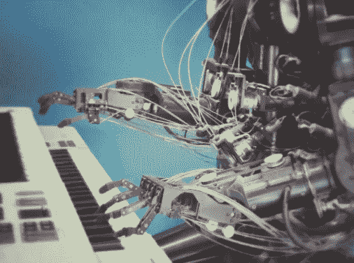
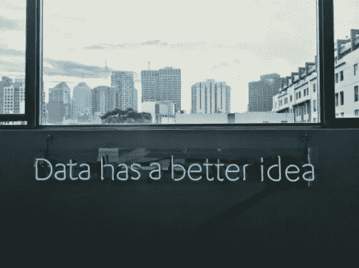

# 人工智能现在是我们人类生存的一个必要部分

> 原文：<https://medium.datadriveninvestor.com/ai-is-a-necessary-co-evolutionary-product-c621cbcd4ef4?source=collection_archive---------9----------------------->

## 一旦你认识到我们的社会是多么认知受损…

Photo by Franck V. of Unsplash

我最近看了布莱恩·约翰逊的一次采访，对于那些不熟悉他职业的人来说，他是一个致力于做出我们大多数人还没有看到需要的改变的人。约翰逊将他的成年生活致力于揭示我们日常决策中的“为什么”,并强调了今天的进步与我们迈向遥远未来的能力之间的脱节，特别是当它涉及到人工智能的使用时。

 [## 挑战你对人工智能和社会看法的 4 本书|数据驱动的投资者

### 深度学习、像人类一样思考的机器人、人工智能、神经网络——这些技术引发了…

www.datadriveninvestor.com](https://www.datadriveninvestor.com/2019/02/28/4-books-on-ai/) 

一旦你明白了我们的认知能力并不等同于我们所面临的挑战，你就开始想知道我们将如何让自己达到那一点。对于那些剥去技术和人工智能外衣的人来说，很明显，我们的未来将不需要我们现在的形式，除非我们今天就做些什么。

在 Bryan 的采访中，他专注于社交媒体——具体来说是脸书——并深入研究了他们算法中存在的“矩阵”。最有趣的一点是关于我们如此随意地通过我们的习惯给予脸书的数据。随着时间的推移，社交媒体将能够收集足够多的关于我们每个人的数据，从本质上来说，他们甚至比我们重要的其他人更了解我们。我们向他们提供的数据越多(姓名、年龄、兴趣、生日、教育背景、状态更新、图片帖子等)，背后的算法就越能最终建立一个 *你*的*头像。这个想法令人担忧的部分是，一旦这种情况发生，AI 有能力在第一个的*分钟*内创造一个甚至*更好的*版本的你。因此，对于我们这些在社交媒体上继续免费提供这些数据的人来说，我们正在延续我们在这个算法“矩阵”中度过的生命。*

Photo by Franki Chamaki of Unsplash

我们中的许多人都可以联想到在谷歌搜索中不由自主地出现在屏幕上的广告，这些广告与我们的互联网浏览模式几乎惊人地一致。我敢说，凭借其规律性和准确性，面部识别被用来做同样的事情只是时间问题。例如，一个愁眉苦脸的人收到广告，宣传改善情绪的方法。

## 那么，我们如何开始打破这些障碍，并与人工智能的未来保持一致呢？

这个过程始于布莱恩所说的“假设叠加”。这些是我们很少质疑的信息，却总是被认为是“正确的”约翰逊在他的内容中使用的一个例子是一个房间里有 5 只猴子。梯子顶端有一篮子香蕉，每次猴子试图爬上去拿香蕉时，都会被冷水淋到。随着时间的推移，猴子发展出一种习得性行为，它们不想爬上梯子，因为害怕被冷水喷到。最终，一只新的猴子会被送进来，所有其他的猴子会从身体上阻止它向香蕉移动。直到一只猴子问:“为什么？”这种情况下的假设堆栈已解决。

 [## 你离下一个突破只有 90 秒了

### 但是有一件事阻碍了你。

medium.com](https://medium.com/@madisonepting/youre-only-90-seconds-away-from-you-re-next-breakthrough-9fa51fb4c00c) 

这同样适用于我们在生活中习得的每一种行为。你们中许多有孩子的人会承认自己是这样或那样的父母；你要么是保护和阻止的父母，要么是在生活的教训面前选择不去缓和打击的父母。约翰逊举了一个例子，他的小女儿和她的朋友走向一个移动的旋转木马，他们伸出手臂去够旋转木马。在我们成年人看来，我们知道一个体重较轻的孩子抓住正在移动的重型设备可能不是最好的主意，但在那一刻，布莱恩有两个选择。另一个孩子的母亲迅速跑向她的女儿，在她有机会接触之前，将她从游乐设施上拉开。另一方面，约翰逊选择让他的女儿自己走上前去解决问题。他惊喜地看到，他的女儿小心翼翼地擦着金属杆，然后意识到她不应该抓住，而是拉开了。

虽然约翰逊承认他可能被视为一个轻率的家长，但他坚持自己的决定，很明显，在那一刻，她有能力自己学习。(尽管在其他情况下，这不应该是决策的方向)。

> 问这个问题“为什么？”这是唯一的方法来开始推倒学习行为的围墙，直到你不能再问这个问题，而是开始相信，“我可以做到这一点。”

这个例子展示了我们自己思考问题的能力，尽管是后天习得的行为。如果约翰逊把他的女儿从旋转木马上拉开，而她从来没有问过这个问题:“为什么？”很可能她会继续将所有旋转木马与危险联系在一起，而不是在采取某些预防措施时变得平易近人。

让我们再举一个例子:你想创业，但在某处读到 90%的企业在运营的第一年就失败了。你拿着这个统计数据，把自己放在大多数人的位置上，作为“如果”委员会的一员继续你的生活。假设你对它进行了更多的思考，甚至求助于一个同事，请他或她提供意见，假设这个同事的生活中有一个人走上了这条路，但他们的业务却分崩离析了。然后那个人用这段历史作为他们建议的催化剂，并告诉你你害怕和认为它可能会失败是对的。在那之后，我们中有多少人会继续问“为什么”？现在，让我们考虑你*做*采取“假设堆栈”的方法，选择质疑他们的立场。下面是对对话的一个修正:

你:“嘿，我一直在想开一家自己的公司。我知道这很辛苦，但我真的很想去。大多数企业都失败了，这让我很害怕。”

他们:“是的，我完全理解你的想法。我的朋友不久前辞去了工作开始做生意，现在她和她的丈夫很难维持生计。我认为他们不得不在大约 3 个月内关门，现在只有债务可以证明。”

你:*“哦，伙计，是的，这正是我所害怕的。你知道为什么他们的生意失败了吗？”*

他们:*“是的，我认为这对他们的经济来说太多了。”*

你:*“这个我能理解。为什么你认为这对他们的经济负担太重了？”*

他们:*“哦，她完全低估了所需的前期成本。”*

你:*“她为什么不推迟他们开业，直到她有更多的资金？”*

他们:*“她做事有点不按顺序。她事先没有做太多的预算规划，而是等到已经签了实体场所的租约后，才开始雇人帮她建网站。*

因此，从这段修改后的对话中可以看出，如果她的朋友*有现金流，并且更好地理解什么事情需要在别人之前发生，她可能会有不同的商业经历。这并不意味着你会犯同样的错误，但是你之前的假设现在变得非常有价值，因为你现在知道了原因。*

T 这就是我们和 AI 的区别。人工智能旨在以一种有助于我们进步的方式与我们共存，并使某些思维过程成为可能。作为人类，我们无法实现人工智能可以达到的可预测性水平。事实上，即使仅仅承认能够理解认知如何损害我们的社会也是一种启蒙。

约翰逊分享了他的女朋友如何使用人工智能来帮助她写音乐，并解释了为什么她再也不会回到人类音乐家身边。为什么？因为算法产生的节拍和旋律与我们人类大脑产生的任何东西都大不相同，因为我们只是没有深入到那些地方。

 [## 如果你不先花时间做这些事情，你将永远不会成为一名领导者

### 并不总是成为房间里最强壮、最勇敢、最聪明的人。

medium.com](https://medium.com/swlh/youll-never-become-a-leader-if-you-don-t-take-the-time-to-do-these-things-first-103a0e30f0f6) 

作为人类，我们有太多的偏见——准确地说，即使没有几千个，也有几百个。这些偏差从确认偏差到熟悉偏差不等。确认偏差是指我们朝着与我们的信仰体系一致的方向前进，而熟悉偏差是指我们倾向于局限于我们感觉熟悉的事物。这些偏见的问题是，它们很少鼓励我们打破我们存在的障碍，并开始探索还有什么。

与人工智能共存的关键将是理解缺乏限制和我们为自己创造的限制，例如我们的偏见和假设。一旦我们能够让自己拥有“一切都值得被质疑”的心态，我们将开始发现在我们之前没有其他人认为必要的信息，以便让我们的生活像我们创造的人工智能一样有价值。