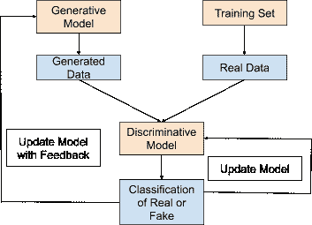
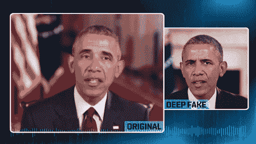
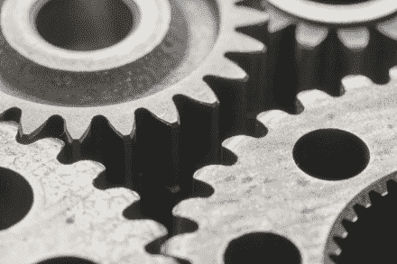

# 人工智能助长了错误信息的蔓延

> 原文：<https://medium.datadriveninvestor.com/ai-is-fuelling-the-wildfire-of-misinformation-b04e9956d3c1?source=collection_archive---------13----------------------->

错误信息席卷了整个世界，因为它就在我们身边。它的形式是充满假新闻的帖子，经过编辑的图片，描绘了与他们最初意图不同的含义，现在，甚至是使用人工智能(AI)创建的假视频。所有这些虚假数据都可以使用人工智能来创建，特别是通过使用生成性对抗网络(GANs) 。gan 已经被用来生成大量的虚假内容，例如创建类似莎士比亚作品的文字，以及基于照片生成字幕。

 [## 今年值得关注的 5 大人工智能趋势|数据驱动的投资者

### 预计 2019 年人工智能将取得广泛的重大进展。从谷歌搜索到处理复杂的工作，如…

www.datadriveninvestor.com](https://www.datadriveninvestor.com/2019/02/19/artificial-intelligence-trends-to-watch-this-year/) 

不过最受关注的肯定是假视频的产生，也就是所谓的深度假货。这篇文章将提供一个 GANs 如何工作的细目分类，更深入地研究深层的假货，以及与它们有关的一些危险。

# 生成模型——蜘蛛编织谎言之网

GANs 由两种不同的神经网络组成，即生成模型和判别模型。

**生成模型是生成虚假数据的神经网络。**为了做到这一点，它输入了大量的训练数据，并使用强化学习方法来训练模型。如果判别模型不能辨别真实数据和生成数据之间的差异，则生成模型被“奖励”。模型的训练也着重于模型中的弱点。例如，如果模型正在被训练识别手写数字，但它无法区分 1 和 7，那么模型将只专注于尝试识别这两个数字之间的差异。

**该模型试图根据从训练集中获得的知识生成新数据，并试图改进其生成方法，直到生成的数据与真实数据无法区分。**

# 辨别模型——识别真相和谎言之间的差异

**判别模型试图区分真实数据和生成模型生成的虚假数据。**例如，如果 GAN 正在被训练以类似于莎士比亚的写作风格写作，则辨别模型将试图辨别莎士比亚实际写的剧本和生成模型编造的剧本之间的差异。就像生成模型一样，判别模型通过监督学习方法来训练。**为了区分真实和虚构，该模型估计生成模型提供的数据是否来自包含真实数据的训练数据集，或者是否是生成的。**一旦模型做出估计，它会输出一个介于 0 和 1 之间的数字，以传达给它的数据是真的还是假的。

判别模型和生成模型具有共生关系，这使得生成的数据变得越来越真实。判别模型向生成模型提供关于如何创建更真实的数据的反馈，并且随着生成模型的改进，判别模型也在发现真实和虚假数据之间的差异方面有所改进。

# 深度造假——用假数据越界？

如前所述，GANs 可用于创建假视频，称为深度假货。**深度假货修改/制作视频内容，描绘从未发生过的事情。**例如，华盛顿大学的研究人员制作了一个深度假货，展示一个几十年前奥巴马演讲的假货。现在，任何音频都可以映射到奥巴马的深度假版本，看起来就像视觉上的真实。下图显示的是合成版的奥巴马和真实的他并排在一起。他们是如此的相似，难道不令人不安吗？

# 生成深度假货的逐步指南:

1.  生成模型被给予与期望输出相似的视频训练集。例如，为了创建巴拉克·奥巴马的深度假像，使用了 14 小时的镜头，以便生成模型可以学习模仿前总统的嘴部运动。
2.  生成模型创建了许多虚假的视频剪辑。
3.  一旦制造出高质量的输出，创成式模型就开始向判别模型提供剪辑。
4.  判别模型确定剪辑是否真实。
5.  每当判别模型能够识别出假剪辑时，它就向生成模型提供关于如何改进未来剪辑以使它们看起来更真实的反馈。

# 关键要点

*   GANs 可用于生成多种类型的虚假数据。
*   GANs 由两个神经网络组成，即生成模型和判别模型。
*   生成模型生成虚假数据。
*   判别模型决定由生成模型生成的图像是真的还是假的。
*   判别模型向生成模型提供关于如何创建更真实的数据的反馈。
*   深度假货修改/制作视频内容来描绘从未发生过的事情。

由 GANs 生成的数据可能很难发现，尤其是深度伪造的数据。深度假货已经在脸书和 Twitter 等社交媒体平台上传播，并证明了它们通过助长假新闻的传播而带来的危害。有些人甚至声称，深度伪造将是民主的终结，因为虚假的政治声明可以用这种技术来上演，从而对政治运动造成毁灭性的打击。请在下面留下你对深度假货和一般 GANs 的看法。你认为 GANs 产生的数据只会有害还是对这项技术也有好处？