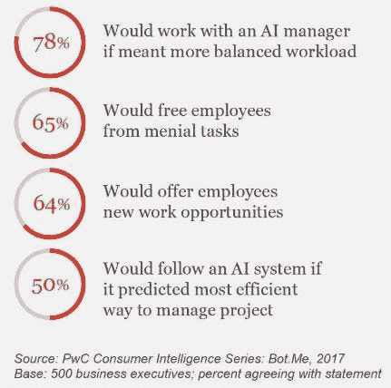
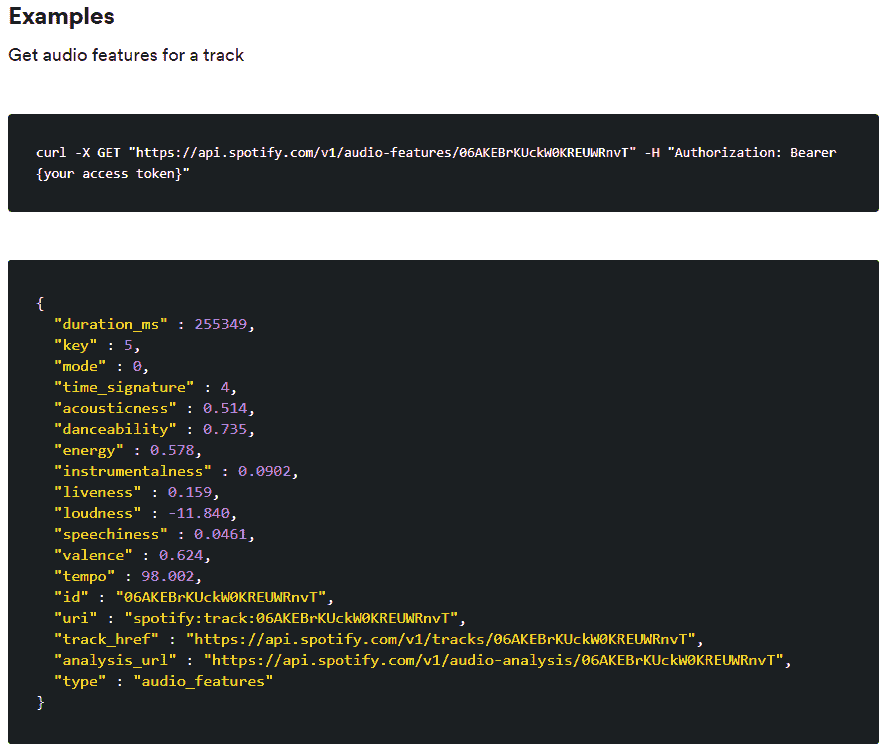
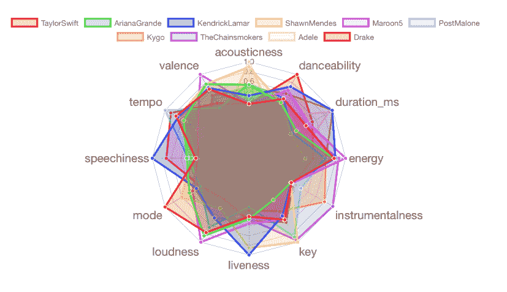
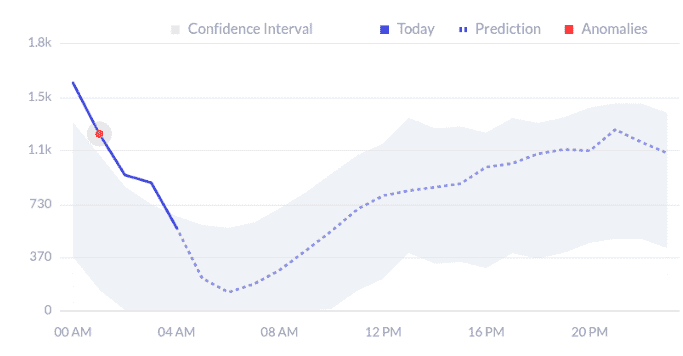
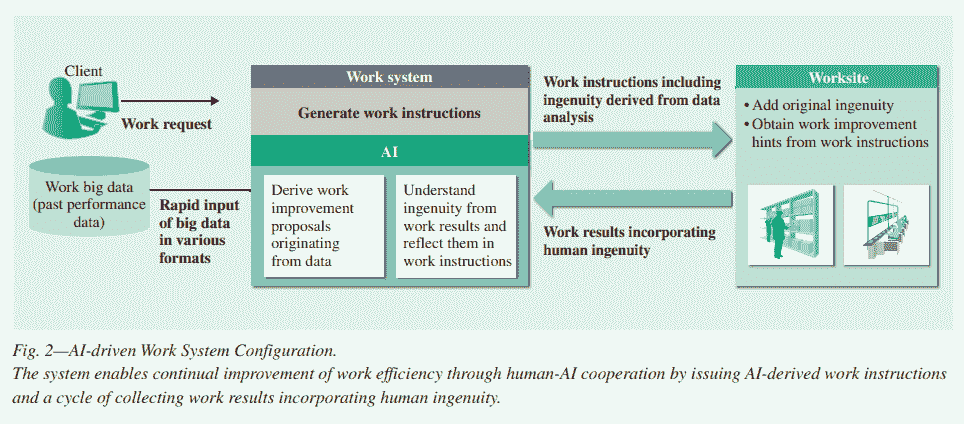

# 人工智能正在改变公司的生产力——下面是方法

> 原文：<https://medium.datadriveninvestor.com/ai-is-transforming-companies-productivity-heres-how-50078a252e89?source=collection_archive---------10----------------------->

在减少开销的同时增加产量是游戏的名字。毕竟大部分公司都想提高生产力，节约成本，对吧？这通常是通过改善工作环境、提供激励和削减不必要的流程来实现的。

但是，如果有一种不干涉的方式来做所有这些事情，我在这里告诉你这是可能的。而且，这都是拜 AI 生产力所赐。

 [## 今年值得关注的 5 大人工智能趋势|数据驱动的投资者

### 预计 2019 年人工智能将取得广泛的重大进展。从谷歌搜索到处理复杂的工作，如…

www.datadriveninvestor.com](https://www.datadriveninvestor.com/2019/02/19/artificial-intelligence-trends-to-watch-this-year/) 

事实上，普华永道对 500 名高管进行的一项调查得出结论，65%的受访者认为人工智能将把员工从琐碎的工作中解放出来。

AI 也不是你在电影里看到的；一个栩栩如生的机器人在办公桌旁为你服务。相反，它是一个自动化的助手，在您的业务后台默默运行。

它可以处理优化、预测和其他最好留给计算机的任务——让你专注于自己作为营销人员的优势。

以下是人工智能帮助企业更聪明地工作的四种方式，而不是更努力。

# 1.预测分析和预测

如果有人说营销中没有水晶球，[他们从未使用过预测分析](https://morphio.ai/blog/blog/5-real-examples-of-predictive-analytics-in-marketing)。它是使用人工智能来发现关于营销、广告、财务和其他活动的预测的实践。

预测分析结合了数据、统计和机器学习来持续预测性能。这使得营销人员能够窥见营销活动的未来，从而做出优化。你可以把它想象成传统的分析方法，但却是兴奋剂。

事实上，你与人工智能的接触也比你想象的多得多。比如，你在 Spotify 上听过音乐吗？自动生成的类别“每周发现”和“每日组合”是通过预测分析创建的。

*让我解释一下。*

每周生成的播放列表基于将用户的音乐历史与其他用户喜欢的类似歌曲相混合。另一方面，每日混音将用户最常播放的曲目与一般推荐的歌曲相结合。

如果我们深入研究 Spotify API ，我们可以一瞥这是如何发生的。首先，每首歌曲都有音频特征，如“可跳性”和“能量”等。

这用于创建关于特定艺术家和歌曲的精确数据集，如[你可以通过这些可视化效果看到](https://towardsdatascience.com/spotifys-this-is-playlists-the-ultimate-song-analysis-for-50-mainstream-artists-c569e41f8118)展示 Spotify 的一些顶级艺术家的特征:

随着新歌的发布和用户的参与，这些数据会不断变化。

Spotify 使用它来对歌曲和艺术家进行分类，以衡量用户的收听历史。想象一下，如果他们不得不用手来做这件事！相反，他们选择使用预测分析并节省大量时间。

# 2.营销安全在这里

从整体上保护您的公司非常重要。但是，你知道什么也很重要吗？[确保营销预算](https://morphio.ai/blog/blog/the-bulletproof-digital-agency-security-checklist)，整合，用户访问和其他小细节。

我们都有过这样的经历:忘记开启活动，设定 PPC 预算，等等。有很多事情可能会像这样破裂或变得不安全，但 AI 可以实时提醒你这些事情的发生。

一种叫做*异常检测*的技术促成了这一进步。

把它当成威胁或机会检测。人工智能学习你的业务是如何运作的，然后[找到像这样偏离](https://blog.statsbot.co/time-series-anomaly-detection-algorithms-1cef5519aef2)的数据:

上下波段之外的任何东西都是异常的。就营销安全而言，异常情况可能是:

*   广告支出超出预算。(你有没有忘记设定一个极限？)
*   一个竞争对手突然在 SERPs 中比你级别高。
*   [客户档案](https://morphio.ai/blog/blog/3-ways-to-use-segmentation-techniques-in-marketing-analytics)的转化率较低。

在这种情况下，AI 如何提高生产率？简单。这节省了你自己寻找这些问题的无数时间。

这就引出了我的下一点。

# 3.代表你的新机会出现了

我在上一篇文章中介绍的技术——异常检测——做了另一件不可思议的事情:它发现了有利可图的机会，否则你可能无法发现。让我解释一下。

当人工智能发现数据集偏离标准偏差时，它会提醒你。不过，这些并不总是安全警报。例如，也可能是新的潜在搜索引擎优化关键词、内容创意或脸书广告受众。

最终，人工智能将有助于找到可以利用的营销机会——事实上——通常比我们自己更快。

鉴于只有 [22%的组织对转化率感到满意](http://www.marketingexperiments.com/blog/research-topics/landing-page-optimization-research-topics/registration-form-optimization-steps.html)，他们需要开始做一些不同的事情。而且，我相信“一些不同的东西”正在利用人工智能来提高产量和性能。

# 4.节省下来的时间可以投资到其他地方

从自动化安全到实时数据和警报，人工智能将为您节省一件事情:*时间*。这是我们拥有的最宝贵的资源，作为营销人员，你知道你不能浪费任何资源。

这正是物流公司[日立开发自己的人工智能软件](https://www.hitachi.com/rev/archive/2016/r2016_06/pdf/r2016_06_106.pdf)的原因。毕竟，处理库存、仓储和运输产品并不容易。

他们创建的解决方案自动计算 Hitchai 的 KPI 与员工产出和行为之间的关系。然后，这被转化为改进建议，并通过日立的工作系统直接交付。过去，这些发现通常是由员工完成的。

然而，带有人工智能的新系统看起来是这样的:

员工只是像往常一样工作，而人工智能收集数据并直接向他们提供改进。总的来说，员工的平均工作时间减少了 8%,当您考虑到每天有数百名员工时，这是一个巨大的数字。

# 结论

你注意到今天人工智能如何提高生产力的主要趋势了吗？它通过节省时间和让技术来处理数据和分析来做到这一点。这让人类去处理创造性和移情性的任务。

实现这一目标的第一种方式是通过预测分析。这是一种机器学习驱动的分析，可以在您运营企业时创建预测和改进建议。

其次，异常检测是双向的。首先，它有助于发现营销安全问题，如活动未启动、不良资产等。它也能够找到有利可图的方向。

有兴趣直接了解人工智能如何转变贵公司的生产力吗？[立即免费试用 Morphio。](https://app.morphio.ai/register)