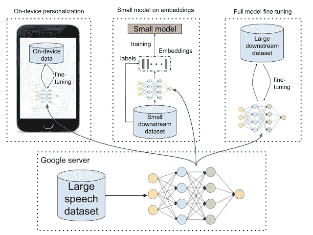

# 人工智能&字里行间的倾听

> 原文：<https://medium.datadriveninvestor.com/ai-listening-between-the-lines-e0626a71a4d8?source=collection_archive---------4----------------------->

Roan Mountain, TN, USA, photo by [@tabithabrooke](https://unsplash.com/@tabithabrooke)

## 改进语音识别中的非语义表示

事实胜于雄辩，很多时候语音识别无法捕捉上下文或您试图传达的意思。基于语义或非语义上下文采取错误的操作可能会在应用语音识别的随意或关键上下文中让您失望。

交谈可能是一项复杂的活动。有时候，我们的意思比我们说的更多，我们的音调可能是我们传达的信息的核心部分。一个单词的不同强调可能会改变一个句子的意思。

因此，考虑到这一点，自我监督如何改善语音表达和个性化模型？

语音识别模型如何识别你在说什么？

2020 年 6 月 18 日，谷歌人工智能的一篇博客文章回答了这个问题。

这篇文章认为，通过大量数据可以更容易地解决许多任务，如[自动语音识别](https://en.wikipedia.org/wiki/Speech_recognition) (ASR)。

这是很方便的，例如将语音翻译成文本。

这个语义解释很有趣。

然而，在“非语义”任务中有一个对比。

这些任务关注的是意义。

因此，存在“副语言”任务。

有元交流的成分。比如对情感的识别。

可能是认出一个说话的人。

说什么语言？

作者认为，当在小数据集上训练时，那些依赖大数据集的人可能不太成功。

大小之间有性能差距。

有人认为，这可以通过在大型数据集上训练表示模型，然后用较少的数据给它设置来弥补。

这可以通过两种方式提高性能:

1.  使得通过将高维数据(如图像和音频)转换到较低维度来训练小模型成为可能。表示模型也可以用作预训练。
2.  此外，如果表示模型足够小，可以在设备上运行或训练，它可以通过向用户提供个性化模型的好处来以保护隐私的方式提高性能，其中原始数据永远不会离开他们的设备。

文本域表示学习的例子可以是[伯特](https://ai.googleblog.com/2018/11/open-sourcing-bert-state-of-art-pre.html)和[阿尔伯特](https://ai.googleblog.com/2019/12/albert-lite-bert-for-self-supervised.html)。

对于图像，可以是[初始层](https://arxiv.org/abs/1411.1792)和 [SimCLR](https://ai.googleblog.com/2020/04/advancing-self-supervised-and-semi.html) 。

作者认为这些方法在语音领域没有得到充分利用。

共同的基准在哪里？

Bottom:A large speech dataset is used to train a model, which is then rolled out to other environments. Top Left: On-device personalization — personalized, on-device models combine security and privacy. Top Middle: Small model on embeddings — general-use representations transform high-dimensional, few-example datasets to a lower dimension without sacrificing accuracy; smaller models train faster and are regularized. Top Right: Full model fine-tuning — large datasets can use the embedding model as pre-training to improve performance

作者认为，在非语义工作中，没有有用表示的标准基准。

从这个意义上说“言语表征有用”。

表征学习有两个进步:

*   [T5](https://ai.googleblog.com/2020/02/exploring-transfer-learning-with-t5.html) 框架系统地评估文本嵌入。
*   [视觉任务适配基准](http://ai.googleblog.com/2019/11/the-visual-task-adaptation-benchmark.html) (VTAB)标准化图像嵌入评测。

这些不直接评估非语义语音嵌入。

作者有一篇关于 arXiv 的论文，名为:“[学习语音的通用非语义表示](https://arxiv.org/abs/2002.12764)”

在这方面，他们有三个贡献。

1.  *首先，他们提出了一个用于比较语音表示的非语义语音(NOSS)基准，它包括不同的数据集和基准任务，如语音情感识别、语言识别和说话人识别。* [*这些数据集*](https://www.tensorflow.org/datasets/catalog/overview#audio) *在* [*TensorFlow 数据集*](https://www.tensorflow.org/datasets/) *的“音频”部分都有。*
2.  *其次，他们创建并开源了* [*三重损耗网络*](https://aihub.cloud.google.com/s?q=nonsemantic-speech-benchmark) *(TRILL)，一个小到足以在设备上执行和微调的新模型，同时仍然胜过其他表示。*
3.  *第三，他们执行大规模的研究，比较不同的表示，* [*开源代码*](https://github.com/google-research/google-research/tree/master/non_semantic_speech_benchmark) *用于计算新表示的性能。*

为了更进一步，我建议阅读原始的博客帖子或查看他们关于 arXiv 的研究论文。

这里是#500daysofAI，您正在阅读的是第 382 条。500 天来，我每天都在写一篇关于或与人工智能相关的新文章。