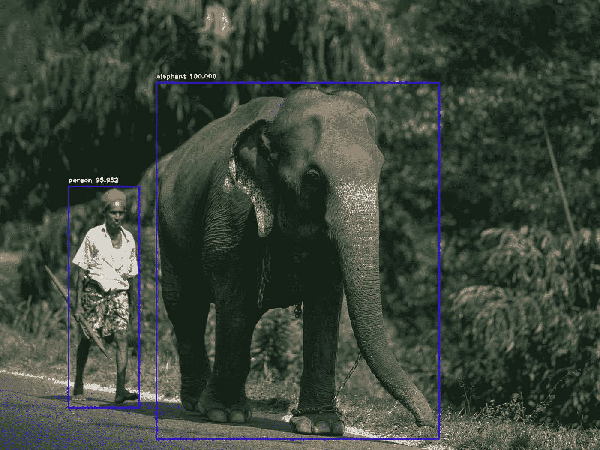

# 仅使用 10 行代码的人工智能对象检测(ImageAI)

> 原文：<https://medium.datadriveninvestor.com/ai-object-detection-using-only-10-lines-of-code-imageai-89d3ba9886ea?source=collection_archive---------2----------------------->

**作者普里亚尔·瓦尔皮塔**

这篇博文将用最少的代码行讨论使用 ImageAI 库的对象检测。你可以建立自己的深度学习网络，用预先训练好的 Coco best 模型，识别对象。

# **简介**

## **什么是物体探测？**

对象检测是与计算机视觉同义的东西，其代表可以识别图像中目标对象或实体的位置的系统。

 [## 深度学习用 7 个步骤解释-更新|数据驱动的投资者

### 在深度学习的帮助下，自动驾驶汽车、Alexa、医学成像-小工具正在我们周围变得超级智能…

www.datadriveninvestor.com](https://www.datadriveninvestor.com/2019/01/23/deep-learning-explained-in-7-steps/) 

对象检测机制的性能是一个图像，该图像具有围绕兴趣点的边界框和特定对象的类实例的指示符。

# **如何将对象检测与 ImageAI 库配合使用？**

## **什么是 ImageAI 库？**

[ImageAI](https://github.com/OlafenwaMoses/ImageAI) 是一个基于 python 的库，使程序员、研究人员和学生能够使用简短的几行代码创建深度学习和计算机视觉自包含应用程序和系统。

你可以使用其他纯 AI/ML 库做同样的事情，比如 Tensor Flow，OpenCV 和 Keras 等等..但是，如果您试图使用这些库进行图像预测，您将会得到大量的代码行，这将会产生像 setup 这样的混乱。但是要解决这个问题，我们可以使用 ImageAI 库，用更少的代码行来查看它。

# **代码解释**

如果您打算在本地机器上这样做，请设置以下工具。

## 必需的库

**Python:**https://python.org

**张量流:**！pip3 安装张量流

**OpenCV :** ！pip3 安装 opencv-python

**Keras :** ！pip3 安装 keras

**ImageAI :** ！pip3 安装 imageai —升级

Source code

添加所需库的前两行代码。

另一部分设置 OS 路径并加载 COCO 最佳预训练模型。COCO 最佳预训练模型基于具有 RestNet 卷积神经网络的 YOLO V3。

则模型运行以检测预训练模型中的对象，并且检测到的对象被保存在检测对象中。接下来的两段代码输出相关的边界框(x，y 坐标，每个框的高度和宽度),最后一段代码显示检测到的带有边界框的图片。

我希望你喜欢 ImageAI 的这个简单的深度学习模型。

感谢阅读并享受编码！:)

Git 回购:[https://github.com/priyalwalpita/ai_object_detection.git](https://github.com/priyalwalpita/ai_object_detection.git)

以下是视频教程。