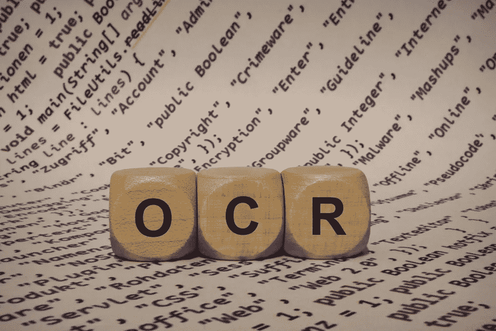

# 人工智能支持的 OCR 技术——人工数据输入操作的替代品

> 原文：<https://medium.datadriveninvestor.com/ai-powered-ocr-technology-a-substitute-for-manual-data-entry-operations-862fba97cbab?source=collection_archive---------3----------------------->

数据输入操作相当繁琐。如果手动完成，它们容易出错。传统的业务流程和运营过去采用手动数据输入，这使得管理和收集数据成为一个繁琐的过程。需要大量人工来手动输入用户信息和其他数据。光学字符识别(OCR)技术凭借其强大的功能减少了令人头疼的问题。OCR 技术能够使数据收集过程自动化。这一创新在很大程度上让一些企业的日子变得更加轻松。

 [## 2019 年即将改变世界的技术|数据驱动的投资者

### 很难想象一项技术会像去年的区块链一样受到如此多的关注，但是……

www.datadriveninvestor.com](https://www.datadriveninvestor.com/2019/01/17/the-technologies-poised-to-change-the-world-in-2019/) 

OCR 技术在全世界被广泛采用。它改造现有业务流程的潜力已经影响了世界各个角落的行业。其流程包括文档验证或从图像和文档中收集数据的企业可以充分利用这项技术。为什么

利用 OCR 技术，可以从电子图像或文档中提取数据。它允许文档以文本文档(而不是图像)的形式上传它们。可以使用 OCR 技术扫描诸如护照、驾驶执照、身份证、收据、公用事业账单、合同、发票等文件。准确而强大的 OCR 服务[可自动从支持所有文档类型的在线文档中提取信息。](https://shuftipro.com/data-extraction)

# **使用 OCR 提取数据**

使用人工智能算法，OCR 技术被构建为包含传统 OCR 缺乏的所有方面。它识别文档模板，并相应地从数据字段中提取信息。以下是描述 OCR 技术如何工作的步骤:

1.  OCR API 与希望从文档中提取数据的系统集成在一起。API 可以与扫描上传文档的桌面或移动设备集成。
2.  用户将上传文件的任何格式，如 JPEG，PDF，PNG，TIFF 等在线系统。
3.  使用人工智能技术，OCR 软件将识别模板类型，然后开始从文档中提取数据。它将提取数据字段，如姓名、地址、出生日期等。从和身份证。

# **OCR 的形式**

OCR 可以根据以下形式进行分类:

**结构化 OCR:** 其中预定义了文档结构。例如，身份证的右边是图片，左边是文字，每条信息之间都有特定的空白和间隔。基于该结构，OCR 相应地提取信息。

**图像 URL:** 使用图像 URL，OCR 从图像中提取文本。图像 URL 由用户提供，OCR 软件成功地打开它并从图像中提取数据。

**带注释的 OCR:** 从文本过多的密集文档中提取数据。例如，一张图片有如此多的文本，却没有合适的格式。该信息将使用带注释的 OCR 提取。此外，如果有图像并且图像上有一些符号，带注释的 OCR 确保除了图标、图像或符号之外，文本被准确提取。

**多语言 OCR:** 支持多种模板/脚本。无论是护照、公用事业账单还是身份证格式，多语言都具有从各种脚本中提取数据的潜力。

# **OCR 准确性—一项重大挑战**

在所有可用的 OCR 软件中，主要的挑战是其正确提取数据的准确性。今天，一些系统可以提供大约 90%的数据提取准确率。以下是一些可以提高 OCR 软件准确率的参数:

*   图像质量越好，结果就越好。
*   高精度 OCR 服务与精确数据处理和提取系统的集成。
*   通过增强图像质量、像素和比例。
*   通过从文档中去除噪声并适当地倾斜它。

通过采用强大的底层人工智能算法，OCR 技术正在提高从任何类型的文档中提取数据的准确率。