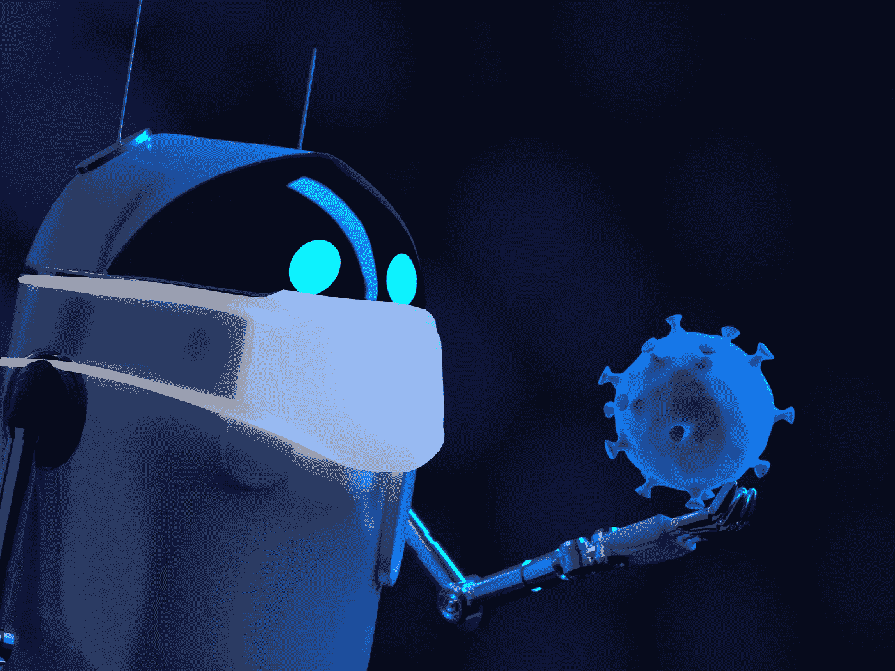
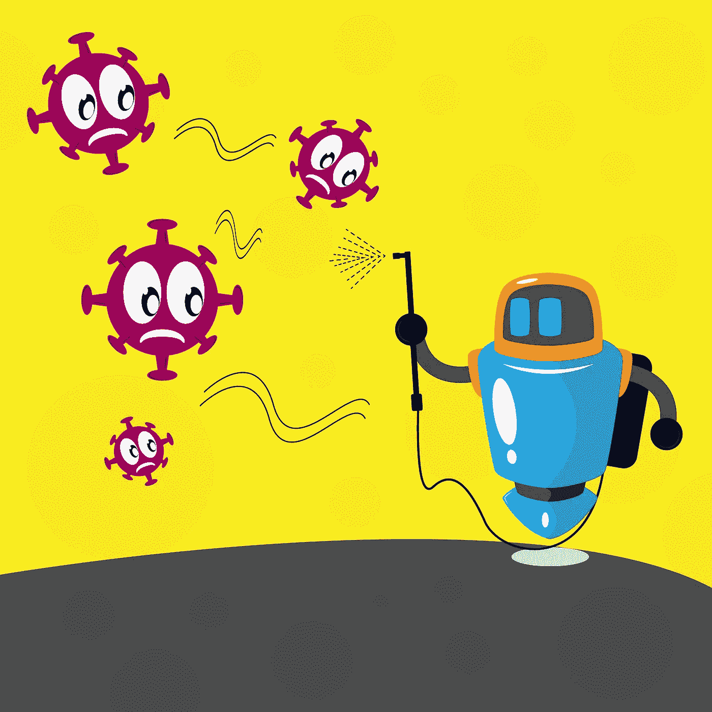

# 人工智能和机器人赢得了与新冠肺炎的斗争

> 原文：<https://medium.datadriveninvestor.com/ai-robots-winning-the-fight-against-covid-19-1921f29c4f7f?source=collection_archive---------14----------------------->

## 未来就在这里:了解人工智能和机器人如何限制新冠肺炎的传播。

Source: [Optinik](https://depositphotos.com/portfolio-25192970.html) / [depositphotos.com](http://www.depositphotos.com)

# 介绍

当如此多的人类生命处于危险之中时，隐私、伦理和其他限制人工智能机制的问题变得不那么重要了。在这个前所未有的时代，没有什么比让尽可能多的病人活着更重要的了。新冠肺炎病毒的爆发在全世界造成了巨大的破坏。市场崩溃，学校和企业关闭，人们生病和死亡，我们大多数人被迫呆在家里。可悲的是，这可能只是开始。

这不是世界第一次经历危险的疫情，但值得庆幸的是人工智能——一种具有惊人能力的工具，它可能有能力加速我们从这场危机中复苏。

# 一堂简短的历史课

第一次有记录的重大疾病爆发可以追溯到公元前 3000 年的中国。考古发现表明，大约在  [5000 年前](https://www.google.com/url?q=https://www.livescience.com/51662-100-bodies-found-prehistoric-house.html&sa=D&ust=1586442559778000)，一场流行病可能毁灭了整个村庄。在一座 14×15 英尺的房子里发现了 97 具尸体，这座房子后来被烧毁。流行病没有放过任何年龄组:青少年、年轻人和中年人的骨骼被发现。基于调查结果信息的推测假设疾病来得如此突然，甚至没有时间进行适当的埋葬。

 [## 艾预测:“颠覆，然后是生产力”|数据驱动的投资者

### 人们越来越担心，随着机器学习和互联网的普及，所有白领工作都将消失

www.datadriveninvestor.com](https://www.datadriveninvestor.com/2018/08/06/ai-forecast-disruption-then-productivity/) 

在新冠肺炎之前，最近一次震惊世界的疫情是西班牙流感或 1918 年的疫情流感。从 1918 年 1 月到 1920 年 12 月，它是如此致命，以至于疾病预防控制中心给它起了个绰号:所有流行病之母。它感染了大约四分之一的地球人口(约 5 亿)，并导致 1700 万至 5000 万人死亡。一些证据表明，死亡人数实际上可能已经超过  [1 亿](https://www.google.com/url?q=https://academic.oup.com/aje/article/187/12/2561/5092383&sa=D&ust=1586442559779000)，这使得它成为人类历史上最致命的流行病。当然，回到 1918 年，世界上没有任何技术工具可以帮助寻找治疗方法或加快康复过程。因此，更多的人处于危险之中。

# 现在:新冠肺炎

近年来，人工智能和机器学习已经向我们展示了如何在需要的时候极大地帮助人类最大限度地减少损失。随着新冠肺炎病毒的爆发，这也许是检验这些机器并弄清楚它们到底能达到什么目的的最佳时机。

截至 2020 年 4 月 5 日，冠状病毒疾病的全球死亡人数为 67，910 人，超过 100 个国家的 120 万人受到影响。自从世界卫生组织(世卫组织)正式宣布冠状病毒为疫情以来，世界各地的旅行都受到了干扰，并实施了高级别的隔离。

限制病毒传播的需要促使受影响地区的主要活动完全停止。现在，基于人工智能的机器人开始发挥作用。

Source: [CYCLONEPROJECT](https://depositphotos.com/portfolio-9498636.html) / [depositphotos.com](http://www.depositphotos.com)

# 人工智能如何赢得与冠状病毒的斗争

基于人工智能的工具和机器可以在几乎没有监督的情况下提供基于人类的服务，最大限度地减少交互，从而限制新冠肺炎的扩散。他们的角色总结如下:

## a.送货服务

人工智能机器人可以运送货物和杂货。它们让人们无需离开舒适(和安全)的家就能获得日常必需品。

Source: [Farizaward](https://depositphotos.com/portfolio-19974636.html) / [depositphotos.com](http://www.depositphotos.com)

## b.消毒剂喷洒

在中国的部分地区和整个南非的约翰内斯堡，人工智能机器人正在给公共场所消毒，而不是使用由人驾驶的重型车辆。它们由电池供电，降低了能耗成本，而其时尚的设计使它们在复杂的地形中具有机动性。

## c.手部消毒和口罩分发

分发[洗手液](https://www.wellwit.com.cn/tcn/?gclid=Cj0KCQjwj7v0BRDOARIsAGh37ioMnMcNzzcEDnoBj_K2My_NBNARJZ5b0PrfKNwvbvcWdQvcuEhg9TMaAr85EALw_wcB)和口罩的机器人已经被安装在战略要地，以帮助控制病毒的传播。

Source: [AndreyPopov](https://depositphotos.com/portfolio-1010613.html) / [depositphotos.com](http://www.depositphotos.com)

## d.机器人厨师的崛起

你知道像朱莉娅这样的机器人厨师可以为你烹饪不同的美食吗？使用她的应用程序，你需要做的只是选择你的食谱，将配料放入指定的容器中，然后点击烹饪按钮。非常用户友好，你不需要有任何烹饪专业知识。如果你能使用一个简单的应用程序，朱莉娅会确保你是好的。

## e.保护我们的医护人员，同时让他们的工作更轻松

当医护人员长时间工作并冒着生命危险保护我们的安全时，像机器人护士汤米这样的机器人有助于减少疲劳并提供更多的保护。他们可以检查体温，监测生命体征，甚至给人消毒，从而将病毒暴露的风险降至最低。

## f.远程医疗的采用

最近几周，远程医疗的应用出现了大幅增长。病人和医生通过机器人促成的视频通话进行互动，其中一些机器人可以在没有身体接触的情况下监测生命体征。

# 结论

每一次重大疾病爆发都会带来变化，并带来新水平的研究和技术。人工智能和机器人正在留下他们的印记，因为他们继续使自己成为不可或缺的工具。当这个疫情最终成为我们的后视镜时，立法者可能会忽略他们对基于人工智能的技术可能存在的缺陷的担忧。它们应该支持和鼓励在生活的各个方面更广泛地利用。

请随意评论或分享。如有任何问题，请联系我——我很乐意收到您的来信。最重要的是，保持健康和安全！

*如果你想看到更多这样的帖子或亲自与我联系，你可以在*[*LinkedIn*](https://www.linkedin.com/in/sohail-merchant-370aaa59/)*[*Twitter*](https://twitter.com/smerchantMD)*上添加我，或在下面发表评论。也可以在* [*中等*](https://medium.com/@smerchant40k) *上查看我的帖子。**

**本帖原载于* [*www。aim blog . io*T25*。*](https://www.aimblog.io/2020/04/13/ai-robots-winning-the-fight-against-covid-19/)*