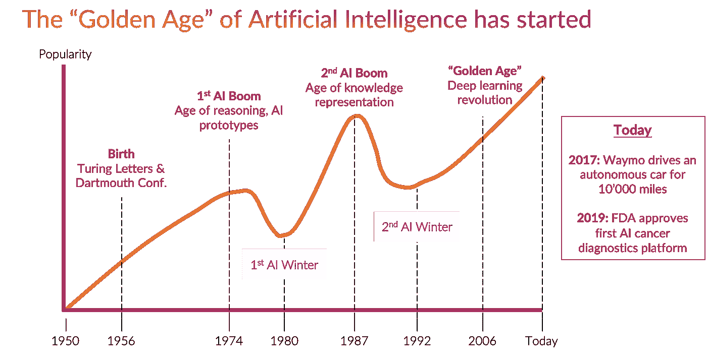
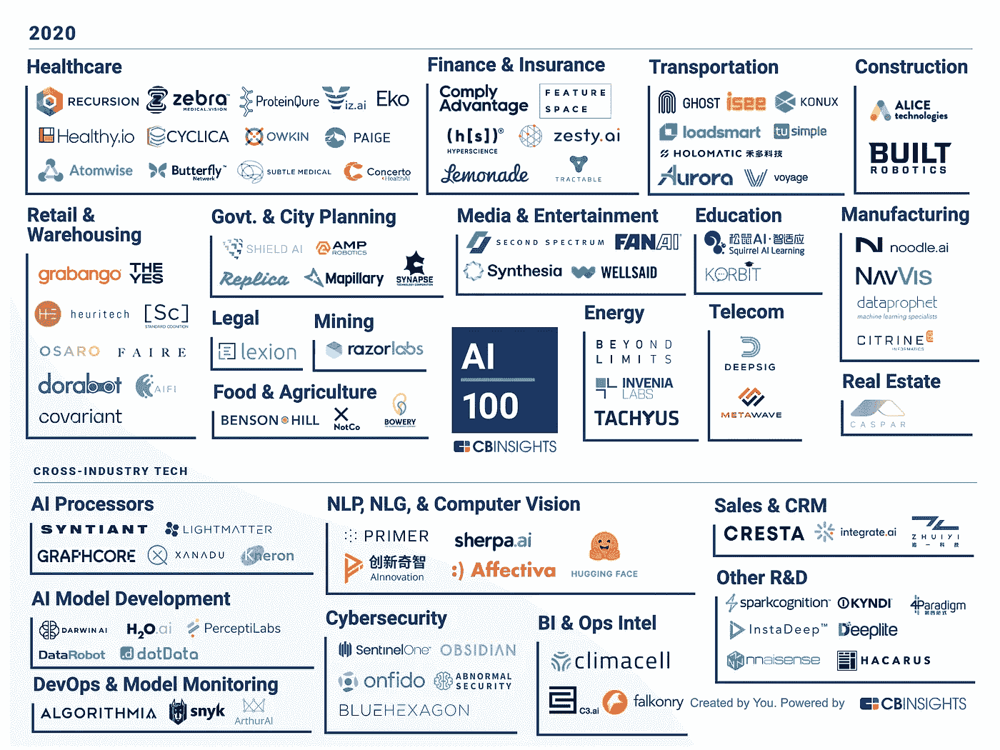
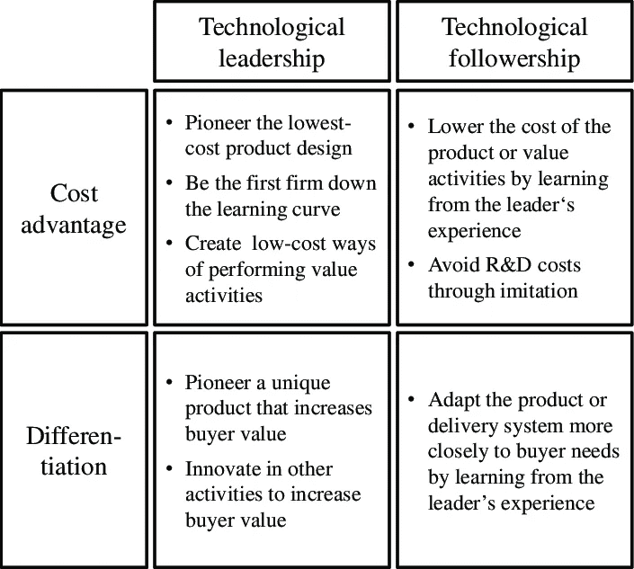

# 商业领袖的人工智能战略:如何超越竞争

> 原文：<https://medium.datadriveninvestor.com/ai-strategy-for-business-leaders-how-to-outperform-the-competition-1f47cabc780c?source=collection_archive---------4----------------------->

Innovation is all about strategy. Source: [Unsplash](https://unsplash.com/photos/fzOITuS1DIQ)

在当今全球化的世界，竞争越来越激烈。产品越来越好，越来越便宜。这场比赛能赢吗？你如何保护自己免受新的创新产品的干扰？

# 人工智能——你应该做好准备的颠覆性创新

在我从事风险投资和咨询工作期间，我看到许多公司努力利用创新来获得竞争优势。今天，毫无疑问，人工智能有潜力成为本世纪最具颠覆性的技术。公司在这方面做了很好的准备。但是，人工智能作为“下一个大事件”已经有很长的历史了，那么为什么这次会有所不同呢？

[The “Golden Age” of Artificial Intelligence](https://www.actuaries.digital/2018/09/05/history-of-ai-winters/)

自 2012 年 ImageNet challenge 以来，现实世界的应用已经出现，人工智能也不再只是大学研究实验室中极客的酷玩具。今天，人工智能慢慢地被“老恐龙”公司使用，他们将人工智能集成到他们的制造或产品中。AI 已经从炒作走向生产。如果这种炒作和广泛适应继续下去，人工智能的黄金时代已经开始。作为 Lightly.ai 的联合创始人，这是一家帮助公司管理和准备人工智能数据的 ETH 初创公司，我们的客户中有一些最具创新性的公司。人工智能应用的领域包括数字病理学、视觉检查和自动驾驶。因此，根据我自己的经验，我可以告诉你，人工智能已经开始成为我们生活中不可或缺的一部分。无论你与 Alexa 交谈以从亚马逊订购，还是使用汽车的驾驶辅助系统，你都在与基于智能人工智能的产品进行交互。由于我们不能再否认技术的进步，作为一名商业领袖，了解技术是否会构成威胁以及技术的应用已经普及到什么程度是至关重要的。

 [## AI 将军是否已经超过了人类的智力容量？数据驱动的投资者

### 不仅在游戏中，而且在劳动力市场上，机器都比人类聪明。在今天的许多领域，使用…

www.datadriveninvestor.com](https://www.datadriveninvestor.com/2020/02/12/has-general-ai-exceeded-the-intellectual-capacity-of-humans/) 

# 今天的人工智能景观

为了评估人工智能的广泛适应性，最好看看下面 CB Insights 的[100 大人工智能景观分析。如今有无数人工智能初创公司活跃在各个领域。几乎没有一个行业是未被触及的，这表明适应过程已经是多么先进了。
可以按行业细分人工智能应用，如果你想分析特定领域的用例，这是必不可少的。然而，在较低的层面上，必须确定这些人工智能应用程序是否会为您带来收入或节省成本。了解这些应用程序对您的业务的战略重要性也很重要。](https://www.cbinsights.com/research/artificial-intelligence-top-startups/)

[Top 100 AI Startups by CB Insights](https://www.cbinsights.com/research/artificial-intelligence-top-startups/)

应根据您的具体业务情况进行彻底的风险评估。为此，我建议坚持使用 Raffi 和 Kampas 提出的战略方法:

> 然而，中断并非不可避免。我们开发并测试了一种工具，可以帮助公司检测潜在的破坏性创新，同时管理层仍有时间做出有效的响应。它没有什么神奇之处——没有能让你看到未来深处的水晶球。但它确实让一群聪明、固执己见的经理坐在一起，系统地思考对核心业务的威胁，并提出如何避免或利用这些威胁的想法。

你应该问自己以下问题:

*   拥有这项技术的竞争对手会有竞争优势吗？
*   竞争对手拥有专有技术吗？(例如，专利保护)
*   在我的业务中集成该技术的工具是什么？(例如，收购、R&D、合伙)
*   我获取这样的技术有多容易？
*   竞争对手是在滩头阵地还是主流市场？
*   客户正在转变还是新客户成为目标？

# 人工智能在你的企业中有哪些应用领域

我们在商学院学到的东西仍然适用于人工智能。我们只需要将我们的知识转移到当前的发展中。正如迈克尔·波特在 1985 年已经表明的那样，一个公司可以用两种不同的方式为两个不同的目标使用技术。

Technological strategy and competitive advantage [Porter (1985), p. 181].

在我们的具体案例中使用人工智能的目的可以是:

1.  **通过自动化&分析节约成本**(成本优势)
2.  **通过新的&更好的产品创造收入**(差异化)

无论你作为一家公司的目标是什么，你必须决定在这场竞赛中你是想做跟随者还是领导者。取决于你所在的行业，这个或那个可能更重要。主要的区别在于一个人应该选择什么样的战略工具来实现技术领导者或追随者。正如罗伯特和贝里早在 1985 年就提出的，你可以通过外部创新、内部创新或战略伙伴关系来获得创新。

*举个例子，如果你是汽车制造商。你希望在差异化方面取得技术领先地位(例如，自动驾驶)。很难从外部获得这种技术。许可不是一个可行的选择，因为这会让你受到许可公司的摆布。因此，您需要自己构建它。*

我想强调的是，这两个目标:使用人工智能节省成本和创造收入，对于确保贵公司的长期生存能力至关重要。因此，一家公司应该始终追求这两者。

此后，我将详细阐述这两个目标，以突出您业务中的潜在应用领域，以及应该使用哪些战略工具。

## (1)人工智能为您的企业节省成本

这可能是将人工智能集成到您的业务中的最简单的方法。为什么？因为除非你想在成本优势上实现技术领先，否则你已经有大量即插即用的解决方案可供选择。你很少需要建立内部技术能力。以下列表显示了示例领域以及为这些领域提供解决方案的公司:

*   流程优化:例如[塞隆尼斯](https://www.celonis.com/)、 [UIPath](https://www.uipath.com/)
*   现金流管理:如 [Float](https://floatapp.com/eur/) 、 [PlanGuru](https://www.planguru.com/)
*   库存和收入管理:例如 [Nextail](https://nextail.co/) 、 [Celect](https://www.celect.com/) 、 [Relex](https://www.relex.ch/)
*   招聘自动化:例如， [Mya Systems](https://www.mya.com/de/) ， [Textio](https://textio.com/)
*   生产自动化:如[蓝河科技](http://www.bluerivertechnology.com/)、[建成](https://www.builtrobotics.com/)
*   分析和监控:例如，[一瞥](https://www.glimpsecorp.com/)、 [Flox.ai](http://Flox.ai) 、 [Assaia](https://assaia.com/)
*   外观检查和质量保证:例如 [Inspekto](https://inspekto.com/de/) 、 [Clobotics](https://www.clobotics.com/) 、 [Hades](https://www.hades.ai/)

然而，在一些用例中，追求技术领先的成本优势是有意义的。例如，如果你是玉米等商品的生产者。在这种情况下，我们会假设客户主要基于价格做出决定。这让你几乎没有其他方法来区分。在这种情况下，你想成为最便宜的生产商来击败其他所有人。使用别人没有的工具来实现生产自动化是有意义的(例如，基于计算机视觉的更有效施肥和杀虫剂的方法)。

另一个原因可能是，如果了解客户需求和预测对您的业务非常重要，您希望拥有最佳的内部解决方案。*这种收购动机的一个例子是最近耐克*[*【1.1 亿美元收购 Celect*](https://www.thailandstartup.news/news/nike-purchases-ai-startup-celect-for-us$110-million-)*。*

无论你的动机是什么，毫无疑问，人工智能可以在最小化成本和获得基于成本的竞争优势方面发挥至关重要的作用。但是，公司永远不应该只关注成本优化。利用新技术的所有潜力来增加收入也很重要。

## (2)人工智能产生新的收入

这个有点复杂。在这里，我们很少能够购买解决方案来创造新的收入来源。有时许可解决方案是有意义的。然而，正如我们在自动驾驶的例子中看到的那样，如果这些解决方案是一个人业务核心的一部分，那可能是一个危险的游戏。在颠覆性创新的情况下，技术追随很少是正确的决定。一个管理者应该如何应对当前对 AI 的革命？

收购该领域的领先初创公司可能是有意义的，但几乎没有办法在内部拥有某些能力。这通常是一个艰难的决定，因为在人工智能行业，收购初创公司和建立竞争力都非常昂贵。机器学习工程师是目前薪酬最高的员工之一，而人工智能初创公司享有最高的估值。然而，哪里有价格，哪里就有理由。在这种情况下，很简单，你可以通过人工智能产生的价值也被许多专家广泛认为是最高的价值之一。

在这里，我收集了一些收购初创公司可能有意义的例子:

***采矿&商品行业:*** *一条*专有*金属&矿产勘探之路，这比业内其他任何人都要好，无疑会给玩家提供竞争优势。当然，这个领域已经充满了无数的创业公司，例如，* [*【地球人工智能】*](http://www.earth-ai.com/)*[*【金点】*](https://goldspot.ca/)*[*【狗头人金属*](https://www.koboldmetals.com/) *。***

*****时尚&服装行业:*** *通过 AI 设计更新潮产品的专有方式。这是一个非常新颖的领域，但我们从例子中知道，人工智能可以成功地应用于创造新的食谱* [*，用于创意菜肴*](https://www.fastcompany.com/1672444/try-a-recipe-devised-by-ibms-supercomputer-chef) *。***

*****医疗保健行业:*** *寻找新药配方治疗疾病的专有方法。另一个例子是为医生提供人工智能数字诊断软件。这里我们有罗氏等玩家，他们自己也在积极开发解决方案或者是 paige.ai 等创业公司***[*字幕健康*](https://captionhealth.com/)*[*QuantX*](https://www.qlarityimaging.com/)*。******

*****零售业:*** *零售业已经并且还在被电子商务颠覆。然而，混乱并没有就此停止。有* [*亚马逊 Go*](https://www.amazon.com/b?ie=UTF8&node=16008589011)*[*AI 零售商系统*](https://airetailersystems.com/)*[*标准认知*](https://standard.ai/) *等举措。因此，零售业最好不要因为被同一个电子商务巨头再次扰乱而犯同样的错误两次。*****

*****汽车行业:*** *以我的自动驾驶为例。在这个领域，有两种不同的方法。我们收购了一些公司(* [*，例如通用汽车的 Cruise*](https://www.crunchbase.com/acquisition/general-motors-acquires-cruise--d7ca7de8)*)和一些主要自己开发解决方案的公司(例如雷诺)。两种方法各有利弊。美妙之处在于你可以组合不同的乐器。例如，通用汽车收购 Cruise 是为了获得其技术。但是，通用汽车仍然在自动驾驶方面投入巨资。另一个例子是谷歌子公司和自动驾驶公司 Waymo，该公司在内部开发了大部分技术，但仍在进行收购。***

**至关重要的是，每次考虑成本时，他/她也要考虑收入，反之亦然。成本的变化会导致收入的增加。因此，在评估战略决策(如将技术整合到业务中)时，始终牢记底线至关重要。**

# **考虑周全，行动更快**

**简而言之，我们可以得出结论，没有哪个行业不会受到人工智能的影响。经理们为公司未来几年做好了准备。重要的是不要匆忙做出如此重要的决定，而是要彻底考虑你自己公司的不同应用领域。一旦你做了决定，快速大胆地执行是很重要的，因为在日益激烈的经济环境中，竞争是激烈的，慢玩家有被快玩家整合的风险。**

**Matthias Heller，Lightly.ai 联合创始人**

****感谢**Mara Kaufmann 和 Igor Susmelj 阅读本文的草稿。**