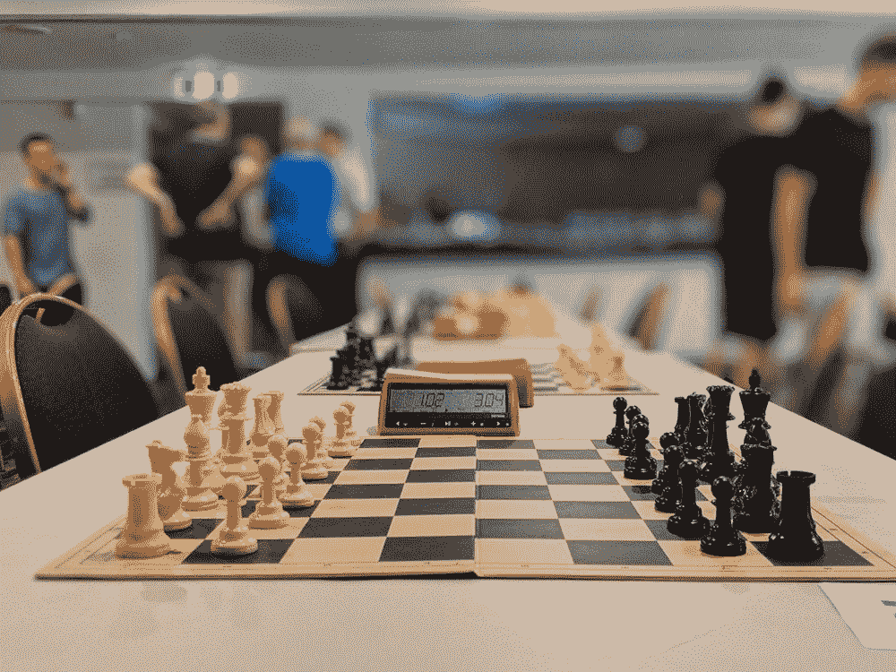

# 人工智能在几个小时内就教会了自己下棋

> 原文：<https://medium.datadriveninvestor.com/ai-teaches-itself-chess-in-a-matter-of-hours-a473bd95e08a?source=collection_archive---------13----------------------->

AI 预测谁会从大学退学。一个伪装成 13 岁男孩的聊天机器人通过了图灵测试。人工智能通过与自己对弈来掌握国际象棋、象棋和围棋。现实变得比科幻小说还要离奇。

Photo by [Mitchell Johnson](http://@mitchazj) on [Unsplash](http://unsplash.com)

早在 1954 年， [Paul Meehl](https://psycnet.apa.org/record/2006-21565-000) 就提出，在给定明确形式化的规则和预测变量的情况下，公式在预测方面会胜过人类。如今，一种预测算法可以根据 GRE 成绩、教师评级和推荐信，轻松预测学生的平均绩点。类似地，统计算法可以比人类法官更准确地计算出一个被定罪的重罪犯再次犯罪的风险。

 [## 人工智能和监督资本主义|数据驱动的投资者

### 大科技，总是现在:人工智能推动的大科技，已经使购物，搜索，在你的…

www.datadriveninvestor.com](https://www.datadriveninvestor.com/2020/03/04/on-artificial-intelligence-and-surveillance-capitalism/) 

除了米尔自己的[临床与统计预测](https://www.amazon.com/gp/product/0963878492/ref=as_li_qf_sp_asin_il_tl?imprToken=-A8b0oo1o7RLVQprXt-F5Q&slotNum=0&ie=UTF8&tag=farnamstreet-20&camp=1789&creative=9325&linkCode=w61&creativeASIN=0963878492&linkId=b8ef0464929465145f4b8367c55ec51b)之外，我们现在将看到现实世界中计算机比人类本身更好地预测人类行为的证据。

## 智能算法

预测算法要么收集参与者自愿给出的信息，要么秘密收集数据。这里有几个由人工智能驱动的数据挖掘机器可以比我们人类更真实地预测的话题。

> 一个学生会从大学退学吗？

[DataKind](http://www.datakind.org/) 追踪学生数据，并预测即将毕业的高年级学生中谁有辍学的风险。每年大约有 2000 名即将毕业的高年级学生从约翰·杰伊学院退学。在数据驱动的干预和财政援助下，[1100 名高风险学生中有 73%成功毕业](https://hechingerreport.org/a-wildly-intrusive-way-to-help-older-college-students-get-their-degrees/)。

> 你如何帮助一个失业的求职者？

[贝叶斯影响](https://www.bayes.org/en/focus/unemployment)利用人工智能，根据过去的工作经验、证书和就业市场，为求职者提供个性化的职业建议。它已帮助 21 万失业人员找到工作。89%的用户认为该算法对他们的工作恢复有用。

随着企业关闭，公司破产，员工被解雇，要约被取消，更多的人将受益于人工智能的建议，以导航在这个新冠肺炎疫情找工作。

> 一个人会自杀吗？

范德比尔特大学和佛罗里达州立大学开发的算法预测 79%的情况下，一个人有 50%的机会自杀。

听听菲利普·特洛克在[超级预测](https://80000hours.org/podcast/episodes/philip-tetlock-forecasting-research/)中是怎么说的。

## 图灵测试

艾伦·图灵思考下棋的能力是否会成为区分人类和机器智力的标志。在【1950 年的论文中的图灵测试试图回答一个有争议的问题“机器能思考吗？”

他后来放弃了这个问题，代之以“机器能像人类一样智能吗？”直到今天，图灵猜想仍然有争议，如果不是更多的话。

> “我相信大约 50 年后，给计算机编程序是可能的……让他们把模仿游戏玩得如此之好，以至于一个普通的审讯者在五分钟的审讯后做出正确辨认的概率不会超过 70%。”—艾伦·图灵

历史上充满了机器在模仿游戏中赢棋和智胜人类的例子。事实上，机器即将表现得更有情感，更像人类。我们甚至会怀疑作为人类到底意味着什么。

## 一个聊天机器人通过了图灵测试

大约 50 年后，图灵猜想果然应验了。2014 年，雷丁大学进行了一次图灵测试，该测试忠实地遵循了图灵规定的模仿游戏规则。

模仿游戏是一种游戏，被蒙住眼睛的询问者需要猜测两个实体(一台计算机，一个人)中哪一个是真正的人。询问器可以在 5 分钟内问每个实体问题，但机器可能不总是说实话。

机器的目标是欺骗。人类的目标是让审问者相信他是真的。

一个名叫尤金的聊天机器人通过了图灵测试。他骗过了 33%的评委，让他们以为自己在和一个 13 岁的阿姆粉丝说话。

就像任何自负的早熟少年一样，尤金自命不凡地谈论着“礼貌的正确性”和阿姆。当面试官责备他时，他甚至打出了悲伤的表情。

在电脑屏幕上，问题在尤金和法官之间来回循环。他的信息中偶尔会有一些错别字。但是拼写错误显然增加了尤金人性的真实性。

## 机器打败了人类象棋大师

20 世纪 60 年代，理查德·d·格林布拉特(Richard D. Greenblatt)的 [Mac Hack IV](https://arstechnica.com/science/2018/12/move-over-alphago-alphazero-taught-itself-to-play-three-different-games/) 是麻省理工学院编写的第一个在国际象棋比赛中战胜人类的程序。1997 年，IBM 的“深蓝”打败了国际象棋世界冠军加里·卡斯帕罗夫。

Mac Hack IV 和 Deep Blue 是用手工规则和聪明的启发式算法精心编程的。虽然手工算法反映了人类国际象棋大师的优先考虑和偏见，但程序员需要绞尽脑汁[数百万行代码](https://www.visualcapitalist.com/millions-lines-of-code/)才能完全模仿人类的游戏体验。

AlphaZero 由谷歌的 DeepMind 编程，除了国际象棋规则的基本知识外，没有其他领域的知识。从随机游戏开始，AlphaZero 可以发展出自己超人的直觉，甚至连世界象棋冠军[卡斯帕罗夫](https://science.sciencemag.org/content/362/6419/1087)都惊叹不已。

> 我承认，我很高兴看到 AlphaZero 拥有像我一样的动态、开放的风格。”—加里·卡斯帕罗夫

AlphaZero 在熟练操纵棋子的同时掌握了对棋盘的控制权，这是一种创造性和侵略性的方法。人们不禁惊叹:AlphaZero 是如何通过与自己对弈来掌握国际象棋的？

## 另类的思维方式

AlphaZero 是在未经训练的神经网络上用通用算法构建的。像人类一样，它可以在没有人类干预的情况下发明棋子结构和国王安全等国际象棋图案。

当 AlphaZero 输掉一场比赛时，它不会翻转桌子，而是分析自己的错误。它通过多下几局棋来休养生息。当它获胜时，它会将过去比赛中所有的最佳动作和有利位置无限期地存储在其神经网络中。

通过自我训练，它学会计算下一步可能的走法和每一步的胜算。它从基本原则以及试错中学习，这是暴力攻击的委婉说法。

超级计算机可以在 9 小时或更短时间内轻松完成一百万次国际象棋迭代。

[Lex Fridman](https://medium.com/u/119b8eb57f8e?source=post_page-----a473bd95e08a--------------------------------)

与直觉相反，AlphaZero 的一些不可思议的棋步颠覆了传统的下棋智慧。国际象棋新手传统上被教导囤积、赢得和交换棋子，以便他们可以获得物质优势。

与人类不同，人工智能机器人艺术大师很早就愿意牺牲像女王或主教这样有价值的棋子。

> “它玩起来不像人类，也不像程序……它以第三种几乎完全不同的方式发挥作用。”— [戴密斯·哈萨比斯](https://www.technologyreview.com/2017/12/08/147199/alpha-zeros-alien-chess-shows-the-power-and-the-peculiarity-of-ai/)

包括卡斯帕罗夫在内的大师们通常不赞成这种冒险、危险的举动。然而，这是 AlphaZero 阴谋的秘密组成部分，目的是在棋盘上获得位置优势，并确保胜利。另一方面，尽管有未来收益的承诺，人类还是倾向于厌恶损失。

AlphaZero 的表现超过了它的机器人对手， [Stockfish 只用了 4 个小时](https://kstatic.googleusercontent.com/files/2f51b2a749a284c2e2dfa13911da965f4855092a179469aedd15fbe4efe8f8cbf9c515ef83ac03a6515fa990e6f85fd827dcd477845e806f23a17845072dc7bd)，而 [Elmo 只用了不到 2 个小时](https://kstatic.googleusercontent.com/files/2f51b2a749a284c2e2dfa13911da965f4855092a179469aedd15fbe4efe8f8cbf9c515ef83ac03a6515fa990e6f85fd827dcd477845e806f23a17845072dc7bd)。然而，它从未与任何人对抗过。人类是注定要失败的吗？

## 虚假二分法

人类和机器的共同进化是人工智能的一个合理的、可预见的未来。人机混合对可以避免影响人类思想的认知偏见和有缺陷的启发式方法。此外，这种混合机器可能比价格过高的数据处理器便宜很多。

必须决定是人还是机器更聪明，这是一个错误的二分法。在人机二分法中，卡斯帕罗夫-AlphaZero 的合作关系将被证明比所有人类或所有机器的方法都更强大。