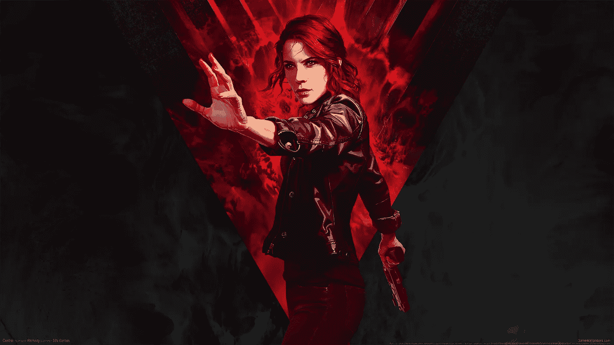
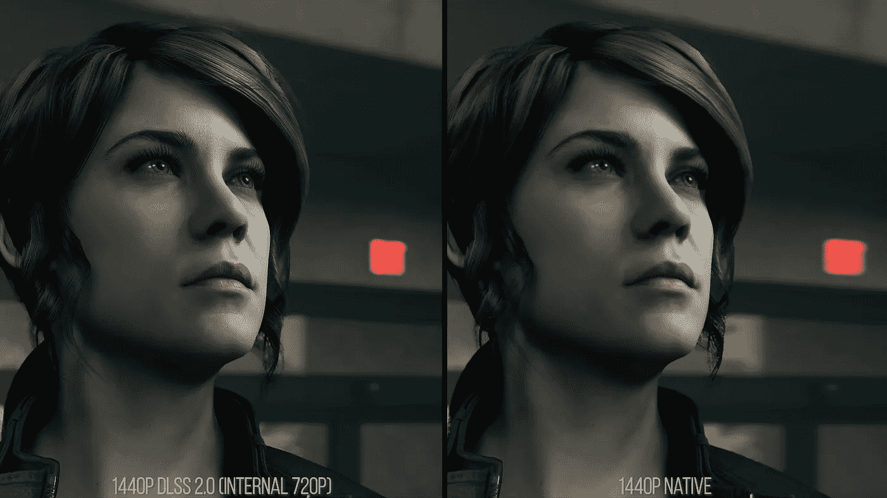
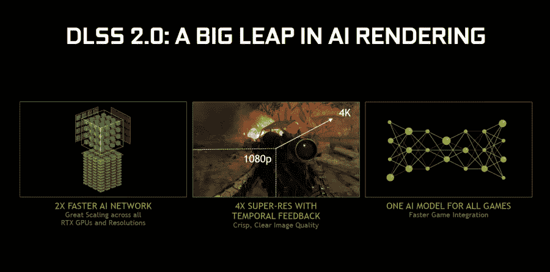
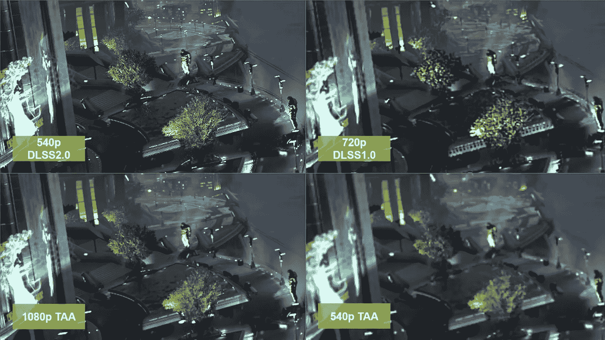

# 人工智能升级的 240p 游戏从来没有这么好看过

> 原文：<https://medium.datadriveninvestor.com/ai-upscaled-240p-games-have-never-looked-this-good-5d937d8c1ac2?source=collection_archive---------2----------------------->

## NVIDIA 的 DLSS 2.0 技术让游戏变得更加容易

Control takes advantage of NVIDIA’s DLSS 2.0 to deliver phenomenal visuals. Source: Remedy.

描绘一下这个。一款完美的次世代游戏，以游戏装备为借口运行，所有的铃铛和哨子都完好无损。以惊人的帧速率。虽然这听起来像一个白日梦，被大多数普通硬件对这些游戏来说不够好的事实所阻碍，但 NVIDIA 对高端的关注最终在这个过程中给了 PC 农民一个好处。

虽然光线跟踪迎合了那些希望从他们的机器中获得最佳性能的人，但 NVIDIA RTX 显卡系列中的人工智能加速张量核心还有另一个诀窍。它有可能改变低级玩家体验视频游戏的方式。

简而言之，以 540p(或更低)的分辨率玩游戏，而升级算法让你以原始的 1080p 甚至更高的分辨率体验游戏。虽然它不是渲染的圣杯，但它非常接近。

Control’s protagonist looks stunning even at 720p thanks to DLSS 2.0\. Source: Digital Foundry.

# 奇迹发生了

NVIDIA 在人工智能渲染方面取得了重大进展，使游戏玩家能够在更高的分辨率下玩游戏，而不会出现通常伴随分辨率提升的计算需求激增。要分解这个工程奇迹的技术方面，无疑需要这方面的硕士学位。但好处是显而易见的:游戏看起来更好*和*运行更好*。*最佳的技术奇迹。

自 2018 年 9 月 RTX 20 系列发布以来，他们的升级算法已经取得了很大进展。NVIDIA 的新卡采用了为工作站使用场景量身定制的 Tensor 内核。当涉及到视频游戏中的光线追踪时，他们也提供了很大的收益。但是 NVIDIA 才刚刚起步。

它还展示了其 DLSS(深度学习超级采样)技术，该技术可以有效地让你在视频游戏中应用图像放大，这一切都是实时的。它使用深度学习将图像放大到更高的分辨率，让神经网络来完成繁重的工作，而不是传统地运行游戏。这反过来导致了巨大的性能提升。通过显卡完成更少的计算，您可以达到更高的图形设置，而不会影响您的帧速率。他们是这样做的。

DLSS 2.0 shakes things up. Source: NVIDIA.

# 实现的诺言

NVIDIA 让 DLSS 听起来像是科技领域的下一个大事件，它肯定是有前途的。这是一种有效的反走样技术，旨在取代传统的锯齿边缘平滑技术，如 FXAA(快速近似反走样)。不幸的是，正如大多数处于婴儿期的技术一样，DLSS 1.0 并不是英伟达所说的银弹。只有少数游戏利用了这一功能，而且这不是一键解决方案。

《战地 V》和《地铁出埃及记》中的实现产生了模糊的混乱，损害了清晰度和纹理细节。尽管通过神经网络人工智能超级计算机运行了几十万次游戏，但事情并没有按计划进行。NVIDIA 的大胆承诺落空了，从必备变成了涂着凡士林的体验。他们承诺，更多的游戏将采用这项技术，但开发者发现这很难实现，而且质量远远达不到没有 DLSS 酱的游戏的视觉展示的预期。

幸运的是，NVIDIA 决定加倍投资 DLSS，一年后，DLSS 2.0 的改进让它不负众望。凭借卓越的质量，更好的分辨率扩展，以及不再需要逐个案例进行的培训，NVIDIA 似乎已经成为赢家。

DLSS 2.0 greatly improved upon the original AI upscaling technology. Source: Wccftech.

# 你只能活两次

DLSS 2.0 允许游戏重建各种复杂的细节，有时超过原生图像，其性能模式使分辨率从 540p 提高到 1080p，如上面的例子所示。困扰 DLSS 1.0 的模糊不再是一个问题，但它的继任者确实有一个略高的性能成本。DLSS 2.0 不仅使用图像来训练其深度神经网络，还使用低分辨率运动矢量来理解物体如何从一帧移动到另一帧，让它估计(以惊人的精度)下一帧会是什么样子。除此之外，这种神经模型不需要每场比赛都进行训练，而且没有人知道这项新生技术将从这里走向何方。

DLSS 2.0 更容易在游戏中实现，游戏质量符合玩家的期望，但目前只有少数游戏可以使用 DLSS 2.0。《控制》、《机甲战士五号》、《把我们送上月球》和《沃尔芬斯坦:热血青年》都见证了在不牺牲视觉效果的情况下性能的稳步提升。随着更多游戏的出现，这项技术的采用正在加快。与光线追踪一样，NVIDIA 的推动可能会使它成为大多数下一代产品的主要内容。AMD 正在开发跨平台的替代产品，这些优势可能很快就会在 AMD 电脑、PlayStation 5 和新的 Xbox 游戏机上显现出来。

目前，只有 RTX 卡可以利用这一功能。300 美元的 RTX 2060 对大多数消费者来说是一个相当陡峭的入门点，但 AMD 甚至英特尔开始推出更便宜的张量核心硬件只是时间问题。一个张量核数更低的淡化显卡可能会在从低分辨率升级的同时创造奇迹，使下一代图形进步可以为大众所用。总而言之，这是一个令人兴奋的游戏玩家时代。