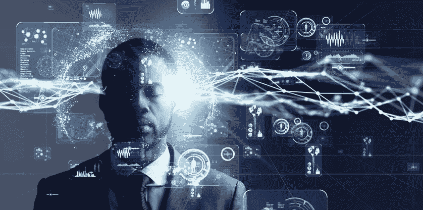

# AI，最终目标是什么？

> 原文：<https://medium.datadriveninvestor.com/ai-whats-the-final-goal-adb634e67404?source=collection_archive---------9----------------------->

为什么是 AI？这个创作的目标是什么？

Credit: Towards Data Science

AI… **一点都不新鲜！**不是现在才在智能手机或个人电脑上发现的。根据维基百科，人工智能研究领域是在 1956 年夏天达特茅斯学院校园内举行的一个研讨会上创立的。(我甚至还没出生)。

同年，达特茅斯学院召开了一个名为“达特茅斯会议”的会议，组织者是**马文·明斯基**、**约翰·麦卡锡**和两位资深科学家:来自 **IBM** 的**克劳德·香农**和**内森·罗彻斯特**。

> 学习的每一个方面或智能的任何其他特征都可以如此精确地描述，以至于可以制造一台机器来模拟它他们在会议上说。

他们认为人工智能只需要一代人就可以像真正的人一样行动和思考，很明显他们低估了发展和改进这种技术的难度。

人工智能的“父亲”是约翰·麦卡锡，他创造了人工智能这个术语。随着人工智能的发明，他们想:

1st —创建一个可以通过限制搜索来有效解决问题的系统

第二，构建一个可以自我学习的系统。

人工智能深入研究的成果之一是一个叫做通用问题求解器的新程序，由纽厄尔和西蒙于 1957 年开发。它能够解决更大范围的常识性问题。

# 人工智能发现(时间线)

显然，为了拥有我们今天所知道的人工智能，我们花了很多时间进行研究和开发。让我们看看人工智能从 1956 年**到 2018 年**的时间线(这个时间线归功于[维基百科](https://en.wikipedia.org/wiki/Timeline_of_artificial_intelligence)):

正如我们在第一章中所说，约翰·麦卡锡发明了“一般问题解决者”。

**1958** —约翰·麦卡锡([麻省理工学院](https://en.wikipedia.org/wiki/Massachusetts_Institute_of_Technology)或 MIT)发明了 [Lisp 编程语言](https://en.wikipedia.org/wiki/Lisp_programming_language)。

**1959 年**——[约翰·麦卡锡](https://en.wikipedia.org/wiki/John_McCarthy_(computer_scientist))和[马文·明斯基](https://en.wikipedia.org/wiki/Marvin_Minsky)创立了[麻省理工人工智能实验室](https://en.wikipedia.org/wiki/MIT_Computer_Science_and_Artificial_Intelligence_Laboratory)。

**1961** — James Slagle(麻省理工学院博士论文)用 Lisp 语言编写了第一个符号化的[集成](https://en.wikipedia.org/wiki/Integral)程序 SAINT，它解决了大学一年级的[微积分](https://en.wikipedia.org/wiki/Calculus)问题。

**1964**——Danny Bobrow 在麻省理工学院的论文(麻省理工学院人工智能小组的技术报告#1， [Project MAC](https://en.wikipedia.org/wiki/Project_MAC) )表明，计算机可以很好地理解自然语言，足以正确解决[代数](https://en.wikipedia.org/wiki/Algebra) [应用题](https://en.wikipedia.org/wiki/Word_problem_(mathematics_education))。Bertram Raphael 在麻省理工学院发表的关于 SIR 程序的论文展示了知识的逻辑表示对于问答系统的威力。

**1965**—[Joseph weizen Baum](https://en.wikipedia.org/wiki/Joseph_Weizenbaum)(麻省理工学院)打造了 [ELIZA](https://en.wikipedia.org/wiki/ELIZA) ，一个[互动程序](https://en.wikipedia.org/wiki/Interactivity)，可以用[英语](https://en.wikipedia.org/wiki/English_language)就任何话题进行对话。当一个“模拟”心理治疗师对话的版本被编程时，它是阿帕网人工智能中心的一个受欢迎的玩具。

**1968**——[麻省理工学院的理查德·格林布拉特(程序员)](https://en.wikipedia.org/wiki/Richard_Greenblatt_(programmer))开发了一个基于知识的[国际象棋程序](https://en.wikipedia.org/wiki/Computer_chess)， [MacHack](https://en.wikipedia.org/wiki/MacHack_(chess)) ，在锦标赛中足以达到 C 级。

**1975**—[Barbara Grosz](https://en.wikipedia.org/wiki/Barbara_Grosz)(SRI)对传统的人工智能话语建模方法进行了限制。Grosz、 [Bonnie Webber](https://en.wikipedia.org/wiki/Bonnie_Webber) 和 Candace Sidner 的后续工作发展了“居中”的概念，用于在自然语言处理中建立[话语](https://en.wikipedia.org/wiki/Discourse)和[回指的焦点。](https://en.wikipedia.org/wiki/Natural_language_processing)

**1979**——匹兹堡大学的 Jack Myers 和 Harry Pople 开发了 INTERNIST，这是一个基于 Myers 医生[临床](https://en.wikipedia.org/wiki/Clinic)知识的基于知识的医疗诊断程序。

**1981** — [丹尼·希利斯](https://en.wikipedia.org/wiki/Danny_Hillis)设计了连接机，它利用[并行计算](https://en.wikipedia.org/wiki/Parallel_computing)给人工智能和一般计算带来新的动力。(后来创立[思维机器公司](https://en.wikipedia.org/wiki/Thinking_Machines_Corporation))

**1985 年**——神经网络随着[反向传播](https://en.wikipedia.org/wiki/Backpropagation) [算法](https://en.wikipedia.org/wiki/Algorithm)而得到广泛应用，也被称为[自动微分](https://en.wikipedia.org/wiki/Automatic_differentiation)的反向模式由 [Seppo Linnainmaa](https://en.wikipedia.org/wiki/Seppo_Linnainmaa) 于 1970 年发表，并由 [Paul Werbos](https://en.wikipedia.org/wiki/Paul_Werbos) 应用于神经网络。

**1987**—alaritous Inc ./all star Advice Inc .多伦多公司推出第 2.0 代 Alacrity，这是首个商业战略和管理咨询系统。该系统基于一个前向链接、自我开发的专家系统，该系统包含 3，000 条关于市场和竞争战略演变的规则，由公司创始人 Alistair Davidson 和 Mary Chung 合著，其底层引擎由 Paul Tarvydas 开发。Alacrity 系统还包括一个解释财务报表和模型的小型财务专家系统。

**1989**—[金属-氧化物-半导体](https://en.wikipedia.org/wiki/Metal%E2%80%93oxide%E2%80%93semiconductor) (MOS) [超大规模集成电路](https://en.wikipedia.org/wiki/Very-large-scale_integration) (VLSI)的发展，以[互补 MOS](https://en.wikipedia.org/wiki/Complementary_MOS) (CMOS)技术的形式，使实用的[人工神经网络](https://en.wikipedia.org/wiki/Artificial_neural_network) (ANN)技术在 80 年代得以发展。该领域的一个里程碑式的出版物是 1989 年由卡弗·a·米德和穆罕默德·伊斯梅尔合著的《神经系统的模拟超大规模集成电路实现》一书。

**1992**——[卡罗尔·斯托克](https://en.wikipedia.org/w/index.php?title=Carol_Stoker&action=edit&redlink=1)和美国宇航局艾姆斯机器人团队用一个海底机器人[远程呈现](https://en.wikipedia.org/wiki/Telepresence) [遥控潜水器](https://en.wikipedia.org/wiki/Remotely_Operated_Vehicle)在南极洲麦克默多湾附近的冰面上操作，并通过卫星链接从加利福尼亚州的莫菲特场遥控。

**1994** — [加州大学柏克莱分校的洛特菲·扎德](https://en.wikipedia.org/wiki/Lotfi_Zadeh)创建了“[软计算](https://en.wikipedia.org/w/index.php?title=Soft_computing&action=edit&redlink=1)”[【49】](https://en.wikipedia.org/wiki/Timeline_of_artificial_intelligence#cite_note-49)并构建了一个融合了神经科学和[神经网络](https://en.wikipedia.org/wiki/Neural_net)系统、[模糊集](https://en.wikipedia.org/wiki/Fuzzy_set)理论和[模糊系统](https://en.wikipedia.org/wiki/Fuzzy_systems)、进化算法、[遗传编程](https://en.wikipedia.org/wiki/Genetic_programming)和[混沌理论](https://en.wikipedia.org/wiki/Chaos_theory)的世界研究网络英国跳棋世界冠军廷斯利在与计算机程序奇努克的一场比赛中辞职。奇努克击败了排名第二的玩家[拉弗蒂](https://en.wikipedia.org/wiki/Don_Lafferty)。奇努克以有史以来最大的优势赢得了美国全国锦标赛。

**1995**—[恩斯特·迪克曼](https://en.wikipedia.org/wiki/Ernst_Dickmanns)的一辆机器人汽车(带有机器人控制的油门和刹车)从[慕尼黑](https://en.wikipedia.org/wiki/Munich)到[哥本哈根](https://en.wikipedia.org/wiki/Copenhagen)来回行驶了 1000 多英里，在车流中，时速高达 120 英里，偶尔执行机动动作以超过其他汽车(只有在少数危急情况下才会由安全驾驶员接管)。主动视觉用于处理快速变化的街道场景。

**1997**——第一次正式的 [RoboCup](https://en.wikipedia.org/wiki/RoboCup) 足球比赛，以 40 支互动机器人队和 5000 多名观众的桌面比赛为特色。

**1998**—[uli ses CORTés](https://en.wikipedia.org/w/index.php?title=Ulises_Cort%C3%A9s&action=edit&redlink=1)和 [Miquel Sànchez-Marrè](https://en.wikipedia.org/w/index.php?title=Miquel_S%C3%A0nchez-Marr%C3%A8&action=edit&redlink=1) 组织欧洲第一次环境和人工智能研讨会 [ECAI](https://en.wikipedia.org/wiki/European_Conference_on_Artificial_Intelligence) ，“结合环境科学和人工智能”

2000 年——交互式机器人玩具([智能玩具](https://en.wikipedia.org/wiki/Smart_toy))上市，实现了 18 世纪新奇玩具制造商的愿景。麻省理工学院的 Cynthia Breazeal 发表了她关于社交机器的论文，描述了 Kismet(机器人)的面部表情。

**2002** — [iRobot](https://en.wikipedia.org/wiki/IRobot) 的 [Roomba](https://en.wikipedia.org/wiki/Roomba) 在导航和躲避障碍物的同时自主吸尘。

**2004 年**——[美国宇航局](https://en.wikipedia.org/wiki/NASA)的机器人探测车[勇气号](https://en.wikipedia.org/wiki/Spirit_rover)和[机遇号](https://en.wikipedia.org/wiki/Opportunity_rover)在[火星](https://en.wikipedia.org/wiki/Mars)表面自主导航。

**2005** — [本田](https://en.wikipedia.org/wiki/Honda)的[阿西莫](https://en.wikipedia.org/wiki/ASIMO)机器人，一个人工智能的人形机器人，能够像人一样快速行走，在餐馆环境中给顾客送[托盘](https://en.wikipedia.org/wiki/Tray)。/ [蓝脑](https://en.wikipedia.org/wiki/Blue_Brain)诞生，一个在分子细节上模拟大脑的项目。

**2007** — [DARPA](https://en.wikipedia.org/wiki/DARPA) 发起[城市挑战赛](https://en.wikipedia.org/wiki/DARPA_Grand_Challenge#2007_Urban_Challenge)，要求[自动驾驶汽车](https://en.wikipedia.org/wiki/Autonomous_cars)遵守交通规则并在城市环境中运行。

**2009**——[谷歌](https://en.wikipedia.org/wiki/Google)打造自动驾驶汽车。

**2010** — [微软](https://en.wikipedia.org/wiki/Microsoft)推出了适用于 Xbox 360 的 Kinect，这是第一款能够[追踪人体运动](http://research.microsoft.com/en-us/projects/vrkinect/)的游戏设备，仅使用一个 3D 摄像头和红外线检测，使用户能够无线玩他们的 Xbox 360。这款设备获奖的人体运动捕捉技术机器学习是由剑桥[微软研究院](https://en.wikipedia.org/wiki/Microsoft_Research#Laboratories)的[计算机视觉小组](http://research.microsoft.com/en-us/groups/vision/default.aspx)开发的。

**2011**——[IBM](https://en.wikipedia.org/wiki/IBM)旗下[沃森](https://en.wikipedia.org/wiki/Watson_(artificial_intelligence_software))电脑击败[电视](https://en.wikipedia.org/wiki/Television) [游戏节目](https://en.wikipedia.org/wiki/Game_show) [Jeopardy！](https://en.wikipedia.org/wiki/Jeopardy!)冠军[鲁特](https://en.wikipedia.org/wiki/Brad_Rutter)和[詹宁斯](https://en.wikipedia.org/wiki/Ken_Jennings)。

**2013** — [机器人](https://en.wikipedia.org/wiki/Robot) HRP-2 由[日本](https://en.wikipedia.org/wiki/Japan)的 SCHAFT 公司建造，是[谷歌](https://en.wikipedia.org/wiki/Google)的子公司，击败 15 支队伍赢得 [DARPA](https://en.wikipedia.org/wiki/DARPA) 的[机器人挑战赛选拔赛](https://en.wikipedia.org/wiki/DARPA_Robotics_Challenge#Trials)。在救灾所需的 8 项任务中，HRP-2 得到了 32 分中的 27 分。任务是驾驶车辆，走过碎片，爬梯子，清除碎片，走过门，穿过墙壁，关闭阀门和连接软管。

**2011–2014**——[苹果](https://en.wikipedia.org/wiki/Apple_Inc.)的[Siri](https://en.wikipedia.org/wiki/Siri)(2011)[谷歌](https://en.wikipedia.org/wiki/Google)的[Google Now](https://en.wikipedia.org/wiki/Google_Now)(2012)[微软](https://en.wikipedia.org/wiki/Microsoft)的 [Cortana](https://en.wikipedia.org/wiki/Cortana) (2014)都是使用[自然语言](https://en.wikipedia.org/wiki/Natural_language)回答问题的[智能手机](https://en.wikipedia.org/wiki/Smartphone) [应用](https://en.wikipedia.org/wiki/Application_software)

**2015**——一封由[霍金](https://en.wikipedia.org/wiki/Stephen_Hawking)、[马斯克](https://en.wikipedia.org/wiki/Elon_Musk)、[沃兹尼亚克](https://en.wikipedia.org/wiki/Steve_Wozniak)和 3000 名人工智能和机器人研究人员签名的禁止研发和使用自主武器的公开信。

**2016**——[谷歌](https://en.wikipedia.org/wiki/Google) [DeepMind](https://en.wikipedia.org/wiki/Google_DeepMind) 的 [AlphaG](https://en.wikipedia.org/wiki/AlphaGo) o 以 5 局比 0 击败 3 次欧洲围棋冠军 2 丹职业[范辉](https://en.wikipedia.org/wiki/Fan_Hui)。

**2017** — Deepstack 是首个发表的在不完美信息游戏中击败人类玩家的算法，在单挑无限注[扑克](https://en.wikipedia.org/wiki/Poker)中显示出统计意义。不久之后，不同研究小组的扑克人工智能 [Libratus](https://en.wikipedia.org/wiki/Libratus) 分别击败了它的 4 个人类对手——世界上最好的玩家——在统计意义上的样本上，以异常高的总胜率。与国际象棋和围棋不同，扑克是一种不完全信息游戏。

**2018** —在斯坦福大学的阅读和理解测试中，阿里巴巴语言处理人工智能的得分超过了顶级人类，在一组 10 万个问题中，得分为 82.44 比 82.304。(2)欧洲学习和智能系统实验室(*又名* Ellis)提出作为美国人工智能努力的泛欧洲竞争者，目的是沿着二战后欧洲核子研究中心的路线，防止人才外流。(3)宣布推出 [Google Duplex](https://en.wikipedia.org/wiki/Google_Duplex) ，这是一项允许人工智能助理通过电话预约的服务。《洛杉矶时报》认为人工智能的声音是对人类语言的“近乎完美”的模仿。

这大致是 2018 年之前人工智能发现的时间线，非常接近现在。几千年前就有了机械人的概念，看看现在的人工智能。

人形机器人和机器人越来越发达，它们正在各个领域帮助我们。人工智能现在存在于每一部手机中，只要问“嘿 Siri”或“好的谷歌”，它就会以一种智能的方式(不总是)回应你。

iPhone 上有 Siri 建议:iPhone 的 AI 会研究你的行为，你打开一个应用程序的次数和程度，在你需要时向你提出建议。

(我想从这个时间线上只拿走人工智能最重要的发现，希望你会喜欢。)

# 进化

Evolution until AI

正如我们已经看到的，我们有非常不同的方法让机器学习一些东西并自己为我们做。假设 AI 是一个人类:一开始，当他还是个孩子的时候，他学习了他的语言。

一旦他长大一点，他就学会了如何做数学运算。

他是一个青少年，他学会了如何像一个真正的人一样和我们说话，以及如何玩一些游戏，如国际象棋和许多其他游戏。

现在他成长得更快，他已经过了主要年龄，假设他现在 20 岁；他了解了我们的态度，并在此基础上向我们提供了一些我们可能感兴趣的产品广告，此外，他还试图学习如何驾驶汽车。

现在他 30 岁了，他知道如何驾驶汽车，解决问题和数学算法，向我们建议产品，地点，餐馆，自动驾驶汽车，像一个真正的人一样和我们说话。

简而言之，这是人工智能的主要发展，令人印象深刻的是今天这项技术有多么强大。

实际上**我正在用一个基于人工智能的设备写这个系列**…但是，它显然不能自己做任何事情。AI 没有了人类来使用它的**就没用了**。这也是 [**科技无法取代人类的众多原因之一。**](/y-technology/is-time-to-clarify-this-question-a83c16d01710)

人工智能是为了帮助我们而不是取代我们而开发的，在日常生活中，我们可以清楚地看到，与大约 50 年前相比，它大大简化了我们的生活。

# 人工智能的未来

Credit: CDO Trends

我们在世界各地有很多智能设备，比如自动驾驶汽车、智能手机、家用设备等等。但是让我们想想，10 年后，也就是 2030 年，会是什么样子？AI 会比今天爆炸吗？还是 vintage 会赢得这场比赛，世界会拒绝这项技术？

技术上来说，AI 现在正在爆发。**美国在 155 项投资中筹集了 44 亿美元**，中国在 149 项投资中筹集了 49 亿美元。这让我们知道，在未来的几年里，这个世界将比今天更多地由人工智能设备构成。

我们将(可能)看到宝马或任何其他汽车公司，发布其新的自动驾驶汽车，可能更多的人形机器人和更多的自助酒店和其他服务，换言之，**生活将比今天更容易。**

但是我们的习惯呢？他们会改变吗？**当然，但不是全部。**

比方说，如果我们过去常常去 McDrive 买些吃的，我们可能会和机器人说话，而不是女孩/男孩，等等。**这些只是本质**和**实际上没有人知道未来**，也许复古会赢得这场比赛，整个人类都会拒绝技术的过剩。谁知道呢？

# 最终目标

Credit: HRPS Blog

正如我们所见，人工智能已经在一小段时间内进化了。

每天都有改进和新技术发明，但是真正的目标，最终的目标是什么？

实际上，有很多目标，比如:

*   **医疗保健**
*   **汽车**
*   **审计**
*   **艺术**
*   **广告**
*   **政府**
*   **法律**
*   **视频**游戏
*   **军事**

当你看到这个列表后，也许你已经找到了为什么发明人工智能的正确答案。

如果你不是，我会告诉你。人工智能从一开始就被发明出来，做一些正常人做不到的事情。

如果我们从生产的角度来说，在汽车工业、手表工业和更多的工业中，我们有全天候工作的机器人。

如果我们只是简单地谈论商业，我们在任何电子商务网站上，如亚马逊、全球速卖通、Wish 等，都有客户服务机器人，它甚至可以在凌晨 2 点帮助你。

如果我们谈论交易，我们现在有很多公司，像 E-Toro，IQ Option 等等，它们与 AI 合作，告诉你投资的正确时间，或者自动复制另一个投资者的投资。

今天，人工智能是我们一切事物的主要来源。从智能手机到智能家居。如果没有艾，我不可能在 [**中**](/@ytechnologyblog) **上发表这个系列。**

快速回顾一下，人工智能的最终目标是帮助我们每天所做的一切。

随着所有这些改进，也许人工智能将取代我们现在正在做的一些事情，但我不认为这将取代一整个类型的工作。

> 人工智能是一项伟大的技术，但它不能像我们人类一样什么都不做。记住这一点。”

## [本文摘自我的原创系列。](https://medium.com/series/ai-what-is-the-final-goal-5b55d82f6703)

# 如果你已经阅读了整篇文章，非常感谢你，干杯！

