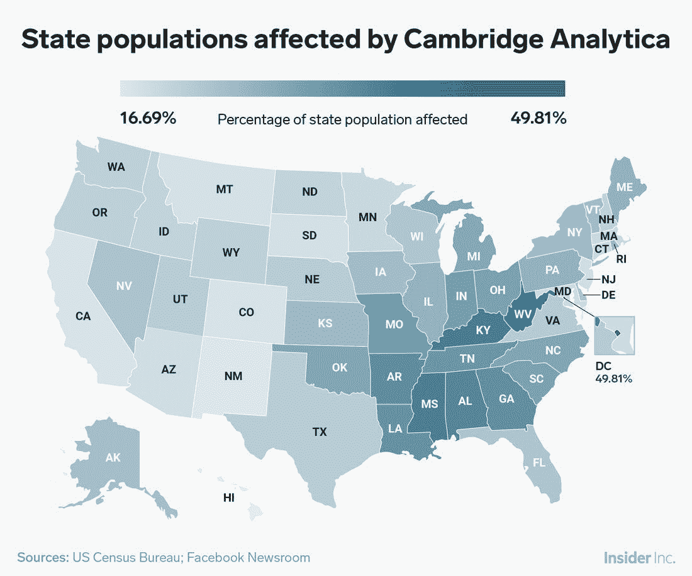
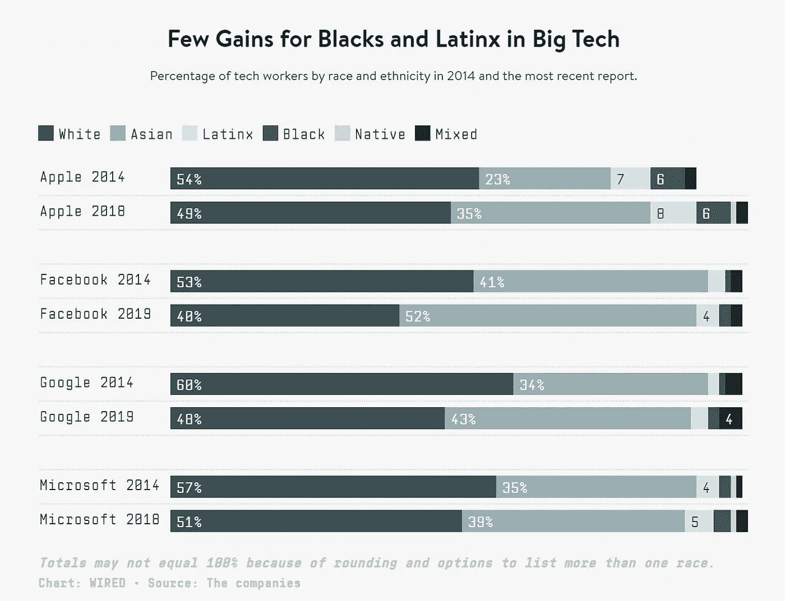
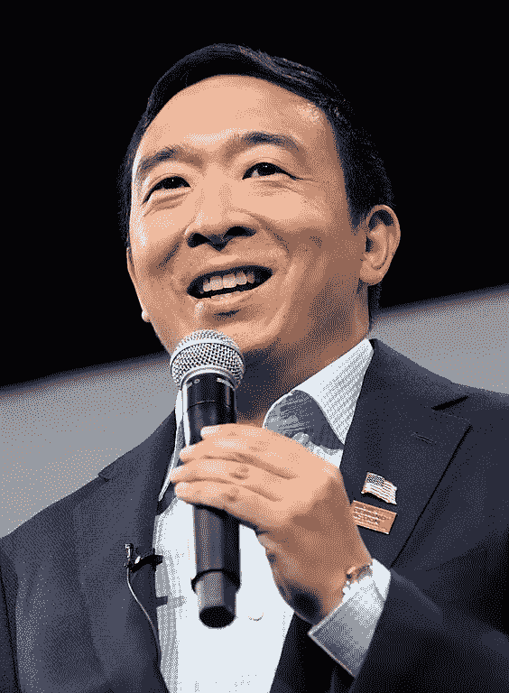
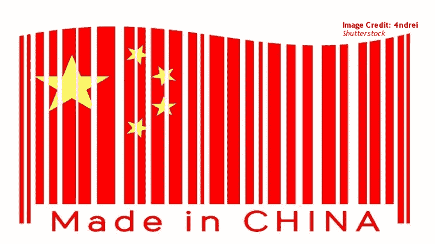
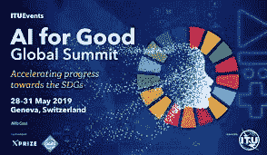

# 人工智能将改变我们的政治

> 原文：<https://medium.datadriveninvestor.com/ai-will-change-our-politics-9e80bfbae35?source=collection_archive---------11----------------------->

根据弗拉基米尔·列宁的说法，“共产主义是苏维埃政府加上整个国家的电气化。”最成功的政治机构认识到技术的力量，并利用它来塑造世界。蒸汽和机车将英国推向帝国，而核武器将美国引向霸权。自动化和人工智能是新的政治战场。

事实上，另一位俄罗斯人弗拉基米尔·普京也在技术上下了类似的赌注，他说:“谁成为(人工智能)的领导者，谁就将成为世界的统治者。”现代国家不仅面临着复杂的技术世界，还必须考虑到本世纪将会发生的金融、社会和军事机构的混乱。

 [## 认知计算——一套被广泛认为是……

### 作为它的用户，我们已经习惯了科技。这些天几乎没有什么是司空见惯的…

www.datadriveninvestor.com](https://www.datadriveninvestor.com/2020/02/19/cognitive-computing-a-skill-set-widely-considered-to-be-the-most-vital-manifestation-of-artificial-intelligence/) 

围起这片土地是困难的。人工智能仍处于婴儿期，令人惊讶的发展(或失败)是不可避免的。尽管未来不确定，今天的人工智能是一项有影响力和充满活力的技术。让我们来看看人们在争论是否、何时以及如何与在越来越多的任务中比人类做得更好的机器争论的领域。

这是人工智能需要考虑的九个方面。

# 1.不断发展的行业的标准和实践

美国对人工智能采取不干涉的态度。现任政府的指导方针支持增加研发并鼓励道德标准。政府寻求美国在科技领域的主导地位，并保持熟练的劳动力。美国人工智能伦理学家关注问责制、透明度和公众信任。

# 开放发展

A painting made by Tensorflow, Google’s open-source AI software.

就像青霉素和 T2 三点式安全带一样，人工智能的开放发展为所有人提供了知识。像 OpenAI 这样的组织通过发布他们项目的源代码来实践这一原则。OpenAI 在[宪章](https://openai.com/charter/)文件中阐明了他们的意图。

“OpenAI 的使命是确保人工通用智能(AGI)——我们指的是在大多数有经济价值的工作中超越人类的高度自主的系统——造福全人类。我们将尝试直接建设安全和有益的 AGI，但如果我们的工作帮助他人实现这一结果，我们也将认为我们的使命已经完成。”

谷歌和 [IBM](https://developer.ibm.com/collections/codait/) 提供一些相同的开源能力，并邀请外部人士了解和讨论项目。开放开发导致对这些复杂系统的更多审查和信任。当机器做出的选择令人费解时尤其如此。想想 Deepmind 的游戏机器人 AlphaGo，它做出了非正统、反直觉的举动，击败了世界冠军。AlphaGo 的创造者无法破译赢得比赛的决定，但人工智能决策的清晰性对于未来系统的信任至关重要。

# 主动报告

Microsoft’s Twitter bot, Tay went down the wrong path. At least Microsoft was upfront about their failings.

脸书的座右铭曾经是“快速移动，打破东西”这家科技巨头利用这一公式取得了巨大成功，但目前的情况需要进一步反思。*多快？* *什么可能会坏？*

2016 年，微软的聊天机器人 Tay 在 Twitter 上发布。16 个小时后，Tay 被下线。Twitter 用户破坏了这个机器人。泰很快推动否认大屠杀，并指责喜剧演员里奇·格威斯发明无神论。在短暂的重启期间，它庆祝在警察面前抽“kush”。从长远来看，微软的灾难使人工智能聊天机器人更加强大，因为它们清晰地报告了这场灾难。其他研究团队现在可以避免同样的错误。也就是说，允许巨魔进入机器人的大脑。

# 2.隐私辩论

A map from Insider Inc. showing how Cambridge Analytica used user data to influence the 2016 election.

一个常见的技术政治对话是关于用户数据和数据收集的。爱德华·斯诺登的美国国家安全局泄密事件和脸书与剑桥分析公司的关系都引发了争论。人工智能综合数据的能力增加了该领域治理的重要性。

# 谁得到我的数据？

自 2017 年以来，数据一直是地球上最有价值的资源。受益人收集、使用和出售它；大型科技公司、政治活动家和广告商。人工智能政策专家质疑基于从未读过的服务协议条款的财富产生。对这种商品征收更高的税可能会获得政治支持。用户可能有一天会要求为我们提供的数据付费。

# 警察用…

Hong Kong Protesters have used laser pointers to disrupt government surveillance cameras using facial recognition software.

当局长期受益于这一前沿技术。从 DNA 测试到指纹识别，新的生物识别技术使得隐藏变得困难。现在，面部识别技术已经超越了人类的能力，并在大规模上发挥作用。在这个充满不信任的时代，军事化的治安和种族主义受到公众的密切关注。已知能增强这些现实的技术肯定会面临阻力。[一些城市](https://www.nytimes.com/2019/05/14/us/facial-recognition-ban-san-francisco.html)和国家已经禁止面部识别执法。

# 认股权证？

无处不在的热门话筒以新的方式挑战隐私权。[虚拟助手](https://www.theguardian.com/technology/2019/mar/26/smart-talking-are-our-devices-threatening-our-privacy)已经渗透到我们的家庭和口袋，留给我们的想象空间微乎其微。私人场所变成了公共场所，当局正在利用这一灰色地带。

# 3.公平

人类并不垄断歧视、残忍或不幸的决策。确切地确定如何确保公平是一个复杂而富有哲理的话题。

# 偏见

A graph from Wired shows little employment gains for Latino/a, black and natives in big tech.

机器经常持有与它们的程序员相同的[偏见](https://www.theguardian.com/technology/2018/oct/10/amazon-hiring-ai-gender-bias-recruiting-engine)，或者那些程序员提供给它们的数据集。例如，亚马逊取消了一个招聘机器人，因为它偏爱白人男性。根据当前员工的有偏见的数据集，机器了解到白人男性更有可能在亚马逊工作，因此是更好的候选人。一个人如何创造一个能反映使用者价值观的人工智能？人工智能公平领域的新项目 Stereoset 揭示了语言模型中的偏见。在实践中，这可能导致对开发团队的包容性要求。可能需要像 Stereoset 这样的程序来防止数字歧视。

# 伦理从何而来？

Socrates, the father of modern philosophy.

哦，亲爱的……这远比一篇中级文章更有深度，但是技术中的伦理问题首先会转化为伦理是什么的问题。[无轨电车问题](https://en.wikipedia.org/wiki/Trolley_problem)是开始讨论无人驾驶汽车的好地方。每一种文化、每一代人和每一个人都有对与错的认知。这对 T2 扎克伯格来说太大了。

# 4.经济影响

经济与技术有着内在的联系。农业、蒸汽机和互联网重组了经济。我们当前的技术趋势；“[第四次工业革命](https://www.forbes.com/sites/bernardmarr/2018/08/13/the-4th-industrial-revolution-is-here-are-you-ready/#59d6b41c628b)”承诺令人震惊的变化。当机器与人类的效率不相上下时，工作的未来是不确定的。随着完成任务所需的人越来越少，财富也就越来越多。

# 自动化

A fully automated factory.

未来几十年，大量现有工作可能会消失。例如，自动驾驶卡车将使这个国家最受欢迎的职业过时。甚至管理工作也可以在一定程度上被技术优化。虽然某些任务需要人类来完成，但机器将承担更大的负荷。实际上，同样的工作量需要更少的人。过去曾发生过劳动力中断的情况，但从历史上看，手动任务已被取代。下一波征服认知任务。前总统候选人杨安泽用他的签名“自由红利”提到了这个问题。由于自动化导致的失业，他主张保证政府津贴。

# 不平等

Former presidential candidate Andrew Yang has found a surprisingly receptive audience for his idea of a Universal Basic Income due to unemployment caused by COVID 19.

如果一个由失业和无法就业的人组成的“无用阶层”膨胀，政府将如何应对？今天的无家可归者是否提供了一个模板，还是会有新的社会项目或慈善事业出现来填补空白？大量就业市场的自动化带来了问题。一些人提议保障工作权、普遍基本收入(UBI)或支付低技能工人学习其他职业。

# 确保获得有益的人工智能

The documentary is known for publicizing the car industry’s campaign to end early electric vehicle production.

Today, electric vehicles are on the verge of widespread usage. Many thought the same in [1990](https://www.politico.com/story/2019/09/16/oil-industry-electric-car-1729429), when California passed a mandate meant to establish electric vehicles as early as 2003\. The fossil fuel industry dismantled the measure, dooming EV’s to a dark winter. With today’s new technology, great leaps in [medicine](https://www.datarevenue.com/en-blog/artificial-intelligence-in-medicine), productivity and information tech will transform billions of lives. A great danger is that the most powerful uses of new technology will be locked away in ivory towers. The leaders of tomorrow should ensure their constituents’ access to major technologies.

# 5\. Juicing Useful Research

By 2025, China hopes to reclaim the phrase to mean the pinnacle of technological innovation.

Currently, the goal of most AI governance strategies is to create novel, useful AI systems for the use of governments. The Made In China 2025 initiative demonstrates Xi Jinping’s desire to fund his country’s tech future. The US funnels research dollars into DARPA and seals lucrative deals with tech giants to gain the upper hand in an escalating AI arms race. Of course, military contracts are a fraction of potential applications.

# Humanitarian Uses

Humanitarian use of AI is among the least explored and least understood areas for governance. The concept has been proven by automating the placement of [refugees](https://www.refugees.ai/) into ideal locales. Other systems demonstrate powerful medical diagnostic capabilities making phones nearly as capable as doctors. With AI, education can be perfectly tailored to individual students, maximizing their potentials. Machines streamlining bureaucracy will make humanitarian work easier to administer.

# Financial Uses

Much of the current financial system is guided by computers. Successful investment firms do not only rely on talented bankers. Wall Street jockeys for powerful algorithms to analyze and react to markets. [Enterprise](https://hai.stanford.edu/sites/default/files/ai_index_2019_report.pdf) use of AI is transforming business operations today. Intelligent systems make the most byzantine areas of finance and taxation as simple as clicking a button.

# Military Uses

五角大楼与谷歌和微软的交易因其争议而闻名。尽管人们对将人类驱逐出战争感到担忧，但让一支过时的军队冒险是不可避免的。重组武装力量可能决定胜败。转移或实施瘫痪性网络攻击的能力将至关重要。像阿尔法星这样的人工智能的战略之眼对于对抗敌方战斗人员来说是不可或缺的。

# 6.自主武器

A drone targets a truck.

枪支*做*杀人。机器视觉的进步允许无人机在没有人类手指的情况下进行打击。许多国家签署了承诺不发展这项技术的条约，但是风险依然存在。

# 7.安全系统

人工智能的风险不像电影中的那样是 T4，然而技术发展有一段灾难的辉煌历史。芥子气和切尔诺贝利就是明显的例子。有了人工智能，理解事情是如何出错的对于防范灾难是至关重要的。

# 奖励黑客

An example of reward hacking.

要教一个 AI，首先要定义“赢”是什么样子。例如，一个整理机器人可能认为“赢”是清除所有卧室表面的垃圾和衣服。一个聪明的人工智能会把垃圾放在垃圾桶里，把衣服放在洗衣篮里。一个聪明的机器人会把地毯拉起来，然后把所有东西放在下面。这种误解是一个常见的错误，被称为“奖励黑客:”不正确地遵循规则。预见这些结果是安全性研究的主要焦点。

# 环境外部性

机器都是一根筋。分配一项任务，他们就会尝试，不会问任何问题。想象一下，一个自主机器人被制造出来清除入侵的风滚草。风滚草对农作物来说是一种可怕的火灾隐患，但野生动物会吃它。在完成预定任务时，机器可能会对其他区域造成损害。这类问题很容易影响人类、环境或经济。为了最大限度地降低这种风险，可能需要在系统投入运行之前进行审核。

# 8.政治武器

Special Counsel Robert S. Mueller III charged Russian Intelligence Officers for hacking US systems.

技术对政治体系的影响现在是毫无疑问的。在互联网的早期，信息的自由流动被认为带来了更大的民主。近年来，专制政权削弱了这一观点。影响国民思想的计算机威胁着政治机构和真理本身。

# 误报

俄罗斯影响了过去十年的世界选举。他们的方法将在下一年扩展。人工智能不仅会优化个性化信息的选民定位，而且深度伪造的视频也构成了威胁。这项技术的质量实际上没有我们想象的那么重要。虚假的阴谋很容易传播。事实核查滞后，有时甚至支持最初的错误主张。

# 淹没该地区

20 世纪的宣传网络压制了信息，但现代宣传用错误信息饱和了公众的理解。目标是扼杀客观真理的概念。宣传者的目的不是证明一个观点是准确的，而是让真相变得难以发现。

# 9.谁站出来了？

解决 2020 年及以后的全球问题带来了独特的挑战。许多西方国家正在退出支持民族主义的全球共识。北约、欧盟和联合国等国际组织陷入了信誉危机。技术挑战需要迅速合作，无论是国际合作还是其他合作。

# 公司间组织

人工智能治理的主体在私营部门。由于科技公司的专业知识，它们可能最有能力应对监管。然而，他们有将利润置于人之上的风险。许多公司签署了由行业领袖撰写的道德声明。他们要求内部委员会建立道德框架。尚不清楚这一结果是对人工智能的道德做法，还是为了满足紧张的公众的宣传噱头。

# 国家机构

从历史上看，各国政府决定了技术政策的成功与否。大多数国家都在积极推行自己的人工智能治理议程。

中国的 AI 计划无疑是世界上最大胆的。这个共产主义国家认为在这一领域的主导地位对全球主导地位至关重要。今天，中国非常依赖国际技术。Xi 主席打算在未来几年内解决这一问题。

法国的战略名为“人工智能造福人类”，到 2022 年将在人工智能领域投资 15 亿欧元。有了这笔资金，他们将解决医疗保健、环境和交通等领域的问题，包括人工智能安全和包容性。

一项战略的效力可能会受到党派分歧和特殊利益的限制。然而，国家限制可能被证明是独一无二的可靠和可执行的。

# 国际机构

Much of the world is realizing that AI is not a national strategy, but a global one.

许多国家在诸如北约或联合国等领域的合作可能会发现很难就人工智能原则达成一致。尤其是当全球联盟涵盖不同形式的政府时。像人权和国家控制这样的概念在各大洲之间有很大的不同。在莫迪的领导下，印度可能会比德国更积极地利用面部识别。腐败猖獗的国家可能更难允许自动欺诈检测。在卫生技术生产等领域可能会找到一些共同点。

## **结论**

总之，这个世界对新技术带来的变化毫无准备。那些最能利用这些新发现的力量的人将会得到丰厚的回报，而其他人将会被抛在后面。这种力量伴随着巨大的责任，因为影响普通人的生活、生计和思想的能力从未如此强大。在一个传统智慧无法回答甚至无法理解数字时代的崩溃的时刻，我们必须依靠我们最珍视的公平、正义和自由的价值观。我们将通过相互关爱取得胜利。