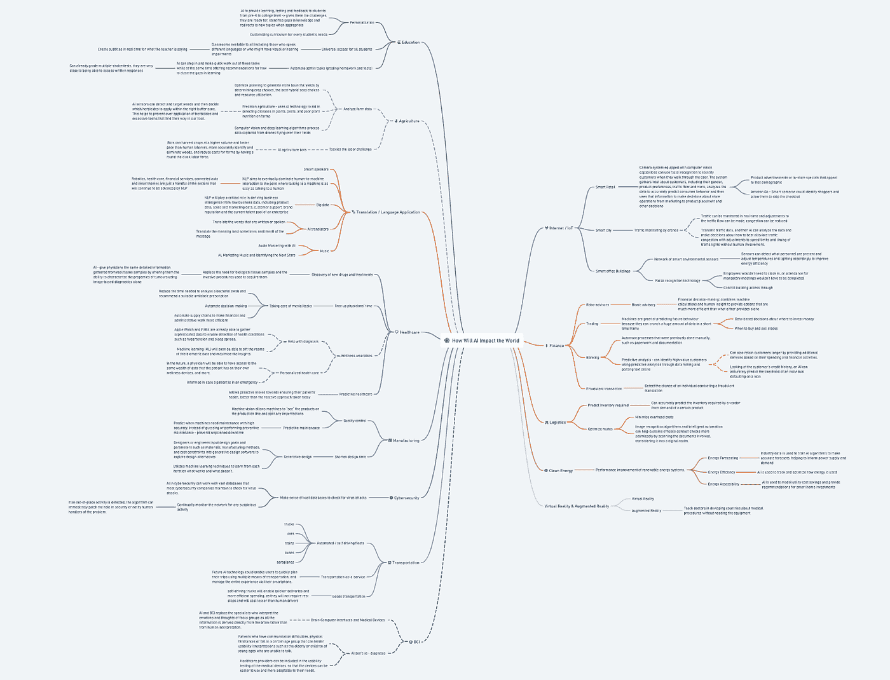
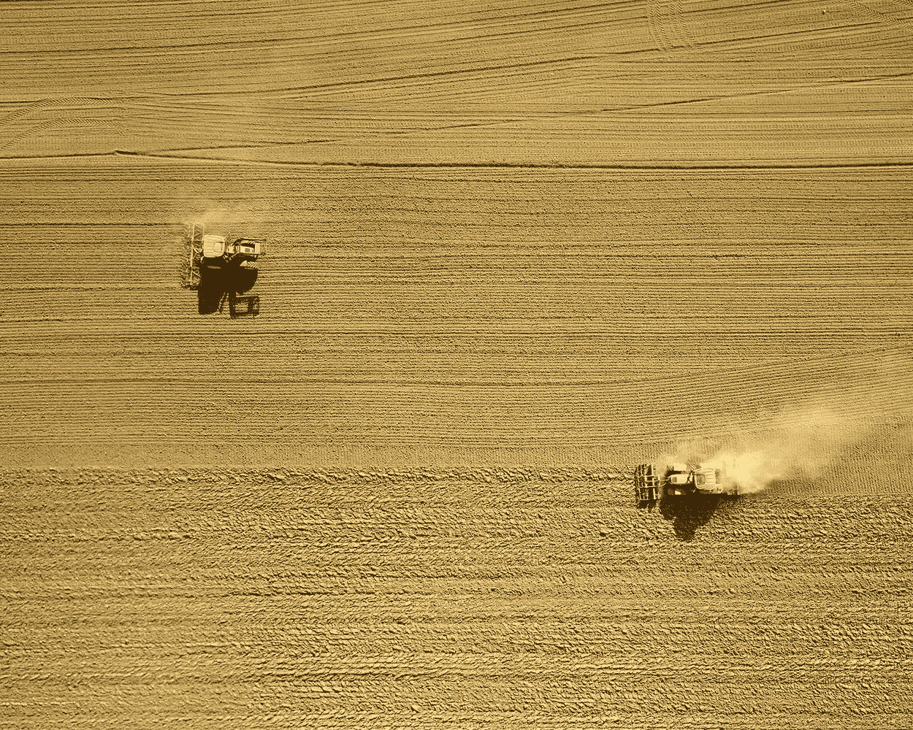
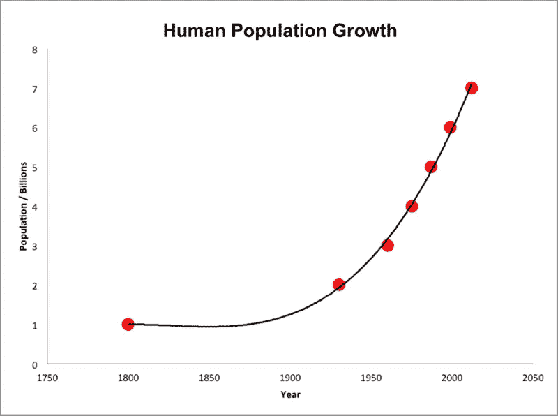

# 人工智能将改变世界——以下是改变方式

> 原文：<https://medium.datadriveninvestor.com/ai-will-change-the-world-heres-how-c9da9a72874b?source=collection_archive---------12----------------------->

Photo by [Louis Reed](https://unsplash.com/@_louisreed?utm_source=medium&utm_medium=referral) on [Unsplash](https://unsplash.com?utm_source=medium&utm_medium=referral)

世界正在我们面前发生变革——人工智能(AI)正在彻底改变每个行业！

到目前为止，大多数人都听说过人工智能，因为它是一个浪漫化的概念，引起了媒体的广泛关注。可以理解的是，人们想知道 ***什么是*** 人工智能，并问了一个或多个这样的问题——人工智能是如何工作的？人工智能有哪些不同的类型？什么是机器学习？

虽然思考什么是人工智能很有趣，但我认为更重要的问题是——人工智能将如何影响世界？毕竟，当数学在公元前 6 世纪被创造出来时，大多数人都想知道数学是什么，并没有关注数学将如何永远改变世界的问题。如果他们有，他们可能已经为建筑、银行、金融和天文学的革命做好了准备。

因此，我没有写人工智能的*是什么，而是通过制作我认为将受到人工智能实质性影响的行业的****思维导图，探索了 ***人工智能将如何改变世界！********

******

***这篇文章将聚焦于人类最基本的制度，这些制度允许我们吃、住、学，并解释它们将如何随着人工智能而改变。然后我们将探索这些创新将如何改变世界！***

# ***🚜农业革命***

******

***人类和其他动物一样，需要吃东西！然而，使人类不同于其他物种的是，我们可以耕种，因此，分配更多的时间和精力来思考。***

*** [## 语音没有死亡——人工智能如何改变呼叫技术游戏|数据驱动的投资者

### 语音死了吗？这是一个公平的问题。关于流程数字化、新应用和增强型移动银行的讨论…

www.datadriveninvestor.com](https://www.datadriveninvestor.com/2020/10/08/voice-isnt-dead-how-ai-is-changing-the-call-tech-game/) 

然而，人口呈指数增长，选择务农的人越来越少。所以，我们需要确保农业能够高效地组装和分配粮食。

> “世界农业人口正在老龄化。随着年轻人越来越多地选择城市生活，谁来种植我们的食物？”玛莎·亨利克斯

最有可能的是，为你的下一顿饭种植粮食的农民已经结束了他们大部分的职业生涯。在英国，农民的平均年龄是 59 岁。在肯尼亚，这个数字是 60。在日本，农民的平均年龄最高，为 67 岁。突然之间，全球的食物供应开始变得非常不确定**——但是不要害怕，AI 来救援了！**

**人工智能农业机器人可能会让你在未来吃到一碗美味的意大利面。为什么？嗯，机器人可以**比人工收割更高产量和更快速度的作物**，更准确地识别和清除杂草，并且**通过全天候劳动力降低农场成本**。**

**人工智能农业机器人使用 [**精准农业**](https://croplife.ca/field-notes-precision-agriculture-canada/) 来帮助检测植物中的疾病、害虫和农场中的植物营养不良。一旦传感器检测到并锁定杂草，人工智能就可以用来决定在正确的缓冲区内使用哪些除草剂。这有助于防止在我们的食物中过度使用除草剂和过量的毒素。**

**人工智能农业机器人还可以模仿人类农民的专业技能来规划农场的运作。计算机视觉和深度学习算法可以处理从农场上空飞行的无人机捕获的数据。然后，这些数据可用于优化规划，通过确定作物选择、最佳杂交种子选择和资源利用来提高产量。**

# **🚑医疗保健革命**

****

**谁不想拥有足够健康的自由，与爱人一起玩耍、创造和留下美好的回忆呢？但是要做到这一点，我们需要更好的药物和治疗方案，个性化的医疗保健，以及对精神健康疾病更好的诊断和治疗。幸运的是，有了正确的技术，这可以成为现实！**

## **早日康复！—用更好的药物和治疗方案**

**当人体出现问题时，人类有很多东西需要学习来修复它。然而，人类不需要成为唯一一个致力于解决这个问题的人——人工智能可以帮助发现新的药物和治疗方法！这里有一些人工智能可以帮助你尽快康复的方法。**

**由于集成数据科学，每个人都可以接触到个性化医疗调查人员。综合数据科学允许你把独立的数据集汇集在一起，并把它们组合成一个可以进行统计分析的实体。然后，人工智能可以在不同的、关联的健康数据集中找到联系和新的见解。**

**此外，在未来，人工智能可以取代对生物组织样本的需求以及用于获取它们的侵入性程序。人工智能将为医生提供从真实组织样本中收集的相同详细信息，使他们能够单独使用[**基于图像的诊断**](https://www.forbes.com/sites/charlestowersclark/2019/04/30/the-cutting-edge-of-ai-cancer-detection/#872469733639) **来表征肿瘤的属性。****

**拜拜文书工作！我从来没有见过一个医生喜欢琐碎的工作，而不是研究新的治疗方法和发现，或者帮助病人了解他们的疾病。嗯，希望很快就不可能遇到一个喜欢粗活的医生，因为人工智能会照顾他们。人工智能可能会使供应链自动化，使财务和行政工作更有效率——让医生有时间做更多有影响力的工作。**

## **独特的人需要个性化的医疗保健**

> **“今天你是你，这是真实的。没有一个活着的人比你更好。”—苏斯博士**

**昨晚你睡了几个小时？你的压力有多大？你早餐吃了什么？每个决定都让我们变得独一无二，并可能对我们的健康产生不同于他人的影响。**

**这就是为什么先进的健康设备是个性化医疗保健急需变革的关键。将来，医生将能够像病人一样在他们自己的健康设备上访问大量的数据。这将允许医生采取**主动的**行动来确保他们病人的健康，而不是今天采取的**被动的**方法。**

## **我们需要数字！—关于大脑的定量知识**

**《精神障碍诊断和统计手册》第五版(DSM-5)和《国际疾病统计分类》(ICD-10)有一些共同点——它们都有很长的标题。哦，事实上它们是目前用于精神疾病分类的两个主要系统。**

**这些书涵盖了所有已知的儿童和成人精神健康障碍。他们还有一个分类系统，试图根据对症状的描述将精神疾病分为不同的诊断类别。**

**然而，借助人工智能、脑机接口和医疗设备，定量信息可能直接来自大脑的神经生物学，而不是来自专家对症状的定性解释。**

**这种进步可以帮助有交流困难、身体障碍或属于某个年龄组的患者，该年龄组可以阻止定性症状解释，例如不能说话的老年人或年幼儿童。**

# **📚教育革命**

****

## ****世界各地****

**不，我指的不是《触摸阶级》、《绿洲》或《贾斯汀比伯》演唱的歌曲；相反，我指的是这样一个事实，即**全世界的人都将有机会接受世界一流的教育！****

**随着人工智能的一个子集被称为[自然语言处理](https://towardsdatascience.com/your-guide-to-natural-language-processing-nlp-48ea2511f6e1) (NLP)教室将很快为讲不同语言或可能有视觉或听觉障碍的人提供。NLP 将能够为老师所说的话实时生成**字幕，从而为每个人提供学习的机会！****

## ****AI 明白每个孩子都是独一无二的****

**每个人的学习方式不同，人工智能可以帮助每个学生量身定制课程——这是即使是最雄心勃勃的老师也没有时间和精力去做的事情。**

**人工智能可用于为从学前教育到大学水平的学生提供学习、测试和反馈。这些算法可以通过识别知识中的差距和优势，为学生提供他们已经准备好的挑战。这种方法会更有效，对整体学习更好，因为会用到间隔重复等方法。**

## ****老师的秘密武器——将枯燥的东西自动化****

**人工智能的进步将允许教师花更多的时间来创建引人入胜的讲座，并花时间帮助他们的学生理解一个概念！这是因为 AI 可以进入**等级**多项选择测试并评估书面答案。此外，人工智能可以通过收集和分析评估数据，为如何缩小学习的差距提供**建议。******* 

*****几乎每一个大型行业都将受到或已经受到人工智能的影响。未来是令人兴奋的，因为农业将更加高效，医疗保健将个性化，教育将是全世界学生的机会！*****

*****如果你想更深入地了解人工智能将如何改变其他行业，请看这张思维导图！*****

## *****访问专家视图— [订阅 DDI 英特尔](https://datadriveninvestor.com/ddi-intel)*****