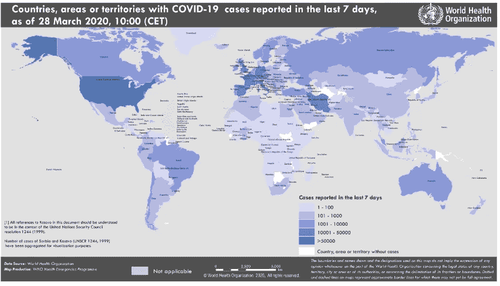

# 人工智能将帮助卫生专业人员仅利用 x 射线胸部图像进行新冠肺炎的大规模预测

> 原文：<https://medium.datadriveninvestor.com/ai-would-aid-health-professionals-in-the-mass-prediction-of-covid-19-utilizing-only-x-rays-chest-4b583506b03b?source=collection_archive---------7----------------------->


仅使用肺活量减少和/或新冠肺炎患者的 X 射线胸部图像进行成像？人工智能将帮助卫生专业人员对病毒感染进行大规模预测。

# 新冠肺炎:人数情况



根据世界卫生组织(世卫组织)的说法，这些是与新型冠状病毒有关的最新数字:

我们从中国开始，根据普遍的共识，中国是新冠肺炎病毒的发源地，也是第一个被报道的病例。面对一个未知的攻击者攻击其人民，他们因对当时尚未疫情的闪电般快速反应而广受赞誉。目前的总数显示确诊 82，230 例(152 例新病例)，3，301 例死亡，其中只有 3 例是最近发生的。

[](https://www.datadriveninvestor.com/2019/01/23/deep-learning-explained-in-7-steps/) [## 深度学习用 7 个步骤解释-更新|数据驱动的投资者

### 在深度学习的帮助下，自动驾驶汽车、Alexa、医学成像-小工具正在我们周围变得超级智能…

www.datadriveninvestor.com](https://www.datadriveninvestor.com/2019/01/23/deep-learning-explained-in-7-steps/) 

另一个采取了令人印象深刻的应对措施并似乎在早期遏制了传播的国家是韩国，仅出现 144 例死亡病例，其中 5 例是最近确诊的 9478 例感染病例。

该病毒的下一次大规模影响发生在意大利和西班牙。在意大利，他们总共遇到了 86，498 个病例，9，136 人死亡。然而，令人震惊的是，在这些病例中，有 5959 例和 971 例死亡被标记为最近发生的。这表明它们在传播或遏制方面还没有达到顶峰。西班牙在 64059 例确诊病例中有 4858 例死亡。

不久之后，病毒影响了美国。已经有 113，000 例确诊病例高居榜首，更惊人的数字包括直接隔离其影响中心。仅纽约就报告了 52318 例病例，728 人死亡。从逻辑上讲，这个国家可能会很脆弱，因为它由许多广泛分布的人口中心组成，其公民的财富允许更容易旅行(增加了传染的可能性)。数据显示，美国仍处于曲线的早期，可能会面临毁灭性的结果。

在我的国家墨西哥，一个常见的说法是*“如果美国打喷嚏，我们就会感冒。”将这种口语应用到疫情，我的国家可能会陷入困境。*

# 墨西哥的新冠肺炎


我来自墨西哥，与其他国家相比，我们的回应较晚。从它在中国的起源，到它穿越意大利和西班牙的迁徙，一路上有许多被忽视的教训。鉴于时间上的巨大优势，加上政府的协同应对，我们本可以使曲线变平，减少全球范围内的感染和对我们医疗系统的压力。相反，我们国家的领导层大规模传达了对病毒的怀疑，似乎指示其人民无视与医疗专业人员保持社会距离的准则，而是依靠他们的信仰和时间来治愈所有伤口。

果然，人们对其领导人表现出了与竞选总统时同样的信心。看到混乱在其他地方展开，他们稍微遵守了基本的安全协议，并没有动摇参加所有的社会活动，显然他们的就业。如果你的当选官员从最高层开始和人们握手并聚集在一起，那么整个社会的学习曲线会变得更加陡峭。不可避免的是，当病毒的危险渗透到科蒂迪亚生活的每一个领域时，我们会回头看看我们的公共无反应，为什么我们获得资源的机会有限，可能对我们的经济造成不可逾越的损害，以及惊人的死亡总数。

受到人工智能如何以不同方式帮助解决目前世界上正在经历的这个问题的启发，我将创建一个深度学习模型，使用 FastAi 和转移学习技术检测 X 射线胸部图像中的新冠肺炎。

这仅仅是教育，而不是医疗部门的解决方案。我希望这能鼓励你扩大对人工智能的使用，并将其应用于其他需要替代解决方案的情况。

大纲:

1.  获取数据集
2.  创建模型
3.  做预测
4.  推荐

## 1.-获取数据集:具有胸部 x 光或 CT 图像的新冠肺炎病例开放数据库


该数据集取自 ka ggle:corona hack-胸部 X 射线数据集，其灵感来自约瑟夫·保罗·寇恩在 GitHub 上分享的新冠肺炎病例胸部 X 射线或 CT 图像的开放数据库，目标是使用这些图像开发基于人工智能的方法来预测和理解感染

我的模型有二进制的目的，所以我将只保留两个类: **Normal 和新冠肺炎。**最终数据集有 2 个目录:

1.  训练-正常(880)和新冠肺炎(60)的形状(300，400，1)的 2，083 个图像
2.  Val- 988 正常(450)和新冠肺炎(9)的各种形状的图像

# **2。-创建模型**

我将使用一个叫做 FastAi 的流行框架，你可能知道，它是一个用于深度学习的开源库，构建在 PyTorch 之上。它非常有效，因为它简化了训练快速准确的神经网络。它基于在 [fast.ai](http://www.fast.ai) 进行的深度学习最佳实践的研究。

**导入库**

让我们导入所需的库:

```
from fastai import *
from fastai.vision import *
from fastai.metrics import error_rate
```

现在，让我们定义图像路径和数据束。该文件夹包含训练和有效文件夹，带有**新冠肺炎**和**正常**样本，因此很容易检测到类别。

```
corona_images_path = 'covid-dataset/'
```

**数据增强**

我将使用 vision.transform 的标准转换集进行数据扩充，并将其传递给 databunch:

```
tfms = get_transforms()
data = ImageDataBunch.from_folder(corona_images_path, train='train', valid='val', ds_tfms=tfms, size=128, bs=10)
```

如果您想预览我正在处理的图像:

```
data.show_batch(rows = 3)
```


我不是一名健康专业人士，我不得不进行研究，找出在 x 光胸部图像中可以发现的最重要的特征，以检测患者是否患有新冠肺炎病。我发现病人的肺部充满了粘稠的粘液，阻止他们吸气，因为没有空气的空间。

你可以查看由北美放射学会发布的图片，这些图片显示了放射学家所说的毛玻璃样的不透明:空气空间的部分填充。

fastai 库包括几个来自 [torchvision](https://pytorch.org/docs/stable/torchvision/models.html) 的预训练模型，所以现在我将为这个任务选择 resnet50:

```
arch = models.resnet50
```

加载预训练模型后，就可以进行微调了:

```
learn = cnn_learner(data, models.resnet50, metrics=[error_rate, accuracy])
```

错误率和准确性是跟踪模型健康状况的选择指标。

现在是训练模型的时候了！让我们将 databunch 和模型创建函数传递给 cnn_learner，并调用 fit 开始训练:

```
learn.fit_one_cycle(8,1e-2)
```


该模型做得非常好，分别获得了 99.56 的准确度、0.05 和 0.01 的训练和有效损失。

让我们绘制指标图:


如你所见，结果非常好。现在让我们来看看混淆矩阵:


让我们看看哪个是最困惑的阶层:

```
interp_resnet50.most_confused()
```

有两个假阳性病例，两个**新冠肺炎**实际病例被预测为**正常**病例。

```
**[('COVID-19', 'Normal', 2)]**
```

让我们绘制一些测试图像来看看它们的预测:


# 3.-做预测

让我们在以前从未见过的图像上尝试我们的模型:

**新冠肺炎患者**

```
img = open_image('covid-dataset/Val/COVID-19/8.jpeg')
img.show()
```


```
learn.predict(img)
```

结果是:

```
**(Category COVID-19, tensor(0), tensor([0.9879, 0.0121]))**
```

**正常情况下**

```
img = open_image('covid-dataset/Val/Normal/102.jpeg')
img.show()
```


```
learn.predict(img)
```

结果是:

```
**(Category Normal, tensor(1), tensor([0.0387, 0.9613]))**
```

# **4。-建议**

*   继续增加新冠肺炎案例的样本数据集，以建立更准确的模型，目前我们没有数据
*   目前，由于收集的数据量很小，这种人工智能解决方案可能并不理想，所以我相信卫生专业人员有更好的方法来检测像新冠肺炎这样的病毒感染

希望你喜欢这篇文章，并鼓励你训练自己的模型。拜托，记得待在家里把曲线压平！

# 参考

所有数字均经世界卫生组织在新冠肺炎的网站核实:

[](https://www.who.int/emergencies/diseases/novel-coronavirus-2019/situation-reports) [## 新型冠状病毒(2019-nCoV)情况报告

### 情况报告-情况报告提供新型冠状病毒爆发的最新情况。这些包括…

www.who.int](https://www.who.int/emergencies/diseases/novel-coronavirus-2019/situation-reports) [](https://www.pyimagesearch.com/2020/03/16/detecting-covid-19-in-x-ray-images-with-keras-tensorflow-and-deep-learning/?fbclid=IwAR208BEU4BvEZnzowAnWRJkg9LqDtvPDzQUIIlJ3gz_nqykKeXyIvCroE8w) [## 使用 Keras、TensorFlow 和深度学习- PyImageSearch 检测 X 射线图像中的新冠肺炎

### 在本教程中，您将学习如何使用自动检测手动创建的 X 射线图像数据集中的新冠肺炎

www.pyimagesearch.com](https://www.pyimagesearch.com/2020/03/16/detecting-covid-19-in-x-ray-images-with-keras-tensorflow-and-deep-learning/?fbclid=IwAR208BEU4BvEZnzowAnWRJkg9LqDtvPDzQUIIlJ3gz_nqykKeXyIvCroE8w) [](https://github.com/ieee8023/covid-chestxray-dataset) [## IEEE 8023/covid-chest Xray-dataset

### 我们正在用胸部 x 光或 CT 图像建立一个新冠肺炎病例数据库。我们也在寻找新冠肺炎病例…

github.com](https://github.com/ieee8023/covid-chestxray-dataset) [](https://www.kaggle.com/praveengovi/coronahack-chest-xraydataset) [## corona hack-胸部 x 光-数据集

### 对有电晕的 X 射线图像进行分类

www.kaggle.com](https://www.kaggle.com/praveengovi/coronahack-chest-xraydataset)