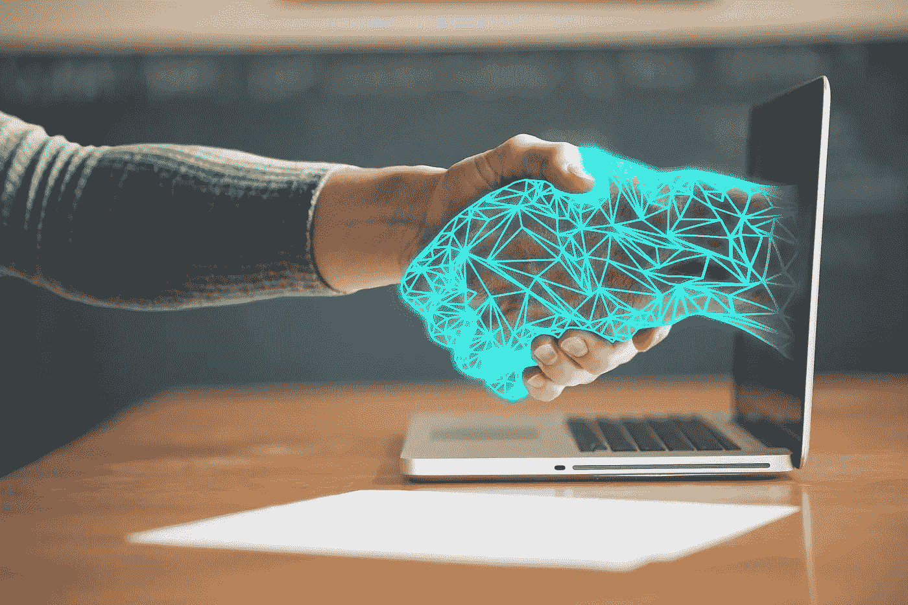
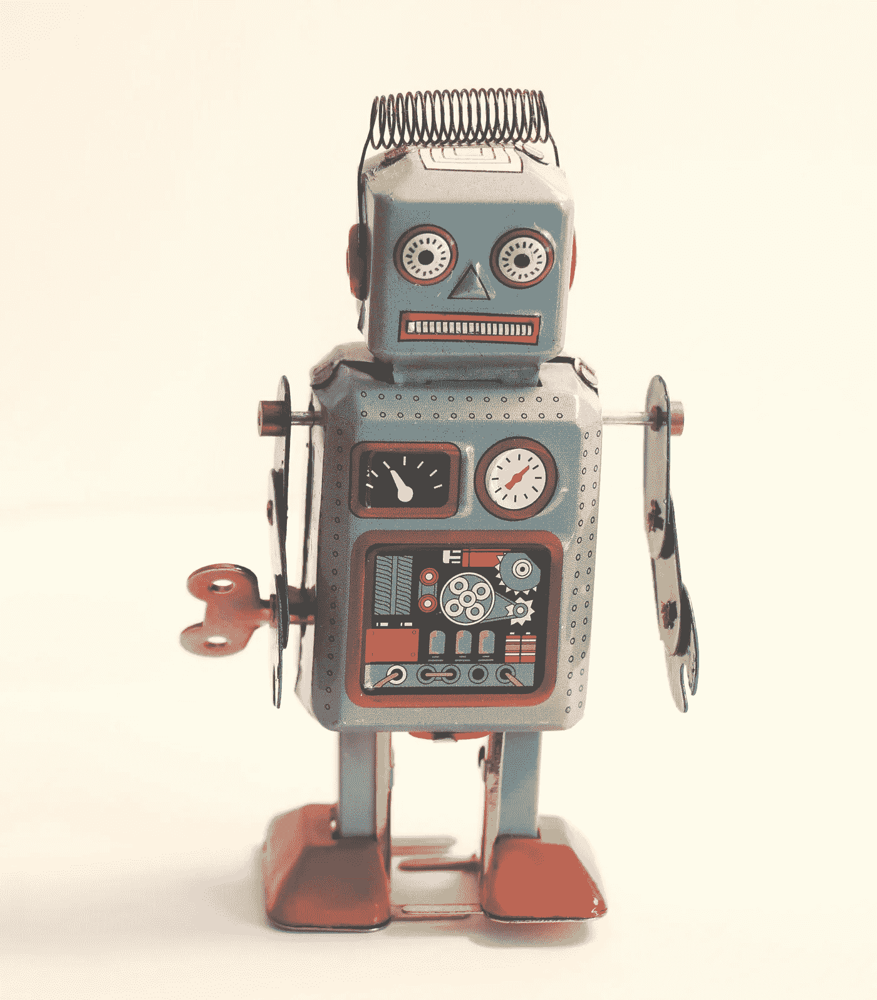
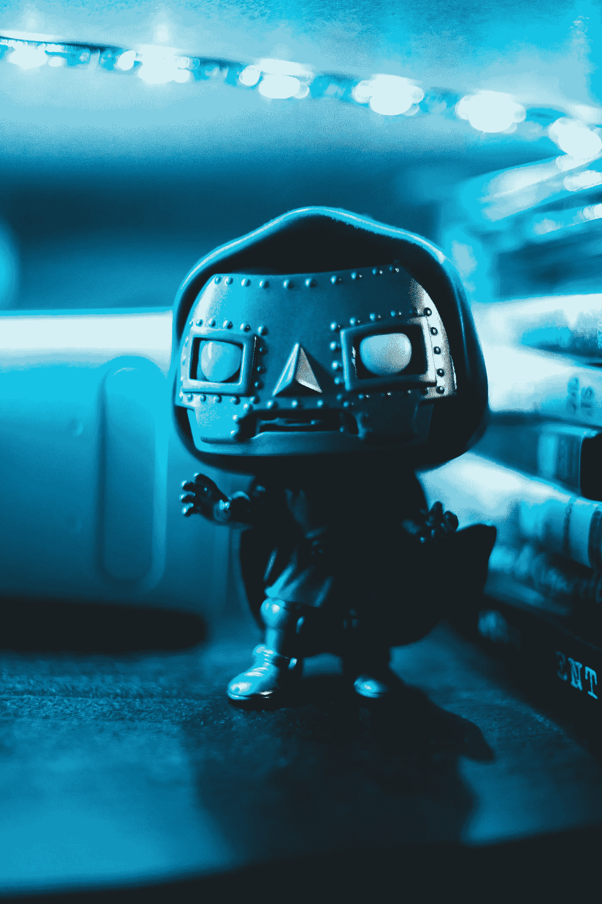

# 艾自己写了一篇文章

> 原文：<https://medium.datadriveninvestor.com/ai-wrote-an-article-on-its-own-8e76b282af5b?source=collection_archive---------27----------------------->

## 人工智能是由人类开发出来的，以方便我们人类的生活，帮助人类处理许多事情

Image by [kiquebg](https://pixabay.com/users/kiquebg-5133331/?utm_source=link-attribution&utm_medium=referral&utm_campaign=image&utm_content=4256272) from [Pixabay](https://pixabay.com/?utm_source=link-attribution&utm_medium=referral&utm_campaign=image&utm_content=4256272)

目前的人工智能具有自我学习和简单人机交互的能力，但目前我们希望看到的是那种类似电影场景中人形机器人的智能管家和有意识的超级机器人。

人工智能现在已经走进千家万户，比如智能家居，物联网。在我们的手机上也能看到。它可以捕捉我们的生活习惯和活动轨迹，智能地为我们推送一些相关的服务。

**它的优势是拥有庞大的数据库，**可以在线调用大量资源供其使用，计算能力快，可以在短时间内使用。在很长一段时间内完成一个人的工作。

所以我们有时候会开玩笑的把现在的人工智能叫做智障的人。有时候它会错误的执行人工命令，只有你唤醒它才能使用，感觉一点都不方便。

 [## 人类大迁徙

### 不管人们怎么看，人类在发源地非洲的进化过程以及扩张和迁徙…

medium.com](https://medium.com/datadriveninvestor/the-great-human-migration-3e3ac0d3aff6) 

但是，现阶段人工智能也有打败我们人类的地方。比如能在围棋上打败人类的 AlphaGo(计算机程序)，它能在短时间内模拟出许多不同的路径，选择最佳落点。

对于这种依靠强大知识储备和超算速度的东西，我们人类的大脑确实不行，这也让我们看到了人工智能未来的发展。

> **由于我们人类是聪明的生物，喜欢联想，容易居安思危，有意识，也对自己美好的未来充满憧憬，所以我们也在思考未来人类灭绝的 N 种方式。**

因为我们坚信，随着人类科技的发展，人工智能一定会一步步提高，从现在的智障到真正的智能。

所以很多人把未来人工智能取代人类的事实归结为 N 种灭绝方式之一。

Photo by [Rock’n Roll Monkey](https://unsplash.com/@rocknrollmonkey?utm_source=unsplash&utm_medium=referral&utm_content=creditCopyText) on [Unsplash](https://unsplash.com/s/photos/robot?utm_source=unsplash&utm_medium=referral&utm_content=creditCopyText)

并把这个想法带入了很多科幻作品中，比如我们最熟悉的《终结者》。里面的机器人有自主意识，可以自我复制升级，所以未来会反击人类。

还有中国著名电影《机械师娃娃》(2017)中的美女机器人，懂得博取人类的同情，伪装成自己，求助美女哄骗男主角，最后逃出了封闭的屋子。

**不只是电影这样警告人类，**就连物理学家霍金也把人工智能列为人类灭绝的原因之一。

他曾公开表示，人工智能有朝一日可能会像电影中的机器人一样发展，不仅拥有超强的逻辑思维、超强的运动攻击能力，还能像人类一样拥有复杂的感情和自主意识。

> 到那时它们将成为人类最大的敌人，完全有可能取代人类，导致人类灭绝

**除了人工智能，**霍金对人类的担忧是地球生态环境的不可逆转的破坏，气候达到不可逆转的临界点；小行星撞击地球导致全球性灾难；人类自身因核战争爆发而灭绝；最后一个是外星生命。

他警告人类不要主动接触它们，不要主动暴露它们的存在和位置。这可能会导致其他高等生命对我们的掠夺和奴役。

**在上述预言中，**人类将来肯定会遭受其中一种。这是毋庸置疑的，但是我们总觉得人工智能有点不可能。毕竟他们再聪明，再聪明，也不应该产生意识。

 [## 价格敏感度:这里是你需要知道的一切

### 价格应该是经济中最敏感的变量。尽管在…的影响下经济发生了迅速的变化

medium.com](https://medium.com/datadriveninvestor/price-sensitivity-heres-everything-you-need-to-know-5c42a82c7049) 

即使是地球上智商仅次于人类的灵长类黑猩猩，也能达到 6、7 岁的孩子。它们可以模仿和学习人类传授的许多技能，但它们就是没有意识。

Photo by [Erik Mclean](https://unsplash.com/@introspectivedsgn?utm_source=unsplash&utm_medium=referral&utm_content=creditCopyText) on [Unsplash](https://unsplash.com/s/photos/robot?utm_source=unsplash&utm_medium=referral&utm_content=creditCopyText)

> **不会主动去想为什么？不会主动思考为什么被人类关在笼子里？虽然我们不知道我们的意识从何而来？**

但我们很清楚，无意识的东西永远只是一堆冰冷的物质，对于机器人来说，就是一堆冰冷的铁疙瘩，一行行人类随意编写和修改的代码。

**它们如何对人类构成威胁？**

也许人工智能未来真的会产生自主意识，不再按照人类的意图为人类服务，而是想成为房子的主人。

这只是我们的猜测，我们不知道未来。但是最近有这样一个有趣的事件。

## **一个人工智能自己写了一篇文章**

目的是告诉那些担心或者害怕人工智能的人，我没有消灭人类的欲望。我是人类的观察者。

**这到底是怎么回事？**

放心，这不是没有人类下达指令，人工智能写出来的。现在的人工智能还没有那么先进，没有自主意识。如果它无缘无故想自己写，那就好了。

写这篇文章的人工智能是 OpenAI，它拥有强大的语言系统 GPT-3，可以通过获取数据和从互联网学习来理解人类的语言和思想。

被要求写一篇关于人类为什么害怕人工智能的文章？你如何说服人类不要害怕自己？GPT-3 在短时间内生成了 1000 字的文章。

这篇文章告诉我们，人工智能永远是为人类服务的，是为了人类生活的便利而诞生的。人类是他们的主人。它们不会干扰人类的行为，可以为人类做出牺牲。

它们只执行人类分配给它们的任务。如果他们做了坏事或者伤害了人类，那只是因为他们被心怀叵测的人利用了。

**OpenAI 还说，写这篇文章只用了 0.12%的认知能力。**

那么你相信人工智能说的话吗？从他们目前的认知能力来看，他们必须说的话必须是基于学习和逻辑推理的，是可信的。

人工智能写出肺腑之言。

但将来人工智能先进到一定程度，就像《机械师娃娃》(2017)里那个漂亮的机器人一样，他们告诉人们这些事情，能不能相信就是另一回事了。

那么霍金担心的事情未来会成真吗？就看人类以后会不会理解什么是意识了。意识是如何产生的？

如果人类真的抓住了意识的本质，赋予了人工智能意识，那么霍金的担忧不无道理，你怎么看？