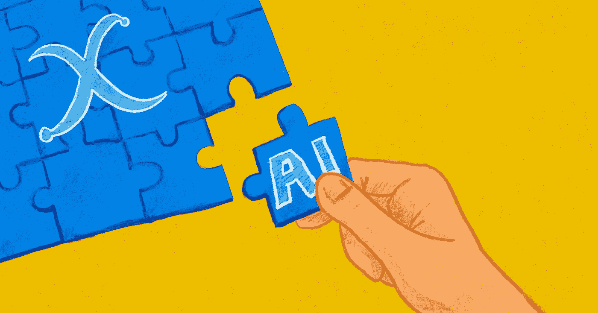

# AI+X:不要转行，加 AI

> 原文：<https://medium.datadriveninvestor.com/ai-x-dont-switch-careers-add-ai-34eff21dd3e1?source=collection_archive---------0----------------------->

## 公司需要拥有领域专业知识，并具备人工智能技能的专业人士。

许多专业人士和学生都想进入人工智能的世界。但是，与其放弃你目前的职业生涯，成为一名数据科学家或机器学习工程师，不如考虑发展人工智能技能，以补充你现有的专业知识。

# **公司找 AI+x**

拥有人工智能技能的员工现在需求量很大。但你能想象雇主要找到一个既懂人工智能又懂基因组学、人工智能又懂物理学、或者人工智能又懂心理学的人有多难吗？姑且称这些新兴职业为“ *AI+X”。*

公司正在投资数百万美元雇佣人工智能+X 个人，并培训他们在人工智能方面的主题专家。来自不同学科的科学家、工程师和分析师拥有强大的计算和编码能力，这使他们能够快速掌握人工智能的基础知识:机器学习、数据科学和/或软件工程技能。那些将人工智能技能基础与自己领域的专业知识相结合的人，将有能力成为许多行业的领导者。

通过 [Workera](http://www.workera.ai) 和[深度学习。AI](http://deeplearning.ai) ，我有幸结识了世界 500 强企业的 AI 领袖，并与之共事。我了解到大多数公司寻找具有双重能力的人，包括最近上市的公司:

*   丰田和现代正在寻找具有人工智能和聚合物电解质膜专业知识的人来制造燃料电池，为数据中心、银行、医院和电信公司提供支持。这些电池还为笔记本电脑、充电器、可穿戴式电子设备和军用无线电/通信设备供电。
*   生物技术巨头 Illumina 寻求具有人工智能和 DNA 测序专业知识的人才，以开发基因组解读的新算法，从而开发新的治疗方法和药物。
*   美敦力寻求拥有人工智能和机器人专业知识的员工来设计和构建[微创外科手术](https://newsroom.medtronic.com/news-releases/news-release-details/medtronic-advance-solutions-and-capabilities-surgical-data-and)。
*   John Deere 希望拥有[人工智能和农业/农艺领域专业知识的申请人](https://www.jobzmall.com/john-deere-company/job/data-scientist-precision-ag-analytics-1)帮助农民[定制和自动化他们如何管理和自动化他们的田间作业](https://www.fierceelectronics.com/electronics/how-john-deere-got-good-at-ai)。

AI+X 个人可以立即进入状态，使公司能够更快地抓住新的商业机会。在人工智能方面培训一名生物技术工程师可能需要几个月的时间，但在有意义的产出之前，培训一名人工智能从业者理解生物技术可能需要几年时间。一个拥有或能够发展人工智能技能的主题专家是一个更好的投资。

# 用人工智能解决现实世界的问题需要专业知识。

作为一名 AI+X 专业人员，即使你不是人工智能专家，你也是唯一有资格构建特定应用程序模型的人。你理解各种决策的历史和技术原理，但也要注意机器学习的局限性。人工智能专家将帮助你把这些模型提供给更广泛的受众。

在医学上，如果你要建立一个模型来分类一个病人是否需要一种高风险的癌症手术，这个模型可能有 95%的准确率。作为一名数据科学家，你无法判断那个数字是好是坏。但是，如果你也是一个了解肿瘤学的人，你就会理解 5%的假阳性/阴性结果对病人的影响，以及医院或医生开不必要的手术所面临的问题。您将知道哪些指标和结果是可接受的，以及模型的哪些地方必须进一步优化。这种细微差别是构建和部署成功的人工智能模型的关键部分，也是只能通过领域专业知识来调整的本能。

在斯坦福大学，吴恩达和我已经看到了获得人工智能工具箱来补充现有知识的愿望。在我们的深度学习课程( [CS230](http://cs230.stanford.edu/) )中，学生学习理论方法，并在教师和行业合作伙伴的亲自指导下完成项目。我们三分之二的学生来自计算机科学系以外的专业——从化学工程到天体物理学到法律。事实上，如果非计算机科学专业的学生在基础技能方面有足够的背景知识，他们的表现一般，甚至比那些攻读计算机科学学位的学生更好。他们中的许多人赢得了项目奖，有些人甚至在领先的行业杂志上发表了他们的成果。几个值得注意的例子:

*   来自材料科学与工程系的 Tyler Quill、Shayta Roy 和 Yaakov Tuchman 根据组分阴离子和阳离子化学结构预测了离子液体的[熔点和粘度](http://cs230.stanford.edu/projects_winter_2020/posters/32496282.pdf)。
*   来自机械工程系的 Lily Buechler 开发了一个深度学习框架，以逼近来自潮流模拟的[输出，并评估各种电网特征的性能。](http://cs230.stanford.edu/projects_winter_2020/posters/32107581.pdf)
*   计算机科学系的 Veronica Peng、生物工程系的 Yu 和土木与环境工程系的 Wenxi Zhao 利用深度学习对潜水员在危险的水下环境中与自主机器人同伴交流时的手势进行了分类。

我们的教学人员试图理解为什么非计算机专业的学生在交付高质量的人工智能项目方面如此有效，并找到了三个主要原因:

*   主题专业知识。这使得非计算机科学专业的学生能够快速理解他们的数据并解释结果。为了形象地说明这一点有多重要，假设一个不会说印地语的人试图构建一个印地语文本到语音合成器。这实际上是不可能的。然而，Dinesh Chaudhary 在 10 周内完成了这项工作，因为他的母语是英语。
*   **获取数据。**通过他们的网络，他们比计算机专业的学生更快地访问特定于应用的数据。来自外部部门的学生从他们的实验室获得了令人难以置信的数据集，可用于训练 AI 模型。同样，在专业领域，如果你是一家石油和天然气公司的结构工程师，你可以在该领域产生科技公司的机器学习工程师永远无法产生的影响。
*   **时间与激情。这些学生倾向于在他们的项目上花更多的时间，因为这不仅是他们选择的领域的一种新方法和通常是开创性的研究，而且因为他们热爱他们所做的事情。**

通过接受正确的培训，主题专家可以在几个月内有效地用人工智能解决现实世界的问题。在商业环境中，这可以让公司在资本耗尽之前或在速度较慢的竞争对手之前确定其数据的趋势。

# AI+X 上的外卖

通过建立您的人工智能技能来支持您的专业知识，您将能够:

*   发现问题何时适合人工智能解决方案。
*   用 AI 解决现实世界的问题。
*   在就业市场获得优势。
*   在学习新技术的同时，坚持做自己喜欢的事情。

如果你正在为一个 AI+X 项目寻找灵感和合作者，这个深度学习项目列表和 [Workera Slack group](https://join.slack.com/t/workeramembers/shared_invite/zt-a1wapv7o-8VkRtJE2tNb_zmJxXr6eng?utm_source=medium_ai_x&utm_medium=Medium&utm_campaign=medium_post_ai_x_August_2020) 是很好的起点。如果你想看看你的人工智能能力如何，参加[工人](http://www.workera.ai)评估，你可能会惊讶于你已经知道了多少。

人工智能软件市场预计将在未来 5 年内创造 1260 亿美元的增量收入。AI+X 将是那个[爆发式增长](https://www.mckinsey.com/featured-insights/artificial-intelligence/notes-from-the-ai-frontier-modeling-the-impact-of-ai-on-the-world-economy)的最大驱动力。你会成为改变的一部分吗？:-)