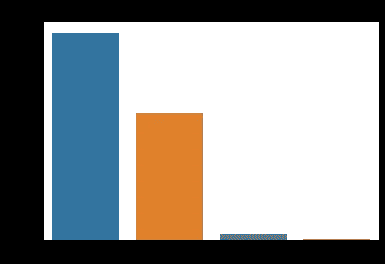
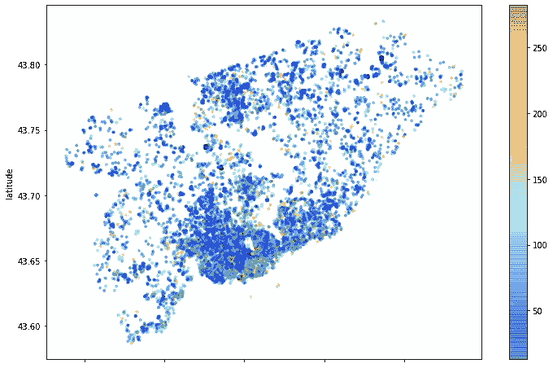

# 多伦多 Airbnb 数据分析

> 原文：<https://medium.datadriveninvestor.com/airbnb-in-toronto-data-analysis-c96a0cb5dee3?source=collection_archive---------12----------------------->


Photo by [Zia Syed](https://unsplash.com/@syedzia123?utm_source=unsplash&amp;utm_medium=referral&amp;utm_content=creditCopyText) on [Unsplash](https://unsplash.com/?utm_source=unsplash&amp;utm_medium=referral&amp;utm_content=creditCopyText)

[Airbnb](https://www.airbnb.com/) 是一个受欢迎的家庭共享网站，它采用独特的住宿方式，为来自世界各地的游客提供某人的家作为住宿的地方，而不是传统的酒店。

Airbnb 内部的网站[为我们提供了数百万个产生大量数据的房源，这些数据可以被分析并用于了解世界主要城市的房价有多贵。](http://insideairbnb.com/get-the-data.html)

我对探索多伦多的 Airbnb 数据很感兴趣，多伦多是加拿大最大的城市，也是商业、金融、科技、娱乐和文化等领域的世界领导者。来自世界各地的大量移民也使多伦多成为世界上最具多元文化的城市之一。多伦多每年接待超过 2750 万游客，是加拿大首屈一指的旅游目的地。

该数据集包含位置、价格、评论、房间类型等信息。目标是从数据中获得一些见解。

# 获取和准备数据

在本文中，我将对 Airbnb 数据集进行探索性数据分析。我们的数据将被加载到 [pandas](https://pandas.pydata.org/) 中，Dataframe 将从文件`listings.csv`中加载，该文件包含多伦多上市的摘要信息和指标，最后更新于 2021 年 1 月 2 日。

让我们看看使用`listings.head(10)`的前 10 行是什么样子的:

并用`listings.describe()`查看数字数据的汇总:

观察结果:

*   *neighborhood _ group*、 *reviews_per_month、*和 *last_review 中有缺失值。*
*   我们来看看*价格*一栏。最低价格为 0 美元，最高价格为 13000 美元，但平均价格为 137.7 美元，其中 75%的价格低于 149 美元。
*   同样的情况发生在 *minimum_nights* 列。最大值是 1125 个晚上，对应几年，那没有意义。像这样的价值观会扭曲现实和我们试图进行的任何分析。他们被称为**离群值**。

# 数据清理

**缺失值**

列 *last_review* 和 *review_per_month* 需要非常简单的处理。细说: *last_review* 是日期；如果没有对该列表的评论，则该日期将不存在。在我们的例子中，这个列与我们的分析无关。

对于 *review_per_month* 列，我们可以简单地为其追加 0.0，用于缺失值(空值)；我们可以看到*的评论数*将为 0，因此按照总评论数为 0 的逻辑，每月的评论率将为 0.0。

列*neighborhood _ group*在整个数据集中不显示任何值，因此也可以将其删除。

**去除异常值**

异常值是一种观察值，它与总体中随机样本的其他值之间存在异常距离。这些值不遵循分布，并且它们扭曲了图形表示。

我们可以通过使用四分位规则(IQR 分数)来识别异常值。有了 IQR 值，就有可能确定变量的上限。任何大于这个值的数字都是可疑的异常值。

应用于*价格*和*最小 _ 夜数*的 IQR 规则的结果如下。

```
IQR price:  89.0
Upper limit:  282.5
Lower limit:  -73.5
1200 Entries above upper limit
6.57% of dataset IQR minimum_nights:  19.0
Upper limit:  48.5
Lower limit:  -27.5
626 Entries above upper limit
3.43% of dataset
```

考虑到这一点，我们创建了另一个名为“df_clean”的数据框，以便存储干净的数据集。我们删除了所有*价格*等于 0 美元且高于 282.5 美元的条目。我们对变量 *minimum_nights* 进行同样的处理，删除 48 晚以上的所有值。

# 数据探索

我将回答以下问题。

1.  多伦多 Airbnb 上列出最多的房产类型有哪些？
2.  按物业类型分类的平均挂牌价格是多少？
3.  哪些小区的挂牌价格平均最贵？



Image by Author

对于第一个问题，可以看到整个住宅/公寓在多伦多的市场上占主导地位，大约有 60%的房源。

然而，从下图中可以看出，整栋住宅/公寓也是最贵的房型，平均每晚 124 美元。其次是酒店客房，每晚 94 美元。有趣的是，我们注意到酒店房间不到总房源的 1%。可以预见的是，包房和合住房的价格更低，分别为 65.29 美元和 42.55 美元。


Image by Author

# 位置

人们可能会想到，作为一个如此多样化的城市，多伦多是一个由不同社区组成的马赛克。这座城市由各区组成:东区、西区、市中心区、北区、市中心区和郊区。


Image by [moving2canada](http://moving2canada.com/where-to-live-in-toronto-neighbourhoods/)

多伦多最昂贵的居住区是海滨社区——岛屿。它占据了远离市区的核心地带，毗邻并包括安大略湖的一部分。下表显示了 Airbnb 列表中最贵的 10 个社区。


在表中显示的 10 个街区中，大多数都位于市中心或市中心。我们还可以通过用数据集的经度和纬度列创建散点图来直观地检查列表的价格。



Image by Author

要查看该分析中使用的所有代码，请点击[此处](https://github.com/brunacmendes/Airbnb_Data_Analysis_Toronto/blob/main/Airbnb_Listings_Data_Analysis_Toronto.ipynb)在[我的 GitHub 数据科学库](https://github.com/brunacmendes/data_science)上查看该项目。

# 结论

上面的探索性分析突出了一些有趣的趋势和数据，让我们可以更仔细地看看多伦多的 Airbnb 房源。在我们完成数据探索步骤的过程中，我们得出了以下结论:

*   海滨社区——该岛是多伦多市平均房价最高的地方。
*   整间房/公寓是最常见的房型，也是最贵的房型。
*   大多数房源都位于多伦多老城区，也是最贵的地方。如果你不想花那么多钱，也许可以考虑找一个离市区稍微远一点的房源。