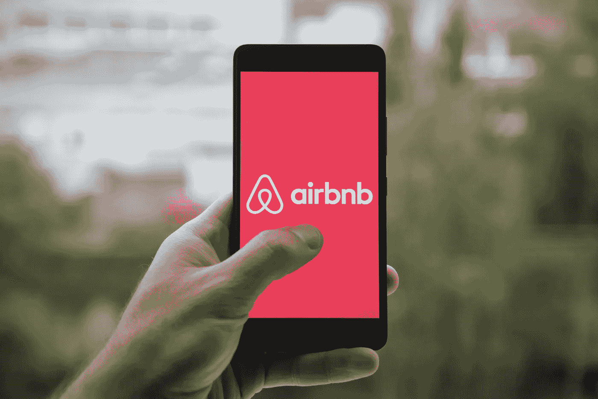

# Airbnb IPO:2020 年最值得期待的 IPO

> 原文：<https://medium.datadriveninvestor.com/airbnb-ipo-why-it-is-one-of-the-most-anticipated-ipo-in-2020-f5766d576a73?source=collection_archive---------1----------------------->

> **“当市场准备好了，我们也准备好了，”-首席执行官布莱恩·切斯基**

尽管 2020 年是 IPO 的绝佳时机，但 Airbnb 首席执行官布莱恩·切斯基表示仍在考虑 2020 年的 IPO。虽然股市反弹后，许多公司现在都急于上市，包括罗宾汉、Door Dash 和 **Airbnb** 。Airbnb 表示，IPO 决定是在该公司自疫情开始以来首次单日预订超过 100 万晚之后做出的。

Airbnb 代表空气床和早餐；这是一个短期租赁和体验的在线市场。该公司于 2008 年由布莱恩·切斯基、乔·格比亚和内特·布莱查尔奇克创立。他们现在遍布 81，000 多个城市，在他们的房屋共享网站上列出了 600 万套房产。

> “我们不得不把它放在架子上一点，因为我们有一些灭火工作要做。我们现在已经把它掸掉了。我们重新开始工作，做好准备。”Airbnb 首席执行官布莱恩·切斯基说。“如果这个世界还没有为我们做好准备，如果人们真的对旅行感到紧张，如果他们不清楚 Airbnb，那么市场还没有准备好，我们也不想上市，”他补充道。

Airbnb 的业务受到冠状病毒的严重打击，该公司突然停止在线广告以削减成本。Airbnb 已经失去了冠状病毒爆发前 310 亿美元的约 16%。这家总部位于旧金山的公司最近解雇了 7500 名员工中的 1900 人。尽管自那以后 Airbnb 出现了一些小的反弹迹象，但它在 6 月份报告称，随着一些旅行的恢复，预订量激增。“我们的业务尚未恢复，但我们看到了令人鼓舞的迹象，”该公司表示。

 [## COVID19 和风险投资|数据驱动的投资者

### 当分析一家初创公司，尤其是处于早期阶段的公司时，投资者关注三个主要因素:团队、市场和…

www.datadriveninvestor.com](https://www.datadriveninvestor.com/2020/07/23/covid19-and-venture-capital/) 

## 我们什么时候能期待 Airbnb 的 IPO？

该公司此前曾计划在 3 月份进行 IPO，但在疫情期间又筹集了 20 亿美元资金，并开始削减各项运营成本后，该公司搁置了这些计划。据路透社报道，Airbnb 在疫情之前被投资者估值为 310 亿美元，已收到通过特殊目的收购公司或特殊目的收购公司上市的要约。

> “我们不排除今年的可能性，但我们现在肯定不会承诺一个时间表，”切斯基说。“在这场危机中，我们仍处于初级阶段，对我来说，对这场危机将如何发展还不够清楚。”

**访问专家视图—** [**订阅 DDI 英特尔**](https://datadriveninvestor.com/ddi-intel)