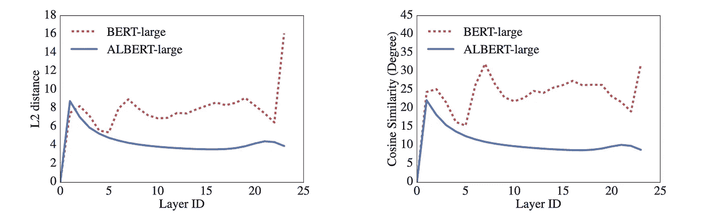
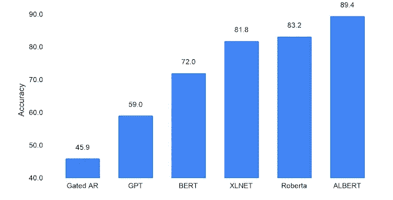

# 艾伯特:小伯特

> 原文：<https://medium.datadriveninvestor.com/albert-a-lite-bert-d47ac9322d05?source=collection_archive---------3----------------------->

## 了解基于变压器的自监督架构

Photo by [Prateek Katyal](https://unsplash.com/@prateekkatyal?utm_source=medium&utm_medium=referral) on [Unsplash](https://unsplash.com?utm_source=medium&utm_medium=referral)

BERT pretraining 是语言建模的先驱。自那以后，NLP 的技术水平一直在发展。然而，该公约说，较大的模型表现更好。但是，大型模型阻碍了扩展。训练他们既困难又昂贵。而且，训练速度随着模型规模的增大而降低。

在这篇文章中，我们将讨论谷歌人工智能在论文中提出的艾伯特模型，“[艾伯特:一个用于语言表示的自我监督学习的 Lite BERT。](https://arxiv.org/pdf/1909.11942.pdf)“本文主要提出了两种针对原始 BERT 架构的参数缩减技术(以克服上述问题):

1.  因子分解嵌入参数化
2.  跨层参数共享

同时保持性能

此外，为了提高性能，提出了一个自监督的句子顺序预测目标。这解决了伯特的 NSP 任务的无效性。

# 因子分解嵌入参数化

在 BERT 预训练中，我们本质上取一个大小为**T5 Vx*E*的嵌入矩阵，其中**V为**vocab _ size，T17**E**为***embedding _ dim***。而这里， ***H = E，*** 其中 ***H*** 就是 ***hidden_dim*** 。******

现在，单词(或单词块)嵌入的主要工作是学习标记的**上下文无关的**表示。另一方面，隐藏层嵌入的工作是学习记号的**上下文相关的**表示。它模糊地意味着单词嵌入学习捕获标记之间的对应关系，而不管数据的分布如何，并且隐藏层嵌入学习捕获标记之间的模式，用于它正在被训练的特定分布。

显然，对于更大的 ***、隐藏 _ 尺寸*** ，该模型将捕获更高的上下文信息。然而，对于标准的参数化，这将是嵌入矩阵的巨大开销。因此，该论文的作者提出了一种参数化技术来分离单词和隐藏层嵌入。想法是将 ***vocab_size*** 长度的单热向量投影到一个小得多的 ***embedding_dim*** 大小的向量(比如 128)。然后，将这个矢量投影到一个大得多的 ***hidden_dim*** 大小的矢量(比如 768)。算算吧！

> 因此，我们正在优化参数的数量，从 ***O(V x H)*** 到 ***O(V x E + E x H)*** 。如果*比 ***E*** 大得多，这就产生了巨大的差异。*

* [## 人工智能帮助你聪明理财|数据驱动的投资者

### 自动化和人工智能为创新平台提供动力，简化双方的财务流程…

www.datadriveninvestor.com](https://www.datadriveninvestor.com/2020/09/02/artificial-intelligence-helps-you-be-smart-with-money/) 

# 跨层参数共享

有几种方法可以跨层共享权重:可以对所有前馈层共享权重，也可以对注意力层共享权重。

> ALBERT 跨层共享其所有参数。

以下比较表明，权重共享不仅减少了模型中的参数，而且有助于稳定网络参数:

L2 Distances via [ALBERT Paper](https://arxiv.org/abs/1909.11942)

左图比较了每层的输入和输出嵌入**之间的 L2 距离。右边的图测量余弦相似性/距离。尽管它们甚至在 24 层之后也不收敛到 0，但是在 ALBERT 的情况下的平滑曲线表明参数稳定。**

# 句子顺序预测(SOP)目标

伯特建议，除了掩蔽语言建模(MLM)目标之外，还要进行下一个句子预测(NSP)任务的预训练。然而，最近的研究表明这一目标的无效性。艾伯特的作者推测，这可能是因为它作为一项任务缺乏难度。

NSP 将话题预测和连贯预测结合在一项任务中，因此简单的话题预测目标掩盖了连贯。为了克服这一点，ALBERT 接受了一项名为句子顺序预测(SOP)的纯连贯性任务的训练。在 SOP 中，就像 BERT 一样，附加两个连续的句子。但是在这里，正样本是正确顺序的句子，负样本是相反顺序的句子。因此，目标是预测两个连续句子在语料库中的出现顺序是否正确。

实验表明，NSP 根本不能解决 SOP 目标。鉴于 SOP 在 NSP 目标上产生了合理的结果:

NSP on SOP and vice-versa via [ALBERT Paper](https://arxiv.org/abs/1909.11942)

# 结果

评估该模型的语言理解能力的最好方法之一是在阅读和理解测试中测试它。为此，使用了[比赛数据集](https://www.aclweb.org/anthology/D17-1082/)。

当在 BERT 数据集(维基百科和书籍)上训练时，ALBERT-xxlarge(比 BERT-large 更少的参数)产生与 BERT 相同范围内的分数(82.3)。然而，当它在用于 [XLNET](https://towardsdatascience.com/xlnet-autoregressive-pre-training-for-language-understanding-7ea4e0649710) 和 [RoBERTa](https://medium.com/dataseries/roberta-robustly-optimized-bert-pretraining-approach-d033464bd946) 的更大数据集上训练时，性能大大提高，并且 ALBERT 达到了新的艺术水平分数(89.4):

Performance on RACE (Random Guess Baseline Score is 25 and the Maximum Score is 95) via [Google AI Blog](https://ai.googleblog.com/2019/12/albert-lite-bert-for-self-supervised.html)

# 结论

在本文中，我们看到了原始 BERT 预训练目标的另一个修改，以及它如何能够击败所有竞争对手，同时确保计算效率。

# 参考

 [## ALBERT:一个用于语言表达自我监督学习的 Lite BERT

### 在预训练自然语言表示时，增加模型的大小通常会导致在…

arxiv.org](https://arxiv.org/abs/1909.11942)  [## ALBERT:一个用于语言表达自我监督学习的 Lite BERT

### 自从一年前 BERT 问世以来，自然语言研究已经采用了一种新的范式，利用了大量的…

ai.googleblog.com](https://ai.googleblog.com/2019/12/albert-lite-bert-for-self-supervised.html) 

## 访问专家视图— [订阅 DDI 英特尔](https://datadriveninvestor.com/ddi-intel)*