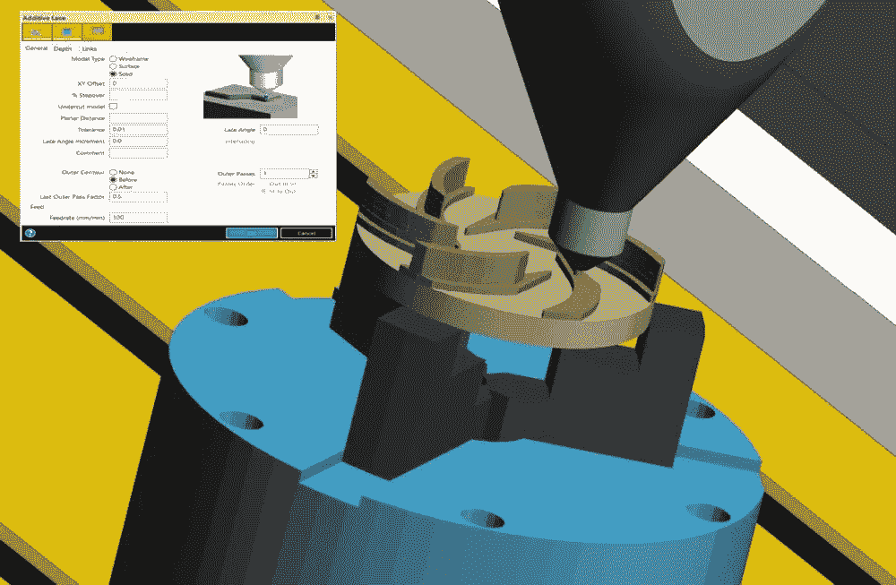

# 增材制造的炼金术

> 原文：<https://medium.datadriveninvestor.com/alchemy-of-the-additive-manufacturing-84b33254be9b?source=collection_archive---------7----------------------->

***我们今天已经拥有了什么？***

增材制造是一种很有前途的技术，通过顺序应用材料(通常是一层一层)，从 3D 计算机模型定制生产复杂形状的零件，这与所谓的减材生产(例如，传统加工)相反。根据上述定义，添加技术使得直接从计算机 3D 模型制造零件或产品成为可能，该模型被虚拟地切割成薄层；具有该模型的文件被传送到系统，系统执行最终产品的逐层形成。添加剂技术的发展始于 20 世纪 80 年代初。从快速原型制作——在开始批量生产之前，创建一个产品的原型，以便检查原型的计算、改进和批准。制造一个原型的成本比大规模生产一个单位产品的成本高很多倍，而制造一个样品需要几个星期。快速创建原型并快速检查其参数的能力已经成为制造和设计公司的技术突破，并成为市场发展的推动力。工业公司注意到了这项新技术，并开始使用它来开发工具，这大大缩短了准备生产周期和成本。

*目前使用的主要工艺流程和材料种类:*

浴中光聚合(Vat 光聚合，VP)——光聚合物；

材料喷射(MJ)——感光聚合物、蜡、有机材料；

粘合剂喷射(BJ)——金属、聚合物、陶瓷；

在基底上合成(粉末床熔融，PBF)——金属、聚合物、陶瓷；

材料挤压(ME)——聚合物、陶瓷/复合材料、有机材料；

能源和材料的直接供应(定向能沉积，DED)——粉末和金属丝形式的金属；

薄板层压(SL)——金属、聚合物、陶瓷。

*主要现代技术:*

CJP(color jet Printing)——通过粘合一种基于石膏的特殊粉末进行全彩色 3D 打印的技术。

MJP(多喷嘴印刷)——使用光聚合物或蜡的多喷嘴造型。

SLA / DLP(立体光刻设备/数字光处理)——激光立体光刻，基于液体材料在激光辐射作用下的逐层固化。

SLS(选择性激光烧结)——根据给定的 CAD 模型，在粉末材料颗粒的激光束下进行选择性激光烧结，以形成实物。

SLM / DMP(选择性激光熔化/直接金属印刷)——根据数学 CAD 模型，使用镱激光器对金属粉末进行选择性激光熔化。

*增材制造的主要现代材料:*

蜡；

石膏粉；

聚苯乙烯；

粉末形式的聚酰胺——玻璃填充、碳填充和金属填充；

紫外线和光固化液态光聚合物；

陶瓷填充的液态光聚合物；

金属合金——不锈钢、工具、镍、有色金属、钴铬合金、铝、钛等。

热塑性聚合物材料、热固性聚合物材料、弹性体、水凝胶、功能聚合物、聚合物混合物、复合材料

*当今增材制造的明显优势有:*

开始生产复杂定制产品和零件的灵活性，这些产品和零件要么不能用传统制造方法制造，要么需要少量。

制造复杂结构的零件(例如，包含内部冷却通道),这些零件不能用减法制造。

能够将计算机 3D 模型转移到世界上任何安装了合适打印机的地方，从而可以在全球范围内组织本地生产。

最终产品形状接近指定形状，这大大降低了材料成本和生产浪费。

开发阶段持续时间短，产品可快速投入生产。

快速加工生产的可能性

在不增加价格的情况下打印任何复杂的设计(“复杂免费”原则，即生产一个零件的成本与生产一个大批量零件的成本相同)。

小规模生产和发布定制产品的经济可行性。

能够在生产阶段对项目进行修改。

针对特殊要求的拓扑优化

分散生产、简化物流、缩短交货时间、减少库存。

能够将多个部件组合成一个部件，从而简化装配并加快生产

能够开发以前用传统方法无法实现或制造成本过高的产品设计

印刷用于现场维修的备件。

需要时按需打印。

机器人技术的有效使用；机器人 3D 打印机能够自动化打印零件的后处理

*添加剂技术在当前发展阶段的局限性*

尽管 3D 打印具有不可否认的优势，但仍有一些基本限制阻碍了该技术范围的扩大:

生产规模(大规模生产过于昂贵)；

零件的尺寸(产品尺寸的限制)；

制造精度(由可达到的最小层厚决定)；

速度(例如，与成形方法相比，生产率相对较低)；

成本(用于印刷的一些材料成本高)；

能源消耗(生产的高能源密度)；

材料(相对狭窄的材料选择)；

复杂表面的精加工；

产品质量稳定性低——目前还没有单一的行业标准，也没有针对工业用户的工厂标准

保护知识产权并将其价值资本化的问题

*添加剂技术的财务前景*

据 Frost & Sullivan 称，添加剂技术的全球市场正以每年 15%的速度增长。如果 CAGR(复合年增长率)保持在这一水平，市场规模预计将从 2018 年的 53.1 亿美元增长到 2025 年的 215 亿美元。据专家预测，到那时，航空业、医疗保健业和汽车业将占据亚太市场高达 51%的份额。詹森咨询公司的专家指出:

3D 打印市场正处于高潮的开端，不同行业的打印实验、各种产品范围、产品重新设计；软件、材料、设备、流程都在大力改进。

3D 打印自信地在实体经济的几乎所有部门占据一席之地，已经投入商业运营，企业不断扩大打印产品的范围。

添加剂技术在生产、营销、设计、客户可视化和公司管理中的应用每年都在扩大:

到 2030 年，全球 2/3 的制造产品将由打印组件制造。

到 2030–2050 年，在许多制造业中，3D 打印将允许打印完全成品。

***然而，被炒作的几率有多大？***

尽管市场持续增长，专家们承认他们对添加剂技术的期望“有点过热”在我看来，这是因为这些技术正在经历一个阶段，市场推广的主要驱动力是技术开发人员。在相当长的一段时间里，他们将添加技术与其他创造产品的方法分开定位，试图将他们的成果不作为价值链的一部分，而是作为一个单独的机会，有时作为服务，有时作为产品，但总是分开的。这是塞子。现在，与企业组织相关的进一步发展有两个方向:融入企业的整体价值链和深化添加剂行业本身的分工体系。很明显，在这个发展阶段，增材制造在工业 4.0 的理念中占据了最重要的位置，是数字和物理世界之间有效连接的体现。与传统制造相比，增材制造最重要的优势体现在产品设计和开发阶段的附加能力上。尽管它有局限性，但公司越来越多地使用它来利用这一关键优势，这使他们能够增加设计复杂性，而不会成比例地增加零件的免费复杂性成本，这在传统制造中是不可能的。

另一个优势体现在对生产的经济模型的分析中。生产链是将原材料转化为商品的过程。将可用资源转化为产品需要一系列步骤:设计、规划、制造和销售。近年来，通过使用 3D 打印技术，传统价值链似乎正在发生转变。具有复杂几何形状的定制产品可以使用添加制造来设计和制造。通过这种方式，可以向市场及时供应所需的产品，而不用在公司中建立大量库存，这通常会带来高成本。事实上，在某些情况下，3D 打印创造了在使用点本地化生产的可能性，这降低了(或消除了)运输成本，使添加剂技术不仅成为其他生产过程的竞争对手，也成为运输的竞争对手。随着 3D 打印“宇宙”的不断扩大，对于爱好者和企业家来说，了解新产品进入市场的定量和定性影响非常重要。这些发展在设计和成本效益方面不断地推动着加法方法的发展。谈到“经济”方面，我可以说，添加技术的发展完全符合全球趋势，成为商品生产和销售的系统平台解决方案的一部分。三种类型的市场参与者正在开发他们的平台和包含附加组件的“生态系统”:

添加剂行业高度专业化的设备制造商

为客户提供各种加工材料和创造产品的设备的公司

PLM 系统行业的领导者

总结经济影响，必须指出的是，添加技术在不同阶段“干扰”产品生命周期——设计、供应链、销售过程、劳动力资源和营销，并因此影响最终消费者。此外，所有这些要素都是相互关联的，其中一个要素的改进会发展整个业务系统:

由于增材制造的使用，产品设计的改变成为可能，导致改变(更便宜)零件材料的可能性；

通过重组生产中心，有可能减少交货时间并改变供应链；

实施上述可能性的目的是解决消费者的具体问题，在形成需求的阶段，就需要与消费者进行更密切的合作，这在以前只是特定行业的特征

增材制造迫使“制造业”认真参与市场营销，因为复杂产品的制造市场在此技术的推动下变得大众化，而在此之前，这一市场的参与者非常有限

劳动力的变化可能是最关键的

创业精神在“有效利用”增材技术方面发挥着关键作用:通过对现代高科技产业和增材制造的问题和机遇的深刻理解，形成针对新市场和传统市场的提案，使我们能够依靠市场增长和该领域成功企业数量的增加。

 [## 给数字营销工作者的 5 本书推荐|数据驱动的投资者

### 随着就业率的上升，由于疫情和人们花更多的时间在网上，数字营销的技巧…

www.datadriveninvestor.com](https://www.datadriveninvestor.com/2020/10/28/5-book-recommendations-for-those-who-work-with-digital-marketing/) 

***家门口的一场加法革命？***

增材制造正在改变世界。它改变了产品的设计和制造方式。这些是生产上述产品的全新可能性。增材制造是一项革命性的技术。它改变了产品的特性:重量、质量参数和配送方式。这并不是说你现在可以快速打印一个玩具，一个独特的礼物，或者你的割草机的替换零件。更重要的是，这些技术正在彻底改变产品的设计、制造和供应。它们影响着企业领导关心的整个产品生命周期。按需打印零件的需求是推动增材技术采用的一个重要因素，尤其是在备件生产中。如果您迫切需要更换故障零件，但同时又没有机会保留整个仓库的昂贵备件，那么附加工艺流程就成了最佳选择。随时随地根据需要打印零件。这是本地化过程的革命性。这种方法使我们能够考虑消费者的独特需求，并确保在产品运行过程中随时快速交付备件。这项新技术简化了制造流程，并使零件能够在内部制造，而不是由第三方供应商制造，这保证了严格的质量控制，并消除了库存需求。

制造零件的替代方法的需求是显而易见的。企业努力提高质量和降低成本，并确保零件能够在正确的时间和地点制造出来。降低制造和供应产品的成本对制造企业的未来起着巨大的作用。添加剂技术为缩短交付时间和确保库存水平开辟了新的可能性。新的革命性生产技术使生产以前只能梦想的产品成为可能。添加制造正在彻底改变工程行业，并允许最大胆的创新，将产品带到一个全新的水平。增材制造本身不会创造奇迹。它的支持需要特殊的软件应用和功能。添加技术具有巨大的创新潜力。他们可以帮助你更快更便宜地生产出优秀的产品，创新并提供竞争优势。

诚然，智能 3D 打印机以现有注塑机、铣削和车削中心以及其他现代生产设备的速度生产出具有真正性能和表面质量的产品的时代尚未到来。但是技术在进步，革命已经开始了！尖端发展正朝着这一目标前进。现在，数百个项目和初创企业已经将注意力转向添加技术，并开始了探索和分散机会的阶段。革命阶段是一个反复试验的时期，但现在，当从工业部门订购特定功能的机器和材料时，进步是真实的。这场革命的主要成果是从液体聚合物生产出高度精细的固体产品，以及出现了更广泛的具有特定物理和机械性能的材料。今天，加法革命已经在许多经济部门发生，例如:

珠宝生产，该技术缩短了原型和一系列产品的准备时间，降低了成本，扩大了范围，消除了建模中的技术限制。

牙科，用于牙齿修复、口腔卫生的数字建模和外科模板的建模。

原型制作和小规模生产(纪念品、玩具、家居用品等)。).

医药用聚合物和 3D 打印机市场。再次，假肢的创造，创伤学。

汽车、航空、火箭和航天生产。

鉴于对产品质量的要求越来越高，建议在其他关键行业引入添加技术，以便按一定顺序成功实施:

-初步选择一系列制成品和有前途的产品；

-设备(类型、制造商、型号)和材料的初步选择；

-在相关企业或潜在供应商处生产实验室和全尺寸样品，进行一系列初步研究和测试；

-增材制造组织的技术和经济分析；

-协调设备认证和产品认证问题；

-购买设备和材料、安装、调试、生产我们自己生产的样品；

-重新测试和更新可行性研究；

-关于生产一批实验产品的可能性的结论。

上述行业正是根据这种算法找到了引入增材制造的经济理由。

***增材制造革命的现代商业模式***

在评估增材制造的潜在商业利益时，理解与复杂性、生产规模和产品尺寸相关的三个基本原则非常重要:

1.添加技术使复杂的模具生产变得既可能又经济。这意味着产品或组件越复杂，使用添加制造而不是传统方法似乎就越合适。

2.下一个基本原则与批量有关。一般来说，生产的产品批量越大，增材制造就越不合适。在经典经济学中，批量越大，单位成本越低。在添加制造的情况下，单位成本与批量无关。这允许您以较小的风险生产小批量的产品或零件，例如，当定制很重要时。

3.最后，添加制造最适合小零件或产品。这意味着，在大型零部件的生产中，企业仍应转向传统技术。

根据上述原则已经获得的具体成果最好按照为过程和产品增加价值的标准进行分类。这种价值在解决最终用户的问题中发挥的作用越大，出现竞争优势、新的商业模式和建议的机会就越多。流程的业务优势:

新零件和产品的上市时间显著缩短。这大大提高了产品更新率。

简化设备维护和维修:备件和专用设备随时随叫随到。

当您可以一次 3D 打印产品或零件，而不需要额外的组装单元时，减少了组装时间和加工成本。

由于产品的最小数量是一个单位，定制，包括大规模定制，是一个真正的解决方案。因此，以低风险和低成本打开有特殊需求的新垂直市场和区域市场成为可能。

快速原型制作和测试可以有效地优化设计，并将消费者反馈纳入产品开发。

Как итог упомянутых выше преимуществ, сегодня сложились такие бизнес модели:

**基于增材制造的产品共创平台**

增材制造为与消费者合作创造产品提供了机会。协作可以在产品生命周期的几乎所有阶段进行。在新产品的概念阶段，通过小批量测试可以很容易地考虑消费者的反馈。您还可以定制现有的设计，或者通过发布定制的附加组件，在产品的整个生命周期中为其增加价值。在这种情况下

**最大化定制**

通过将增材制造与 3D 扫描仪等工具结合使用，企业现在可以大规模生产高成本效益的定制产品。由于这类产品的性能通常好得多，它们的消费者价值显著增加。这种定制形式在各种各样的领域创造了许多新的商业模式(从假肢、眼镜到耳机)。这里需要特别注意的是，尽管经济实惠的扫描仪器市场在不断增长，但仍有必要使用复杂的专业 3D 扫描仪来创建医疗设备(假体、助听器等)。)以确保所需的高精度。

**产品生命周期管理**

产品生命周期管理是当前增材制造在工业中的主要应用之一。生命周期延伸始于产品或零件开发阶段。利用增材制造的设计能力消除了对装配的需求，从而延长了产品生命周期并减少了故障。在售后服务阶段，通过使用定制工具和稀缺、昂贵的定制零件，可以延长设备的使用寿命。一般来说，这一过程包括改善供应链(减少制造操作的数量，降低加工成本和简化维护程序)。因此，这导致供应链中总成本的显著降低，以及客户服务水平的提高。

**提供增材制造服务**

增材制造需要大量刚刚开始在企业中形成的新资源，因此对于服务提供商来说，这是一个有前途的利基。了解设计能力和潜在的产品优势、增材制造的设计考虑因素、3D 打印材料和技术、3D 打印机和后处理技能以及质量改进行动都需要技术娴熟、经验丰富的员工。各种规模的企业越来越多地思考他们在提供增材制造服务方面可以发挥什么作用。

***未来商业模式***

随着添加技术的发展，从技术和经济角度来看，它们的应用可能性也在扩大。随着设备生产率的提高，每个印刷品的折旧水平和成本也会相应降低。这意味着更大范围的产品或零件将成为经济实惠的 3D 打印产品。增加最大可打印区域也将对商业模式产生积极影响。打印较大零件的能力也将允许在单个打印会话中生产较大批量。这将缩短交付周期，并相应降低总拥有成本。

[加入聊天](https://t.me/joinchat/AAAAAE84vCXg5PK-VpHADg)

**谢尔盖·戈卢别夫**

[Crynet 营销解决方案](https://crynet.io/)、 [vtorov.tech](http://vtorov.tech) 、欧盟结构基金、ICO/STO/IEO 项目、NGO &投资项目、项目管理

## 访问专家视图— [订阅 DDI 英特尔](https://datadriveninvestor.com/ddi-intel)