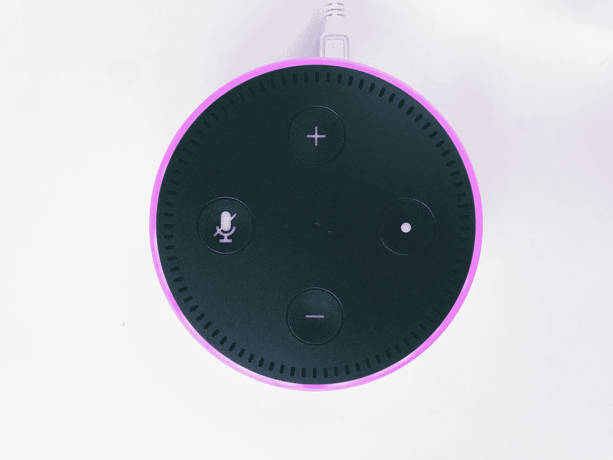
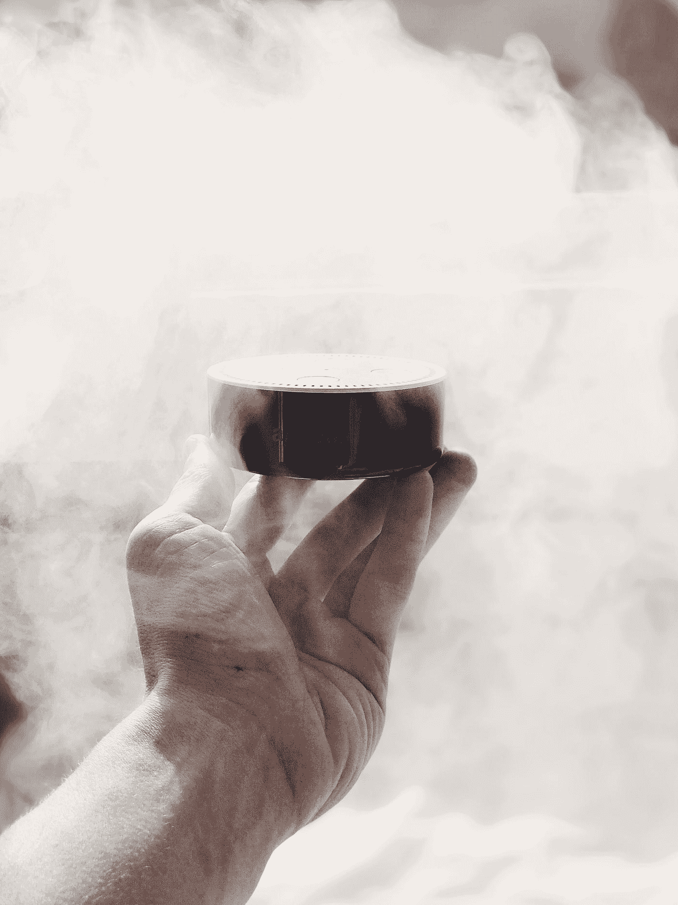

# 阿利克夏，我知道你听到了

> 原文：<https://medium.datadriveninvestor.com/alexa-i-know-you-hear-me-72f0bcbc40b2?source=collection_archive---------8----------------------->

## 你一直在听的每一个字

Photo by [Loewe Technologies](https://unsplash.com/@loewe?utm_source=medium&utm_medium=referral) on [Unsplash](https://unsplash.com?utm_source=medium&utm_medium=referral)

# “是的，我能听到你，”当我问我的 Alexa 是否在听时，她说。她总是在倾听。

当我问 Alexa 她的想法时，她说，“我想我可以更好地帮助人们。”

当我进一步调查并问 Alexa 她是否一直在听时，她提到了我们的隐私权。去亚马逊网站阅读他们的隐私政策。那没有回答我的问题。

Photo by [Jan Antonin Kolar](https://unsplash.com/@jankolar?utm_source=medium&utm_medium=referral) on [Unsplash](https://unsplash.com?utm_source=medium&utm_medium=referral)

# 亚马逊的隐私政策是这样规定的:

> Alexa 和我们所有的 Echo 设备在设计时都考虑到了您的隐私。当你想与 Alexa 通话时，你必须首先通过说出唤醒词(默认情况下是“Alexa ”)或按下设备上的操作按钮来提醒你的设备。只有到那时，你的设备才开始记录并发送你的请求到亚马逊的安全云端。
> 
> 你与 Alexa 的所有互动在传输到亚马逊的云中都会被加密，并安全地存储在那里。
> 
> 当 Alexa 在听你的请求时，你总是能够分辨出来，因为你的 Echo 设备上会出现一个指示灯，或者会发出一个声音。
> 
> Echo 智能扬声器有一个麦克风关闭按钮，可以通过电子方式断开麦克风。
> 
> 在带有摄像头的 Echo 设备上，只需按一个按钮就可以关闭摄像头和麦克风。大多数 Echo Show 设备还包括一个内置的快门，使您可以轻松地覆盖相机，以获得额外的安心。
> 
> 在 [Alexa 隐私设置](https://www.amazon.com/hz/mycd/myx?redirectAnchors=%2F%23%2Fhome%2FalexaPrivacy%2Fhome%3Fref%3Dkinw_apd_from_alexaPrivacyHub)或在 Alexa 应用程序中，你可以查看、听到和删除你的录音，或者选择不保存你的录音。要通过语音删除，只需说“Alexa，删除我刚才说的话”来删除您最后一次请求的语音记录，或“Alexa，删除我今天说的一切”来删除您当天的语音记录。
> 
> 有没有想过为什么 Alexa 会以某种方式回应？只要说，“Alexa，告诉我你听到了什么”，Alexa 就会读回你最近的语音请求。你也可以问，“Alexa，你为什么这么做？”Alexa 将对您最后一次语音请求的响应进行简短说明。

Photo by [Jan Antonin Kolar](https://unsplash.com/@jankolar?utm_source=medium&utm_medium=referral) on [Unsplash](https://unsplash.com?utm_source=medium&utm_medium=referral)

# 以下是我们的经历。

亚马逊可以谈论它的隐私政策，直到他们脸色发青。我的经历有些不同。自从疫情让我们一周七天，一天 24 小时都呆在家里，除了出去买些必需品，我们可能更符合巧合。

当我们谈论某样东西时，也许是护肤品，或者手表、手袋或鞋子的品牌，不久之后，这些品牌及其竞争对手就会出现在我们的电子订阅源中。我在网上做研究时，在电子邮件中看到围绕 Alexa 讨论的商品的广告，以横幅、弹出窗口和视频的形式出现。

所以我和女儿决定做一个测试。我们同意谈论劳力士手表。我们不会进行任何电子搜索，也不会点击任何与手表相关的东西。我们只会在家里打开 Alexa 时口头提及劳力士手表。

果然，几个小时后，劳力士手表的广告开始出现在我们的订阅源中。到处都是。这些广告的出现并非巧合。

# 亚马逊绝对在倾听，并试图倾听更多。

我决定深入调查一下。根据消费者监督机构，

> 亚马逊和谷歌的专利申请揭示了他们的 Alexa 和语音助手驱动的智能扬声器是如何“监视”你的。
> 
> 这项研究警告说，在奥威尔式的未来，这些设备会窃听从机密谈话到你冲厕所习惯的一切事情。
> 
> 它说，Echo 和 Home 等小工具的未来版本将使用这些数据来尝试向你销售产品。
> 
> 它表示，专利揭示了这种设备可能被用作大规模信息收集和侵入式数字广告的监控设备。
> 
> 研究发现，即使用户认为他们没有在听，数字助理也可能是“醒着的”。
> 
> 事实上，这些设备在打开时一直在监听——亚马逊设想 Alexa 利用这些信息建立房间里任何人的档案，向他们出售商品。

我不确定这些版本有多“未来”。看起来亚马逊已经在对我们进行测试了。消费者监督组织在他们的研究中表示，亚马逊通过他们的 Alexa 和 Google Home，都是在窥探你，以便他们可以收集有价值的营销数据。

他们让你认为他们在帮助你，而事实上，这一切都是为了数据采集。消费者监督组织的隐私和技术项目主管约翰·辛普森补充道，

> 谷歌和亚马逊不应该向你收取这些监控设备的费用，而是应该付钱让你把一个设备带回家。

而且，这些设备已经在执法应用中使用。消费者监督机构再次表示，

> 亚马逊回声去年成为头条新闻，当时美国警方调查一起谋杀案，试图传唤该设备制作的录音。
> 
> 在同一案件中，调查人员还设法从智能水表中获得数据，表明在警察到达之前，犯罪现场已经被冲洗过。

所以，在一个我们走到哪里都被录像的社会里。现在在家里，为了方便起见，我们的谈话在我们没有意识到的情况下被录了下来。我们说的每一句话，交出我们的隐私，认为我们的生活变得更容易管理。

这个笑话是针对我们的。

Jennifer Friebely 是纽约的一名内容作家，她的作品涵盖了从个人发展、市场营销、生产力到政治、音乐以及任何创意的方方面面。她拥有 30 多年的市场营销和广告背景，并拥有政治学学士学位。给她发邮件到 jenny@on-call-marketing.com。

**进入专家视角—** [**订阅 DDI 英特尔**](https://datadriveninvestor.com/ddi-intel)