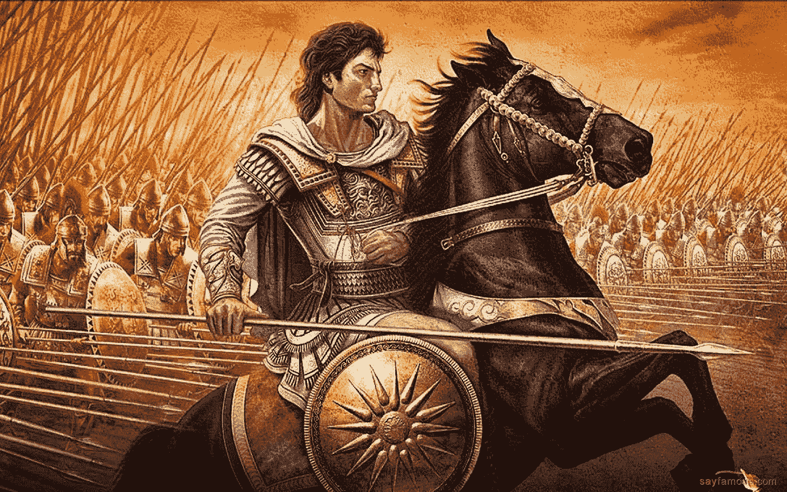

# 亚历山大大帝:领导力五课

> 原文：<https://medium.datadriveninvestor.com/alexander-the-great-5-lessons-on-leadership-f9bd38469dd0?source=collection_archive---------0----------------------->

By: [Wp](https://wallpapercave.com/w/wp6407051)

“亚历山大大帝”也被称为“亚历杭德罗·马格诺”，是历史上最伟大的征服者之一，其疆域从希腊延伸到印度，此外，他是在单一指令、语言和货币下统一西方和东方(希腊和波斯帝国)的人。出生在马其顿的古都，从很小的时候，他的父亲菲利普训练他在战争的艺术和他的教育是从亚里士多德本人。亚历山大大帝精心准备，不负众望。

在他成年后，他内心的痛苦淹没了他很长一段时间，波斯帝国对希腊进行了长时间的屠杀，这就是他的辉煌时代如何开始于 334 年，当时他跨过达勒斯波特进入小亚细亚，他在伊索、格拉尼克、波斯门和高加米拉的战斗中击败了大流士国王。他摧毁了一支人数和武器都是其十倍的军队，从那时起，他的胜利是广泛而持续的。他征服了伊朗、土耳其、叙利亚、埃及、巴基斯坦、阿富汗和印度。他的军事成就和胜利让位于与东方的贸易。直到，以一种神秘的方式，他在 33 岁时不复存在。

今天，由于各种因素，人类生活在一个非常有问题、紧张和加速的世界中，这种情感的旋风使我们离开沉思、反省和思考那些看不见摸不着，但对我们的生活有很大影响的事情。其中之一是时间，到目前为止，还没有确切的定义，它无情地存在于生物和无生物存在的各个方面。

然而，在所有这些哲学上的考虑以及融入一个意义是多么复杂的事情中，有一个人想要给出一个简单的解释，但是有着伟大的意义和无可辩驳的真理，关于每个人从出生到生命最后一刻的时间，这就是亚历山大大帝。

 [## 领导力。赢得|数据驱动型投资者需要更广阔的视角

### 不管他们愿不愿意，领导者都是快速运转的机器中的齿轮，这就要求他们夹住自己的爪子…

www.datadriveninvestor.com](https://www.datadriveninvestor.com/2020/02/07/leadership-it-takes-a-wider-perspective-to-win/) 

这就是为什么今天我们要谈论亚历山大大帝的 5 条领导力课程:

**1。以身作则**

许多“领导”都有关于与他们的工人处于相同条件下的讲话，因此他们的所有行动都指向同一个方向，但他们表明他们享有个人特权，如更好的膳食、特殊停车场、特殊待遇……这些特权是他的下属所没有的。

当亚历山大大帝带领他的军队穿过干旱的沙漠时。纵队绵延数英里，人和马都极度干渴。突然，一队侦察兵朝国王飞奔而来。他们发现了一个小喷泉，并设法用这种珍贵的液体装满了头盔。他们跑到亚历山大那里，把它介绍给他。

军队留在原地观望。所有的目光都集中在他们的指挥官身上。亚历山大大帝感谢他的探险家们带给他这份礼物，然后，他一滴不沾，拿起头盔，把珍贵的液体倒在沙滩上。立即响起了热烈的掌声，像打雷一样从圆柱的一端传到另一端。有人说:“有这样一位国王来领导我们，地球上没有任何力量可以反对我们。”

因此，领导者必须努力成为下属效仿的榜样，找到一种方法来永远激励他们，让他们觉得战斗是所有人的战斗。

**2。有纪律和策略**

毫无疑问，亚历山大的[纪律](https://medium.com/@Stoiccopy/how-to-build-self-discipline-like-a-stoic-f912dd8a266b)是在一个非常特定的视角和参数下形成的，随着时间的推移，这些视角和参数得到了加强，他的主要目标是超越他父亲的成就和征服。对他来说，纪律代表着组织、协调和勇敢面对严酷战场的力量。

不管情况会变得多么混乱，他们的队形和想法都有一个功能，让他们比敌人更有优势。

很多人对纪律的定义仅仅是一种维持成员之间秩序和从属关系的行为，但它也是一套规则或规范，对这些规则或规范的遵守不断导致某种结果，而这种结果与我们在完成一项艰巨任务后感到自豪的结果相同。

今天，拥有并维护纪律严明的组织，拥有实现战略目标的纪律严明的团队是势在必行的。

**3。领导一切**

亚历山大大帝统治希腊世界，然后扩张到波斯世界，远达印度。他的整个帝国由多种多样的文化组成，但并不是一切都是美好的，维持帝国的统一并不是一件容易的事情。事实上，在他死后不久，他的部下就开始迅速崩溃。

他习惯于采纳被征服地区的习俗，如服装。此外，他娶了波斯大流士三世的女儿，并让他的官员们也娶了波斯上流社会的女子。

对于一个领导者来说，能够与各种各样的人打交道是至关重要的。在组织中或在日常生活中，我们周围都是来自不同背景、思维方式和能力的人，重要的是找到一种方法来实现轻松沟通和相互尊重。

**4。展现力量和智慧**

这就是人类的生活，有赢的战斗，也有输的战斗。在我们的生活中，我们并不总是政治正确的。

所有曾经密谋反对亚历山大大帝的人被发现后，都被亚历山大大帝的力量所震慑，这样就没有人敢挑战他了。

有一次，他甚至发现他的一名军官正计划剥夺他的权力。他和那些帮助他的人一起执行了这项任务。但他并没有就此罢休，他还处决了他的父亲，尽管他并没有参与这场阴谋，尽管他是最忠诚和最重要的将军之一。这是因为，通过这种方式，父亲不会想在以后推翻他，因为他已经处决了他的儿子。

而且虽然看了这个小趣闻有点不安，但今天并没有太大的不同，我们必须和身边的人在一起，这些人给我们的生活增添了乐趣，并作为领导者和团队的一部分对我们忠诚。无论你是一个多么优秀的领导者，总会有人想不公平地把你赶下台。

正是这些类型的人，他们不欠第二次机会。只是因为他们是人而尊重他们，仅此而已。在你的团队中有这种类型的人是不可取的，你必须表现出实力，否则，你就失去了作为领导者的效力。

**5。激励和征服**

为了总结亚历山大大帝的这 5 条领导力课程，我们来谈谈激励。通过让他的部下参与战利品，他确保他们愿意毫不犹豫地跟随他去征服新的领土。

事实上，有一次在印度，经过多年的运动，亚历山大大帝的人威胁要暴动。他们筋疲力尽，想回家。亚历山大召集了一次集会。当军队集合后，年轻的国王出来，在众人面前脱下衣服。

“我身上的这些伤疤”，亚历山大宣称，“是给你们的，我的兄弟们。如你所见，每个伤口都在前面。让那个比我流更多血，忍受更多痛苦的人站在你们面前。给我看，我会屈服于你的疲惫，然后回家”。没有人出现。相反，来自军队的起立鼓掌。这些人恳求他们的国王原谅他们缺乏精神，并恳求他继续引导他们。

作为领导者，奖励团队成员(不仅仅是经济上的)，特别是当他们做好生意时，是对他们未来继续尽最大努力的宝贵鼓励。此外，它进一步加强了作为领导者的纽带和尊重。

你可能也喜欢阅读:

[清晰的重要性:打造成功的简约方式](https://medium.com/datadriveninvestor/the-importance-of-clarity-the-minimalist-way-to-build-success-fa16a727de97)

禁欲主义和成功是对立的吗？

[斯多葛派对爱情的看法](https://medium.com/@Stoiccopy/stoic-thoughts-on-love-65cb7c6bfd94)

[战胜焦虑的坚忍方法](https://medium.com/@Stoiccopy/the-stoic-way-to-beat-anxiety-fa55b3f52343)

[睡前应该做的 7 件事](https://medium.com/@Stoiccopy/7-things-you-should-do-before-going-to-bed-40733f058fb1)

## 访问专家视图— [订阅 DDI 英特尔](https://datadriveninvestor.com/ddi-intel)